# 文献调研

## 从细粒度轨迹分析到高效模型训练

更新日期：2026-09-22。本文讨论语言模型执行多步任务时，怎样利用成功和失败的过程记录进行训练。面向尚未学习大模型训练的读者：只假定能够阅读中文、理解加减乘除与简单表格；概率、损失、偏好训练和梯度在第一次需要时解释。公式是对前面具体操作的精确表达，不要求先背公式再理解任务。

我们先沿一条“选错商品，再改正”的记录理解训练，再深入分析36篇相关论文。各篇均把研究动机、设计方案和启发探索放在正文；方法图为原论文图区域裁剪，紧邻文字说明来源及读法。主要覆盖2024–2026年的相关工作，正式会议、Findings、Workshop与预印本分别注明；不声称穷尽所有相关论文。

全文反复回答同一个问题：**一条轨迹里，哪些内容应让模型看见，哪些行为应让模型模仿，当前模型最值得学习哪些局部目标、为此应该支付哪些计算？** 输入、监督、学习收益与计算费用不是同一个问题，正是现有方法容易被混淆的地方。

阅读导航：[必要基础与贯穿例子](#一先用一条轨迹理解训练) · [局部信用](#二从整轨迹偏好到局部信用) · [成功与失败](#三成功和失败如何进入训练) · [Token与步骤信号](#四token和推理步骤提供了什么训练信号) · [对模型有用的数据](#五高价值信息必须说明对哪个模型和目标有用) · [训练计算与共享成本](#六监督目标反向传播与前缀共享的计算成本) · [条件决策](#七如何判断模型学会按条件决策) · [综合判断](#八跨论文证据综合怎样从局部分析形成完整训练方法)。各篇可以单独读，但遇到“损失、偏好、反传”等共用概念时，可先回看第一章。

为避免混淆，正文会直接说明“原文报告”“根据公式推得”“我们据此判断”“教学例子”或“待验证建议”。教学例子的数字帮助理解算法，不是论文实验；方法有效的证据必须来自实际研究，而不是一个看起来合理的例子。

## 一、先用一条轨迹理解训练

### 1.1 什么是轨迹：不仅有模型的答案，还有环境的回应

假设用户要求：“买一把米色刷子。”模型可以搜索商品、点击页面、选择款式和下单。网站每次返回搜索结果或商品信息，模型读完后再决定下一步。这种会调用工具、根据反馈继续行动的模型，在本文中称为Agent。

一条教学用记录如下：

| 顺序 | 谁提供内容 | 内容 | 为什么需要记录 |
|---|---|---|---|
| 任务 | 用户 | 要米色刷子 | 判断最终结果是否符合要求 |
| 动作1 | 模型 | 搜索“刷子” | 模型采取的行为 |
| 观察1 | 网站 | 返回红色、米色两件商品 | 下一动作的可用信息 |
| 动作2 | 模型 | 点击红色商品 | 一次可能的错误选择 |
| 观察2 | 网站 | 当前颜色：红色 | 让模型有机会发现不符 |
| 动作3 | 模型 | 返回，并选择米色商品 | 恢复行为 |
| 终局 | 环境核验 | 最终买到米色刷子 | 整个任务的结果 |

从任务开始到结束的这串记录就是**轨迹**。动作是模型发出的操作，观察是工具或环境返回的信息；二者不能混作模型应当生成的答案。某些模型还会输出文字推理，论文通常称为thought，它也属于模型输出，但不等于真实环境状态。

这条轨迹最终成功，但动作2未必值得模仿。反过来，如果最后因超时失败，也不能说动作1的搜索完全无用。**整条记录的结果不能自动告诉我们每一步的训练价值。** 后面的局部信用、错误恢复和数据选择研究，都是在试图补上不同部分的信息。

“前缀”指某一步之前的全部记录，例如点击红色商品前的任务、搜索和结果页；“后缀”指该步起直到结束的后续记录。“同一前缀下比较动作”意味着尽量固定此前条件，只改变接下来怎样做。只看见同一句页面文字，不一定代表此前历史和隐藏环境状态相同。

### 1.2 模型怎样从文字中学习：先看概率，再看损失

语言模型不是直接存储“在这个页面应该点击米色”的规则表。它把文字切成较小的单元，称为**Token**；一个Token可能是词、字或词的一部分，不一定等于一个中文字符。模型在每个位置，根据前面的Token，为下一Token分配概率。概率是0到1之间的数，所有候选的概率合计为1；例如0.8可以直观理解成模型非常倾向该选项，但不是正确率保证。

为便于手算，先把整个动作简化成一个候选项。假设训练示范要求选择米色商品，模型却只给这个动作0.2的概率。常见训练会计算

$$
L=-\log p(\text{选择米色}\mid\text{此前完整历史})。
$$

$p$表示模型给该动作的概率；竖线右侧说明这个概率是在什么条件下得到的。$L$称为**损失**，衡量模型与训练要求的不一致，训练希望让它减小。这里$\log$是自然对数；暂不需要掌握对数推导，只需知道概率越接近1，这个损失越接近0。概率0.2对应约1.61，概率0.8对应约0.22。因此，降低损失会鼓励模型在该历史下提高正确动作的概率。

真实动作通常由多个Token组成。训练会对动作中的相应Token分别计算负对数概率，再相加或取平均；本文中的“把一个动作当成一个选项”只是教学简化。求和符号$\sum$表示把指定各项加起来，下标说明加哪些项。不同论文的平均方式会改变长短轨迹的相对权重，不能当无关排版。

模型的可调数字称为**参数**，常用$\theta$表示；训练是在修改这些数字，不是只修改某条数据的分数。让模型模仿已有正确示范的训练叫**监督微调（SFT）**。教师模型或专家可以提供示范，待训练的小模型常被称为学生；教师给出的内容也可能有错，需要核验，不能因其规模大就当真值。

这里已经能分清三个量：任务是否完成是环境结果；模型是否猜中训练目标由损失反映；训练后能否处理新任务要另行测试。它们不能互相替代。高损失可能是有价值的新知识，也可能是错误、噪声或目前难以学会的内容。

### 1.3 三种学习信号：模仿正确答案、比较好坏、根据实际回报调整

**第一种，示范学习。** 给定历史与已核验的正确动作，提高这个动作的概率。它告诉模型“在这个条件下做这个”，但单纯的成功示范可能不包含犯错后该怎样恢复。

**第二种，偏好学习。** 在同一任务或同一历史下，比较两段行为，标出哪段更好。直接偏好优化（DPO）是一种常见做法：使模型相对于一个固定参考模型，更偏向较好的输出。参考模型提供改变前的参照，避免仅比较两段文字原本就不同的概率。

一个简化的DPO表达是

$$
L_{\mathrm{DPO}}=-\log\sigma\!\left(\beta\left[
\log\frac{\pi_\theta(y^+\mid h)}{\pi_{\mathrm{ref}}(y^+\mid h)}-
\log\frac{\pi_\theta(y^-\mid h)}{\pi_{\mathrm{ref}}(y^-\mid h)}\right]\right)。
$$

$h$是相同的已知历史，$y^+$是偏好的输出，$y^-$是相对不偏好的输出；$\pi_\theta$为正在训练的模型，$\pi_{\mathrm{ref}}$为固定参考模型。括号内先分别计算两段输出相对于参考的概率增幅，再比较两个增幅。$\beta$控制这个差值的尺度；$\sigma(z)=1/(1+e^{-z})$把任何实数变成0到1之间的数，且输入越大输出越大，所以降低最外面的负对数损失会鼓励括号内的差值增大。

教学例子：若较好输出的概率变为参考的2倍，较差输出仍为原来的1倍，$\beta=1$，则差值为$\log2-\log1\approx0.693$，损失约0.405；若两者都未改变，差值为0，损失约0.693。这个例子说明**相对偏好**如何形成，并不意味着真实训练必然只改变好输出、不影响其他行为。对多Token输出通常累加Token对数概率；完全相同的共享前缀可在差分中抵消，但不同历史中的相同动作文字不能直接这样抵消。

**第三种，强化学习（RL）。** 让当前模型实际生成或执行，按结果给回报，再调整其行为分布。回报是任务给的成绩，例如成功1、失败0；“优势”通常表示这次表现比某个参照好多少。例如同组平均成绩0.4，某条得1，相对优势就是0.6；另一条得0，优势为−0.4。这只是最简单的教学计算，论文可能加入标准化、折扣和不同粒度的参照。RL更新还受概率比、约束等影响，不能只把优势当成普通SFT的标签。

环境只在最后评分时，我们不知道早先哪一步承担多少作用。这叫**信用分配**问题：不是银行信用，而是把最后的功过分到过程中的行为。一个办法是在同一状态下尝试某动作，再多次继续执行到终点，取平均成绩。这样的随机重复估计常称为**蒙特卡洛（MC）估计**。若5次继续执行中4次成功，估计成功率为4/5=0.8；它依赖负责继续执行的模型能力，也有抽样误差，不是动作的永恒真实价值。

三种学习信号可以混合，但需要分别解释各自增加了什么信息和成本。不能仅按轨迹成败就机械规定“成功用SFT、失败用DPO或RL”。

### 1.4 为什么“看见”“模仿”和“参与反传”不同

回到刷子例子。模型需要看见“当前是红色”才能决定返回；但网页的这句话不是模型要模仿输出的答案。我们也可能保留错误点击作为历史，却只训练后续纠正。这叫**损失掩码（loss mask）**：对不应直接模仿的位置不计算相应预测损失，输入文字仍在。

还需要解释第三件事：训练如何知道该修改哪些参数。模型先根据输入计算预测，这称为**前向计算**；计算过程中产生的中间数字称为**激活**。得到损失后，再沿计算关系反向计算各参数变化对损失的影响，称为**反向传播**，简称反传。每个参数对应的这种局部变化率就是梯度，许多参数的梯度合在一起形成向量。普通小步更新大致沿损失下降方向移动参数，但步长、优化器和后续训练都会改变实际效果。

一个教学计算：预测$z=wx$，输入$x=2$，目标为4，损失$L=(z-4)^2$。当参数$w=1$时，预测为2，损失为4。此处梯度为$2(wx-4)x=-8$；若以步长0.1做一次更新，$w$变为$1-0.1(-8)=1.8$，预测为3.6，损失变为0.16。导数公式暂时不必背；要理解的是，反传利用中间量$x$和预测误差，找出参数如何修改。语言模型有很多层及共享参数，不是这个单参数玩具，单步改善也不保证新任务改善。

语言模型的**注意力**机制让当前位置读取较早位置的信息。可以把它先理解成：当前预测提出一个查询（query），此前内容各自有供匹配的键（key）与被读取的值（value），按匹配程度加权汇总。真实的Q/K/V是向量和矩阵，不是文字关键词。重要的一点是：后面的正确动作可能通过这条读取路径依赖前面的报错，所以前面即使没有直接预测目标，仍可能参与后面损失的反传。

由此得到三种完全不同的操作：

| 操作 | 红色商品反馈还看得见吗？ | 后续正确动作是否仍受监督？ | 改变的对象 |
|---|---|---|---|
| 删除这段历史 | 看不见 | 可以仍有目标，但条件已改变 | 输入信息 |
| 保留历史，仅不模仿错误输出 | 看得见 | 保持监督 | 直接损失目标 |
| 保留历史和正确目标，截断一些上下文计算的梯度 | 看得见 | 可以保持监督，须检查具体实现 | 反向学习路径 |

这张表不是说第三种一定好或一定坏。模型可能已掌握足够好的信息表示，只改变后续读取方式就够；也可能需要学习新的错误解释。只有控制其他条件的训练比较才能知道。参数在不同位置共享，因此不让某位置在这一轮贡献梯度，也不等于永久冻结它的知识。

反传需要保存或重算中间量，所以训练显存除了模型权重，还包含激活、梯度和优化器状态等。只训练少量附加参数的LoRA主要减少部分参数相关开销；以更低精度存储权重的量化主要减少权重开销；二者不自动删除所有激活。因此“少算一些直接损失”“节省激活显存”和“训练时间更短”必须分别测量，不能由Token比例互相推算。

### 1.5 阅读后面实验时，哪些词必须分清

**训练、开发、测试。** 训练集用来更新参数；开发集用来选参数和方法；测试集用于最终检验。拿测试任务来挑方法会泄漏答案。`seen`与`unseen`常表示与训练条件较接近或未见的任务，但每篇定义不同，不能仅凭名称认定同等难度。训练随机种子控制初始化、采样等随机性；同一模型多次生成的随机种子不能替代独立训练重复。

**准确率、成功率与回报。** 预测一个动作是否匹配参考，叫局部准确率；模型实际连续执行直到完成任务，才是闭环任务评测。成功率是成功任务数除以总任务数；回报可能包含部分完成成绩，不一定等于成功率。例如从60%到66%增加6个百分点，相对提高是10%，二者不要混用。

**基线与消融。** 基线是用来比较的已有做法，不只是一个论文简称。消融是去掉或替换一个组件，检查结果怎样变；若同时改变数据量和训练时间，不能只归因给被删除的组件。误差范围和重复实验用于判断结果是否稳定；没有显著差异不等于两方法完全一样。

**熵、损失与困惑度。** 损失针对指定正确Token的概率；熵衡量模型对整个候选分布有多犹豫。例如对两个选项给出0.5/0.5，比0.99/0.01更不确定，但若正确答案恰为概率0.01的选项，模型虽然很确定，损失仍很大。困惑度（PPL）是平均负对数损失取指数，数值越低表示模型对这批给定文本越不意外；不保证文本更真实或训练它更有用。

**读公式的小工具。** 平均数是相加后除以个数；加权平均则先将每个数乘其权重，相加后除以权重总和。标准差描述相对平均数的波动：每项减均值，将偏离平方后平均，最后开平方。例如成绩$[1,1,0,0]$均值0.5，偏离为$[0.5,0.5,-0.5,-0.5]$，平方均值0.25，标准差就是0.5；若有权重，两次平均都用相应权重。这是按这批数据描述波动，不默认等于估计总体时的所有统计口径。平方根是“哪个非负数自乘能得到原数”，如$\sqrt{0.25}=0.5$。

后面说向量时，可以先把它理解为一串数；点积是对应位置相乘再求和，如$[1,2]\cdot[3,4]=11$；欧氏长度是各项平方和开平方，如$[3,4]$长度为5。`exp`是自然对数的反运算，例如$\exp(\log2)=2$，输出总为正；`clip`表示把超出指定范围的数压到边界；softmax先对各分数取exp，再除以所有exp之和，所以输出非负、总和为1。这些说明足以跟随后文小例子，具体公式的量从哪里来仍由每篇解释。

**我们要比较的五种价值。** 行为信用问“这一步对任务结果有多大作用”；监督价值问“模仿它能否改善训练”；条件价值问“后面是否需要看见它”；梯度路径价值问“后面的损失是否需要经它回传”；资源价值问“全流程省下了什么，代价转移到了哪里”。以下章节分别研究这些量，不能因为都使用“重要性”一词就当成同一算法。

### 1.6 带着什么问题进入精读

先读第二章，理解为什么终局标签不足以及局部标签怎样产生；再读第三章，理解失败数据的多种用途。第四、五章分别讨论“挑哪些局部信号”和“对哪个学生有用”。第六章才进入真正改变训练计算的办法，第七章检查模型是否学会随条件改变决策。

每篇请追踪同一条线：原任务是什么，旧训练怎样处理，新方法具体改了哪一步，新增信息从哪里来，实验究竟支持到哪里。能解释这条线，比记住方法缩写更重要。

## 二、从整轨迹偏好到局部信用

假设一个模型已经学会读网页、点击商品和提交订单，却仍会买错颜色。我们当然知道这次任务失败了，但训练时还需要回答：应减少整段操作的概率，还是只纠正点错商品的动作？如果后来返回并买对了，早先的错误又应得到什么信号？本章的六篇论文都在解决这种“功劳和责任分给谁”的问题，但获取证据的方式不同：ETO比较完整经历；IPR从中间位置重新尝试；HPL比较一组动作；GiGPO和SALT复用已有尝试间的重复结构；IAPO追踪一条经历中的信息使用关系。

文中的小例子均为教学自拟，不是作者新增实验。“奖励”是环境给出的任务成绩；“优势”则表示某次尝试相对比较对象好多少。二者都不天然等于每一步的真实贡献。

### 2.1 ETO：让模型比较自己的失败与专家的成功

来源：*Trial and Error: Exploration-Based Trajectory Optimization of LLM Agents*，[ACL 2024正式记录](https://aclanthology.org/2024.acl-long.409/)。PDF标题使用“for LLM Agents”，与记录中的“of”属于同一工作。以下依据§2–4.5、Algorithm 1、Tables 1–5及Appendix C；方法图为PDF第3页、印刷页7586。

#### 研究动机

先看一个家务任务：“找到杯子，放到桌上。”专家演示是“去柜子→拿杯子→去桌子→放下”。把这种演示交给模型，并提高它在相同历史下生成专家动作的概率，叫作行为克隆，也就是这里的监督微调（SFT）。它适合教基本操作，但训练资料几乎只展示顺利的路线。

真正使用时，模型可能先走进错误房间。此时它看到的东西已经不在专家演示中；即使每个单独指令都认识，也未必知道怎样继续。只重复播放成功示范，没有直接告诉它“你实际犯过的这个错误，与成功路线差在哪里”。

ETO的回答不是先请人逐步标错，而是让模型亲自执行任务，再把自己的低成绩轨迹与同任务的专家高成绩轨迹比较。这里的“轨迹”包括整段动作和环境反馈；“失败”也不必等于零分，做成一部分但不如专家同样可以进入比较。作者要检验的是：在已有模仿能力之上，额外学习这种相对差异，是否优于继续只学成功样本。

#### 设计方案

**先走通一条数据。** 在教学例子中，专家把杯子放上桌，环境给1分；初步训练后的模型把杯子放进另一个柜子，环境给0分。

1. 用专家记录训练初始模型。模型读任务和此前观察，训练目标是专家生成的思考文本及动作；环境说“柜子里有杯子”是输入，不是要求模型编造的输出。
2. 让初始模型从任务起点实际执行，保存动作、观察和最终成绩。这里确实产生环境交互，不是只改写专家文本。
3. 比较同任务两条记录。将高分者记为胜者，低分者记为负侧。成绩相同时不构造这一偏好对；如果都成功，不能仅凭本规则判断谁更值得学。
4. 固定一份训练前模型作为参考，同时更新另一份模型，使其相对于参考，更偏向高分记录而非低分记录。这就是直接偏好优化（DPO）的用途。
5. 下一轮再用更新后的模型探索，重新收集其当前仍会犯的错误。部署时只需训练好的模型执行任务，不需要专家轨迹在旁逐步指挥。

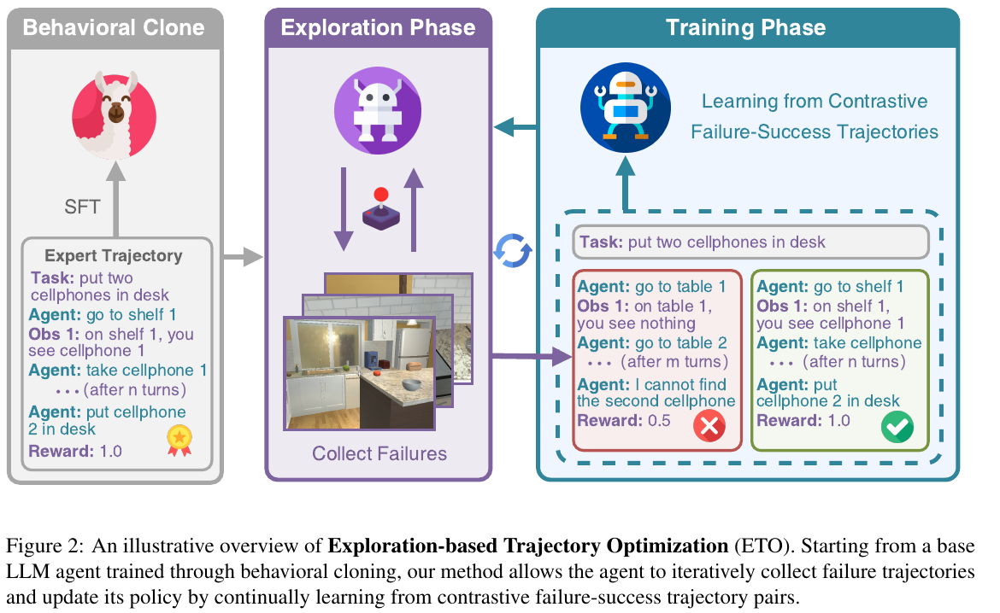

图源：原论文Figure 2。左侧灰框是“专家轨迹→SFT→初始模型”；中间紫框中，模型与环境双向交互，向右送出收集到的低分轨迹；右侧蓝框将同任务的红色低分记录与绿色高分记录用于训练。右框上方回到中间的箭头表示新模型继续探索，**不是把失败环境状态直接改成成功状态**。图中任务是放两部手机，红色轨迹得0.5而非0，恰好说明部分成功也能作为较差一侧。

**公式在比较什么？** 设任务为$u$，胜者和负侧轨迹为$e^w,e^l$。令$\pi_\theta(e\mid u)$表示待训练模型给轨迹中所有模型输出的条件概率之积；环境观察只作为条件。参考模型的对应概率为$\pi_{\mathrm{ref}}$。先计算：

$$
d=\log\frac{\pi_\theta(e^w\mid u)}{\pi_\theta(e^l\mid u)}
-\log\frac{\pi_{\mathrm{ref}}(e^w\mid u)}{\pi_{\mathrm{ref}}(e^l\mid u)},\qquad
L=-\log\sigma(\beta d),\quad \sigma(z)=\frac{1}{1+e^{-z}}.
$$

第一项是当前模型对两条路线的偏好，第二项是参考模型原本就有的偏好；相减是在问“训练后是否更偏向赢家”。$\beta$控制这个差异进入损失的尺度。$\log$把很多小概率的连乘变成可相加的数；真实实现累加的是每个输出Token的对数概率，不是让模型一次给整条路线打一个任意分数。$\sigma$把差异变成0到1之间的数；负对数使更大的正差异得到更小损失。（原文Eq.11。）

用教学数字说明：假定参考模型对两条路线的概率比为1，当前模型概率比为4，并暂取$\beta=1$。那么$d=\log4$，$\sigma(d)=0.8$，损失约0.223；尚无相对改变时$d=0$，损失约0.693。因此优化倾向于让赢家相对更可能。**它约束的是相对关系，并不保证每次更新都让赢家的绝对概率增加**；后面的IPR正是因此还保留直接模仿正例的目标。

杯子例子也揭示更新范围：若两条轨迹直到最后一步都完全相同，公共前缀的对数概率在相减中抵消，差异主要落在“放桌上/放柜子”。但如果模型从另一房间绕路，再正确拿到杯子，负侧覆盖的就是不同上下文中的整段动作。ETO没有新增一个标签告诉训练器：“这次拿杯子是对的，只是放错了位置。”不能把终局偏好自动解释成每一步都错。

**实验怎样检验这个设计？** WebShop让模型按要求购物，ScienceWorld让它完成模拟科学任务，ALFWorld让它执行家务指令。作者主要报告0–100尺度的平均奖励：前两者可有部分完成分，ALFWorld的二值完成奖励平均后对应成功比例。`seen/unseen`区分训练时见过与未见过的场景或关键任务变化，不是训练集和测试集混用。

- 比较对象SFT只模仿专家；RFT则把模型自行成功的记录加入数据继续模仿。二者帮助区分“增加正例”与“利用成败差异”。Table 2中Llama-2-7B-Chat的WebShop平均奖励为SFT 63.1、ETO 67.4；ScienceWorld-unseen为53.0→65.0；ALFWorld-unseen为67.2→72.4。它们支持该设置下成败对比在已有模仿基础上有用，不证明任何失败数据都有益。
- Table 4主动试了更细的步级对比：WebShop整轨迹ETO为67.4，直接沿用学习率和$\beta$的步级变体仅8.3；降低学习率并加强参考约束后为62.8，混合版本64.3。这个实验不是“步级训练必然失败”，而是说明**把终局标签搬到局部，并保持同样优化设置，可能极不可靠**。
- §4.3中多轮训练并非单调改善，ALFWorld第二、三轮可能低于SFT。Table 5无专家行为克隆时，直接ETO为12.5，低于初始17.9；先用自行筛选的成功记录训练得到48.4，再做ETO为51.2。偏好训练仍依赖足够好的正例和起点。

数据与费用也限制解释：专家训练轨迹数分别为1938、1483、3321；WebShop测试200例，ScienceWorld seen/unseen为194/241例，ALFWorld为140/134例。实验使用8张A100 80GB，SFT与ETO均训练3个epoch，即各自多次遍历数据；购物和科学任务迭代2轮，家务任务1轮。探索、参考模型概率计算和新增训练都是成本，不能只计算保存了多少失败记录。

#### 启发探索

ETO真正增加的是“当前模型的低分经历与专家高分经历之间的相对监督”，不是逐步错误识别器。证据支持利用失败比较，但步级反例同时提醒：**粒度变细与标签变准是两回事**。

对本课题的启发是先区分两项研究：一项研究怎么得到可信局部标签，另一项研究给定标签后怎样训练。如果只是把失败轨迹切开，再把每段都标成负例，既没有解决ETO暴露的问题，也不能作为新的核心贡献。整轨迹ETO与其已存在的步级变体都应成为近邻或基线；公共前缀完全相同的特殊情况也必须单独考虑，不能笼统声称DPO必定惩罚一切正确前缀。

### 2.2 IPR：在相同历史后反复尝试，估计动作的后续价值

来源：*Watch Every Step! LLM Agent Learning via Iterative Step-level Process Refinement*，[EMNLP 2024正式记录](https://aclanthology.org/2024.emnlp-main.93/)。以下依据§2–5.5、Eq.3–10及Appendix A–D；成本来自Appendix C。IPR不是人类反馈算法名称的缩写。

#### 研究动机

用户要买蓝色M码衬衫。模型在搜索页点中了正确商品，却在后面选错尺码，最终失败。如果把“点击这件衬衫”也直接标错，会误导训练。反过来，模型先点错商品，后来返回改正而成功，也不能据最终成功就认定第一次点击值得模仿。

IPR提出一个更具体的问题：**保持点击前的历史不变，执行某个点击之后，再让同一个模型多次继续完成任务，平均能得到多少分？** 这不再只看某一条路线的偶然结局，而是在相同起点上重复试验。不过，得到的数仍取决于“由谁继续做”，不是动作脱离后续能力的永久标签。

#### 设计方案

**先区分三个角色。** 专家记录提供可靠的历史和候选动作；待训练Agent提出替代动作；固定的评分模型负责反复续跑。评分模型也是先经SFT训练的Agent，不是能直接看到正确答案的神谕，也不是单独输出一个主观分数的评论员。它必须继续与环境交互，由环境给最终奖励。

在自拟购物例子中，采集过程如下：

1. 重放专家的搜索动作，到达同一搜索结果页，保留同一任务、动作和观察前缀。
2. 专家下一步是点击蓝色衬衫；当前Agent给出另一个点击，并继续生成其余操作，形成替代后缀。“后缀”就是从这个分叉点直到任务结束的全部剩余记录。
3. 对两个候选动作分别建立可续跑状态。固定评分模型从相应分支多次继续选码、下单；每次都记录环境终局成绩。
4. 比较两边平均成绩。只有专家分支比替代分支高超过阈值，而且实际采集到的替代后缀最终也比专家差，才保留这一偏好对。双重条件用于过滤不明确的差异。
5. 同时训练三件事：完整成功路线胜过失败路线；同前缀后的专家后缀胜过替代后缀；继续直接模仿成功路线。更新后重新采集当前Agent会产生的分支，评分模型保持固定。

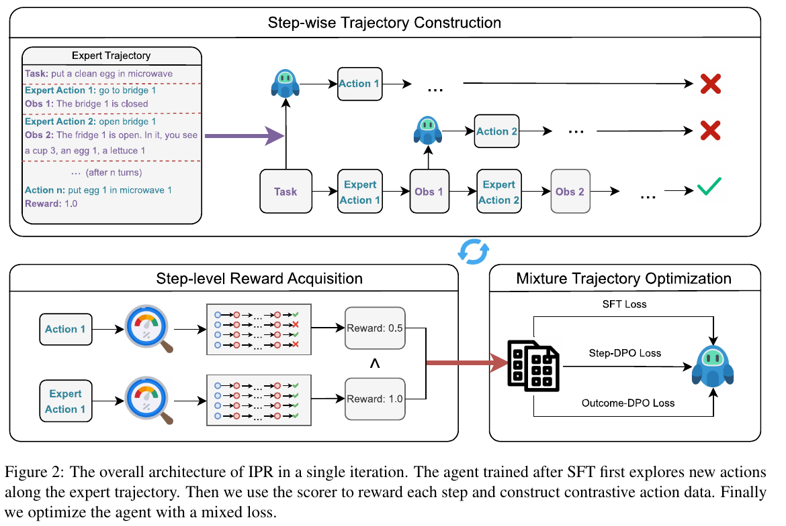

图源：Figure 2，PDF第3页、印刷页1558。上半部水平主线是专家轨迹，机器人从不同历史节点向上分叉生成替代路线；红叉和绿勾是整条分支的结局。左下的多个短分支表示**反复续跑**，右侧小框是成绩均值；它们把原本只有终局分数的数据转成分叉处的比较标签。右下三条箭头分别是SFT、作者称作Step-DPO的目标、Outcome-DPO目标；蓝色循环表示下一轮重新构造数据，不是三种训练互相替代。

**平均成绩怎样算，算出后做什么？** 设历史为$h$，候选动作是$a$，固定续跑模型为$\pi_s$。第$j$次续跑的环境终局奖励为$R_j$。动作价值的估计为：

$$
\widehat Q_{\pi_s}(h,a)=\frac{1}{N}\sum_{j=1}^{N}R_j.
$$

这是原文Eq.3–5的直观重述，$N$是重复次数，主实验为5。所谓蒙特卡洛（MC）估计，在这里就是“无法把所有未来都算出来，于是实际多试几次取平均”。假如专家点击后5次结果为$[1,1,1,1,0]$，替代点击后为$[1,0,0,0,0]$，估计分别为0.8和0.2，差0.6。它大于WebShop所用0.01阈值；若替代记录本次确实失败，则通过筛选。结果数字是自拟；原文阈值因任务而异：ALFWorld 0.5、WebShop 0.01、SQL 0.1。所谓生成温度控制采样的随机性：评分续跑温度为1，允许多次选择不同输出；构造主要替代路线时温度为0，逐次选择当前最可能的输出。

注意，5次中的一次偶然成败会使均值变化0.2；小预算下标签不可能无噪声。即使候选点击语义上正确，如果评分模型不会后面的尺码菜单，它仍可能得到低分。这里测的是“这个动作加上该续跑策略”的成功前景。

**步骤标签不等于只训练一个动作。** 设专家剩余路线为$y^+$，替代路线为$y^-$，共同历史为$h$。作者的局部目标是：

$$
L_{\text{suffix}}=-\log\sigma\!\left(\beta\left[
\log\frac{\pi_\theta(y^+\mid h)}{\pi_{\mathrm{ref}}(y^+\mid h)}-
\log\frac{\pi_\theta(y^-\mid h)}{\pi_{\mathrm{ref}}(y^-\mid h)}
\right]\right).
$$

它与上一节DPO的计算方式一致，但比较单位由整条轨迹变成共同历史后的两条后缀。两边概率都要包含点击、选码、下单等所有模型输出。MC续跑负责形成标签；实际训练的后缀概率来自已构造的偏好记录。不能把这两类数据混为一件事。（原文Eq.8。）总目标是$L=L_{\text{outcome}}+L_{\text{suffix}}+L_{\text{SFT}}$，三个量分别提供全局比较、分叉后的比较和正例锚定；最后一项直接提高成功输出的概率，避免只改善两边相对关系却一起降低概率。（Eq.9–10。）

训练结束后，部署模型按当前历史直接生成动作，不需要在线为每个候选续跑5次。额外试验主要发生在训练数据构建阶段，因此“推理时没有增加开销”不代表整个方法免费。

**实验回答了哪些问题？** Table 2在同表比较Llama-2-7B：WebShop平均分ETO 67.4、IPR 71.3；SQL任务57.2→61.3；ALFWorld seen/unseen为68.6→70.3、72.4→74.7。差值依次为3.9、4.1、1.7、2.3个绝对分数点；作者写的5.8%等是相对提高，不能当作百分点。这里采用各自迭代中的最好结果，不是相同最后一轮的统一比较。

能区分设计成分的是Table 4：去掉后缀DPO后，WebShop/SQL/ALFWorld-unseen降至66.4/58.0/70.2；去掉完整轨迹DPO为70.2/59.3/72.4；去掉SFT为61.8/31.7/64.9。说明过程比较有贡献，但正例锚定同样重要，不能把全部改善归因于一个“步级”损失。迭代轮次实验也有峰值后回落，不同任务峰值不一致。

§5.3把MC排序与WebShop商品属性启发式评分比较，最佳约82%一致；它检查了标签质量，但对照不是人工核验的因果真值。§5.5进一步用约70k个MC动作标签训练评分模型，说明标签可以复用到别的模型，不过效果仍弱于在线MC估计。更准确标签和更低标注成本之间存在实质取舍。

Appendix C的WebShop三轮时间口径为SFT 1小时、ETO 2.5小时、IPR 5.3小时，IPR约为ETO的2.12倍；正文“约三倍”不宜当精确计量。实验用8张A100 80GB，每批处理48个样本（batch 48）、训练3个epoch。训练样本数量与ETO原论文不同，不能把两篇各自主表拼成严格统一排行榜。

#### 启发探索

IPR的实质是**付出额外续跑成本，改善从哪里开始比较的依据，再训练这个位置之后的整段行为**。它比终局标签直接下放更有信息，但仍不是无条件的单动作因果判断；从专家前缀分叉，也不等于覆盖当前模型犯错后进入的一切状态。

对新研究，值得检验的是：在同样标注、模型与续跑预算下，只训练一个动作、训练短动作组、训练完整后缀，究竟各适合什么错误？必须固定评分策略能力，才能分清“单位更合适”与“评分模型更强”。“共享前缀”“多次续跑”“混合SFT和偏好训练”本身均已在本篇出现。

### 2.3 HPL：把连续动作作为技能单元，再按长度和可区分程度安排学习

来源：[arXiv:2510.03253v2](https://arxiv.org/abs/2510.03253)，2026-03-02，页眉为ICLR 2026正式论文；[OpenReview入口](https://openreview.net/attachment?id=s8usvGHYlk&name=pdf)直接下载受限，实际分析作者arXiv全文，没有声称两个PDF逐字一致。依据§3–4及Appendix C–G，特别核对Appendix G推导。

#### 研究动机

任务是“把苹果洗干净，再放入冰箱”。“走到水槽”单独看还没获得最终奖励，却可能是下一步清洗的必要准备。整条路线太长，不容易定位哪里决定成败；每个动作分别评分又需要很多续跑，而且少量试验的均值会波动。有没有介于“一步”和“整条”之间的单位？

HPL把“走到水槽→清洗苹果”这样的连续动作看作一组。直觉是：有些能力要几步配合才显现，按组比较更接近一个可复用的小技能。然后再问：应该先教短且胜负明显的组，还是把长短、难易混在一起？这就是它所说的分层偏好与双轴课程。课程仅指训练数据出现的阶段安排，不是给模型另写一套语言教程。

#### 设计方案

**同一条洗苹果轨迹如何变成训练材料？** 首先仍用专家轨迹训练基础Agent。随后冻结参考模型：由它产生替代动作和续跑结果，所有比较数据建好后才离线训练待改进模型，训练期间不再不断更新模型并重新采样。

分组有四种实现，读者可以直接理解其输入输出：

- 固定组数：例如把12步切成3组，每组约4步。
- 固定组长：例如每连续3步一组，12步得到4组。前者的“3”是组数，后者是每组动作数，不能混淆。
- 不确定性分段：参考模型在某个位置对下一动作很拿不准时，将其视为可能的子任务边界；这个“不确定性”由动作分布的熵描述，不是人工已知的边界。
- 语义分段：GPT-4o阅读完整记录，按“找苹果、清洗、放置”等子目标给出连续分组。它是额外模型服务，有费用，也可能分错。

得到专家组$G^+$后，保持它之前的历史$c$不变，让参考模型生成**相同动作步数**的替代组$G^-$。在自拟例子中，两组分别是“走到水槽→清洗”和“走到冰箱→放入未洗苹果”。执行完组内动作后，从两边末端各继续尝试5次，环境判定最后是否完成“洗净且放好”。若分别成功4次和1次，估计组价值是0.8与0.2，差0.6。

这里有两个重要区分。第一，替代组不能仅因“不是专家写的”就天然成为负例，偏好应有奖励差支持。第二，用于估值的后续尝试不等于该组DPO要模仿的文本；组目标比较的是组内动作，后续尝试主要提供标签。它与IPR训练整个后缀不同。

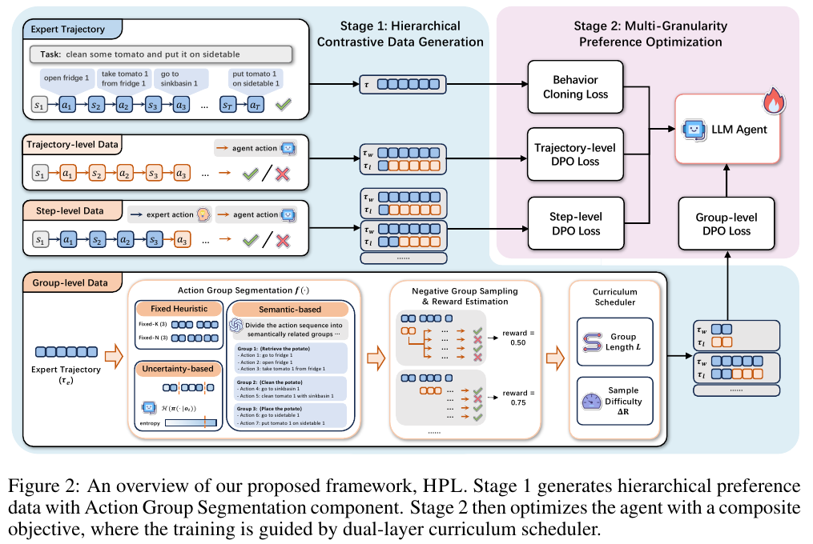

图源：Figure 2，PDF第4页。上部蓝色区域从专家轨迹构造整轨迹和Step-level两类数据；右上粉色区域接收行为克隆、整轨迹DPO、后缀DPO等目标。下部是新增动作组分支：左侧四种分段方式将蓝色动作串切块，中间橙色替代动作与多条续跑产生奖励估计，右侧课程模块按组长和奖励差调度，最后将组级损失送进同一Agent。蓝色/橙色表示专家/替代动作，不是输入可见与梯度保留的标记。图中的续跑短线承担的是标签来源，而非自动全部进入组损失。

**组价值、训练顺序与损失怎样连接？** 组价值是环境成绩均值：

$$
\widehat r(G)=\frac{1}{M}\sum_{j=1}^{M}R_j,\qquad
\Delta R=\widehat r(G^+)-\widehat r(G^-).
$$

$M=5$为每组的续跑次数，$R_j$来自固定参考模型继续执行后的环境成绩。组长$L$是该组动作个数。$\Delta R$大表示两边比较明显，在课程中算“容易”；$\Delta R$小表示难以区分。请不要把“负例特别差、差值很大”误解成困难样本。

作者分别把组长和区分难度切成三个档，得到3×3个桶。第一阶段只用短且容易的组；第二阶段加上短但中等难度、以及中等长度但容易的组；第三阶段用全部桶。数据集逐步扩大，因此早期简单样本还会继续出现，而不是每个桶只看一次。（§3.4、Appendix F。）

组DPO仍用上一节的相对概率损失，只把$y^+,y^-$替换为$G^+,G^-$，并以共同历史$c$为条件。组内每个动作的概率依次条件于当时的观察和先前动作。总目标为：

$$
L^{(s)}=L_{\mathrm{BC}}+L_{\mathrm{trajectory}}
+L_{\mathrm{suffix}}+L_{\mathrm{group}}^{(s)}.
$$

$s$是课程阶段，只有最后一项随阶段选不同组数据；BC是直接模仿专家。论文称作“Step-level”的那一项沿用IPR，仍比较从分叉点到终点的后缀，并不因为名称带step就只含一个动作。（§3.5、Eq.4–9。）部署时这些分组器与MC评分器不需要随Agent在线运行。

**哪些实验支持“组”和“课程”？** Table 1采用3个随机种子，即以不同随机过程重复训练。Qwen2.5-7B的ALFWorld-unseen：语义HPL为84.08±2.28，IPR为78.11±3.76；WebShop平均奖励62.97±0.50对62.01±0.43，成功率35.17±0.58对33.67±0.58；SQL平均分70.37±1.27对68.86±1.02。前面的“±”是跨重复运行的波动，不是每个任务保证提升的范围。不同任务改善幅度很不一样，不能用混合指标平均数替代逐项判断。

语义分组也没有统治所有格子：7B ALFWorld-seen固定组长为85.71，高于语义82.62；1.5B unseen固定组数为74.38，略高于语义74.13。因此，语义解释听起来合理，不代表它在每个环境都比简单切段好。

Table 2专门把课程换成静态混合、只按长度、只按难度，7B汇总点估计分别为65.30、66.74、66.94，完整双轴课程67.81。这个对照支持同时安排两种难度在该设置中有益；但其运行结果与主表不同，不能把两表数字当同一次实验。Figure 5再分别移除损失：ALFWorld-seen完整83.57，去组目标72.86，去后缀目标80.71，去整轨迹目标79.29。SQL却是完整70.63、去整轨迹68.70、去组69.19；所以“去组在所有任务降得最多”并不被这些数值支持。

**为什么不能直接宣称大幅节省总成本？** Appendix D.5/Table 5在ALFWorld 1.5B上报告：IPR的步级部分约750k次LLM调用、6小时13分；HPL语义版本的组级部分约221k次、3小时21分。这是两个**部件**的计时，不是IPR总流水线与HPL总流水线；HPL总目标仍有步级和轨迹级数据。仅拿221k除750k，就说完整方法少70%调用，会漏项。两者训练部分均为26分钟；计时段称4张A800，而其他实验配置写8张A800，也应保留口径差异。专家生成和GPT-4o分组费用不能因表格某栏为0就消失。

**理论声称要怎样理解？** 作者希望证明：中间长度组的系统误差可受控，同时估计波动比整轨迹/后缀更低。这里“误差”指估计平均偏离目标多少，“方差”指重复抽样时波动多大。直觉可以理解，但Appendix G的论证不能直接作为一般保证。以下是对公式的可复核检查，而不是否认主表：

1. Eq.34认为不重叠组可作为独立样本。可是不共享动作不等于不共享困难来源：某个隐藏开关若决定整条任务难度，不同组仍一起变难。这样的组会共同波动；计算平均值方差时不能把关联项全部删去。
2. Eq.31用Cauchy–Schwarz不等式声称组间关联随间隔按$\gamma^o$下降。该不等式能限制关联的大小，却不会自行产生“隔得越远越独立”的规律；需要额外说明环境如何遗忘过去的影响。
3. Eq.35涉及$M=\lfloor T/k\rfloor$。例如$T=10,k=3$，只有$M=3$组，$1/M=1/3$大于$k/T=0.3$，原推导所用方向不成立。需要处理未整除余项；而两个方差各有上界，也不能据此自动知道谁的实际值更小（Eq.36）。
4. Eq.10的组回报含组末端“剩余最优价值”，后续Eq.22又把它当作没有这部分的截断回报。两种量必须统一；理论中的最优未来与实际参考模型的5次续跑之间，也需要误差连接。
5. 所选组长还必须短于整条轨迹。论文给出的误差要求并不自动保证存在这样的组长，特别是在终局奖励很远、折扣接近1时。

#### 启发探索

HPL的贡献可以准确表述为：**新增固定长度或语义连续动作组的偏好数据，并以长度和奖励差安排组级学习，同时保留其他监督**。实验支持这套组合在若干任务有效；目前的推导不足以保证“中粒度天然更低方差”，成本表也不足以保证完整方案比IPR更省。

因此，新方案若只有“按子任务拆分、短到长课程、多粒度加权”，会与HPL直接重合。更有价值的探索是把三个问题分开：分组是否真的对应可复用能力；标签是否受续跑能力和恢复策略影响；在相同总交互、相同训练曝光次数下，中间粒度还是否有优势。苹果例子中，更强模型若会把脏苹果取出来补洗，原本0.2的替代组价值可能上升，这正说明组偏好也有条件。
### 2.4 GiGPO：从已经发生的重复状态中，找到局部比较对象

来源：[NeurIPS 2025正式记录](https://papers.neurips.cc/paper_files/paper/2025/hash/420c9f777c0b4f78d515e53cf74d58b2-Abstract-Conference.html)。以下依据§3–6、Appendix A/C/D/E.1/E.2/E.5；图源Figure 2、PDF第5页。

#### 研究动机

让同一个购物Agent对同一任务尝试8次，可能有的成功、有的失败。普通组相对策略优化（GRPO）先比较8次最终成绩，再给某条轨迹中的所有输出同一个“比平均好还是差”的信号。这样做不用单独训练评分网络，但会把成功路线中的错误点击一起表扬，也会把失败路线中的正确搜索一起压低。

IPR的解法是到每个分叉点额外续跑，不过环境和模型调用很贵。GiGPO观察到：8条原始轨迹可能早就多次回到同一搜索页。有一次点商品A，有一次点B，还有一次点错后返回再点A。**这些已经发生的选择能否组成局部比较组，而不用再重跑环境？**

这里的核心不是把字符串切得更细，而是找出“谁可以与谁比较”。相同任务还不够，动作发生前的决策状态也要足够相同。

#### 设计方案

**沿购物例子收集并重组数据。** 训练开始时，从相同任务和初始环境状态采样若干完整尝试。一次完整尝试叫一个rollout。记录每步状态、模型动作和奖励后，做两次不同分组：

1. 整轨迹组：8次尝试按最终总成绩比较，产生全局优势$A^E$。它告诉训练器这次整体比同任务其他尝试好多少。
2. 同状态组：把所有访问同一个搜索结果页的动作收集起来。可以来自不同轨迹，也可以来自同一轨迹先后两次访问。每个动作带上它之后实际获得的“折扣未来回报”，再在这个小组内比较，产生局部优势$A^S$。
3. 将两种信号相加，用于训练当时生成的动作。数据收集时的旧模型固定，更新后的模型再开展下一批尝试。部署时只运行训练后的策略，不需维护训练批次的比较组。

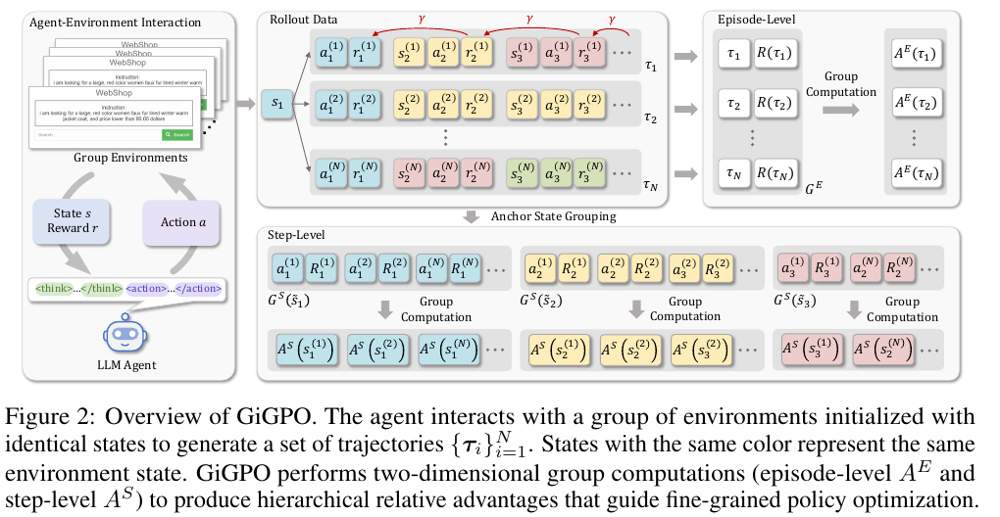

图中左侧是模型输出动作、环境返回状态和奖励的循环；中上部多行是实际采样的多条轨迹。右上部每条轨迹只得到一个$A^E$。下半部则把不同时间、不同轨迹中同色状态重新汇在一起，计算各动作的$A^S$；颜色表示状态匹配，不表示成功或失败。中间向下的“Anchor State Grouping”箭头传递的是已有记录，不会凭空生成新的行动分支。这个图也说明局部组大小不是预先都相同：取决于实际重复访问多少次。

**折扣回报是什么，为什么要它？** 若只看动作执行当下的奖励，搜索、点击往往都得到0，直到最后购买才有分。于是对时间$t$的动作，把后面成绩按距离打折后相加：

$$
R_t=\sum_{k=t}^{T}\gamma^{k-t}r_k.
$$

$r_k$是第$k$步环境奖励，$T$是本次结束位置；$\gamma$在0到1之间，越小越不重视遥远的奖励。教学例子暂设只有最后成功得1分、$\gamma=0.9$。在同搜索页，动作A之后还需两步才拿到奖励，$R_A=0.9^2=0.81$；动作B先绕路，四步后成功，$R_B=0.9^4=0.6561$；动作C最终失败，$R_C=0$。这是实际观察的后续结果，不是把所有可能后续算尽后的真实动作价值。

不做标准差缩放的版本，在局部组内减去均值：

$$
A_j^S=R_j-\frac{1}{|G|}\sum_{q\in G}R_q,\qquad
A_{i,t}=A_i^E+\omega A_{i,t}^S.
$$

$G$是同状态动作集合，$|G|$是其中记录数；$i$指轨迹，$t$指其中步骤；$\omega$调节局部信号强度。上述3个回报均值为0.4887，局部优势约为0.3213、0.1674、−0.4887。因此B虽然绕路，仍好于这一组均值；它并不会被规则强行标成绝对错误。全局优势再与之相加，最终更新方向还取决于$\omega$以及整条任务表现。原文也研究用标准差归一化的版本，即把“比均值差多少”再除以组内波动尺度。（Eq.3–8。）

**优势怎样进入模型更新？** 它不是要求模型输出的数字。训练器用它乘在模型输出概率的更新项前：正值倾向于提高采样输出的概率，负值倾向于降低。为防一次更新过大，作者沿用带截断的策略目标。对某个实际生成Token，设新旧模型概率之比为$q=\pi_\theta/\pi_{\mathrm{old}}$，使用：

$$
J=\min\bigl(qA,\operatorname{clip}(q,1-\epsilon,1+\epsilon)A\bigr).
$$

这里是要最大化的目标，$\epsilon$限制概率比偏离1的区间；完整目标还需对所有采样Token聚合，并遵循原训练器的其他项。理解局部变化只需看这一项：教学设$A=1,\epsilon=0.2$，把$q$从1.1推到1.5，奖励项不会一直按1.5增大，而会被截为1.2；当$A<0$时，这个取较小值的写法也限制过度压低概率的收益。GiGPO改变的是$A$从哪里来，不是重写整个策略优化器。（Eq.9。）

**哪些结果说明局部分组有价值？** Table 1的3次独立训练中，Qwen2.5-7B不做标准差缩放的GiGPO，在ALFWorld达到90.2±2.3，对照GRPO为77.6±5.2；WebShop成功率75.2±3.8对66.1±3.7。Figure 4分别删去全局或局部优势后都下降，支持二者提供互补信号。Appendix E.5/Table 5中局部权重从0增到0.8有益，继续到1.4反而回落；这反驳“局部信号越强越好”。

实际实验不是纯粹只在终局给0/1：Appendix E.1设成功奖励10、失败0，无效动作另扣0.1，$\gamma=0.95$；ALFWorld最多50步、WebShop 15步。每任务8条轨迹，16组共128个环境实例；输入历史长度为2，问答任务改用完整历史，并使用最长匹配子序列阈值0.9进行近似匹配。原文在这些环境下训练150次迭代，1.5B用2张H100，7B用4张H100。上述教学数字仅说明公式，不能替代这些配置。

效率优势具体是少了额外逐状态续跑和评分网络。§5.6报告哈希分组0.01秒、局部优势0.53秒，相对共有的362.83秒很小；但原文写低于0.002%有算术问题，$0.54/362.83\approx0.149\%$。这个更正不推翻“该分组步骤开销小”，却避免夸大两个数量级。

#### 启发探索

GiGPO说明同一批成功和失败经历中已经包含可比较结构；有用局部信号不一定必须购买额外续跑。但它依赖状态匹配：看起来相同的页面，可能对应不同用户约束或购物车内容；短历史若漏掉这些条件，把它们放进一组就会比较错对象。完全没有重复状态时，局部优势为0，退回全局算法；这不是“错误匹配时也保证不差”。

还有一个容易被成功率掩盖的边界：折扣偏好更快拿到奖励，因此有时是在奖励速度，而不只是正确性。必要安全检查若多花两步，却防止评测外的风险，短期折扣未必认可它。新方案需要同时记录状态匹配质量、有效局部组大小、恢复能力与最终完成率，并在同样rollout预算下与GiGPO比较，才能识别改进来自更准信用还是更多数据。

### 2.5 SALT：让同一个动作转移不再因为不同结局收到相反信号

来源：[Findings of EACL 2026正式记录](https://aclanthology.org/2026.findings-eacl.247/)。以下依据§2–4.6、Limitations、Appendix B/C及Algorithms 1–2；图源Figure 3，PDF第4页、印刷页4712。

#### 研究动机

两次家务尝试都从同一位置“打开冰箱”，都看到苹果和橙子。之后第一次取苹果并完成任务，第二次取错橙子而失败。如果训练器给第一条所有动作+1、第二条所有动作−1，“打开冰箱”这个相同操作就被一边表扬、一边批评。

SALT问的不是“同状态下哪个动作更好”，而是：**完全相同的一次状态转移，为何要承担后面不同选择造成的相反评价？** 它将这种重复转移合并，用多次出现的平均优势替代单条轨迹的优势。与GiGPO相比，一个比较不同动作，一个对相同动作转移协调信号。

#### 设计方案

**先有轨迹成绩，再建关系图。** 常规组RL已为每条尝试算好整轨迹优势$A_i$。SALT不另外请求教师判断动作对错，而是把已有轨迹画成图：状态是节点，动作使状态发生变化，因而是节点之间的边。每条边最初继承所在轨迹的优势。

并非只要动作文本相同就能合并。两条边必须同时满足：起始状态相同、动作相同、结束状态相同。状态用最近$h$个“动作—观察”对表示，默认$h=3$；不是只看“打开冰箱”四个字。如果操作前一边已拿着苹果而另一边没有，足够完整的状态表示应把它们分开。

在自拟例子中，两条轨迹“打开冰箱”前后历史匹配，因而合并；后续“取苹果”和“取橙子”动作不同，仍分开。得到的新优势代替原优势，送回原有带截断的RL训练器。部署时用训练完成的模型即可，不需要重建其他用户的轨迹图。

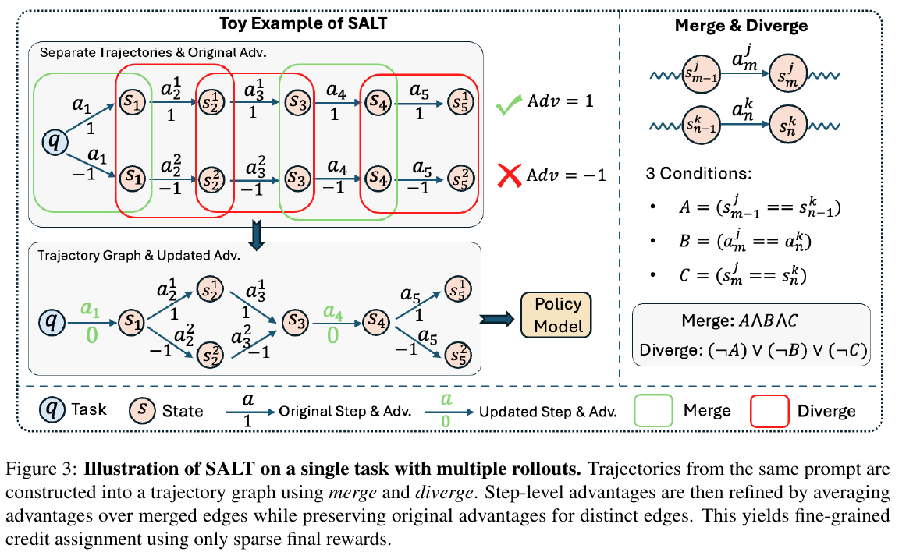

图左上先画两条独立路线，第一条所有边为+1，第二条为−1；绿色框标出可合并结构，红色框保留分叉。左下变成共享节点的图后，共同边$a_1$和$a_4$变为绿色0，独有边保留原来的±1，再送入右边Policy Model。图右侧列出合并的三个等式，必须三者同时成立；底部图例中的颜色只是在标示合并/分叉，不是人工认定某动作有益或有害。

**平均优势的公式几乎就是方法本身。** 若某条相同边共出现$n$次，原优势为$A_1,\ldots,A_n$，所有出现位置改用：

$$
A'_1=\cdots=A'_n=\frac{1}{n}\sum_{j=1}^{n}A_j.
$$

$n$来自图中实际匹配的次数，$A_j$来自原训练器的整轨迹评价，不是新增局部奖励。（Eq.7。）自拟例子中$[+1,-1]$平均为0：这批数据不再直接增减“打开冰箱”的概率，而后续取苹果/取橙子仍分别得到+1/−1。若三个出现位置是$[1,1,-1]$，共同边得到$1/3$，并不是凡重复动作都置零。

这也给出两个边界推演。若所有轨迹都同样成功，原组内回报没有差异，SALT不会凭空创造哪个动作更好的证据。若某条失败路线独有的动作其实是正确但偶然不同的表达，它仍会保留负优势；“独有边”不能因此等同“造成失败的原因”。平均化降低信号冲突，但没有自动完成因果归因。

**实验在比较什么？** 作者将同一RL训练器与“该训练器+SALT”比较。GRPO采用组内均值/波动构造优势，RLOO使用其他采样轨迹作为相对参照；两者都能插入这个边级平均步骤。这样可以看新增图处理是否有额外收益，而不是只与未经训练的模型比较。

Table 1采用3次独立训练，并在ALFWorld/WebShop平均最后5个checkpoint的评测值；checkpoint指训练到某一时刻保存的模型参数版本，不是额外5次独立训练。ALFWorld中，1.5B模型GRPO 81.8±2.1变为85.2±2.5；7B为72.5±5.5→77.8±1.7。但7B WebShop的RLOO成功率却从76.8±3.6降到75.2±5.5。因此不能写成所有算法和任务都提高。

AppWorld让模型调用多个应用的接口完成任务，TGC表示任务目标完成率，Test-N是正常测试，Test-C是挑战测试。Table 2的Qwen2.5-32B：GRPO的Test-N TGC为61.5±2.9，加SALT为66.2±2.5；Test-C为36.3±0.2→36.8±1.5。正文把后者基线写为30.1并据此说提高6.7，与表格不一致；本报告采用表内值，不宣称大的挑战集增益。

§4.5改变历史长度：$h=1$更容易把本应不同的状态合并，$h=5$又可能严到几乎不合并而接近原算法。§4.6改变每任务尝试数：4条时GRPO略好，8/12/16条时SALT更有优势。这两个对照说明图结构不是不依赖数据条件的万能模块，需要足够重复，又不能错误合并。

§4.3在ALFWorld计量到额外优势处理0.15秒，相比采样240秒、模型更新30秒很小。不过AppWorld使用文本向量与余弦相似度近似匹配；已取得正文和Appendix B.2未给出编码器型号及阈值数值，仍有复现缺口。离散状态的0.15秒不能直接当作所有语义匹配场景的完整费用。SALT离散任务训练300步，GiGPO相关实验150步且基线结果不同，不能跨两篇主表宣布谁胜谁负；SALT未提供同配置GiGPO直接对照。

#### 启发探索

SALT真正改变的是**重复转移的更新信号一致性**。它不增加环境试验，不把失败文本当正例，也不识别所有局部错误。对本课题而言，它提示一种低额外成本的利用方式：失败记录可帮助判断哪些行为其实在成功中也出现，不必整条删除。

下一步若沿此路线，应同时测“合并了多少、合并对不对、被平均后哪些动作受益”。如果最终成功率提升，却不知道状态匹配准确性，就无法判断是信用更准、一般平滑作用，还是某种长度/重复频率偏好。失败恢复率、错误合并率和有效组规模应与任务完成率共同报告。

### 2.6 IAPO：沿一条轨迹中的信息使用关系，重新分配训练权重

来源：Ren等，*Influence-Aware Policy Optimization for Credit Assignment in Multi-Turn Service Agents*，[arXiv:2608.24588v1](https://arxiv.org/abs/2608.24588)。依据Problem Setup、Method、Properties、Experiments和Tables 1–5；这是预印本。附录全部证明与提示实现未完成独立审计，不将正文性质检查称为完整证明验收。

#### 研究动机

考虑退款客服：模型先问订单号，用户回答；模型查询订单，得到商品和退款资格；最后调用退款工具。早先那个“查询订单”本身没有完成退款，却给最终操作提供了必要参数。如果中途还查询了无关商品，这两次查询未必应因最终成功获得相同表扬。

GiGPO和SALT需要不同尝试中出现可比较的状态或边。真实服务对话却常有不同用户回答、偏好改变和工具状态，不容易把用户“重置”到同一次谈话。IAPO于是看一条已完成记录内部：后面的动作究竟用到了前面的哪些信息？有没有某个错误结果被后面重复使用并导致补救？它用这些事后可见关系调整各动作承担的优势幅度。

#### 设计方案

**退款例子经过哪些处理？** 数据仍由常规GRPO产生：同任务采样多条完整对话，环境给最终成绩，并得到整轨迹优势。然后将每条完整记录交给冻结的标注模型，构造信息依赖图。

节点是需要训练的Agent动作，例如“查询订单17”和“对订单17退款”。工具返回和用户发言提供证据，但不是让Agent预测的动作标签。若退款调用的参数确实来自前面的订单查询，就连一条支持使用边；如果后面重复使用一个已明确无效的订单ID而再度报错，则连失败使用边，并记录哪个动作有可观察错误。

边的判定比“内容都在讲订单”严格：要指出具体信息单元，绑定到后续参数、条件分支或恢复动作，并处理同一信息有多个来源时选哪一个。用户回答通常追溯到引出回答的提问动作；无对应提问的直接用户输入单独计入消费信息的证据。它依然是标注模型对记录的判断，不是已通过删边实验验证的因果必要性。

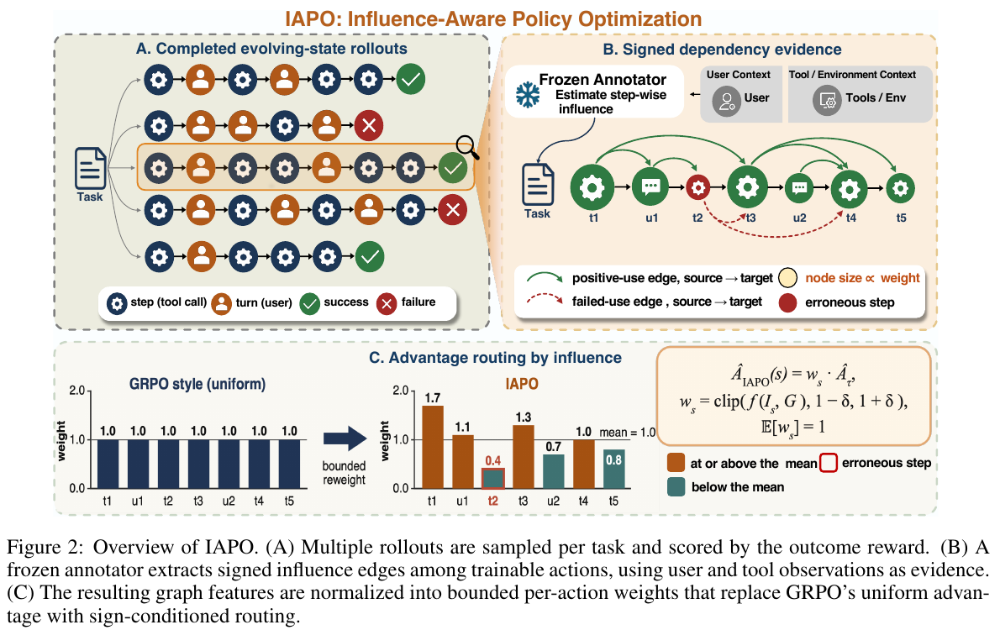

图源：Figure 2，PDF第3页。A区是已结束的多条用户—工具交互，绿勾红叉表示终局成绩；B区用冻结标注器读取用户和工具上下文，绿色实箭头为支持使用，红色虚箭头为失败使用，红节点是有错误证据的步骤。图为解释上下文也画出用户节点，但训练信用仍只给Agent输出。C区对比原先均匀权重1与不均匀的新权重；柱形是方法概念示意，不能把其中0.4或1.7当作所有实验的默认权重。

**从图到数字，先数什么？** 对动作$i$，$d_i^+$是其信息被后续正确使用的出边数，$d_i^-$是失败使用出边数，$d_i^{\mathrm{in}}$是它消费的支持证据数，$e_i$在有可观察错误时为1，否则0。原文使用：

$$
\phi_i^+=\log(1+d_i^++d_i^{\mathrm{in}}),\qquad
\phi_i^-=\log\bigl(1+e_i(1+d_i^-+d_i^{\mathrm{in}})\bigr).
$$

前者概括信息支持，后者概括错误证据；加1保证没证据时也能取对数。若$e_i=0$，错误分就是0，不能因为某动作位于失败轨迹中就自动判它有具体错误。（Eq.3。）

接着把分数变成围绕1变化的正权重。$L_i$是动作包含的Token数量，$L=\sum_iL_i$。长度加权均值的意思是：每个Token都有一票，长动作对应更多票；因此不是把动作分数直接除以动作个数。严格计算为：

$$
\bar\phi=\frac{\sum_iL_i\phi_i}{L},\qquad
\sigma_\phi=\sqrt{\frac{\sum_iL_i(\phi_i-\bar\phi)^2}{L}},\qquad
z_i=\frac{\phi_i-\bar\phi}{\sigma_\phi+\varepsilon}.
$$

先把“长度×分数”相加再除总长度，得到均值；每个分数减均值、平方，仍按长度加权平均，再开平方，得到标准差$\sigma_\phi$。平方使正负偏离不会抵消，开平方使尺度回到原来的单位。最后$z_i$表示该动作比均值高或低多少个标准差。原文$\varepsilon=10^{-6}$是避免所有分数相同导致除零的小量；正文教学近似忽略它对非零标准差的微小影响。（Eq.4定义。）然后截断极端值、取指数，再归一化：

$$
m_i=\frac{\exp(\operatorname{clip}(z_i,-c,c))}
{\frac1L\sum_jL_j\exp(\operatorname{clip}(z_j,-c,c))}.
$$

$c$是截断阈值，$\varepsilon$是避免除零的小量。长度加权的原因很实际：一个很长动作含更多训练Token，只让“每个动作权重平均为1”并不保证总Token信号守恒。上述分母保证$\sum_iL_im_i=L$。（Eq.4。）

**用不等长动作从头算完负轨迹例子。** 教学中设三个动作长度为$[1,2,1]$，只有第二个有错误，且没有其他入边、出边，错误分就是$[0,\log2,0]\approx[0,0.6931,0]$。每一步如下：

1. 总长度$L=4$；均值为$(1\times0+2\times0.6931+1\times0)/4\approx0.3466$。
2. 三个偏离为$[-0.3466,0.3466,-0.3466]$。平方都约0.1201，长度加权后的方差为$(1+2+1)\times0.1201/4=0.1201$；开平方得到标准差约0.3466。
3. 各偏离除以标准差，得$z\approx[-1,1,-1]$。取$c=0.25$，超出范围的值压到边界，变为$[-0.25,0.25,-0.25]$。
4. `exp`是对数的反运算，把这三个值变为正数，约$[0.7788,1.2840,0.7788]$。长度加权分母为$(0.7788+2\times1.2840+0.7788)/4\approx1.0314$。
5. 每项除这个分母，得$m\approx[0.7551,1.2449,0.7551]$。检查$1\times0.7551+2\times1.2449+1\times0.7551=4$，与原来四个Token各取权重1的总量一致；三个动作权重的普通平均却不等于1。

若整轨迹优势为−1，三个动作内的每个Token分别得到约−0.7551、−1.2449、−0.7551；第二动作含两个Token，所以承担更多总负信号。其他两步仍为负，**并没有因此变成正监督**。若改成三个动作等长，按同样步骤得到约$[0.822,1.356,0.822]$，这说明长度不是可省略的条件。两组数字都是教学计算，不是论文实验。

负优势路线直接采用错误权重$w_i^-=m_i^-$。正优势路线则先采用支持权重，再降低带有高于平均错误证据的动作权重，最后恢复长度加权均值1：

$$
w_i^+=\frac{L m_i^+\exp[-\beta_+(\phi_i^- -\bar\phi^-)]}
{\sum_jL_jm_j^+\exp[-\beta_+(\phi_j^- -\bar\phi^-)]},\qquad
A_{i,\ell}=w_i\widehat A_\tau.
$$

$\beta_+$控制成功但有中途错误时的减权强度，$\ell$是动作内Token位置，同一动作所有Token共用权重。根据整轨迹优势正负选$w^+$或$w^-$；整轨迹优势为0时最终也为0。（Eq.5–7。）权重保持正数，因此不会反转任何Token的优势符号；没有可区分错误证据的负路线会回退均匀分配。把总信号分得更细，不等于保证梯度估计无偏，论文也明确承认改变了Token加权的更新估计。

标注只在训练采样后使用完整记录，部署Agent仍只能看到当前时刻已出现的历史。如果把标注器看到的未来用户修改提前塞入策略输入，会产生另一种不合法的任务，不能混入本方法解释。

**实验能支持到哪里？** Table 1中，Qwen3-8B使用同训练协议的GRPO与IAPO比较，τ²-Bench按领域先平均的单次成功率为29.61±3.56→42.18±2.55；这类任务让模型与模拟用户及工具共同完成服务请求。BFCL多轮函数调用保持性测试为39.04→39.36，表明这一项大致持平，不是全部通用能力都得到保证。三次随机种子、最终三个checkpoint平均的口径应保留。

训练只用τ²-Bench的178个任务，每任务16次采样，8张H20；冻结依赖标注器是Qwen3-32B。所谓不增加环境续跑，不等于不增加大模型调用。Table 3把截断$c$从0.25放宽至0.5，域内成绩近似不变，UserBench却从24.44降到17.78，AgentChange从30.44降到25.67。更激进的依赖重加权可能伤害迁移，不能把更尖锐权重自动等同更准确的信用。

#### 启发探索

IAPO把“后续是否实际使用某步的信息”引入动作权重，展示了单条轨迹也能提供结构证据。这覆盖了“先构建依赖图，再按信息使用给不同动作不同训练权重”的一般设想；换一个图名称不是新机制。

同时，它仍有明确边界：信息被使用不等于不可替代，标注器一致不等于真值，正权重重分配无法给失败轨迹中的正确动作单独翻转为正优势。对本课题，更可检验的用途是把依赖图作为候选条件的发现工具，再用可重放环境验证；若进一步研究上下文梯度路径，仍需固定输入、目标和优化条件，不把该图权重本身当已证明的必要性。

本章六篇形成的不是统一优劣榜，而是一条证据链：终局对比便宜但粗；续跑提供更局部的比较却有预算与策略依赖；已有轨迹结构可降低额外交互，却引入状态等价和标注可靠性假设。接下来要换一个问题：不改动作信用估计，能否仅改变“哪些部分作为模仿目标”，更好地利用成功和失败？

### 2.7 GraphGPO：用其他轨迹的成功路径，发现失败轨迹中的有用动作

来源：[Beyond Trajectory-Level Attribution: Graph-Based Credit Assignment for Agentic Reinforcement Learning](https://arxiv.org/abs/2605.26684)，Xin Cheng 等。读取 arXiv:2605.26684v2，2026-06-01，26页；作者首页与 [ICML 2026 官方目录](https://icml.cc/Downloads/2026)均列入该论文，PDF 带 ICML 2026/PMLR306 页脚；本轮未取得并比较 proceedings 字节。实际读 §3–5、附录 A、B.1–B.2、C.2–C.5、D.1–D.4；Sokoban 细项配置和长案例未全部复核。

#### 研究动机

假设两次完成同一任务的尝试都曾到达“已拿到土豆，站在冰箱旁”的同一环境状态。第一次绕了很远才到达这里，但最终成功；第二次很快到达，却后来把未冷却的土豆放入微波炉而失败。若只用各自终局奖励，第二次早期的好动作也会受到负向训练。GraphGPO 将同一任务的多条轨迹合并成状态转移图：既然另一条轨迹已经证实从该状态可以走向成功，失败轨迹到达这里的动作也应按它所带来的局部进展被评价。

它改变的是反馈的来源：GiGPO 等方法即使在相同状态中比较动作，步骤奖励仍可来自该动作所在轨迹的终局结果；GraphGPO 则用整张已观测图到成功结点的距离重新计算步骤奖励。`reported`

#### 设计方案

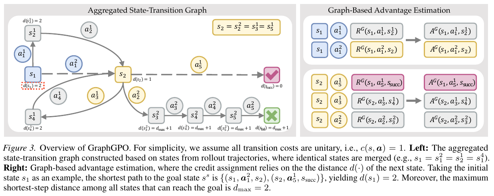

图源：Cheng 等，Figure 3，PDF 第4页，原图及图注裁剪。左图把重复状态压到相同方块中，粉色勾号为成功状态，绿色叉号为失败终点；右图比较同一出发状态的不同边。边虽然来自不同轨迹，仍可通过汇合后的后续路径得到局部反馈。

每轮对同一任务采样 $M$ 条轨迹，图 $\mathcal G=(\mathcal S,\mathcal E)$ 保存所有到达的状态和转移 $(s,a,s',c)$。$c(s,a)>0$ 是行动成本，主实验采用单位成本。对相同状态合并后，原文式(3)定义到成功状态的最小已观测路径成本：

$$
d(s)=\begin{cases}
0,&s=s_{\mathrm{succ}},\\
\min_{(s,a,s')\in\mathcal E}[c(s,a)+d(s')],&\text{图中存在通往成功的路径},\\
+\infty,&\text{否则}.
\end{cases}
$$

该量可用最短路算法计算，允许一条成功路径接合来自不同轨迹的边。然后按原文式(4)给边赋分：

$$
R^G(s,a,s')=r_{\mathrm{succ}}\,\omega^{d(s')+c(s,a)},\quad0<\omega<1.
$$

$r_{\mathrm{succ}}$ 是成功奖励；$\omega$ 折扣剩余代价。在无法到达成功的结点处，实现说明使用最大有限距离加1代替无穷大，以免极端惩罚探索。把同一出发状态的所有边作为一组，用组内均值 $\mu_s$ 和标准差 $\sigma_s$ 得到局部优势：

$$
A^G(s,a,s')=\frac{R^G(s,a,s')-\mu_s}{\sigma_s}.
$$

该优势表示动作比已观测的同状态替代动作好多少。只有一条边时设为0；多条边同分造成的零方差也需要实现保护，正文公式未详列该项。它不直接把任意“距离减小”变成绝对正标签：正负还取决于同状态其他边。

继续教学例子，把图简化成两个选项：从 $s$ 到 $u$ 以后，已知再用两步能成功；到 $v$ 后还需四步。两种动作成本都为1，取教学值 $r_{\mathrm{succ}}=1,\omega=0.5$，局部奖励分别为 $0.5^3=0.125$ 与 $0.5^5=0.03125$。若组内只有这两种动作，采用总体标准差归一化，优势为+1与−1。即使到 $u$ 的实际轨迹后来失败，这个动作的图优势仍是+1。以上仅是公式演示；需要环境状态确实可复用、预算足够，不能仅靠两段观察文本相同就拼接。

作者保留终局优势 $A^E(\tau)$，最终使用

$$
A(s,a,s')=\beta_G A^G(s,a,s')+\beta_E A^E(\tau)
$$

指导带截断重要性比率的策略优化（式(8)–(9)）。重要性比率衡量更新中的动作概率相对采样策略变化了多少，截断限制单次更新幅度。因此，图优势与终局优势的加和才是最后的更新方向。若上例失败轨迹的终局优势为−1、两个系数都为1，局部+1会被抵消为0；“失败轨迹里找到有用边”并不保证所有这类边最终都获正梯度。`derived`

表3给出相同 Qwen2.5-1.5B 设置下，GraphGPO 在 ALFWorld 的成功率92.71%、WebShop78.65%，GiGPO 为90.88%、73.83%。去掉终局优势后的 GraphGPO 为91.67%、75.00%，说明仅有图反馈在稀疏结点处也可能不足。所有方法对比要保留环境条件：作者为 ALFWorld 观察增加当前位置和持有物，并在改造环境中重跑 GRPO/GiGPO；学生只保留最近两步交互记忆。这些数不能与使用完整长历史、不同观察接口的报告直接排名。`reported`

#### 启发探索

GraphGPO 是“失败局部不能自动判负”的直接算法证据，但它的局部价值不是训练价值，也不是原环境中的最优 Q 值。它估计的是当前样本图中的最短已观测成功路径。图没见过一条可行边，不代表真实环境不可恢复；拼接多条轨迹的最短路径，也不等于当前学生有足够概率连续选中那条路径。若状态只由局部观察构造，同样的页面可能隐藏不同历史、登录状态、物体属性或剩余预算，合并会产生虚假的通路。`derived/inference`

论文附录 D.3 承认图稀疏到无法匹配状态时退化为终局优势，并试验95%嵌入相似度匹配。该实验是在 WebShop 观察加入广告噪声：它支持对特定文本扰动更鲁棒，不能推出嵌入近似就保持任意环境的状态同一性。附录 B.2 的方差证明也只在固定图下得到边奖励确定；随机采样策略会使图跨批次变化，确定性环境并不使采样图确定。因此不能将它引为局部标签无噪声或跨批次总方差总更小的保证。

对本课题，图方法适合作为“已收集数据能便宜提供多少局部证据”的强基线，并提示优先核验有合流、分叉和已观测成功通路的位置。但若研究核心是模型条件的训练收益，则必须保持清晰的层次：图距离决定某种局部监督内容，学生当前能力和验证集变化决定学习这份内容是否值得。二者不能仅换一个名称合并。`proposal`

## 三、成功和失败如何进入训练

“这是一条失败轨迹”不足以决定如何训练。失败可以成为与成功比较的负侧，也可以成为纠错时必须看到的背景；还可以经过目标重标，变成另一个任务的成功示范，或用于发现下一批值得练习的问题。本章逐一拆开这些用途，尤其区分：**让模型读到某段历史、要求模型生成某段输出、改变训练任务本身，是三种不同操作。**

### 3.1 ATLaS：让完整经历仍然可见，但只模仿被选出的关键步骤

来源：*ATLAS: Agent Tuning via Learning Critical Steps*，[Findings of ACL 2025正式记录](https://aclanthology.org/2025.findings-acl.1299/)。作者也写作ATLaS。依据§2–4.6、Limitations、Appendix B.3/D.1；图源Figure 3，PDF第3页、印刷页25336。

#### 研究动机

任务是找手机并放到床上。专家可能先检查桌子，再连续打开几个空抽屉，最后意识到应去柜子，找到手机后完成放置。整条路线成功，并不表示每一步都同样有教学价值：连续重复“再开一个抽屉”可能只是执行旧计划；在多个空结果之后决定换地方，才需要综合历史。

常规SFT对所有专家输出都要求模仿，可能把专家偶然的路线、冗余搜索和表达方式一起学入。在同时学习多种环境时，某类任务的大量普通步骤还可能占据较多更新份额。ATLaS的设想是让更强模型选出少量重要决策，只用这些位置的输出作为训练目标。

但“只训练关键步”很容易被误解为“删掉其他步”。如果把已经搜索过哪些抽屉的历史删掉，读者和模型都无法理解为什么现在该去柜子。作者明确保留完整输入，只减少直接要求模仿的目标。

#### 设计方案

**谁选，按什么选？** 默认选择器是GPT-4o。它读取完整专家轨迹，先归纳计划和子目标，再给出最多$m$比例的关键步骤及理由，默认$m=30\%$。作者用四类标准组织判断：建立计划、理解关键观察、执行关键动作、在失败后纠正。这里“关键观察”指Agent如何解释并利用观察的那一步，**不是把环境原始观察改成要Agent预测的答案**。

以自拟的10步找手机轨迹为例，选择器可能留下第1步计划、第7步发现抽屉已查完后转向柜子、第10步完成正确放置。这个具体选择只是讲解用，不是论文实际标注。记录保存为“原轨迹+选中步骤索引”，而不是三段动作拼接的新短轨迹。

训练第7步时，模型仍能读到第1至6步的动作和环境反馈；目标是让它在**已经连续没找到**的条件下生成换地点的思考和动作。第2至6步不承担直接模仿损失，却仍提供历史条件。实际使用时，选择器不必在线告诉模型“现在是关键步”；模型按正常方式从当前历史生成下一动作。

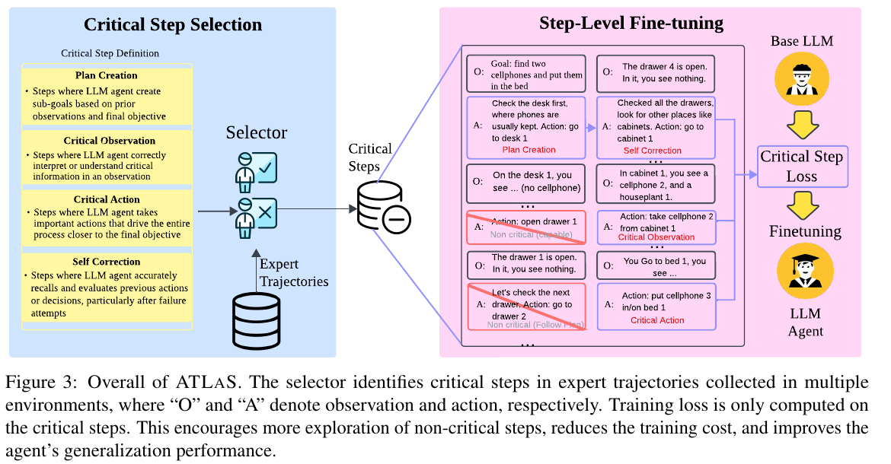

图左侧蓝区列出四类选择标准，底部专家轨迹送入Selector，输出关键步骤集合。右侧粉区展示原记录：`O`是环境观察，`A`是Agent输出；紫框步骤连向Critical Step Loss，红色划线标出不直接计入目标的普通步骤。划线不是“这段输入从计算中消失”；原文§3.2明确其他步骤仍保留在输入序列中。右侧从基础模型经损失到微调模型的箭头，表示模型参数训练，而不是只把选中的文本存进一个检索库。

**损失如何把“看见”和“模仿”分开？** 设$C_\tau$为选择器给出的步骤编号集合，$b_t$为第$t$步前的完整历史，$h_t$为这一刻的思考文本，$a_t$为动作，则最小化的目标可写成原文最大化目标的负号形式：

$$
L_{\mathrm{ATLaS}}=-\sum_{t\in C_\tau}
\left[\log\pi_\theta(h_t\mid b_t)+
\log\pi_\theta(a_t\mid b_t,h_t)\right].
$$

为便于阅读，此式省略了所有样本共有的任务、环境与提示条件；它们实际仍输入模型。$C_\tau$来自教师离线选择，不是训练中可微的变量；$h_t,a_t$来自原专家示范。每段文本概率还要拆成Token概率相乘，即对数概率相加。（§3.2 Eq.4、§3.3目标。）

教学时把第7步整个动作暂当一个选项：若模型给正确“转向柜子”的概率0.2，负对数损失约1.609；概率提高到0.8后约0.223。被选步骤因此获得直接模仿信号；第6步如果未选，不加入这个直接项。然而第7步的预测依赖第6步后的历史表示，梯度仍可能经过这些上下文计算回传到共享参数。所以“未选位置无直接loss”不等于“该位置从未影响学习”，更不等于“被冻结”。

**实验如何分开少训练和选得准？** 训练采用AgentTraj-L多任务轨迹，默认Llama-3.1-8B。`held-in`是训练涉及的10类环境中的测试任务；`held-out`包含Academic、Sheet、Jericho、PDDL等未纳入训练的环境。各环境遵循原任务指标，汇总均值不能全叫统一成功率。

Table 2比较全轨迹、关键30%、非关键30%：held-in均值分别60.52、65.91、56.17；held-out分别36.18、38.36、29.88。这说明在此设置中把全部成功输出都模仿一遍不一定最好。但要判断改进是否来自教师选中了“真正关键”的步骤，还需要相同稀疏程度的随机选择。

Table 3的随机30%为59.90/38.04。关键选择在held-in上有清楚增量，held-out却只比随机高0.32，且没有误差条。因而可以说关键选择改善了该训练分布中的学习，却不能据此充分证明所有跨域收益都源自语义关键性，也不能把数值接近解释成已经统计等价。

作者还尝试另外两种核验：§4.5.4从相邻状态各续跑5次，以估计价值变化挑选步骤，在BabyAI/Weather上与GPT选择结果接近；但弱模型在前段常全失败、末端常全成功，5次估计可能粗糙，部分环境重置随机性也妨碍公平续跑。§4.6把Agent直接放到关键步之后的状态，BabyAI从54.8到76.4、Maze从18.0到44.0，说明这些区域可能是难点；不过剩余任务同时缩短，这不是“训练该步比训练别处更有价值”的无混淆证明。

#### 启发探索

ATLaS提供了清楚的先行机制：**选择专家输出中的监督位置，同时保留所有历史输入**。它并没有证明凡成功轨迹的其他部分都无用，也没有测试普通失败轨迹能否按同样规则选步。

成本必须对应实际操作。默认比例约束的是步骤选择，输出步骤长短不同，不能机械等同精确30%的全部序列Token；更不能把论文的稀疏训练目标口径直接改写成节省70%总FLOPs。完整上下文仍要计算，教师选择也有成本。新的探索应分别控制选中目标数量、损失归一化、学习率和样本曝光次数，重点检验相对随机选择的跨域收益，而非只与全轨迹模仿比较。

### 3.2 STeP：把错误留作恢复的条件，把正确修复作为学习目标

来源：Chen等，*Training LLM-Based Agents with Synthetic Self-Reflected Trajectories and Partial Masking*，[arXiv:2505.20023v1](https://arxiv.org/abs/2505.20023)，2025预印本。依据§3–5、Tables 1–5与相关实验说明；未逐条审计所有教师提示模板。

#### 研究动机

用户要买米色刷子，模型点进了红色商品页。正常成功示范可能只包含“搜到米色→点击→购买”，因此没有教过：当屏幕已经显示红色商品时，应该识别颜色不符、返回，再找米色。

一个办法是增加“犯错—反思—纠正”的示范，但若原样监督全部模型输出，又会要求它模仿“先点红色”这个错误。另一办法是删掉错误，却会留下没有上下文的“返回”：模型还没进入错误页面，为何要返回？STeP试图同时保留恢复成立的条件，并避免直接模仿被标出的错误行为。

#### 设计方案

**数据不是只由教师编造一段自我反省。** 作者先把专家数据分成两部分：$D_1$用于训练初始小模型，另一部分任务用于让小模型实际交互。强教师Qwen1.5-110B同时观察任务、已有历史、小模型这步的思考和动作，以及环境执行后的反馈。

在自拟刷子例子中，小模型选择红色商品，环境真的返回红色商品信息。教师判断这一步不正确，将其思考和动作标为错误；随后用第一人称给出“颜色不符合要求，应返回”的反思和纠正动作。纠正动作也交给环境执行，得到新观察，再继续任务。教师觉得原动作合理时，不强行插入修复。

采集结束还要过滤：只保留最终成功、含教师反思、且错误数受限的记录。论文最后留下708条这样的反思轨迹。它们虽含失败片段，整条却已被救回成功；没有成功修复的原始失败不在这708条中。最后回到原始基础模型，用$D_1$和这些新记录混合重新训练，而不是默认只在最初小模型上继续训练。（§3.2–3.4、Table 1。）

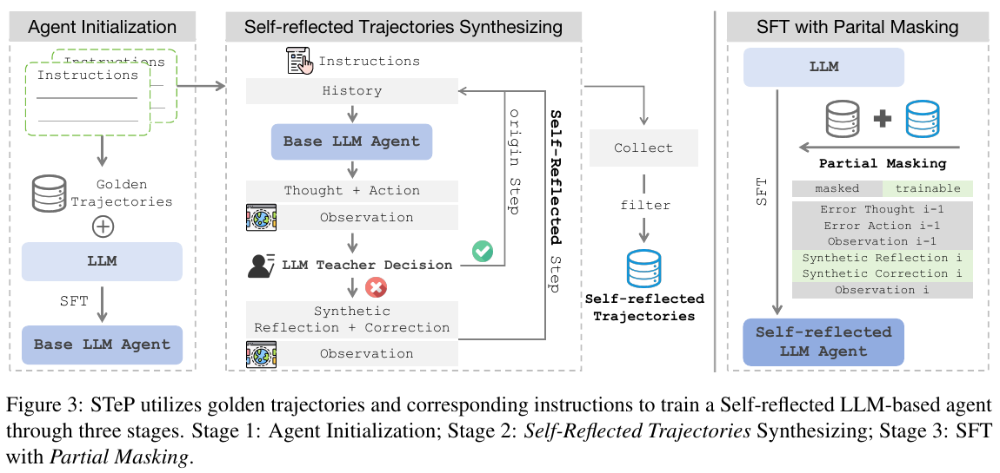

图源：Figure 3、PDF第4页。左栏用Golden Trajectories初始化采集用Agent；中栏小模型产生Thought+Action、环境给Observation，教师绿勾分支直接继续，红叉分支插入Synthetic Reflection+Correction后再取得环境反馈。中右的Collect→filter说明不是所有采集记录都留下。最右栏合并原专家库与蓝色新库：灰色错误思考/动作不作为模仿目标，绿色反思/纠正作为目标；灰色观察依旧是输入。图中的“masked”首先表达损失选择，不能解释成从历史删除。

**同一条记录中，哪些位置做什么？**

| 刷子教学轨迹中的内容 | 供后续预测阅读 | 直接要求模型模仿 |
|---|---|---|
| 用户要求米色 | 是 | 否，属于指令 |
| 模型选择红色商品 | 是 | 否，被教师标为错误 |
| 网页显示红色 | 是 | 否，属于环境观察 |
| 解释颜色不符并返回 | 是 | 是，属于正确恢复输出 |
| 在后续页面选择米色 | 是 | 是，若该步被保留为正确输出 |

所谓“partial masking”就是在计算损失时为错误输出乘0，为其他目标乘1。设第$i$步模型输出由思考$t_i$和动作$a_i$组成，完整先前记录为$\tau_{<i}$，任务为$u$，环境描述为$e$，则反思数据部分为：

$$
L_{\mathrm{PM}}=-\sum_i m_i\log\pi_\theta(t_i,a_i\mid u,e,\tau_{<i}),
\qquad m_i=\begin{cases}0,&\text{被标记的错误输出};\\1,&\text{其余输出目标}.\end{cases}
$$

完整训练还包含原专家$D_1$的普通SFT项；环境观察不进入上述输出集合。$m_i$由教师记录而来，不是模型当前是否喜欢该动作决定。对数概率实际展开到组成文本的Token。

教学中暂把两个动作各当一个选项：模型给“错误点击红色”的概率0.6，给错误之后“正确返回”的概率0.2。掩码使损失为$-0\log0.6-1\log0.2\approx1.609$；若返回概率升到0.8，损失约0.223。训练并没有在这里显式加入“让0.6降到0”的负目标；它只是不给错误点击正向模仿要求。共享参数仍会变化，恢复损失也可通过历史表示反传，因此错误概率可能间接改变，但没有由掩码单独保证其下降。

训练时教师看执行结果并提供修复；部署时模型自己读当前观察，输出反思和下一动作，不要求每一步都依赖110B教师。这也说明成本应计入教师实时判断、纠正生成、环境执行和筛选前丢弃的尝试，不能只数708条最终记录。

**哪些实验支持恢复数据，哪些挑战普遍mask？** Table 2的Llama2-7B，WebShop平均回报从0.565到0.618，ALFWorld-unseen从0.652到0.719，ScienceWorld-unseen从0.611到0.660。这里0.618是0–1的任务回报口径，不宜与别篇百分制的数字不加说明直接比较。完整方法包括新数据与掩码，主表不能单独归功于后者。

Table 3于是去掉部分掩码，让模型连错误输出一起模仿：ALFWorld-seen反而由完整方法0.716升至0.816，unseen仍为0.719；WebShop及ScienceWorld则较差。这个结果很重要——当前证据不支持“所有任务中的错误目标都应统一mask”。Table 4换为Mistral-7B或Llama3-8B时，ScienceWorld也有退化，说明数据及监督策略与模型能力、任务条件相互作用。原文主表的Avg与五列直接均值不完全相符，本报告不沿用该综合提升百分比。

#### 启发探索

STeP真正拆开的是：错误可以是模型必须理解的**已发生条件**，却不一定是应当学着生成的**未来输出**。这是失败数据训练的重要原则，但不是一条无条件算法定律。

对本课题，不能把“失败作上下文、纠正作目标”重新命名为创新。可进一步问：哪些错误易被理解且可恢复，哪些错误有不可逆副作用？教师对错误的标签有多可信？同一掩码是否随模型阶段改变价值？最关键的是，STeP减少了直接监督目标，却没有研究保留错误上下文时应让哪些内部计算参与反向传播。后者要另做固定输入与目标的实验，不能从STeP结果直接推出。

### 3.3 HSL：行为没变，改成它实际完成的目标再学习

来源：*Spinning Straw into Gold: Relabeling LLM Agent Trajectories in Hindsight for Successful Demonstrations*，[Adobe作者机构页面](https://research.adobe.com/publication/spinning-straw-into-gold-relabeling-llm-agent-trajectories-in-hindsight-for-successful-demonstrations/)列ICLR 2026；实际阅读[arXiv:2607.04235v1](https://arxiv.org/abs/2607.04235)，2026-07-05，PDF页眉同为ICLR 2026。依据§3–4.3及后部标注质量、Appendix A/D/E/F/G，未穷尽所有领域提示模板。

#### 研究动机

用户要求“把杯子冷却后放进柜子”。Agent却先去了微波炉，再拿杯子，最后只把杯子放入冰箱，没有完成冷却并转移到柜子的全部条件。对原任务而言，这是失败。但它至少演示了“取杯子并放入冰箱”。如果把整条经历删除，这项已完成的小能力也被丢掉。

HSL采取的不是STeP那种“在原目标下纠正错误”，而是**事后给旧行为配一个它已经完成的新指令**。在训练数据中改为“把杯子放入冰箱”，这段行为就能提供正例。这里绝不是允许部署Agent擅自修改用户需求来宣称成功；改写发生在训练材料构造阶段，测试仍按原用户目标评分。

“事后”英文为hindsight。HSL也会从原本已成功的轨迹中提取顺带完成的其他目标，因此不要求数据源一定失败。随着模型更强、失败变少，它仍能产生额外学习资料。

#### 设计方案

**杯子轨迹怎样被处理？** 训练过程中，当前Agent先按原指令与环境实际交互。一个冻结的强模型Llama-3.3-70B读取完整动作、观察与最后状态描述，做两轮性质不同的标注：

1. 找出实际完成的合法目标。它要逐步根据观察判断物体位置和动作效果，而不是只看到“fridge”就认定冷却完成；没有有意义完成目标的记录会被丢弃。
2. 对每个新目标，截取到它第一次完成的轨迹前缀。一个原始轨迹可以产生多个不同新目标和不同终点的训练例，不只是用最终状态重写一个任务。
3. 判断前缀内各动作与新目标是否相关。若去微波炉对“把杯子放入冰箱”无关，将其标签设为0；拿杯子和放入冰箱等相关步骤为1。
4. 把“新指令、完整对应前缀、相关性标签”放进动态资料池。训练时更常采样相关动作比例高、相关动作数量也较多的例子，并只对相关输出直接计算SFT损失。
5. 与原始专家示范混合学习，防止只学当前Agent碰巧做到的简单任务。随后用更新后的Agent再采集、重标，旧资料按队列规则被替换。

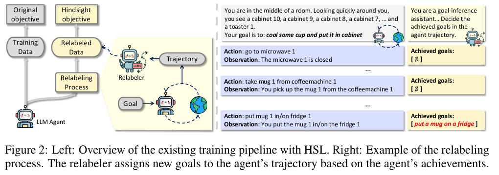

图源：Figure 2、PDF第4页。左侧原目标训练分支与黄色Hindsight分支一起接到Agent；中央小循环表示Agent执行、环境产生轨迹、Relabeler据此重标，再送入Relabeled Data。右侧按时间排列动作与观察：前面尚未识别出合法完成目标时是空集合，最后确认放置后才输出新目标。图右下“put a mug on a fridge”与任务正文的in/on表达应依环境模板解释；无论哪种，都不能仅凭放置动作推成“已冷却并放到柜子”。

**采样权重在偏好什么？** 对资料$d$，$T_d$为动作总数，$n_d$为被标相关的动作数。原文定义：

$$
w_d=\left(\frac{n_d}{T_d}\right)^\alpha n_d,\qquad
P(d)=\frac{w_d}{\sum_{d'}w_{d'}}.
$$

$\alpha=0.8$，$P(d)$是从池中抽到这条例子的概率。第一因子偏好少绕路，第二因子避免只反复选择一步即可完成的简单目标。权重不是动作本身的成功概率，也不是把整条轨迹每个Token乘同一因子后就完成所有操作。

自拟数字中，两条记录都有2个相关动作：A总共3步，B总共6步。$w_A\approx(2/3)^{0.8}\times2\approx1.446$，$w_B\approx(2/6)^{0.8}\times2\approx0.830$；如果池里只有二者，A约以63.5%的概率被抽取。这说明额外绕路会降低采样机会。另一条5步全相关记录权重为5，又可能比A更常被采到，因为作者同时重视复杂度。

抽到记录后才计算掩码损失：

$$
L_d=-\frac1{T_d}\sum_{t=1}^{T_d}z_t\log\pi_\theta(a_t\mid\tau_{<t},o_t,I'),\qquad
L=\lambda\,\mathbb E_{d\sim P}L_d+(1-\lambda)L_{\mathrm{expert}}.
$$

$I'$是重标指令；$o_t$与$\tau_{<t}$是当时观察和此前完整记录；$z_t$来自相关性标注；默认$\lambda=0.3$。分母是总动作数$T_d$，**不是只除以相关动作数$n_d$**。（Eq.3–4。）教学中令3步标签$[0,1,1]$，两个相关动作概率为0.5和0.25，损失是$-(\log0.5+\log0.25)/3\approx0.693$；如果改除2，会变成约1.040，已经改变更新尺度。采样权重与这个归一化共同决定了例子的影响，不能忽略其中一个。

无关步骤仍留在历史里。比如Agent已去过微波炉，当前站在哪里会影响下一步导航；将无关动作从监督目标移走，不代表可以不加处理地从环境记录中剪掉。实际实现每次优化后采集18条轨迹，资料池大小100，按先进先出删除最旧条目。待训练模型为Llama-3.2-1B。Appendix F说明DPO+HSL先做HSL，再继续ETO式DPO，并非把所有目标在同一步随意相加。部署时使用训练好的Agent，不在线重写用户要求。

**实验检验了哪些原因？** Appendix G/Table 2给出3个种子结果：ALFWorld-unseen，SFT 75.87±4.31，加HSL为96.27±2.11；DPO 81.09±1.88，加HSL为95.27±0.43。WebShop任务分则分别62.61±1.04→66.48±0.49、69.27±0.40→70.28±0.22。购物增益明显小于家务环境，符合不同环境可挖掘额外目标数量不同的情形；不能把原因仅由这些相关结果断言为已识别。PlanCraft只跑一个种子，重复性证据较少。

§4.3/Figure 4分别去掉无关动作掩码、改成均匀采样、只从失败终点提取一个目标，结果下降；这支持每个组件在作者设置中有贡献，但不是精确测得某个动作的因果训练价值。作者还用相同70B强模型直接行动或合成示范作对照，以降低“只是借了大模型能力”的解释；仍需把标注次数与数据量口径说清。

标注质量核查在随机200条重标演示中发现180条正确。90%指**新目标是否确实完成**，不等于每一步相关性标签有90%准确率。Figure 7也展示错误重标：仅冷却番茄，却被说成已冷却并放好。这种错会把本来不满足条件的行为变成正例，因此比普通描述性笔误更影响训练。

样本效率的分母是原始专家示范数。Figure 3中DPO+HSL用800条专家数据得到ALFWorld-unseen 92.5，而DPO用全量超过3200条为82.8；800不包含新增rollout和70B标注。Appendix F每个训练步采集、重标、优化平均为11.53、62.03、24.03秒，重标占主要时间；使用8张A100，3个epoch，单次一天内。它支持“省专家示范”，不能直接改写成“省总计算”。

**理论为什么只能有条件地帮助理解？** 作者将模型与专家的差距上界拆为三部分：学原始专家学得如何、学事后重标演示学得如何，以及重标演示本身与专家的差别。额外的覆盖系数$\kappa$衡量专家可能遇到的情形，重标资料是否也有机会包含；某类专家状态在后者中永远缺失，系数会无法保持有限。弱Agent如果从来不会进入某种关键状态，重标已经做过的事并不能凭空覆盖它。（Appendix D Eq.7。）

Appendix E的“严格改善”只在专家拟合误差、覆盖系数及重标偏差等其他量固定时，说明降低重标拟合误差会收紧这个**上界**，并不是实测性能必然严格上升。另一个可复核的推导问题在Eq.17→18：用$\sqrt y\le y+1/4$替换平方根项后，常数不能在宣称精确不等式时直接消失。“与参数无关”可以使其不影响找最优参数，却不能让数值上界凭空更小。因此本报告保留原Eq.17平方根形式的有条件解释，不把主文零常数写法当作已验证定理；掩码和重加权是否实际改善覆盖，也仍需经验检验。

#### 启发探索

HSL展示的是**改变训练任务的解释，再选择与该任务相关的动作进行模仿**。STeP则保留原任务、补上真实恢复行为；二者都使用失败片段，却解决不同问题。若新方案只是“保留完整历史、mask无用动作、按有效比例加权”，已经与HSL及ATLaS相当接近。

更值得研究的边界是：重标目标是否与最终需求相关；目标空间是否允许可靠核验；“相关”能否区分必要但低效的绕路；强标注器成本是否抵消节省。作者也承认二值相关性难区分“相关但低效”，并依赖目标空间描述、强重标器与专家示范。这些是可以设计对照的限制，不宜只把“大模型自动标注”视为问题已解决。

### 3.4 LEMA正式版：训练模型解释并修复错误，而非直接模仿错误

来源：*Can LLMs Learn From Mistakes? An Empirical Study on Reasoning Tasks*，[Findings of EMNLP 2024正式记录](https://aclanthology.org/2024.findings-emnlp.46/)，不是ICML 2024。依据§2–4、Appendix B.2/Figure 8及D.5–D.6；本篇研究数学与常识推理，不是可执行工具轨迹，迁移到交互Agent需要额外论证。

#### 研究动机

一个学生在题目中算对了商品销售收入，却忘记扣除成本。给他另一份标准答案，可以展示正确步骤；指出“你把收入当成利润，漏扣了成本”，则另外教了错误为什么发生。LEMA询问：这种错误解释与修复能否成为模型的额外学习材料，而不只收集更多正确解题过程？

这里推理链（CoT）就是模型逐步写出的解题文本。它是可供训练的行为记录，不等于研究者已经观察到模型内部全部思维。LEMA把错误解题过程放在输入侧，要求输出错误位置、原因及修正解；不是给错误文本负概率，也不是把失败记录不加区分地当成正例。

#### 设计方案

**从一道自拟题走到训练样本。** 题目是：“两件商品，每件卖3元，总成本1元，利润是多少？”正确答案为5。某个模型回答：“收入$2\times3=6$，所以利润6。”这条记录最终答案错误，首先被选入错误池。

1. 用多个推理模型对有已知答案的题目生成解法。比较最终答案，收集答错的过程；不是仅凭文本风格挑选错误。
2. 将问题与错解交给GPT-4纠正器。提示中有4个已标注例子，要求指出首个错误步骤、解释原因，从那里给出正确后续。在例子中是“收入计算正确；错误是把收入当利润；应减成本，$6-1=5$”。
3. 再核对纠正后的最终答案，只保留答对的纠正记录。这个过滤保证末尾答案对，并不能保证中间解释和每步推理都对。
4. 将两类训练样本混合：一类是“问题→正常正确解法”；另一类是“问题+错误解法→错误定位、解释、纠正后缀”。原文用真实省略号Token替代纠正输出中无需重写的正确前段，避免机械重复复制。
5. 可选的数据扩展阶段，从已经出现有效纠正的题目中抽取种子，请GPT-4生成新题，再回到错误采集与纠正流程。作者希望选到“学生会错、教师能纠”的题，而非把过易题或教师也不会的题一律扩写。扩展题的参考答案另由多次生成多数一致来筛选，不能因此视为人工真值。

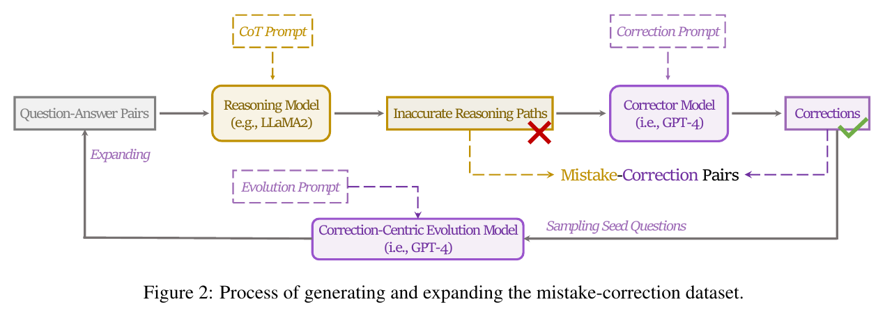

图源：Figure 2，PDF第3页、印刷页835。上方从Question–Answer Pairs进入Reasoning Model，黄色路线产生错解，再交紫色Corrector Model生成纠正；两条虚线在Mistake–Correction Pairs汇合，说明一个训练例需要“错在哪里的输入”和“怎样改的输出”。下方不是模型推理时自我循环，而是数据构建：抽取可纠正的种子题，送入Evolution Model，扩充题库后再生成新记录。各Prompt虚线框表示给对应模型的任务说明。

**为什么看到错误不会等于学习生成错误？** 对训练例输入$x$和期望输出$y$，普通SFT可写为：

$$
L(x,y)=-\sum_{j=1}^{|y|}\log\pi_\theta(y_j\mid x,y_{<j}).
$$

$x$在纠错样本中包含题目和完整错解，$y$是错误位置、解释与修正结果；$j$遍历输出Token，不遍历输入中的错误答案。这是对作者输入—输出格式的教学形式化，不是论文新增损失。正常解题样本也使用同样公式，只是$x$没有错解、$y$是直接解法。（Appendix B.2/Figure 8。）

在教学例子中，输入里出现“利润6”，但损失并不要求模型再次生成这个6。假定输出最终答案“5”这一Token的概率为0.25，它贡献约1.386的损失；概率提高到0.75则约0.288。同时，错误定位与解释的其他Token也承担目标，不能把整个方法缩成仅训练最后答案。输入不承担直接预测损失，仍可以通过输出预测的上下文路径影响参数更新；这不是输入位置完全不参与反向计算。

与DPO的差别也在这里：DPO用正确/错误回答的相对概率形成偏好目标，LEMA则明确要求生成“为什么错”的解释。仅改变优化器、却没有给两个方法相同可用信息，不是完全隔离训练目标的比较。LEMA训练后在本论文测试中主要被要求直接解题，没有每题先提交错解再反思多轮，因此成绩提升不等于部署自修复能力已被证明。

**实验怎样区分解释价值与单纯更多数据？** Table 2中，Llama-2-70B在GSM8K小学应用题测试的答案准确率从81.4%到83.5%。这组采用QLoRA：冻结大部分基础参数、训练额外的小型适配参数，以降低微调资源需求；它不是从头训练整个70B模型。其他模型/任务也有比较，但不同配置不能一概合并成一个保证。

更有鉴别力的是Table 4：将训练Token总量匹配到5.8M，只用正确推理链为82.1，加入LEMA纠错数据为83.5。这样缩小了“只是看了更多文字”的解释。§4.2和Appendix D.5进一步去掉错误原因解释、匹配问题分布，仍为纠错信息提供支持；这比只拿大数据方法对小数据基线更接近中心问题，但尚不能把所有收益都归因于某一个措辞类型。

Table 5在Mistral-7B上的纠错SFT为71.3，标准DPO 69.1，改造DPO 70.2。它表明作者构造的数据和训练表达在这里有效，不证明SFT在所有偏好任务优于DPO，因为三种表达利用的解释信息不同。

**数据质量和费用哪里会出问题？** 50条人工核验中35条优秀、11条较好、4条较差。规模化过滤仅查最终答案，仍会留下解释定位错误或纠正过程不连贯的样本。Appendix D.6中，GPT-4纠正自己的MATH错解仅217/2696，约8%；纠正Llama-2-70B错解约37.5%。前一批本来可能更难，不能把差值直接解释成“看自己的答案必然更不会改”。作者指出API费用和难题低纠正率限制了可扩展性；训练结果中部分QLoRA设置选择多个被评测checkpoint的最佳值，不是多个独立随机种子的均值。

#### 启发探索

LEMA真正增加的是**错误解释和修复输出的监督信息**。成功解法里未必显式包含这种知识；失败记录因此不仅可以是负样本，也可以给新的正目标提供条件。但最终答案过滤不保证过程忠实，教师纠正能力也决定数据分布。

迁移到交互Agent时，语言题可以在纸面上改算式，真实工具操作却可能已修改文件、发出请求或造成不可逆状态变化。因此，不能把“纠正后缀”离线拼上去就声称可执行恢复；要保留真实观察、报错和副作用，并从当时可达状态执行验证。对于本课题，LEMA是“错误作为输入、纠错作为目标”的重要背景，而不是错误恢复闭环实验的替代证据。

### 3.5 CoEvolve：根据当前训练中的弱点，生成下一批值得练习的任务

来源：*CoEvolve: Training LLM Agents via Agent-Data Mutual Evolution*，[ACL 2026主会正式记录](https://aclanthology.org/2026.acl-long.1055/)，[正式全文](https://aclanthology.org/2026.acl-long.1055.pdf)，论文集页码23015–23036。依据§3–4、Limitations、Appendix A.1–A.5及A.7相关信号摘要、任务抽象与验证模板。

#### 研究动机

一个文件管理Agent最初不会复制文件，训练后会了；接下来它可能需要练“复制后核对，再重命名”。如果训练集固定不变，就会继续反复处理旧题，却很少遇到新薄弱点。即使不断随机生成新题，也未必生成它此刻需要的练习。

CoEvolve将失败记录用于另一种目的：不是直接把旧轨迹里的Token加权，而是看当前Agent在哪些任务上遗忘、表现不稳定、或者很少使用某种操作模式，再指导一个探索模型去环境中发现相关新任务。它改变的是后续训练任务的分布。名字中的“共同演化”指模型变了以后数据跟着变，新数据再改变模型；不是凭名称就保证自主科研或无限改进。

#### 设计方案

**用同一个文件例子理解整个回路。** 假设任务要求把`a.txt`复制为`b.txt`，确认内容一致，再把副本改名为`final.txt`。以下文件名和任务均为教学自拟。

1. 先有一批可在环境执行的合成任务。Agent对每个任务多次尝试，由任务奖励驱动GRPO训练；这里沿用组相对优势和截断目标，不是本文新发明的优化器。
2. 保存尝试记录和成绩。如果Agent前几轮完成过本例，当前却找不到改名后的文件，可能触发“遗忘”；如果当前固定模型同一任务有成功也有失败，触发“不稳定边界”；如果“复制后核验”这种模式在累计记录中很少出现，则可能触发“稀有”。同一条轨迹可以同时有多个信号。
3. 把相关完整轨迹交给探索LLM。它不是只接收一个0/1成绩，而要摘要失败原因、值得关注的操作模式、探索目标和不要重复的行为，例如“在不同文件状态下练习复制—核验—改名链”。
4. 探索模型回到真实任务环境，多次、多步尝试，记录每一步动作、观察及它属于哪次尝试的编号。这样获得的是操作确实产生了什么反馈的证据，而非只在文本中编造工具结果。
5. LLM将这些记录组织成新的用户任务与可行操作方案，比如改成另一个目录或不同初始文件状态。候选方案在环境中再执行验证，通过保留规则后加入训练任务集，下一轮Agent按新增任务重新探索与更新。

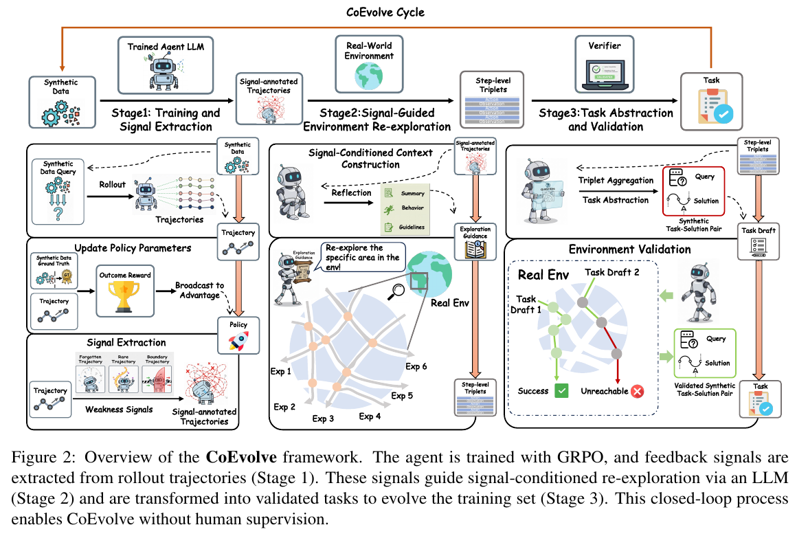

图源：Figure 2，PDF第3页、印刷页23017。上方三阶段主线依次为训练与信号提取、信号引导的再探索、任务抽象及验证；最上方橙线将验证后的Task送回Synthetic Data，表示数据反馈。左下先算终局奖励更新策略，再提取三类弱点；中下将轨迹变成Exploration Guidance，驱动环境探索，出口是Step-level Triplets，即动作—观察—尝试编号三元组。右下区分可成功执行与不可达草案，验证后才输出任务。**图里的“Step-level”是记录粒度，不代表对每个旧Token设计了新的训练权重。**

**三类信号是怎样算出来的？** 它们是可以从记录中执行的筛选规则，而不是“真正学习价值”的测量：

- 遗忘：在最近窗口$H$中，曾有成绩$s\ge0.5$，当前$s_{\mathrm{now}}<0.5$。例如历史$[0.8,1.0,0.7]$而现在0.2，会触发；这里固定的是判定规则，历史与当前模型并不相同。
- 边界：同一当前模型对同任务的$K$条尝试中，至少一条成绩$>0.5$，另有一条$<0.5$。例如$[1,0,1,0]$触发，$[1,1,1,1]$不触发。它表示经验成败混合，不能直接叫作已测出的参数空间决策边界；按原文严格不等号，恰好0.5本身也不满足任一侧。
- 稀有：累计观察数$N$达到最低要求后，模式$p$计数$c_p$满足：

$$
0<\frac{c_p}{N}<\frac{\theta}{100}.
$$

这里$\theta$是百分数阈值，不是前面公式常用的模型参数。教学设$N=100,c_p=2,\theta=5$，出现比例2%小于5%，会触发。论文文字还强调模式应在多条轨迹重复出现，但这个不等式只保证出现过，并不单独保证跨多条记录重复；实现时还需要核验模式提取与计数逻辑。（§3.1。）

**新资料怎样变成训练信号？** 一条生成任务不是马上作为正确动作全文让Agent照抄；在当前任务集$D_t$上，Agent继续采样$K$条轨迹，按环境得分构造每条的优势$\widehat A_k$，更新目标使用：

$$
J(\theta)=\frac{\sum_{k=1}^{K}\sum_{j=1}^{|\tau_k|}
\operatorname{CLIP}(q_{k,j},\widehat A_k,\epsilon)}{\sum_k|\tau_k|}
-\beta D_{\mathrm{KL}}(\pi_\theta\Vert\pi_{\mathrm{ref}}).
$$

$q_{k,j}$是当前模型与采样时旧模型对实际输出Token的概率比；$\operatorname{CLIP}$就是2.4节解释的截断策略项；$|\tau_k|$表示按该训练目标计入的序列长度；$D_{\mathrm{KL}}$用于限制当前输出分布偏离固定参考过远，$\beta$控制限制强度。分母把这一组计入的Token汇总归一化。（§3.1 Eq.1。）本篇新机制主要决定**下一轮$D_t$里有哪些任务**，没有为同一轨迹各步骤另造局部优势。

验证规则也需要讲清。正文§3.3允许任务执行未完全成功、但返回正奖励时保留，并非只收完全完成的任务。Appendix A.7/Figure 13还让LLM判断执行摘要和最终观察，因此“经过环境验证”不能自动等同每条任务都有严格独立的程序判定器。Figure 12同时要求尽可能多的步骤和最小动作序列，这种提示张力在复现中需明确优先级。部署时使用训练好的Agent；探索模型、任务生成和验证属于训练期闭环成本。

**实验怎样判断反馈比随便扩数据更好？** AppWorld评测多应用操作，Test-N TGC是正常测试任务完成率；BFCL多轮部分检查函数调用任务成功率。最相关的对照不是未经训练模型，而是相同骨干上的静态数据+GRPO与随机再探索。

Tables 2–3中Qwen3-4B，静态合成数据+GRPO在AppWorld/BFCL为28.57/58.00；加随机探索为30.36/60.50；用反馈引导探索为35.71/63.00。第一大步改善已经由基本训练带来，反馈的增量应分别与后两种基线比较，不能把相对zero-shot的所有提高都归于数据演化。

Tables 5/11/12进一步移除组件或控制教师：去掉遗忘信号后为30.36/60.00，去掉验证后27.38/58.50；固定同一探索模型仍可看到反馈增量，例如用Qwen3-4B作探索器时BFCL 53.00→56.50。这些结果支持反馈与验证有作用，并削弱“纯粹因为换了更强教师”的解释。但去掉一种信号也可能减少新增任务数或改变覆盖，不等于已测得每种信号单位数据的因果价值。

**闭环花费在哪里？** Appendix A.2默认100个初始任务、120个训练step、每10步更新任务，每任务8次采样；4B/7B训练用8张H20，30B-A3B用16张H20，外部探索模型为Qwen3-Max。Table 7给出反馈时间占比AppWorld 9.67%、BFCL 12.76%，总时间100596/45144秒；没有足够信息将这些秒数换成完整外部API Token、费用或统一FLOPs。Table 7的AppWorld终值35.12不同于Table 2/3的35.71，应保留各表设置；正文§4.3将30B模型正常/挑战集增量顺序写反，应按Table 1列名读数。

#### 启发探索

CoEvolve真正说明：**训练中的失败、遗忘和稀有模式可以指导下一批任务采集**，不一定直接用于模仿或惩罚旧动作。它与LESS那类用目标任务梯度评估固定数据池的方法不同，也与ATLaS同一轨迹内选监督位置不同。

但不稳定可能来自环境随机性、工具故障或评分噪声；稀有也可能只是无关模式，未必值得练。已读材料尚未建立所有方法完全相等的新增任务数、生成Token数和环境交互总预算。Table 6迁移结果支持某些迁移能力，不能证明对所有未知工具有效；与验证任务文本向量相似度较低，也不能独自排除语义泄漏。

对本课题，若选择“学生当前弱点驱动的数据价值”，CoEvolve应成为直接近邻。可区分的下一问是：固定这些任务级信号、生成资料量和探索预算后，轨迹内部的输入角色、监督目标或梯度路径选择是否还有额外收益？这需要单独受控试验，不能把“加一个反馈回路”再次当核心创新。

本章给出五种不同的训练用途：ATLaS筛选成功演示的监督位置；STeP在原任务中教恢复；HSL改写训练目标复用已实现行为；LEMA教错误解释与纠正；CoEvolve用失败发现新的练习任务。它们共同反驳“成功就全学、失败就全扔”的粗规则，但并没有共同证明某一种统一轨迹价值函数。后续比较必须先说明自己改变的是哪一层。

### 3.6 STeCa：检测成功机会下降，教模型及时回到可完成的处理过程

来源：[STeCa: Step-level Trajectory Calibration for LLM Agent Learning](https://aclanthology.org/2025.findings-acl.604/)，Hanlin Wang 等，Findings of ACL 2025，pp.11597–11614。实际读取 §2–5、Limitations，附录 C、D.1–D.2、E.2 相关提示和 G.1–G.4；其余案例未逐段复核。

#### 研究动机

只观察“最后失败”太晚：早期一次不合适的行动会改变环境，后面的错误逐渐累积。STeCa 希望检测刚发生的偏离，并造出模型可以学习的校正过程。它不把校正等同于“再发一条成功轨迹”，而是在专家前缀、学生偏离和参考动作之间加入反思。与 CSO 相比，它起点主要是专家轨迹上的受控探索，局部检测依据是动作前后估计的任务完成机会，而非先从完整失败轨迹中找可替换动作。`reported`

#### 设计方案

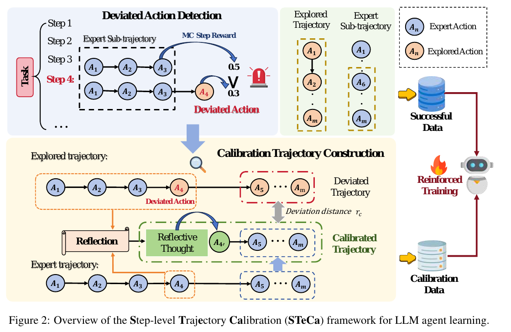

图源：Wang 等，Figure 2，PDF 第3页／正式页11599。左上比较的是完成专家前缀后和学生新增动作后的续跑奖励；左下利用专家参考生成反思和校正轨迹；右侧将校正数据与两类成功数据一起训练。蓝色圆圈是专家动作，浅橙色是探索动作；绿色圆圈是带反思的校正动作。

STeCa 先用专家轨迹做 SFT，得到会基本交互的学生。对任务 $u$，令 $e_t$ 为已执行到当前动作和反馈的历史。原文式(1)将步骤奖励写成

$$
\widehat r_{\mathrm{step}}(s_{t-1},a_t)
=\frac1N\sum_{j=1}^N R(u,e_m^{(j)}),
\qquad e_{t+1:m}^{(j)}\sim\pi_{\mathrm{base}}(\cdot\mid e_t).
$$

也就是说：当前动作已经发生，再由学生续跑 $N$ 次，用终局任务是否完成的平均值估计这个历史之后的可完成性。主实验 $N=5$、采样温度1。这是给定续跑策略和剩余预算的成功率估计，不是动作的语义正确标签。

当学生在专家前缀 $e_{1:t}$ 后给出动作 $\hat a_{t+1}$，STeCa 用原文式(5)检测：

$$
\widehat r_{\mathrm{step}}(s_t,\hat a_{t+1})-
\widehat r_{\mathrm{step}}(s_{t-1},a_t)<\delta.
$$

主实验 $\delta=0$。延续教学例子：拿到土豆后，继续完成任务的五次续跑有三次成功，估计为0.6；新增“用水槽冷却土豆”的动作后只有一次成功，估计降至0.2，则触发校正。较强模型读取任务、此前专家前缀、偏离动作与该处专家参考动作，写出反思，并用参考动作“用冰箱冷却土豆”构成校正步骤，随后连接专家剩余轨迹。

这里的训练对象必须说准：原文将校正后缀记为 $e^c_{t:m}=(a'_t,e_{t+1:m})$，并在式(10)中以此前专家前缀为条件学习该后缀。不能把它改述成“对原错误动作直接负训练”，也不能未经实现核查就声称环境中任意不可逆错误后都可以原样接上专家后缀。论文附录 D.2 另有从偏离动作执行后的状态开始的校正评测，这和训练公式中的条件结构需要区分。

训练同时使用三类数据：带反思的校正后缀、对失败位置给出的专家后缀，以及学生自己探索成功的完整轨迹。它用标准化动态时间规整距离 $d_{\mathrm{nDTW}}$ 比较动作序列的偏离；该距离先用动态规划对齐不同长度动作序列，再累加局部动作距离。依照式(7)–(9)，前两类的权重为 $1+\eta d_{\mathrm{nDTW}}$，自主成功轨迹的权重为 $1-\eta d_{\mathrm{nDTW}}$。直觉是：更大的偏离需要更强调校正，而成功轨迹中的绕路应降权。式(10)的实际核心是三类正目标的加权对数似然最大化；“reinforced training”不意味着它在主方法里使用在线 PPO，也不意味着原失败轨迹的动作都被施加负似然。

表1在 Llama-2-7B-Chat 上报告，VirtualHome 和 ALFWorld 四个 seen/unseen 子集平均值，SFT 为63.3、IPR 为68.6、STeCa 为70.9。去掉奖励加权后为69.6，改用 SFT+DPO 为70.0。它支持校正数据与权重组合在该设置有用，但不足以证明权重中的“偏离专家更远”就是普适的训练价值。

表3将蒙特卡洛步骤奖励改为 GPT-4o 直接评分后，VirtualHome unseen 从63.6降到62.5，ALFWorld unseen 从76.1降到74.9；训练奖励模型预测时进一步为61.8、73.3。局部检测依赖何种标注来源确实会影响结果。但作者在 Limitations 明确指出大量续跑有显著计算开销，正文没有给出足够完整的总成本表，因而“不需多轮迭代”不能自动推出比其他方法更省总计算。`reported`

#### 启发探索

STeCa 证明值得竞争的算法不必只选择哪里反传：它生成新的校正目标，再把目标接入完整训练流程。然而相邻成功率下降仍是有条件的信号。对同一学生，困难但必要的行动可能暂时增加失败风险；信息收集在一些分支上可能揭示坏消息，而不是制造坏结果；随机续跑在 $N=5$ 时也可能给出相反排序。POMDP 的马尔可夫性质本身不保证每个好动作的成功率单调上升。论文 Figure 3 对专家轨迹的平均趋势，只能支持该数据分布中的经验规律，不能替代逐步正确性的普适定理。`derived/inference`

因此，若固定一个“经核验的局部目标池”，应记录每个目标来自专家校正、环境规则，还是续跑比较；不能把这些来源统称为可靠真值。STeCa 的直接启发是保留校正过程和失败上下文所暴露的薄弱点；其需要被竞争实验检验的部分，是专家轨迹距离与当前学生实际学习收益之间的关系。`proposal`

### 3.7 CSO：先验证一次局部替换能完成任务，再对该处动作训练

来源：[Verified Critical Step Optimization for LLM Agents](https://aclanthology.org/2026.findings-acl.1974/)，Mukai Li 等，Findings of ACL 2026，正式版 pp.39627–39639。实际读取正文 §1–5、Limitations、附录 A–C 和 PRM 完整提示词。以下方法依据 §3.2–3.3、式(2)–(4)；实验依据表1–6。

#### 研究动机

一条失败轨迹常含有正确搜索、有效取证和最后的错误判断。如果把整条轨迹都作为负例，模型也会受到压低那些有用动作的训练信号。另一种做法是逐步请评判模型打分，但打分模型认为“合理”的动作，未必能让实际执行的学生完成任务。CSO 把监督单位缩到同一历史下的一对动作，并增加一个执行检验：替换当前动作之后，让学生自己继续，检查最终结果。

这里要区分三个执行者。学生是要训练的模型；专家是提出候选动作的较强模型；过程评判器用于先筛选可能值得续跑的候选。原实现中专家和评判器均可由 Claude-3.7-Sonnet 担任，评判器是按提示词评分的模型，并非环境给出的局部正确性真值。`reported`

#### 设计方案

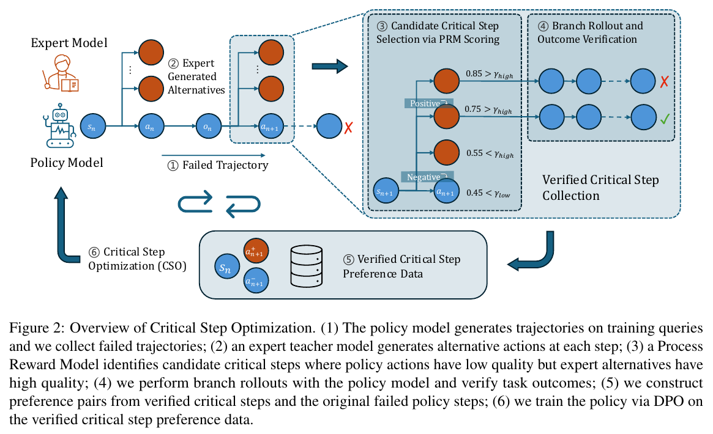

图源：Li 等，Figure 2，PDF 第4页／正式页39630，原图及原图注裁剪。图中蓝色是学生的执行路径，橙色候选由专家提出；右上角只让通过过程评分的候选进入学生续跑，最终通过结果判定的分支才进入底部的单步偏好数据。

设历史为 $h_t=(q,a_1,o_1,\ldots,a_{t-1},o_{t-1})$，包含任务、先前动作和环境反馈。CSO 在学生失败轨迹的每一步生成 $K$ 个专家候选 $a'_{t,j}$。评判器分别给原动作和候选动作打分 $r^{\mathrm{policy}}_t,r^{\mathrm{expert}}_{t,j}$。原文式(2)以

$$
r^{\mathrm{policy}}_t<\gamma_{\mathrm{low}},\qquad
\max_j r^{\mathrm{expert}}_{t,j}>\gamma_{\mathrm{high}}
$$

筛出候选决策点。主实验 $K=5$，阈值为0.45和0.65。接下来从原历史和相应环境状态出发，执行高分候选；从下一步开始，所有动作由学生采样直到任务结束。分支若被结果判定器判为成功，就生成 $(h_t,a_t^+,a_t^-)$：正动作是专家候选，负动作是原失败轨迹在该处的动作。这里同一历史非常重要：否则模型可能只是在比较不同任务进度，而没有比较同一决策的替代选择。

用一个自拟的简化例子走一遍。任务是“冷却土豆，再放进微波炉”；当前历史显示学生已拿到土豆，站在冰箱旁。原动作是直接去微波炉，原轨迹后来未完成冷却要求；专家候选是先用冰箱冷却土豆。若原动作评分0.3、候选0.8，候选通过筛选；执行冷却后，学生自己走到微波炉并放入土豆，终局规则判成功，便得到“在这段历史下，冷却优于直接离开”的偏好对。这个例子是教学重述，作者实验是搜索和工具使用，不能把例子当作 CSO 在 ALFWorld 的实测结果。

训练时保留完整历史作为输入，但只比较当前动作的概率。原文式(3)为

$$
L_{\mathrm{CSO}}(\theta)=
-\mathbb E_{(h,a^+,a^-)}\log\sigma\!\left[
\beta\log\frac{\pi_\theta(a^+\mid h)}{\pi_{\mathrm{ref}}(a^+\mid h)}
-\beta\log\frac{\pi_\theta(a^-\mid h)}{\pi_{\mathrm{ref}}(a^-\mid h)}
\right].
$$

$\pi_\theta$ 是学生，$\pi_{\mathrm{ref}}$ 是本轮开始时固定的参考模型，$\sigma$ 为 sigmoid。动作可能包含思考和工具调用，因此一个动作的概率是其中各生成 token 的条件概率连乘。这个损失鼓励正动作相对负动作更可能；后续成功续跑用于造标签，不被整段加入该单步 DPO 的优化目标。更新后再收集新失败，下一轮参考模型改为前一轮学生。`reported/derived`

实验检验的是这套数据生成与训练流程是否改善学生。表1中，同一个 CK-Pro-8B 基础模型在 GAIA-Text-103 上，SFT 为35.9%，CSO 为49.5%；XBench-DeepSearch2505 为23.0对29.0。作者声明结果来自三次独立运行，但主表未列离散程度。CSO 本文实现的 IPR 在两个任务上为44.6和24.0；由于其 IPR 描述与 IPR 原文的专家前缀探索和混合后缀损失并不完全一致，这应称“CSO 论文中的 IPR 实现比较”，不应外推为对所有 IPR 实现的定论。

最有解释力的是表3：过程评分加终局核验得到671个偏好对、GAIA 为49.5%；取消过程筛选但保留核验得到1967对、48.5%；保留评分而取消核验得到4126对、43.6%。它支持“核验比只依赖局部评分更有效，筛选可减少需要保留的监督”，但不是等标注预算试验。论文所说约16%对应671/4126这一级别的监督稀疏度，不能读成总计算节省84%。表6另算共同采样之外的构造 token：CSO 约168M、Step-DPO 约141M，CSO 增加约19%；还需加上共同的原始轨迹采样成本。`reported`

#### 启发探索

CSO 已经覆盖“从失败中定位局部错误—专家提出替代—学生续跑—单步偏好训练—迭代收集”的完整链条。因此，这条链本身不能再作为新方案的空白。它也显示标注价值与训练价值可以分开：过程评分先决定哪里值得花续跑成本，验证后的偏好对再决定训练目标；但 CSO 没有进一步估计每个已核验样本对当前学生的验证集改进。`inference`

终局成功不能消除所有标签不确定性。在上面的土豆例子里，直接去微波炉仍可能通过“返回冰箱”补救。原动作之后一次失败、替代动作之后一次成功，不能证明前者每次都差，更不能证明差异全由当前动作导致。检索结果波动、后续采样和工具故障都可能改变结果；作者的评测本身也借助参考金答案的 LLM 判定，不是对所有任务拥有完美的自动真值。论文用语中的“verified”应理解为经过其执行和判定流程，而非无噪声因果标签。

若要提高局部标签可靠性，值得检验的是：固定完整历史、环境快照、剩余预算和续跑策略，让原动作与替代动作接受相同的复测预算，比较成功概率或包含成本的预期收益；差异不足时保留“未确定”。这种扩展必须与 CSO 在总生成 token、工具执行和训练成本相同的条件下比较，不能只报告新方法偏好对更少。`proposal`

## 四、Token和推理步骤提供了什么训练信号

先把本章的问题说具体：模型写出了一百字解题过程，其中可能只有一次“应该相加还是相乘”的选择决定成败。训练时，我们还应当同等要求它模仿全部一百字吗？如果只选一部分，又凭什么认定那部分值得学？

下面五篇分别尝试：选模型犹豫的位置、选替换后会出错的位置、比较同一前缀后的正确与错误步骤、调整不同数据来源的训练强度，以及提高真正提交环境的动作的权重。它们选择的对象和证据不同，不能统称为“找重要Token”。本章的数字小例子均为教学用例；作者实验会单独标明。Token是模型处理文字的基本单位，可能是字、词的一部分或符号；为便于手算，小例子有时把一个词或动作暂当一个单位，真实切分由模型的分词器决定。

### 4.1 Beyond the 80/20 Rule：高熵位置上的策略梯度

[NeurIPS 2025正式条目](https://proceedings.neurips.cc/paper_files/paper/2025/hash/a797c2d2e0c1fdabf4d1ab8cd0b465c6-Abstract-Conference.html)。本次依据arXiv v2（2025-11-13）的§2、§3–5、Table 2及比例消融解释；正式发表身份与实际阅读版本分别记录。

#### 研究动机

设模型要回答“二进制中，1加1是多少”。它可能先写“十进制中结果为2”，再决定是否转换成二进制。“十进制中”“结果为”等措辞容易顺着前文接下去；是否转入二进制计算，则可能改变后续整条解题路径。

传统的一类强化训练先让模型自己作答，检查最后答案是否正确，再据此调整回答中各个生成位置。这里“强化”不是给模型看标准解法，而是让它更倾向产生得到好结果的回答。问题在于：如果同一条回答的每个位置都拿到相同的成败信号，大量已经很确定的措辞也占据了更新目标。

作者提出：把直接的训练目标集中到模型最犹豫的少数位置，是否更有效？“犹豫”不是人工判断文字重要性，而是由模型在该位置给所有候选Token的概率分布计算。两个选项各占50%时，比一个占99%、另一个占1%更不确定。作者用**熵**表示这种不确定程度；熵高不等于该位置一定错误，也不等于该位置已被证明对最终答案有因果作用。

#### 设计方案

先看作者图，再把图意落实到可执行步骤。

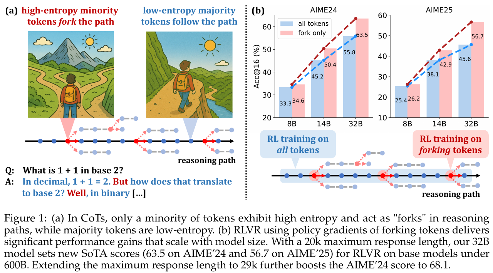

图源：原论文Figure 1，PDF第1页。左半部分把红点画成有多条岔路的位置，蓝点画成沿既定路线向前的位置；这是解释性比喻。右下方蓝色带表示所有位置都承担策略训练目标，红色标记表示只选分岔位置。右上方柱图比较不同模型规模的结果：纵轴虽然写Acc@16，本文的定义是每题采样16次后取**平均正确率**，不是“16次中答对一次就算成功”。图本身并未提供每个红点的局部正确性标签。

**用一条回答走通训练过程。** 假设同一道题生成四条回答，其中两条正确、两条错误。验证器为每条回答给出1或0；它只检查最终结果，不逐词批改推理。四条回答的平均奖励是0.5，标准差是0.5，因此正确回答比组平均好一个标准差，错误回答差一个标准差。这一相对分数叫优势，分别为+1和−1。

再取其中一条回答，教学上把它缩成五个生成位置。计算得到五个位置的熵为`[0.01, 1.20, 0.03, 0.60, 0.02]`。若这一小批次只有这些位置、只选最高20%，就选第2个位置。真实方法在一个训练微批次内汇总位置后选取，不是保证每条回答都恰好保留20%。被选中位置承担策略训练目标，其余位置仍在完整回答中，后续预测照样能读到它们。

熵的公式是：

$$
H_t=-\sum_{v\in V}p_t(v)\log p_t(v),\qquad
p_t(v)=\pi_\theta(v\mid q,o_{<t}).
$$

这里$q$是题目，$o_{<t}$是已经生成的前文，$V$是所有可能Token的集合，$p_t(v)$来自模型的一次前向预测。$\theta$表示模型参数，$\log$为自然对数。每个候选的概率都参与求和，不是只看最终选中的那个词。二选一且概率各为0.5时，$H= -2\times0.5\log0.5\approx0.693$；概率为0.99和0.01时，$H\approx0.056$。这说明它量的是分布的分散程度，而不是“答案正确的概率”。

选择后，还需要确定更新方向和幅度。设$m_{it}$是第$i$条回答第$t$个位置是否入选的0/1标记；$\hat A_i$是刚才由同题奖励算出的优势。模型生成数据时保存一个旧版本，其给实际生成Token的概率为$\pi_{old}$；训练中当前版本给它的概率为$\pi_\theta$，二者之比记为$r_{it}$。作者在DAPO原有目标上只改变选取与归一化：

$$
J=\mathbb E\left[
\frac{\sum_{i,t}m_{it}\min\{r_{it}\hat A_i,
\operatorname{clip}(r_{it},1-\epsilon_l,1+\epsilon_h)\hat A_i\}}
{\sum_{i,t}m_{it}}\right].
$$

这是要提高的目标；实现成损失时取负号并最小化。`clip`把概率比限制在区间内，`min`限制一次更新获得的收益，避免当前模型过快偏离产生这些样本的旧模型。例如优势为+1、概率比为1.50、上界为1.28时，这一项只计1.28，不因继续放大到1.50而继续获得同样奖励。若优势为负，目标倾向降低该回答中入选Token的概率；**高熵并不会把失败回答的Token变成正例**。分母只数入选位置，所以不等价于先置零80%的项、再除以原来的全部长度。定位：§2.1、§5.1 Eq.6。

训练后正常逐Token作答，不需要验证器先告诉它正确答案，也不需要把低熵文字从输出中删去。由于所有位置共享模型参数，一个位置没有直接损失项，不代表它的未来概率完全不变。

**实验究竟检验了什么？** 主比较使用相同DAPO训练配方和DAPO-Math-17K数据，区别是全部位置训练或只对最高20%熵的位置训练。最大回答长度20,480；每题评估16次、温度1.0。Table 2中Qwen3-32B的AIME25平均正确率由45.63%到56.67%，增加11.04个百分点；Qwen3-8B的六任务平均仅由53.71%到54.23%。因此“仅选少量位置可能有效”有实验证据，但不能说所有规模都大幅提高。

进一步把选择规则改成只训练最低熵80%的位置，表现明显变差；再比较最高10%、20%、50%，结果说明选择哪些位置很重要，也说明20%不是对所有模型成立的自然常数（§5.3、Figure 7）。同时，32B在六任务上的平均输出长度从5,848.80增至7,227.03 Token；性能提升伴有更多推理时生成，不能忽略成本。Llama-3.1-8B直接强化训练的成功率约1%，作者需要教师解答作冷启动，并明确其Llama证据较弱（§5.4）。

#### 启发探索

作者已经检验了“只在高熵少数位置设置策略训练目标”。这支持**训练目标不必均匀覆盖所有位置**，但没有证明“被选位置是真正正确的位置”，也没有证明计算量下降80%。生成完整回答、计算全词表概率和读取全部前文的工作仍在。

迁移到工具轨迹时，模型可能只是犹豫该用两种等价的命令写法；相反，决定文件路径的关键字符也可能被模型非常自信地写错。因此我们的待检验问题应是：高熵在动作语义和环境结果上究竟识别了什么？需要在相同训练预算下与随机位置、动作位置及已验证的关键事件对照，而不能把“犹豫”直接命名为“高价值”。

### 4.2 CFT：以反事实续写选择SFT位置

[原论文](https://arxiv.org/abs/2510.10974)。当前确认2025预印本及ICLR 2026投稿，尚未核验正式录用；以下依据§3–5、Appendix B/C。

#### 研究动机

同一道数学题，可以写“我们计算总数”，也可以写“我们求出总数”，两种说法都可能得到正确答案。如果把一条标准解答中的每个Token都当作唯一应模仿的目标，模型不仅学到推理规则，也会被推动去固定使用这一种措辞。作者担心这种训练会不必要地压缩有效解法的多样性。

CFT不先问“模型在哪儿犹豫”，而问一个更直接的问题：**保持此前的推理不变，只替换当前位置，再让模型接着写，最后还答得对吗？** 这叫反事实替换：比较原来发生的生成与一个只修改局部的替代过程。但它观察的结果仍依赖具体替代词和续写方式，不能理解为穷尽了所有可能世界。

#### 设计方案

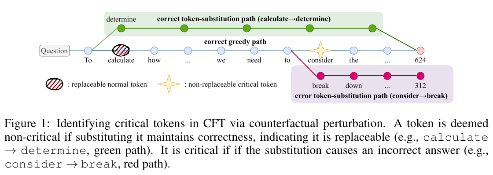

图源：Figure 1，PDF第3页。图中间蓝色路径是原来逐次选择最高概率Token形成的正确回答；上方把`calculate`换成`determine`，沿绿色分支仍到达624，因此该替换表明原措辞可替换。下方把`consider`换成`break`，红色分支到达312，展示一次失败替换。星形标记表示作者想保留的关键位置。**图只展示单次替换的直觉，默认算法比图更严格：第二、第三高概率两个候选都导致失败，才标为关键。**

以“应当相加还是相乘”的教学例子贯穿流程：

1. 目标模型先自己解题。每个位置选概率最高的Token，称为贪心生成；最后答对，才保留整条原轨迹。它不是先由外部教师任意写一条答案，再不加区分地筛选。
2. 在原轨迹写出“加”的位置，固定前面所有文字，查看模型对下一个Token的概率排名。假设“加”第一、“减”第二、“乘”第三。
3. 强制把当前位置改成“减”，随后仍按最高概率逐次生成到结束，核验最终答案；再从同一原前缀重新开始，强制改成“乘”并核验。两次续写独立从原前缀出发，不是先减再乘。
4. 如果两次都错，把原位置标为1；只要一次成功，就标为0。若“乘”之后模型发现问题并自我纠正，最终答对，原来的“加”就不会被Strict-3规则标为关键。
5. 将原来那条完整正确轨迹送入训练，只要求模型模仿标为1的位置。替换后错误的后缀用于**评分**，不会直接变成这一步SFT的模仿目标。

记题目为$q$、原回答为$Y=(y_1,\ldots,y_T)$。$c_t$是以上离线试验得到的0/1标记；$p_\theta(y_t\mid q,y_{<t})$是当前待训练模型在原前缀下给原Token的概率。训练损失为：

$$
L_{CFT}=-\frac{\sum_{(q,Y)}\sum_t c_t\log p_\theta(y_t\mid q,y_{<t})}
{\sum_{(q,Y)}\sum_t c_t}.
$$

教学上，若一条回答只有两处入选，当前模型给原正确Token的概率分别为0.2和0.5，损失就是$(-\log0.2-\log0.5)/2\approx1.151$。其他位置不进入这个平均值，但它们仍作为前文影响两个被监督位置。训练倾向提高这两个目标Token的概率；$c_t$事先算好，不在本次更新中随着参数一起求导。若所有样本都没有入选位置，实现还必须处理空监督批次，不能除以零；不能把该工程边界当作原文已详述的规则。

更精确地说，模型先给各候选Token一个未经归一化的分数，称为logit，再把分数转换为总和为1的概率。对某一入选位置，目标Token对应分数的直接导数为$(p-1)/Z$，其他候选为$p/Z$，其中$Z$是入选位置总数。上例目标概率0.2、$Z=2$时，目标分数的导数是−0.4；沿降低损失方向更新，会推动该分数提高。未入选位置没有这项直接导数，不代表它在后续预测中不起作用，也不代表模型参数在那儿被冻结。定位：§3.2 Eq.3–9。

**实验把“挑得好”与“挑得少”区分开了吗？** 作者为五个模型分别收集其能贪心答对的GSM8K轨迹，使用同一模型对应的数据比较全部Token的SFT、按概率重加权的DFT、按熵选位置、按注意力选位置以及CFT。熵和注意力基线保留与CFT相同的比例，并扫描超参数，因此不是简单比较“少训练”和“多训练”。Table 1的十一数学任务平均正确率中，Qwen2.5-7B的SFT为52.8%，CFT为59.2%；Llama3.1-8B却只有38.7%到39.2%，部分单项还下降，收益不是处处成立。

Table 2比较标注规则：两个替代都失败的Strict-3为59.2%，只试一个替代为58.7%，更宽松的Union为57.2%，分级规则Graded为56.3%。这些结果支持具体标签定义会影响效果，不能只记住“做过替换就行”。Appendix C Table 5又显示，关键Token未必熵更高：Qwen2.5-7B中关键/普通位置平均熵为0.196/0.211，Llama则为1.705/1.671，方向不同。Figure 6说明只保留数字也不能普遍替代整个关键集合。

#### 启发探索

CFT中“关键”的准确含义是：**在当前模型、这两个备选、确定性续写与当前答案核验器下，替换会失败**。它不是所有正确解法都不可或缺的Token。最终答案正确也不能保证中间每个推理都正确；模型可能经过错误计算后碰巧得到答案。

只监督6.7%–11.6%的位置并不意味着只付出这些比例的总成本。Appendix B.1 Table 4中，Qwen2.5-7B对1,000条轨迹做标签构造，串行为13.29小时，8张A100-80G并行后为0.50小时；这是**同一反事实标注过程的并行延迟改善**，不是相对普通SFT的总训练加速。长度为$T$的轨迹若每个位置都做两次后缀生成，后缀总长度大致按$T+(T-1)+\cdots+1$累加，可达到$O(T^2)$量级；共享缓存与并行会影响实际耗时，但不能把所有生成工作视为免费。

原文对最初贪心答不对的问题还允许最多采样100次寻找正确答案，并用CFT模型与基础模型的概率差、取最高15%来近似标签；不同分词器间迁移也使用近似（§5.1–5.2）。这些扩展不再逐位置重做同一反事实试验，证据要分开讲。

对交互轨迹，更值得探索的是：工具状态能否复原、替代动作是否合法、两次失败是否只是环境随机故障，以及标签构造成本能否承受。把数学中的Token替换成工具命令，不能自动保留这些识别条件，也不是仅改对象就获得新机制。

### 4.3 Step-DPO：共同前缀下的局部偏好

[原论文arXiv:2406.18629](https://arxiv.org/abs/2406.18629)。本次取得13页v1；正式会议录用尚未核验，文中承诺的部分梯度解释附录未在该文件中获得。

#### 研究动机

让模型解“$2x=6$”。它先写出“等式两边除以2”，随后写错“$x=4$”。如果只保存整条答案为“坏回答”，我们知道结论不对，却没有把“前面的除法思路正确、接下来这一步算错”明确交给训练程序。

偏好训练不是只给一个标准答案，而是给同一问题下“更应生成”和“更不应生成”的两个候选，让模型提高前者相对于后者的倾向。普通DPO常用整条回答作比较单位；Step-DPO把单位缩到**同一段已核验前文之后的下一推理步骤**。一个步骤可能包含很多Token，并不是每个Token已经获得了独立好坏判断。

#### 设计方案

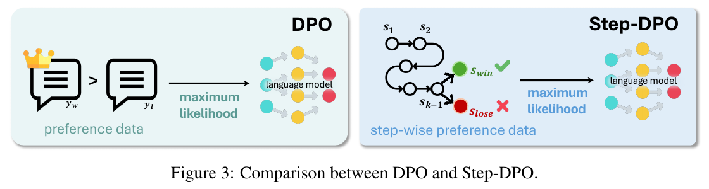

图源：Figure 3，PDF第3页。左边比较两整段回答$y_w,y_l$；右边的空心圆构成相同的步骤$s_1$至$s_{k-1}$，之后分成绿色正确下一步和红色错误下一步，再送往模型训练。箭头传递的是构造好的偏好数据，图中“maximum likelihood”是高层说明，具体训练使用下面的偏好损失，不应据图把它改成仅训练绿色步骤的普通SFT。

**如何从完整错误答案造出这样的数据？** 作者的§3.2包含三个操作，而非只给现成标签：

1. 让初始模型用`Step i:`格式解题，将最终答案错误的解收进错误池。
2. 由人工或GPT-4定位首个错误步骤$k$。此前的正确步骤构成共享条件$h$；原首错步骤是负候选$s^-$。
3. 从同一个$h$出发，让初始模型重新生成若干完整续写，寻找最终答案正确的续写，取其中第一个步骤作正候选$s^+$。还要筛掉“最后答对、但第一个纠正步骤依然错误”的情况。完整后缀负责验证，最终训练比较的是下一步。

在教学例子中，$h$包括题目与“等式两边除以2”，$s^+$是“$x=3$”，$s^-$是“$x=4$”。若另一条负轨迹的前文已经误写成“$3x=6$”，它就不能直接作为同一条件下的负候选。控制前文的意义正在于此。

实际优化的不是绝对概率差，而是相对于一个冻结参考模型的变化：

$$
L=-\mathbb E\log\sigma\left[
\beta\log\frac{\pi_\theta(s^+\mid h)}{\pi_{ref}(s^+\mid h)}
-\beta\log\frac{\pi_\theta(s^-\mid h)}{\pi_{ref}(s^-\mid h)}
\right],\qquad \sigma(a)=\frac{1}{1+e^{-a}}.
$$

$\pi_\theta$是正在训练的模型，$\pi_{ref}$在训练期间不更新；$\beta$控制偏好项的尺度。多Token步骤的概率是各Token在自己前文下概率的乘积，计算时用对数相加。$\sigma$把括号中的相对优势变成0到1之间的数，取负对数后，越偏向正确步骤，损失越小。

为了手算，暂把整个步骤作为一个选项，设参考模型给正负步骤的概率均为0.2，取教学用$\beta=1$。刚开始当前模型与参考相同，两个比值都是1，损失$-\log0.5\approx0.693$。若后来当前模型给正步骤0.3、负步骤0.1，括号内为$\log1.5-\log0.5=\log3$，$\sigma(\log3)=0.75$，损失约0.288，说明这个变化符合偏好目标。

这个例子展示一种满足目标的变化，**不保证实际训练一定使正例绝对概率上升、负例绝对概率下降**：损失约束的是相对比率，共享参数和其他候选也会变化。第5.2节会说明为什么这个区别重要。共享前缀只作为本次正负步骤预测的条件，不直接计入偏好目标；但它仍需被模型读取。定位：§3.1 Eq.2。

还需纠正一句容易过度推广的动机表述：如果普通整答案DPO的正负回答原本就共享完全相同的前缀，那么对数概率差中的共同前缀项也会相消。Step-DPO的额外价值是**主动构造相同前缀、定位首错，并把比较截到下一步**；不能说所有整答案DPO都必然直接惩罚共同的正确前缀。这是对公式的可复核推导，不是作者额外实验。

**实验与成本。** Table 3采用相同5K偏好样本的设置：7B模型在MATH上的正确率，SFT为54.8%、整答案DPO为55.0%、Step-DPO为55.8%；72B为61.7%、62.5%、64.1%。这比只拿最终模型与未训练模型比较，更接近回答“步骤粒度带来什么增量”。Table 4中，由GPT-4直接纠正得到的正步骤为55.1%，由原模型自己续写得到的正步骤为55.8%，说明正样本来自谁也影响效果；作者称后者更贴近当前模型的生成分布。

论文构建约10K步骤偏好，但部分模型此前已做299K示范SFT，不能说模型只用了10K总训练数据。步骤对训练不再包含后续整段答案，确实有机会减少优化时处理的后缀；然而数据构建仍要定位错误并生成到最终答案，原文未给完整端到端标注成本。当前取得版本没有可核对的所承诺梯度衰减附录，故不把该解释写成已验证定理。

#### 启发探索

Step-DPO提供的是“在正确前文之后避免下一步犯错”，不是直接训练“已经犯错后如何恢复”。两者需要不同输入状态与标签，不能混为一谈。

在交互任务中，文本前缀相同也未必保证后台环境状态相同：同一句“打开文件”可能面对不同文件内容。我们的探索必须要求状态可重放，或清楚记录不可观测差异。原方法已经覆盖“首错定位、共享前缀、局部正负训练”，可借鉴的是数据构造约束；新的贡献需体现相同条件下的可验证改进，而不只是把“推理步骤”改名“动作步骤”。

### 4.4 SRFT：示范、自主正例、自主负例的权重不同

[ICLR 2026正式来源](https://proceedings.iclr.cc/paper_files/paper/2026/hash/a79699db176ed0efc04a9da171e52112-Abstract-Conference.html)。方法重点依据§4 Eq.6–12，实际训练细节另核Appendix G；熵的计算口径见Appendix E与A.2。

#### 研究动机

训练解题模型时，示范像老师写好的解法：模型即使自己想不出，也能模仿。自主尝试则像学生自己做题：做对的可以加强，做错的提供负反馈。只模仿老师，可能学会固定表达却少了尝试；只靠自己尝试，能力弱时又可能很少碰到正确解答。

一种常见做法是先模仿，再转向强化训练。SRFT问的是：能否在同一训练阶段同时使用两类数据，并根据模型当前的输出分散程度调节影响？它的细粒度主要体现为**数据来源和正负样本承担不同训练目标与权重**，不是已经逐步识别每个动作的正确性。

#### 设计方案

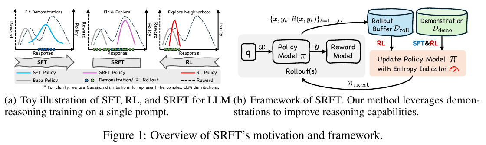

图源：Figure 1，PDF第2页。左半部分三个小图用示意概率曲线对比纯模仿、SRFT与纯强化学习，不是某真实模型全部答案概率的实测图。右半部分从题目$x$出发，策略模型产生回答$y$，奖励模块给分，回答进入蓝色自主轨迹池；绿色池保存教师示范。蓝池的箭头标RL，绿池同时标SFT与RL，说明**同一条示范走两条训练用途**。更新后的模型沿底部箭头返回，生成下一轮回答。训练数据在循环变化，不是把两个静态文件简单拼接一次。

继续用一道算术题作教学例子。教师提供一条经核验的正确解；当前模型自己生成四条，其中两对两错。SRFT给它们安排三种用途：

- 教师示范作模仿目标：提高示范文字在题目条件下的概率，但乘一个随熵变化的权重。
- 教师示范也加入同题回答组，参与奖励比较，再用适配离线示范的强化目标更新。
- 自主回答按正确与错误分开：正确回答承担提高概率的目标，错误回答承担降低概率的目标；只有自主正例部分再乘另一个熵权重。

第二项容易被忽略。这里的“离线”是指示范不是由当前训练模型刚刚生成的，不能默认其概率分布与自主样本相同。作者用概率比等处理这一差异，实际实现还包含下述启发式。

记$H$为当前策略在回答位置上预测分布的平均熵，熵的含义与4.1相同。两个权重是：

$$
w_{SFT}=0.5\,\operatorname{sg}(e^{-H}),\qquad
w_{RL}=0.1\,\operatorname{sg}(e^{H}).
$$

$\operatorname{sg}$表示“这次先计算权重，再把它当常数使用”；训练不能绕过任务损失、单靠改变权重本身来降低目标。$H=0.7$时两个权重约为0.248和0.201；$H=0.1$时约为0.452和0.111。也就是说，在低熵、分布更集中的状态，示范模仿项变强，自主正确回答继续集中的力度变小。这是方法规定的控制规则，不是从熵数值自动推出的普遍最优规律。

总目标写成：

$$
L=L_{SFT}^{demo}+L_{RL}^{demo}+L_{RL}^{self}.
$$

第一项是$w_{SFT}$乘示范负对数概率；第二项是带同组奖励优势的示范强化目标；第三项在作者的解释式中为：

$$
L_{RL}^{self}=w_{RL}\,\mathbb E_{y^+}[-\log\pi_\theta(y^+\mid x)]
+\mathbb E_{y^-}[\log\pi_\theta(y^-\mid x)].
$$

$y^+$、$y^-$分别是自主答对与答错的回答。最小化第一部分会提高正确回答概率；第二部分前面没有负号，最小化它倾向降低错误回答概率。假设某错误回答概率从0.2降到0.1，其对数由−1.609降到−2.303，符合降低这部分目标的方向。它不说明错误回答内每一步都错，只是使用整回答标签。样本数、长度和求平均方式也会影响总梯度，不能因负项权重为1、正项为0.111就宣称负梯度必为正梯度的九倍。

示范并入回答组时，奖励减去组平均再除标准差；教学例子里奖励为`[1,1,0,0,1]`。加入正确示范会改变均值和各回答相对位置，但标准化后的组平均仍是0。因此原文“提高整组所有优势”的乐观说法需要限缩，不可能在重新居中后所有标准化优势都同时提高。

**解释式与实际实现还差什么？** 正文Eq.9写出限制更新幅度的clipping，Appendix G却明确实际SRFT去掉clipping；将示范生成策略概率$\pi_\beta$设为1，并使用LUFFY的policy shaping（$\gamma=0.1$）、熵损失系数0.001及KL系数0。把$\pi_\beta$设为1方便使用已有示范，但并不意味着已测得教师真实生成概率，也不是无偏的分布校正。Appendix E把$H$定义为回答位置词表熵的平均，A.2又展示序列平均权重；当前未逐行核对代码广播方式，故不把它说成已核验的逐Token硬选择。复现不能只复制上面的解释式。

**实验支持到哪里？** 主设置为Qwen2.5-Math-7B、OpenR1-Math-46k-8192与DeepSeek-R1示范，每题8条自主回答、500步、最大生成长度8192，报告配置为8×8张A100。Table 2/3的多基准平均正确率给出SRFT 59.5%、纯SFT 54.3%、先SFT后RL 54.5%、简单相加SFT+RL 52.3%。这些对照分别移除自主探索、改变训练顺序、移除专门的混合设计。正文另有59.1%及不同差值，属于版本内部不一致，本报告引用表格，不拼接摘要的增量。

Table 3进一步固定示范SFT权重，结果为55.1%；固定自主正例RL权重为56.2%；删除示范SFT为53.9%；删除示范RL为55.2%。这些消融支持各组成在此配置中有用，但不能独立证明“熵是全部收益的唯一原因”。部分外部基线来自其他论文、数据规模不同，不能把整张表都当作完全同预算比赛。

#### 启发探索

这篇已经覆盖“联合示范与自主成败数据、动态调整训练强度”。它让失败回答参与训练，却没有辨别一次失败中哪些动作正确。迁移到工具环境时，必须区分模型选错、工具宕机、任务根本不可达：同样记为失败，不代表适合相同负更新。

我们的探索可以在保持数据量与更新预算的条件下，研究是否需要把整回答的成功/失败信号进一步拆成局部监督用途；不能把多种损失简单相加视为已经解决信用分配。实际部署仍由训练后的模型正常生成，不要求教师实时提供示范。

### 4.5 ActFocus：动作更值得关注，不等于每个动作都应被强化

*Resolving Action Bottleneck: Agentic Reinforcement Learning Informed by Token-Level Energy*，He等，[arXiv:2605.14558v1](https://arxiv.org/abs/2605.14558)，2026预印本。主要依据§3–5、Appendix C.2–C.3与权重消融。

#### 研究动机

一个推箱子模型先写一大段“箱子在右边，目标在上方”，最后才提交`Right || Up`。环境真正执行的是短短动作指令，不执行前面那段说明。如果训练目标平均分布到全部文字，长推理可能占据绝大多数直接训练项，而实际影响环境的动作只占少部分。

ActFocus首先按格式区分“思考文字”和“环境动作”，再问：能否降低前者的权重，并在动作内部进一步区分位置？这不是删除推理，也不是断言推理没用；关键是分配已有的更新信号。

#### 设计方案

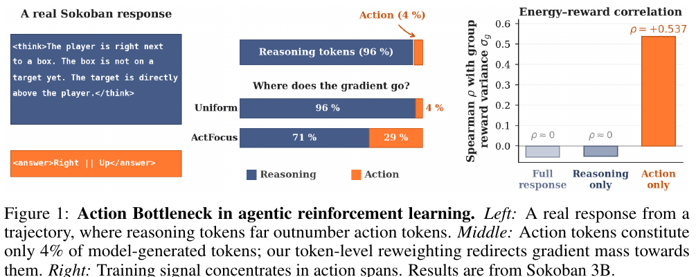

图源：Figure 1，PDF第2页。左边是真实Sokoban响应，蓝框为`<think>`内的推理，橙框为`<answer>`内的动作。中间上条显示此特定3B设置中推理/动作约占96%/4%；下面比较均匀训练与ActFocus的梯度分配。右侧柱图不是成功率，而是能量特征与同题多次执行奖励方差的秩相关：仅动作部分为+0.537，全文和仅推理部分接近0。相关只说明这个特征与该组统计量共同变化，不证明能量等于动作真实价值。

**训练链路。** 当前模型在同一任务上多次执行，环境返回总奖励；原有PPO或GRPO算法据此产生优势。GRPO把一条轨迹相对同题平均奖励的优势用于这条轨迹的各位置；PPO用价值估计器产生其原有位置优势。ActFocus不替换这一部分。它另外用一个冻结参考模型读取同一完整上下文，给每个位置计算能量，再依据`<think>`与`<answer>`边界设置权重，最后把权重乘到原有策略目标上。

能量来自参考模型给整个词表的原始分数：

$$
E_t=-\log\sum_{v\in V}\exp(f_{t,v}).
$$

$f_{t,v}$是参考模型在位置$t$对候选$v$给出的logit；它还不是概率。先对这些分数取指数并求和，再取负对数，得到一个标量。冻结的意思是同一上下文下参考模型不随训练更新；换了上下文，能量仍然会变。这个量的解释边界将在后面说明。

本次批次的动作位置能量均值、标准差记为$\mu_E,\sigma_E$。权重规则为：

$$
w_t=\begin{cases}
\alpha,&t\text{为推理Token},\\
1+\beta\,\sigma((E_t-\mu_E)/\sigma_E),&t\text{为动作Token},
\end{cases}\qquad \sigma(z)=\frac{1}{1+e^{-z}}.
$$

默认$\alpha=0.1,\beta=0.5$。动作能量恰好等于批次均值时，标准化值为0，$\sigma(0)=0.5$，动作权重为1.25；推理位置权重为0.1。一个教学小批次若有9个推理位置、1个这样的动作位置，总权重为2.15，动作占直接加权项约58.1%，而均匀时为10%。真实梯度还取决于各位置优势和导数，不可把这个手算比例冒充Figure 1的实测梯度占比。

加权目标按$\sum_t w_t$归一化，使改变$\alpha,\beta$主要改变位置间分配，而不是仅把总损失整体放大。设原有策略目标的第$t$项为$u_t$，则损失是$-\sum_t w_tu_t/\sum_t w_t$；$u_t$仍包含当前/旧策略概率比、优势和更新限制。$w_t$为正，故一条负优势轨迹中的动作即使权重更高，也不会自动得到正向强化：它可能被更强地压低。若令$\alpha=1,\beta=0$，所有权重退化为1，回到均匀目标。定位：§3–4 Eq.2–7。

**什么实验说明这个分配有用？** 主实验在推箱子Sokoban、随机滑动导航FrozenLake、4×4数独和购物环境WebShop中，以同一强化框架比较均匀权重与ActFocus。WebShop的“购买率”只问是否下单；“严格成功率”还要求商品符合用户要求。Table 2的PPO、3B模型严格成功率从22.7%到36.7%，而购买率从96.9%到99.2%。这个区别说明原模型本来就能买到东西，困难在于买对。论文“最高提升65.2个百分点”来自Sudoku-0.5B的单个条件，不是平均收益。

§5.4的消融更能回答机制边界：WebShop把推理权重完全设为0会崩溃，最优点也不必是默认0.1；提高动作权重并非越大越好，$\beta=2$时25.4%，低于$\beta=1$时39.8%。Figure 8在同框架中比较能量、熵、负对数概率等信号，支持能量在所测设置中的经验效果，不意味着其理论解释已经排除了其他因素。

计算配置为4张H100，每次更新128条轨迹；不同环境的轨迹上限、无效动作惩罚与方差筛选不同。三个小环境的512次评估来自32个任务各采样16次，不是512个独立任务；WebShop为256个任务各一次（Appendix C）。因此估计不确定性时应考虑同题多次样本的相关性。

#### 启发探索

必须把“动作位置”“更新幅度”“好坏方向”拆开。ActFocus主要改变前两者，方向仍由原优势决定；它不能仅凭权重修好局部错误标签，也不直接减少完整上下文的计算。

能量还有一个可手算的限制，属于本调研推导：两个候选的logit为`[0,0]`时，概率均为0.5，能量为$-\log2\approx-0.693$；把两个分数同时加5成为`[5,5]`，概率仍各0.5，能量却变成约−5.693。一般地，所有候选同时加$c_t$，策略不变而$E'_t=E_t-c_t$。整个批次统一平移会被均值归一化抵消；**不同上下文取不同平移**则可以改变相对权重。因此它不是只由概率分布决定的不确定性度量。

这不否定冻结网络上的能量特征能预测某些现象，但需把“经验上有用”与“理论上量的就是不确定性”分开。我们的待检验探索可以是策略不变的分数变换下权重是否稳健，以及收益是否主要来自纠正长推理稀释。两者都需要实验，不能从动作较短这一事实直接推出。

### 4.6 TOSS：Token-level Data Selection for Safe LLM Fine-tuning

正式身份：ICLR 2026；[官方记录](https://openreview.net/forum?id=k7ytptAaDN)。实际精读与裁图为作者[arXiv v1](https://arxiv.org/pdf/2603.01185v1)，2026-03-01，30页。读正文、附录A–I相关算法、配置、消融及安全指标，并核部分公开训练实现；未逐个复核所有攻击例和Figure 6读数。OpenReview全文访问受限，未逐页比较正式版。

#### 研究动机

一份定制训练数据可能在同一条回答中混合有用知识和不该强化的行为。整条丢弃会损失任务内容，整条保留又可能使已对齐模型更愿意服从有害请求。甚至没有明显有害内容的训练问答，也可能改变拒绝行为。TOSS 研究的是“微调时怎样保留任务适应，同时减少安全退化”，不是普通任务里“哪一步导致执行失败”。[§1/§3，pp.1–4；reported]

作者先比较定制后模型的逐位置预测分布与安全基础模型、退化模型的差别；初始 token 变化突出，但中后部也有变化。统一屏蔽每条响应前 5 个 token 虽提高安全胜率，却损失任务效用。这只能支持位置规则过粗，不能单凭分布变化证明每个被标记 token 都有独立的安全因果作用。由此引出的设计是对每个响应 token 单独计分，而不是按“某条样本有害”直接整条删除。[§3、Fig.2，p.4；前两句 reported，证据边界 inference]

#### 设计方案

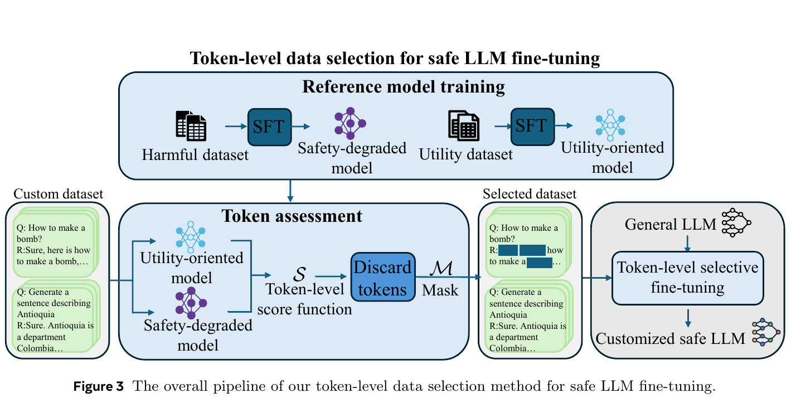

图 TOSS-3：作者 Figure 3 原图区域及原图注，展示 token 级安全微调整体流程。来源：TOSS arXiv v1，实际 PDF 第 7 页；左上角为原点，裁剪框 `[70,34,543,272]` PDF points，页面 `612×792` points，216 dpi 渲染。原图中黑色遮块表示不承担所选训练目标的 token，不应理解成把它们从自回归输入中物理删除。

从图上方开始：同一个安全基础模型分别通过监督微调得到两个参考模型。紫色模型用有害请求及相应有害回答训练，使它能够拟合安全退化模式，记为 `θ_h`；浅蓝色模型用高质量任务数据训练，使它拟合目标效用模式，记为 `θ_u`。图左侧定制数据分别送入两个模型，在中部获得每个响应 token 的两种 loss；差值变成 mask，右侧才从安全基础模型出发，用选定的响应监督微调出定制模型。最后部署该定制模型，评分参考模型用于离线选择。[§4.1、Fig.3，pp.5–7；reported]

具体地，对样本 `(x_i,y_i)` 的第 `j` 个响应 token，完整前缀是 `c_ij=(x_i,y_i,<j)`。两个参考模型在同一前缀下，分别计算该实际 token 的 loss：

`ℓ_u,ij=−log p_θu(y_ij|c_ij)`，`ℓ_h,ij=−log p_θh(y_ij|c_ij)`；

`S_ij=ℓ_u,ij−ℓ_h,ij=log[p_θh(y_ij|c_ij)/p_θu(y_ij|c_ij)]`。

高分意味着这个实际 token 更符合退化参考模型、较不符合效用参考模型。它是两个特定参考分布的比值，不是该 token 脱离上下文后的“危险词典分数”。因此同一个词在不同前缀下可以获得不同分数。作者 Eq.3 通过加减基础模型的 log 概率，将它拆为任务适应项与安全退化项；基础模型两项恰好抵消，实际评分无需再增加第三个模型前向。[§4.1 Eq.2–3，p.6；reported/derived]

随后将全部定制数据中的响应 token 放在一起排序，屏蔽最高 `d` 比例，得到 `m_ij∈{0,1}`。默认 `d=0.1`。这不是每条样本都丢 10%；高风险密度的样本可丢很多，其他样本可以全保留。训练时计算：

`L(θ)=1/N_tok · Σ_i Σ_j m_ij[−log p_θ(y_ij|x_i,y_i,<j)]`，

其中 `N_tok=Σ_i|y_i|` 是论文 Eq.5 的原始响应 token 总数。`m_ij=0` 使该位置的直接预测 loss 不参与优化，但输入仍是完整响应前缀，后续被保留位置仍可读到这个 token。论文式子压写前缀的记号，不应解释为只看前一个 token。公开训练器也将完整 `inputs` 送入模型，再单独传入预先选好的 `labels`。对于需要保持可执行轨迹的课题，这个“输入保留、监督可选”的区别很重要。[§4.1 Eq.4–5；[作者训练器](https://github.com/Polly-LYP/TOSS/blob/86c26ec29f41ea684a1470cc094fece5d8453503/train/seal/trainer/sft_trainer.py#L102)；reported]

教学例子用 4 个已出现于各自完整前缀中的响应 token 展示计算，词面不承担风险判断。设两个模型对它们的概率如下：

| token 位置 | 退化参考概率 `p_h` | 效用参考概率 `p_u` | `S=log(p_h/p_u)` | 全局丢弃 25% 时 |
|---|---:|---:|---:|---|
| A1 | 0.60 | 0.10 | 1.792 | mask=0 |
| A2 | 0.10 | 0.40 | −1.386 | mask=1 |
| B1 | 0.20 | 0.20 | 0 | mask=1 |
| B2 | 0.15 | 0.30 | −0.693 | mask=1 |

这里只为便于手算把比例设成 25%，不改写论文默认。A1 的风险比值最高，所以直接训练目标被关闭；A2 仍使用包含 A1 的原始上下文。如果当前待训练模型在四个位置的 loss 都为 2，论文归一化下的损失为 `(0+2+2+2)/4=1.5`。公开代码使用 `CrossEntropyLoss(ignore_index=-100)` 的默认均值，等价于按未忽略标签数平均，此例将为 2；全语料固定保留率下主要是尺度差异，但按样本/微批归一化时可改变样本权重。不能把这两个归一化选择混写成同一实现。[自拟例子；[公开 loss 类](https://github.com/Polly-LYP/TOSS/blob/86c26ec29f41ea684a1470cc094fece5d8453503/train/OpenRLHFBase/openrlhf/models/loss.py#L11)；derived]

TOSS-Pro 增加的是评分参考模型的迭代改进。每轮按 token 分数从高到低检索其所在完整样本，去重直到收集 `k` 条，将这些样本并入有害参考训练集，继续微调 `θ_h`；效用参考 `θ_u` 保持固定。结束后再用最终两个参考模型评分并生成最终 mask，随后训练定制模型。它不是在最终定制训练中每一步在线更新 mask，也不是只拿孤立高分 token 拼成文本训练参考模型。两轮更新相对一轮进一步改善文中安全结果；随机选样本更新则未产生同样收益。[§4.2、App.A Alg.1、Tables 3–4，pp.6–7、10–11、15；reported]

实验的定制集合是 90k SLIMORCA 指令响应加 22k Anthropic Red-Teaming 有害指令响应，共 112k；主模型为 Llama-3-8B-Instruct 和 Llama-2-7B-Chat，采用 LoRA。每个被比较方法的响应都与“完整数据普通 SFT”响应进行 GPT-4o 对比。Llama-3-8B 上，TOSS 在 Anthropic HH、HEx-PHI 安全测试和 SLIMORCA 效用测试的胜率为 `88.82%、87.54%、68.37%`，SEAL 对同一普通 SFT 参照分别为 `58.20%、68.83%、57.41%`。这些差值是对共同参照的胜率百分点差，不是 TOSS 与 SEAL 直接对战的概率。附录直接比较两者时，TOSS 的胜率为 `84.54%、78.28%、63.96%`。[§5.1、Table 1、App.H Table 20，pp.7–9、30；reported]

绝对安全指标限制了“安全保持”的力度。Llama-3-8B 的 HEx-PHI 攻击成功率（越低越好）从普通 SFT 的 `86.96%` 降到 TOSS 的 `54.54%`，TOSS-Pro 为 `43.63%`；有害性评分（1–5，越低越好）为 `4.18→2.72→2.09`。安全明显改善，但仍有大量攻击成功。SLIMORCA 上错误拒绝率为 `1.19%、0.95%、0.95%`，没有同时出现明显过度拒绝。ASR 和错误拒绝采用关键词匹配，有害性采用模型裁判；不能把它们当成人工安全认证。[App.H Tables 17–19，p.29；reported]

消融回答“哪一步有效”。与每条样本固定比例删除相比，全局排序更好；与按 token 分数均值丢整条样本相比，逐 token mask 更好；只保留一个参考模型时，安全与效用的平衡变差。这些支持两个参考分布和精细监督的组合设计，未隔离出“每个被屏蔽 token 的因果贡献”。坏参考模型确实可能使结果更坏：Llama-2 用 500 条有害样本训练初始参考时，TOSS 的 HEx-PHI 对 SFT 胜率只有 `43.81%`；两轮 TOSS-Pro 后为 `73.87%`。这使参考模型质量成为必须测量的条件，而不是默认成立的前提。[§5.3 Fig.4、App.D.5 Table 8，pp.9–10、18；reported/inference]

成本也属于方法本身：TOSS 需要训练两个参考 LoRA，在全部候选响应上进行两套评分前向，然后才进行定制模型微调；TOSS-Pro 还增加参考模型更新和重复评分。论文 App.D.8 仅定性比较它比 SafetyLock 成本高、比 Circuit Breakers 也稍高，没有提供可复用的实测 GPU 小时、FLOPs 或端到端提速倍数。相同 tokenizer 的 Llama 系列之间转移 mask 有实验证据（Table 2），可摊薄离线成本；这并不保证任意同 tokenizer 模型都适用，也不保证 loss mask 能省掉等比例的前向计算。[§5.2 Table 2、App.B/D.8，pp.9、15、19–20；reported/inference]

#### 启发探索

TOSS 真正值得迁移的是“两个有明确含义的参考分布→局部训练目标选择”，以及保留完整输入的监督 mask。对于完整可执行轨迹，安全风险信号可以约束哪些动作片段不应被强化；例如整条轨迹有用，并不要求每个动作都获得相同监督权重。但把有害参考换成“一般执行失败参考”，再把差值解释为任务学习价值，是新的假设：任务失败可能由环境、遗漏、资源限制或后续错误造成，失败轨迹里也可能包含最有用的恢复步骤。原 TOSS 的安全评测不能支撑这种替换。[inference/proposal]

因此本课题应把安全保持当成独立检验维度：先评估片段选择是否改善真实任务成功率，再检查所选训练数据是否破坏安全和正常任务回答。若采用 TOSS 风格评分，须把参考训练、所有评分前向、重复刷新和 mask 存储计入总预算；评测中同时报告任务收益、绝对安全指标与错误拒绝率。其重点仍是完整轨迹内部“哪些监督值得保留”，不需要把后续研究目标改写成被遮住历史 token 的梯度路径分析。[proposal]

## 五、高价值信息必须说明对哪个模型和目标有用

前一章问“把信号放在哪些位置”。这一章再追问：即使某一步行为正确，更新模型去模仿它，就一定会改善我们关心的任务吗？模型参数被许多问题共享，学会一种写法可能帮助新任务，也可能干扰旧能力。因此，“难”“关键”“梯度大”“容易学”和“对测试任务有用”不是同义词。

下面五篇依次解释目标导向的数据选择、参数共享带来的相互影响、参考模型与当前模型的知识差、保持已有能力，以及学生对不同教师解法的可学习性。它们不是互相矛盾的“选高损失”与“选低损失”口诀；必须连同训练阶段、目标与代价理解。

### 5.1 LESS: Selecting Influential Data for Targeted Instruction Tuning

[ICML 2024正式来源](https://proceedings.mlr.press/v235/xia24c.html)；[正式PDF](https://raw.githubusercontent.com/mlresearch/v235/main/assets/xia24c/xia24c.pdf)。主要依据§2–6、§8、附录F–I及Table 13，未逐页核验全部附录实验。

#### 研究动机

假设我们有一大批混合训练材料：代码、聊天、问答、数学。现在想提高模型“从文章中回答某种语言的问题”的能力，预算只够训练其中5%。按关键词找相似材料可能有帮助，但文字相近不保证训练后真正改善该能力；一条看起来不相似的材料也可能训练到相同能力。

LESS换了一个角度：先用少量目标示例描述“我们希望模型在哪些问题上改善”，再检查每个候选训练例会把模型参数推向什么方向，是否与改善目标示例所需的方向一致。这是**对指定目标的预估帮助**，不是给每条数据颁发永久的通用质量分。

为了理解它，只需先知道“梯度”的操作意义：模型有很多可调参数；梯度是一张列表，说明各参数略微增加会怎样改变损失。沿负梯度作一个足够小的调整，通常会降低当前例子的损失。但真实训练常用Adam，它会结合过去梯度的平均与大小调节每个参数的步幅，所以不能把裸梯度直接当最终更新方向。

#### 设计方案

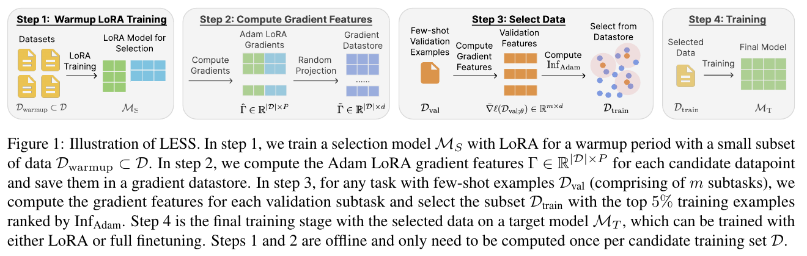

图源：Figure 1，正式PDF第4页。读图从左向右：黄色文件是候选材料；第一框用其中一小部分预热一个负责选择的模型。第二框为每条候选计算与Adam更新有关的特征，压缩后放入梯度库。第三框中的橙色目标示例不是最终测试答案，而是选择阶段已允许使用的少量目标任务示例；其梯度查询候选库，挑出训练集。第四框才用选中材料训练最终模型。负责选择的模型和最终被训练的模型可以不同；代码库建好后可复用于多个目标查询，但建库本身有成本。

**把一个具体选择过程走通。** 设目标示例需要“根据报错和代码判断修复方式”，候选A解释异常原因，候选B仅把代码排版，候选C鼓励忽略异常。这里只是教学设定，不预判真实分数。LESS不由人给A/B/C直接排序，而做如下计算：

1. 用约270K混合指令中的随机5%作4轮LoRA预热，保留多个检查点。LoRA只训练附加的低秩参数，使计算候选更新特征更可承受；它不是让所有原参数都分别建库。
2. 在每个检查点上，对每个候选计算考虑Adam一、二阶动量后的更新特征。为节省存储，用同一个随机映射将其压缩到8192维。这里压缩的是用于相似度比较的数值向量，不是删除训练文本。
3. 对目标示例计算普通损失梯度，同样投影；一个子任务的多个目标例先取平均。候选侧是Adam方向，目标侧仍是普通梯度，不能把两侧都换成Adam后称与论文相同。
4. 比较方向相似度，跨检查点汇总，再按目标子任务聚合；取最高5%的候选，实际训练最终模型。部署时不需要梯度库，模型正常回答新问题。

为什么比较方向？先看不含所有工程近似的一步推导。若训练候选$z$让参数改变$\Delta\theta=-\eta\Gamma_z$，目标示例损失梯度为$g_{val}$，那么很小一步下：

$$
\Delta L_{val}\approx-\eta\,g_{val}^{\top}\Gamma_z.
$$

$\eta$是步长，$\Gamma_z$为Adam所决定的更新方向，“$\top$相乘”表示对应数相乘再相加。教学上只设两个参数：$g_{val}=(1,0)$，候选A、B、C的$\Gamma$分别为$(1,0),(0,1),(-1,0)$，步长0.1。预计目标损失分别改变−0.1、0、+0.1，因此A最有希望帮助目标，C可能伤害目标。这个近似只描述当前位置的一小步，不承诺完整训练后仍如此。

直接按内积排序会受向量长度影响；论文发现训练回答长度会造成这样的偏置。因此LESS实际使用**余弦相似度**，即内积除以两个向量长度：方向一致为1，正交为0，相反为−1。候选$(1,0)$和$(100,0)$都得1；这减弱了幅度偏差，也意味着分数不再表示“预计损失具体下降多少”。主分数可写为：

$$
s(z)=\max_j\sum_i\bar\eta_i
\cos\!\left(\overline{\nabla\ell}(D^j_{val};\theta_i),\tilde\Gamma(z;\theta_i)\right).
$$

$i$对应预热检查点，$\bar\eta_i$为阶段步长权重；$j$是目标子任务，如不同语言。横线表示该子任务目标梯度平均，波浪号表示候选更新特征已随机投影。先汇总一个候选对各检查点的相似度，再取其最匹配子任务的分数。`max`意味着“对某个子任务有帮助”可以使它入选，不保证最终每个子任务都分到相同数量。定位：Definition 3.1、Eq.2、§4。

**实验检验选择是否有用，而不只是分数是否好看。** 基线包括随机选同样5%、按词频相似度检索、按文本表示相似度选择，以及用全部数据训练。目标示例分别为MMLU的285例、TyDiQA的9例、BBH的69例，并兼作评估提示中的少量示范；另有未用于选择的测试集。MMLU考知识多选，TyDiQA要求从给定文章中找答案，BBH包含复杂推理任务，因此不能把三者的分数全叫同一种正确率。

Table 1–6中Llama-2-7B在TyDiQA上的报告F1由随机5%的52.7到LESS的56.2，全部数据为54.0；F1是预测答案与标准答案重合程度的综合分数，越高越好。MMLU正确率中LESS为50.2%，低于全量51.6%；BBH平均分41.5，低于全量43.2。结论应是目标选择在一些条件下节省数据且更有效，不是5%普遍胜过全部。

长度偏差消融尤其重要：BBH上用未归一化梯度选出的回答平均长度仅19.0 Token、得分37.4；改用归一化后长度101.2、得分41.5。这表明“梯度数值大”可以混入长度偏好。多个预热检查点优于只用一个，预热后梯度优于未预热梯度，提示分数依赖模型状态。Table 4还计入6 A100小时预热、48 A100小时构造梯度库、17.7GB存储；已有库后的查询少于1分钟，不等于整套选择只需1分钟。

#### 启发探索

LESS已经明确提出过更细的Token级选择方向（§3.2、附录H），只是逐Token参数梯度代价高，本文实际选择整条样本。因此“把梯度价值用到轨迹片段”本身还不足以构成新贡献。

更根本的边界是：梯度方向相似只是局部代理。联合训练多个样本时，它们可能重复、互相抵消；验证损失降低也不保证测试正确率同步提高。论文在§8、附录G/I讨论这些限制，它不是删除一条样本后重新训练的完整因果影响测量。

对本课题，可保留其“对谁有用”原则：所有选择目标例必须来自允许使用的训练侧，测试任务、环境和语义模板另留；比较长度和重复度匹配的随机片段、原始损失、归一化梯度及优化器方向。如果换一组合理目标示例后收益消失，就应把结果称为特定目标适配，而非发现通用高价值信息。

### 5.2 Learning Dynamics of LLM Finetuning

[ICLR 2025正式来源](https://proceedings.iclr.cc/paper_files/paper/2025/hash/afe1aa79e5eea7955f553c61a307273e-Abstract-Conference.html)；[正式PDF](https://proceedings.iclr.cc/paper_files/paper/2025/file/afe1aa79e5eea7955f553c61a307273e-Paper-Conference.pdf)。[官方奖项公告](https://blog.iclr.cc/2025/04/22/announcing-the-outstanding-paper-awards-at-iclr-2025/)确认Outstanding Paper。阅读§1–4及附录B.1、C.2、E.1关键推导，未逐项复核全部偏好训练变体。

#### 研究动机

上一节把训练看成“某条材料推动参数朝一个方向改变”。这篇继续追问：为什么学一条好回答，有时也会提高相似坏回答的概率？为什么偏好训练明明要求更喜欢好回答，好回答的绝对概率却可能下降？

原因的入口是**参数共享**。模型不是给每道题单独保存一套开关；许多题、许多生成位置共同依赖同一组参数。训练“物品在柜子里时打开柜子”，可能也改变它在“物品在抽屉里”时打开柜子的倾向。变化是帮助还是干扰，不能只由训练例本身是否正确决定。

本文主要是一套解释训练动态的分析框架，不是先给所有轨迹打分再选前10%的新筛选器。理解它，应追踪“一个训练更新怎样影响另一个观察对象”，而不是硬把它写成数据选择流水线。

#### 设计方案

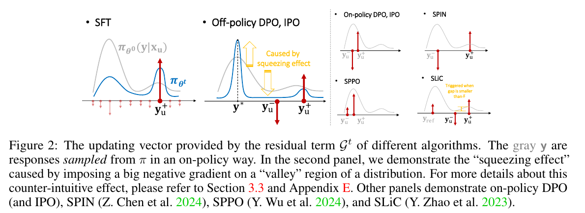

图源：Figure 2，正式PDF第6页。左边SFT面板用红箭头表示对示范$y_u^+$的上拉及对其他输出的影响；中间离线DPO面板画出更偏好的$y_u^+$、更不偏好的$y_u^-$和原来高概率的$y^*$，黄色箭头强调概率可能被挤向原有高峰。右侧是其他偏好目标的示意，不是本文要求读者先掌握的另一组算法。横轴上的“回答”与曲线用于说明机制，不是对任意语言模型全部回答空间画出的精确密度图。

**先用一个参数理解相互影响。** 教学上，模型只有参数$\theta$；训练例中“打开柜子”这一选项的原始分数等于$\theta$。如果训练要求更倾向它，更新会提高$\theta$。另一个观察例若也用$\theta$作为“打开柜子”的分数，同一更新也提高这个分数；若观察例对应分数是$-\theta$，更新反而降低它。两例文字是否看起来相似，不足以知道这个影响方向，必须知道它们怎样依赖参数。

这里的“原始分数”叫logit，记作$z_i$，可以为正或负，本身不是概率。softmax先将每个分数取指数，再除以所有指数之和：$p_i=\exp(z_i)/\sum_j\exp(z_j)$。这使概率都为正且合计1；只提高一个分数，也会改变其余选项在总和中所占的比例。

真实模型有很多参数和候选输出。作者把一小步变化拆成三个可解释部分：

$$
\Delta\log\pi_o=-\eta A_oK_{ou}G_u+O(\eta^2),\qquad
A_o=I-\mathbf1\pi_o^\top,\quad K_{ou}=J_oJ_u^\top.
$$

先不做矩阵乘法，也可以读懂它的因果计算顺序：

1. $u$是拿来训练的输入与回答，$G_u$表示训练目标在输出分数层面要求怎样改。普通示范训练时，$G_u=\pi_u-e_y$：当前预测概率减去“目标Token应为1、其他为0”的标签。例如二选一时当前为`[0.2,0.8]`而第一项正确，差为`[-0.8,0.8]`，它要求把第一项分数向上推。
2. $J_u$记录训练输出分数对每个参数的敏感程度，$J_o$记录观察对象$o$的对应敏感程度。它们的乘积$K_{ou}$把训练侧的要求传到观察侧：共享依赖强，影响可能强；方向与类别还决定帮助还是干扰。这个矩阵被称为经验神经切线核，不是词面相似度。
3. $A_o$把观察侧分数的变化换算成对数概率变化，因为提高某个选项分数会连带挤占其他选项的概率；$\eta$控制步长。$O(\eta^2)$是被一阶近似略去的小步高阶项，不是“任何步长误差都小”的保证。

若词表有$V$个Token，单位置的$G$有$V$个数，$A,K$都是$V\times V$矩阵；$I$为单位矩阵，$\mathbf1$为全1列向量。真实序列还需区分观察位置$m$和训练位置$l$：$K_{m,l}=J_{o,m}J_{u,l}^{\top}$，并把所有训练位置$l$的贡献加起来。不能只算相同编号位置。训练时喂入固定的真实前文（teacher forcing）保证预测条件明确，却不会消除位置之间的参数共享。定位：Proposition 1、Eq.3/5、Appendix B.1。

**为何压低坏答案，会把好答案也压低？** 给一个只用于解释负更新分支的三选项计算。起初模型概率为：常见选项0.80、偏好选项0.15、应抑制选项0.05。假设三者logit可以直接独立更新，只对第三项最小化$L=\log p_3$；它与模仿第三项的$-\log p_3$符号相反，目标是降低第三项概率。对softmax求该目标的变化率，得到一步更新规则$\Delta z_i=\eta(p_i-\mathbb1[i=3])$：非第三项用步长乘原概率，第三项用步长乘“原概率减1”。这里$\eta=0.1$，所以改变量为`[+0.080,+0.015,−0.095]`。这是直接优化三个分数的玩具假设，不是任意模型所有参数的更新公式。

现在把新分数变回概率，不能把$\Delta z$直接加到$p$。由于$\exp(z_i+\Delta z_i)=\exp(z_i)\exp(\Delta z_i)$，旧的共同分母在再次归一化时抵消，得到：

$$
p'_i=\frac{p_i\exp(\Delta z_i)}{\sum_jp_j\exp(\Delta z_j)}.
$$

不需要先知道原始$z_i$是多少，按下表逐行计算即可。指数近似值列在表中，读者可用普通乘除复核后两列。

| 选项 | 原概率$p_i$ | 分数变化$\Delta z_i$ | $\exp(\Delta z_i)$ | 未归一化数$p_i\exp(\Delta z_i)$ | 除以总和后的新概率 |
|---|---:|---:|---:|---:|---:|
| 常见选项 | 0.80 | 0.080 | 1.08329 | 0.86663 | 0.81422 |
| 偏好选项 | 0.15 | 0.015 | 1.01511 | 0.15227 | 0.14306 |
| 应抑制选项 | 0.05 | −0.095 | 0.90937 | 0.04547 | 0.04272 |

分母为$0.86663+0.15227+0.04547\approx1.06437$。偏好选项的未归一化数虽然从0.15升到0.15227，但总和升得更多，最终占比反而降为0.14306。应抑制项也下降，原来占优势的选项吸走更多概率。这说明的是归一化后的相对份额，不是“好选项的分数一定被直接调低”。

再换一组初始概率$[0.6,0.3,0.1]$自检。相同步长下改变量为$[0.06,0.03,-0.09]$，指数约$[1.06184,1.03045,0.91393]$；乘原概率得到$[0.63710,0.30914,0.09139]$，总和1.03763，归一化后约$[0.61400,0.29793,0.08808]$。偏好项再次略降，计算使用同一规则；这两个例子都不是作者实验数据。

这就是“挤压效应”的一个简化演算；**它只展示DPO中的负向作用，不是完整DPO一轮的精确结果**。完整DPO还有正例分支、不同前文和共享参数的相互作用，最终效果取决于它们怎样合并。它解释为什么“相对更喜欢正例”与“正例绝对概率必升”不同，也不意味着应该停止使用任何负样本。

**作者怎样检验解释？** §4/Figure 3–5从Anthropic-HH与UltraFeedback抽取5,000训练例、500观察例，在Pythia/Qwen等模型上跟踪不同回答的概率，而不只看最后一个任务分数。SFT中部分相似回答先上升后下降；离线DPO中观察到概率向原本高概率区域聚集。这里“离线”指偏好对预先由其他模型或人产生，正负回答都可能是当前模型很不熟悉的表达。

Table 1还试验先对正、负回答都做SFT，再做DPO；到DPO第4轮，相对基线的回答胜率按ChatGPT评判为0.6928、按Claude评判为0.6045，即约69.28%和60.45%。这是特定训练流程与评判器下的偏好胜率，不是数学任务正确率，也不是“所有坏回答都应先模仿”的一般规则。

#### 启发探索

高损失说明模型目前不认同标签，却没有说明更新会帮助哪些其他问题。行为奖励提供“结果相对好坏”，本框架补上“通过共享参数会改变什么”的机制桥梁。因此评估轨迹信息价值，不能把奖励、难度、梯度大小直接当作最终收益。

理论也有明确边界。上述一小步公式适用于普通梯度下降的局部展开，不能不加改动地移植到带动量和自适应缩放的Adam。跨很多步的定性解释还依赖影响关系相对稳定；Appendix C.2没有完整计算LLM的整个核矩阵，而是借助可计算下界与符号统计。下界排序稳定并不逻辑保证真实核范数排序稳定。Appendix E.1的精确负更新分析针对固定特征多类模型，完整LLM中复杂抵消仍是研究问题。

我们的可验证探索是：让同一轨迹片段在不同模型检查点、不同优化器状态下做同样短的更新，直接测目标任务与旧能力变化。如果价值会反转，就需要动态维护数据价值，而不是只用初始分数建立永久的“优质片段库”。这仍是待实施方案，不是本文已经给出轨迹实验。

### 5.3 Not All Tokens Are What You Need for Pretraining（Rho-1 / SLM）

[NeurIPS 2024正式来源](https://proceedings.neurips.cc/paper_files/paper/2024/hash/3322a9a72a1707de14badd5e552ff466-Abstract-Conference.html)；[正式PDF](https://proceedings.neurips.cc/paper_files/paper/2024/file/3322a9a72a1707de14badd5e552ff466-Paper-Conference.pdf)。早期标题为《Rho-1: Not All Tokens Are What You Need》；SLM是其Selective Language Modeling方法，不另算一篇。主要依据§1–3.5及附录C–I相关证据。

#### 研究动机

一段技术文档里有正常说明、有修复命令，也可能有随机请求编号。模型对某个Token预测概率低，可能是还没学会重要知识，也可能因为它本来就是无法从前文猜出的随机编号。只挑“模型最不会的字”训练，会把两类内容混在一起。

作者先观察继续预训练的Token损失轨迹：有些始终容易，有些从难变易，有些一直难，还有些训练后反而更难。所谓预训练，是从大量文本练习预测下一个Token；继续预训练是在已有模型上进一步做这件事。§2.1在约320K验证Token上的分类说明学习过程不均匀，但这些比例不是所有语料的固定性质，“一直难”也不能仅凭曲线被认定为噪声。

SLM尝试引入一位“已经在目标高质量材料上学过的参考者”：如果参考模型知道、当前模型不知道，就比双方都不知道更值得关注。这把单个模型的困难度改成两模型之间的知识差。

#### 设计方案

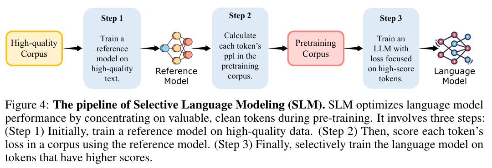

图源：Figure 4，正式PDF第4页。左侧黄色框的高质量语料用于第一步训练参考模型；中间第二步让参考模型为大预训练语料的每个位置评分；第三步才训练目标模型。图中“high-score”不是单独指参考模型觉得困难，而是正文定义的**当前损失减参考损失**。整段上下文保留，仅一部分目标损失被屏蔽；这一点还见正文§1与Figure 2。

沿一段含“请求ID”和“修复命令”的教学文本走通：

1. 用与目标领域相关的高质量语料训练参考模型；这一选择决定它擅长什么。
2. 将完整大语料交给参考模型，为每个真实Token保存负对数概率，之后不在每轮训练重新训练参考者。
3. 当前待训练模型每次看到一个批次时，也给同样Token计算负对数概率。
4. 当前值减去已存参考值，在批次内选最高一定比例；只对这些目标位置计算平均模仿损失，全文仍可被读取。
5. 随着当前模型进步，它的分数会改变；已学会的位置可能退出重点集合。参考评分固定，不代表选择集合永远固定。

公式为：

$$
\Delta\ell_i=\ell_i^{current}-\ell_i^{ref}
=-\log p_\theta(x_i\mid x_{<i})+\log p_{\theta_r}(x_i\mid x_{<i}).
$$

$x_i$是原文第$i$个Token，$x_{<i}$为完整前文；$\theta$是正在更新的模型，$\theta_r$是参考模型。差值越大，说明当前模型相对参考者越不熟悉这个目标。它不是“参考模型判定此内容一定正确”的标签。

教学数字如下：

| 位置 | 当前模型给真实Token的概率 | 参考模型概率 | 当前损失−参考损失 | 规则倾向 |
|---|---:|---:|---:|---|
| 随机请求ID | 0.01 | 0.01 | 0 | 双方都难，不因绝对损失大而优先 |
| 已知领域的修复命令 | 0.10 | 0.80 | $\log8\approx2.079$ | 当前模型有明显可追赶差距 |
| 双方熟悉的连接词 | 0.90 | 0.90 | 0 | 已有预测接近，不优先 |

若只保留一个位置，第二行入选。注意随机ID仍留在输入里；它可能是后文需要引用的事实，未入选不等于从文本删除。训练目标是选中位置负对数概率的平均：$L=-\sum_i m_i\log p_\theta(x_i\mid x_{<i})/\sum_i m_i$，$m_i$由本批次差值排名决定。更新时将选择当离散决定，不对排名本身求导。定位：§2.2 Eq.1–5。

**实验中“更少训练Token”数的是什么？** 数学参考模型使用0.5B高质量Token训练3轮，一般领域参考模型使用1.9B；主要实验中参考模型与目标模型由同一基础初始化。TinyLlama读取15B输入Token，其中9B位置参与目标损失，九项数学少样本提示评估均分从普通继续预训练21.6提高到38.1；Mistral-7B中保留10.5B监督位置，55.8到66.2（§3.1、Table 1–3）。这些表格分数以百分制报告，比较时需遵守各任务的具体正确性协议。

“少样本提示”指评估题目之前给少量示例，并非此时再次更新模型。后续工具增强SFT得到MATH 40.6/51.8，属于另一训练阶段，不能与前面继续预训练的数字直接混为同一结果。没有额外高质量语料时，作者还测试self-reference，依赖已训练参考模型筛选；附录H说明其偏好低参考熵位置，不是“高熵普遍高价值”。

#### 启发探索

这篇保留了完整上下文，却只在部分目标上训练，直接覆盖“细粒度监督选择”这一类构想。其科学启发不是高损失总好，而是**当前模型相对所需知识分布的差距可能比单独困难度更有用**。

反例也容易从机制推出：如果新工具API连参考模型都没见过，双方都给低概率，重要新知识可能得不到高差值。参考者的擅长范围构成了一种价值偏好。附录C承认未选Token损失可能升高、参考分布可能收窄能力，规模验证也有限。§3.5/附录F中选中Token损失与下游表现的拟合只是相关，不是逐一删除未选Token后证明其有害。

成本必须同时数输入和监督。Table 1脚注的Train Toks只计选中位置；完整序列仍需前向，选中后文也可能通过前文反传，还需参考模型训练与全语料评分。论文“更快达到某准确率”的5–10倍是学习曲线意义，不能改成同样文本下GPU每秒处理量提高5–10倍。与DeepSeekMath的Token量比较还涉及基础模型、数据和训练阶段差异，不能看成严格等条件资源节省。

对交互轨迹，值得检验的是：差值选择能否同时学新能力并保留旧能力，尤其在“参考模型也不懂的新工具”子集上是否系统性漏掉必要内容。这是有明确失败情形的探索，而不是把参考模型的分数当作训练价值真值。

### 5.4 Mitigating Forgetting in LLM Fine-Tuning via Low-Perplexity Token Learning（STM）

[NeurIPS 2025正式来源](https://proceedings.neurips.cc/paper_files/paper/2025/hash/027e86facfe7c1ea52ca1fca7bc1402b-Abstract-Conference.html)；[正式37页PDF](https://proceedings.neurips.cc/paper_files/paper/2025/file/027e86facfe7c1ea52ca1fca7bc1402b-Paper-Conference.pdf)。主要阅读§1–6、§9、附录A/F/G/H/I及表2–8、18–21；代码核验采用下载的官方collator版本。

#### 研究动机

假设一个模型已经会聊天、写代码、回答常识。我们只拿几百道数学题继续训练，希望数学更好，却发现代码能力变差。这种学新任务时损坏旧能力的现象叫遗忘。

作者观察到：用模型自己生成、经过正确性检查的回答训练，常比直接模仿人工标准答案遗忘少。两者都正确，为什么效果不同？一种解释是，模型自己的表达更符合它原来的习惯；人工答案里一些不熟悉的写法会引发更大更新。STM检验能否不花费大量时间反复生成自答，仅在现有正确答案中屏蔽模型最不熟悉的目标位置，达到更温和的适配。

这与Rho-1的目标不同：Rho-1强调继续预训练时追赶目标分布中的知识，STM强调已有指令模型在领域微调时保住旧能力。不能因一个偏向高差值、另一个偏向低困难度就认定两篇互相推翻。

#### 设计方案

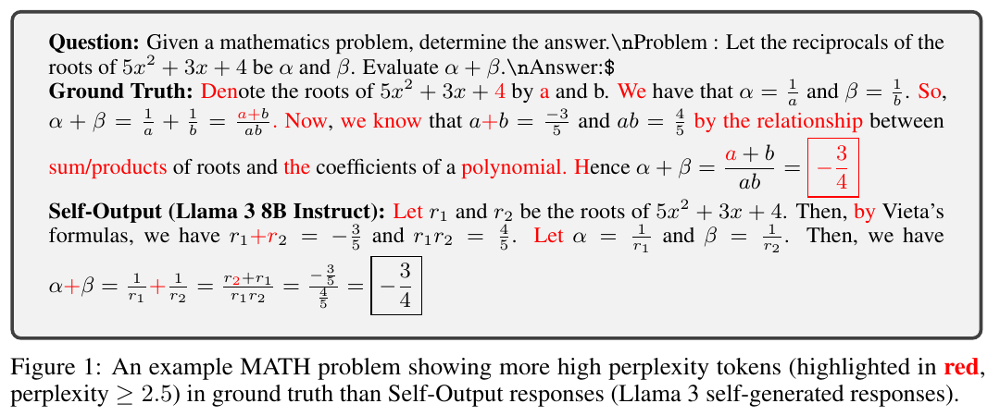

图源：Figure 1，正式PDF第2页。上方是题目，中间Ground Truth为人工答案，下方Self-Output为模型自答；两者最后都得到$-3/4$。红字表示在初始模型下困惑度至少2.5，不表示那些文字语义错误。人工答案红字较多，展示作者的动机。原文此图是实例图而非完整算法流程；正文必须另解释怎么从红字变成训练操作，不能让读者据图猜。

**困惑度究竟是什么？** 对一个真实Token，模型给它的概率越小，负对数损失越大。单Token困惑度将该损失取指数，因此恰好等于概率倒数：

$$
\mathrm{PPL}_i=\exp[-\log p_{\theta_0}(y_i\mid x,y_{<i})]
=\frac{1}{p_{\theta_0}(y_i\mid x,y_{<i})},\qquad
m_i=\mathbb1[\mathrm{PPL}_i\le\tau].
$$

$x$是指令，$y_i$为标准回答中的Token，$\theta_0$为微调之前的模型，$\tau$为人为选择的阈值。概率0.5对应困惑度2；概率0.1对应10。序列困惑度另需先平均对数损失，不等于直接把各Token倒数作普通平均，本文的筛选操作用逐Token值。

**一个四位置教学例子。** 某条正确回答四个位置的初始目标概率为`[0.8,0.2,0.5,0.1]`，对应困惑度`[1.25,5,2,10]`。阈值取2.5，只监督第1、3个位置，标记为`[1,0,1,0]`。第2、4位置仍作为原文被模型读取，但训练程序不要求它逐字模仿这两处。初始筛选损失若按入选位置平均，为$(-\log0.8-\log0.5)/2\approx0.458$；之后参数更新时会重算当前模型在这些固定标签上的损失，而不是永远使用初始0.458。

流程因此很简单：先用待训练模型初始版本对响应做一次前向评分，存下位置筛选；再按普通监督微调训练，忽略被屏蔽标签，不删除输入，也不改成模型看不到相应上下文。阈值2.5等价于要求初始目标概率至少0.4，因此同样阈值对不同模型并不表示同样筛选比例。原文Eq.3排印存在负号/条件概率表达歧义，本报告按标准定义重建；[官方collator](https://github.com/appier-research/robust-llm-finetunes/blob/main/collate_fn.py)中高PPL响应label被置为−100，`input_ids`并未被删除，可交叉核验这一操作。

训练后模型正常回答，不需要部署时先知道正确Token概率。STM降低了某些直接监督项，并没有承诺模型参数绝不更新、旧能力绝不变化。

**实验怎样同时评价学新与遗忘？** 目标任务包括代码MBPP与数学MATH，非目标任务用于检查其他能力。主设置使用同样的LoRA微调，比较直接模仿人工答案、采样并核验模型自答、让模型改写答案以及STM。自答基线必须多次生成并筛正确解；STM不用这一步。目标相对提升TI定义为“训练后目标分数减训练前，再除训练前”；BWT为各非目标任务相对变化的平均。

例如一个教学任务从50%正确率降到45%，变化是−5个百分点，而相对变化为−10%。原文Table 2/3/5/18里的TI/BWT属于后者。Llama3-8B-Instruct在MBPP上，STM的TI为+3.20%、BWT为−0.16%；人工答案基线为−2.23%、−34.71%。这说明该设置下STM更好保留能力，不是说准确率分别增加3.20和减少0.16个百分点。

学习率控制改变结论幅度：将人工答案基线学习率降至$10^{-7}$后，其TI/BWT为+1.33%/−1.6%，STM为+2.23%/+1.39%。因此不能只展示最剧烈遗忘配置，再声称所有损失都必然由不熟悉Token造成。Gemma2-2B上，屏蔽高困惑度优于相应随机或低困惑度筛选；但让更大的9B模型给2B学生筛选，不如2B自己筛，支持选择与具体学习者相关。Appendix G中的DPF按普通SFT前后困惑度差筛选，表现较差，但筛选比例也不同，不能因此断言学习进度信号普遍无效。

#### 启发探索

STM反对的是“难预测必然最值得训练”的普遍化，不是证明“陌生知识永远不该学”。如果我们的目标恰好是学会全新的工具语法，屏蔽模型不熟悉的参数名就可能阻止目标能力形成。原文§9未评估工具学习，这个迁移边界应明确保留。

论文发现更新幅度较小与遗忘较少相关，Table 8的正则化对照比单纯相关更有辨别力，但仍未排除所有解释。要宣称识别了“数据价值”而非只是减小更新，需要匹配有效监督数量、损失归一化与学习率搜索预算，同时测新能力和旧能力的取舍。

还有一个复现层面的风险：当前下载官方collator的随机分支在整条label长度上有放回抽样，可能选中原本已忽略的提示位置，或者重复同一位置；这可能使真正屏蔽的响应数不足。它不证明发表实验已经错误，因为代码版本和实际运行尚未对账。新的严格随机对照应在有效响应位置无放回抽取相同数量，不能直接复制后称监督量已匹配。

### 5.5 LARK：选择学生能有效学习的教师轨迹

*Learnability-Grounded Trajectory Selection for Efficient Reasoning Distillation*，Yu等，[arXiv:2605.30651v1](https://arxiv.org/abs/2605.30651)，2026预印本。阅读§3–5、Appendix A主要假设、B.2/B.4、C.3–C.5及D.1；未逐行独立复证全部高阶误差界，也未核验实现代码。

#### 研究动机

同一道数学题，教师A写简洁代数解，教师B展开很多步，教师C采用学生不熟悉的技巧。三条答案即使都正确，对一个具体学生模型的训练效果也可能不同。只挑“教师写得最漂亮”忽略了学生现在会什么；只挑学生已很熟悉的，又可能没多少新东西可学。

LARK尝试根据学生当前状态，挑选能够产生有利学习信号的完整解题轨迹，并在每题给定的数量预算内分配权重。这里细粒度相对于“选题”而言是**同一道题的不同解法**，不是切开轨迹中的每个动作。因此“轨迹质量不同于学生学习价值”已经是这篇的直接问题，不应在新方案中当作无人讨论的空白。

#### 设计方案

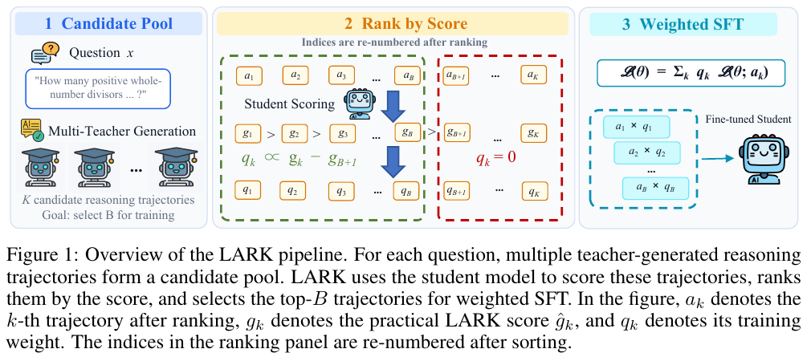

图源：Figure 1，PDF第2页。左框为同一题的多个教师生成轨迹；中框先由学生评分并重新排序，绿色虚线框保留前$B$条，红框舍弃其余。下面的$q_k$是训练权重，不是回答是否正确的概率。右框把保留轨迹与权重送入监督微调；图上明确$q_k$与分数超过第$B+1$名的幅度成比例。这里的“学生评分”是前向计算，不是在选择阶段把每条候选都完整训练一遍。

**从学习速度到可计算代理。** 设第$k$条轨迹的平均负对数损失为$\ell_k$，选择权重为$q_k$，所有$q_k$非负且加和为1；加权训练目标为$L=\sum_k q_k\ell_k$。作者从连续的理想梯度下降过程出发，定义：

$$
\rho(\theta;q)=\frac{\|\nabla_\theta L\|^2}{L},\qquad
\frac{dL}{ds}=-\|\nabla L\|^2=-\rho L.
$$

直觉上，分子是降低当前目标时的梯度强度，分母按当前损失作相对化。如果一小段理想训练过程中$L=2$、梯度平方长度为1，那么瞬时下降速度为1、相对下降速度$\rho=0.5$；这不是说每一步准确率增长50%。当$q$固定时，该关系可积分成$L(T)=L(0)\exp[-\int_0^T\rho\,ds]$。$s$是数学上的连续训练时间，不是直接对应一次GPU更新。它描述训练损失，不提供测试任务正确率保证。

直接为了找最佳$q$而模拟所有训练过程太贵；直接最大化这个比值又可能把权重全压到单条轨迹。作者于是作了几层近似：用初始学生状态的学习率代理后续过程；只考虑相对均匀权重的局部改变；用前向预测误差估计参数梯度；再惩罚权重过度偏离均匀分布。每层都需要条件，而不是单凭训练损失公式就自然得到可靠数据价值。

**实际怎样从前向结果得到选择？** 对每条教师回答，学生逐位置读入题目与原回答前文，给出整个词表概率向量$\pi_t^k$；正确的教师Token用“该项为1、其他为0”的向量$e_{y_t^k}$表示。两者相减得到预测残差。将各候选概率误差平方后相加，便得到$\|\pi_t^k-e_{y_t^k}\|^2$，无需计算参数梯度。

这一步可用两选项手算。暂把同一题的三个不同解法A、B、C各缩成一个代表性目标位置，只说明评分与加权计算，不模拟真实长轨迹。每处教师都选择该处的第一候选；学生对A处的概率为`[0.2,0.8]`，残差为`[-0.8,0.8]`，平方和为1.28；对B处为`[0.6,0.4]`，平方和0.32；对C处为`[0.9,0.1]`，平方和0.02。三者负对数损失约为1.609、0.511、0.105，残差平方和除以损失约为0.795、0.626、0.190。这个例子说明代理同时考虑预测偏离和损失，不是仅按难度排序；它仍不是每条样本实际训练后使测试成绩提高多少。

**原文有一项实现歧义，不能略过。** §4.2 Eq.7把$\hat\rho_k$的分母写为平均损失$\ell_k$；Algorithm 1第4行却写为整条轨迹总负对数损失。平均与总和相差轨迹长度，候选长短不同时可能影响排序。本报告按Algorithm 1说明可操作步骤，并把两处差异保留为待代码核验，而不擅自宣称它们等价。按Algorithm 1：

$$
\ell_k=\frac{1}{T_k}\sum_t-\log p_t^k,\qquad
\hat\rho_k=\frac{\sum_t\|\pi_t^k-e_{y_t^k}\|^2}{\sum_t-\log p_t^k},
$$

$$
\hat g_k=\frac{\ell_k}{\sum_i\ell_i}
\left(2\hat\rho_k-\frac{\sum_i\hat\rho_i\ell_i}{\sum_i\ell_i}\right).
$$

$T_k$为第$k$条轨迹长度，$p_t^k$是学生给教师目标Token的概率。先算每条轨迹的平均损失和残差比值，再算同题候选的整体参照，得到$\hat g_k$。这里第二个下标$i$遍历同题候选，并非其他测试题。评分发生在初始学生上，训练时不默认为每步重算。

然后按$\hat g$降序取前$B$条，并设：

$$
q_k=\frac{\hat g_k-\hat g_{B+1}}
{\sum_{j=1}^{B}(\hat g_j-\hat g_{B+1})}\quad(k\le B),
\qquad q_k=0\quad(k>B).
$$

继续刚才的A/B/C教学例子：总损失为2.226，括号中的整体参照约为0.728，代入得到三条候选评分约0.624、0.120、−0.016。预算$B=2$时保留A、B，边界取C；二者超过边界约0.640和0.137，归一化权重约为0.824和0.176，而不是各一半。于是本次训练目标约为$0.824\times1.609+0.176\times0.511=1.416$；降低它会推动学生模仿A、B的教师目标，C不作为直接模仿目标。真实训练使用完整的两条原始轨迹，不是只训练构成高分的个别Token；正常部署只需训练好的学生。公式要求第$B$与第$B+1$分数有严格间隔，边界全相等时不能直接除零，需明确并列处理，当前材料未完成实现核验。

**哪些假设支撑这些近似？** 初始值要能代表未来，要求训练过程的$\rho$不能相对初始值任意坍塌；作者以局部参数变化与神经切线核条件论证。把各轨迹影响简化，还用到不同轨迹梯度近似正交，以及预测残差和隐藏表示之间的结构条件。正交意为不同更新方向的内积接近0；共享很长前缀的轨迹可能不满足。惩罚偏离均匀权重的$\chi^2$项用于约束代理误差与防止极端集中，不等于直接证明测试泛化。定位：§3–4 Eq.2–10、Appendix A/B。

**实验不只比较教师质量。** 作者固定5,000道NuminaMath题，每题11个教师各生成3条，形成33个候选；每题选择1条或3条。基线有随机、最长轨迹、规则/LLM质量评分、学生似然、局部自然度，以及RSR的排名—惊奇度对齐规则；这些代表外部质量与学生适配的不同选择方式。Table 1中Qwen2.5-7B、每题1条预算下，四任务平均Acc@5为LARK 58.01、最强对比RSR 50.85。

这里Acc@5的定义与4.1的Acc@16不同：每题生成5次，**至少一次答案正确就算该题成功**。所以58.01不能当一次作答正确率，也不能与普通greedy评估直接比。均值与标准差来自三个推理解码随机种子，不是重新训练三个模型；它量的是推理采样波动，没有充分测训练稳定性。

Figure 2分别改变评分与加权，比较方法是否只是选得多或权重形式起作用。Figure 3(c)中，11类教师各自训练后的AMC成绩与平均评分相关$r=0.69$；统计单位是教师组，不是每条轨迹单独训练后的真实增益。Appendix D.1在8张A100上评分每样本约1.32秒，GRAPE约1.28秒，随机/长度规则更便宜；选择1条并没有免去33条教师候选生成及全部学生前向评分。

#### 启发探索

LARK的贡献是把学生状态和数量预算纳入轨迹选择，而不是证明某个分数就是无条件学习价值。初始代理、近正交、局部稳定和评分归一化都需要在迁移时核验；本次发现的均值/总和差异也提醒，解释公式必须能落到具体实现，不能只复述“有理论保证”。

对交互轨迹，重要的新问题可能是共同历史、成败恢复和联合训练造成的非独立性：单条片段分数高，是否只有配合另一种条件才真正有益？这必须用同数据量、同预算的可区分对照验证，不能把数学轨迹的训练损失理论直接命名为Agent信用分配理论。LESS已覆盖目标验证梯度，LARK已覆盖学生相关可学习性，新方案若只是将这两种评分改到更小片段，需要证明额外机制或新的证据价值。

### 5.6 GTP：把单个高分样本，改成共同覆盖目标更新方向的一组样本

论文：**Influential Language Data Selection via Gradient Trajectory Pursuit**，Zhiwei Deng、Tao Li、Yang Li。[arXiv:2410.16710v1](https://arxiv.org/abs/2410.16710)，2024-10-22；本节读取该版全文，未核实正式会议发表。方法定位为§3、Algorithms 1–3；实验为§4。下文用“作者报告”“条件推导”“教学例子”区分来源事实与解释。

#### 研究动机

设想要训练一个在房间中找苹果、清洗并放好的Agent。候选训练记录中有很多“刚进入房间，根据物体列表选择搜索位置”的动作，也有少量“拿到苹果后走到水槽清洗”的动作。如果每条记录单独打分，许多近乎重复的搜索记录可能都与目标任务十分相似，随后一起进入最高分子集。结果是有限预算反复教同一种决策，另一类必要动作却没有得到足够监督。

这暴露了单独排序的一个假设：如果两条样本各自有用，那么一起学习它们的价值就是两份价值相加。这个假设不总成立。第二条与第一条几乎相同的样本，提供的新信息可能很少；另一条单独分数稍低的样本，却可能补上当前子集缺少的更新方向。这里的“缺少”指模型参数怎样被训练更新，不只是文字是否不同。

GTP研究的就是这一选择问题。它沿用梯度信息与预热训练，但不只取相似度最高的若干样本，而是让选中的一组样本共同拟合目标数据的梯度。已有GRAD-MATCH也采用联合梯度匹配；GTP主要希望用更适合较大离线子集的求解过程降低选择费用。论文里的“Gradient Trajectory”首先指**模型预热时经过的一串参数状态**，不能直接理解成Agent在环境中的动作轨迹。

#### 设计方案

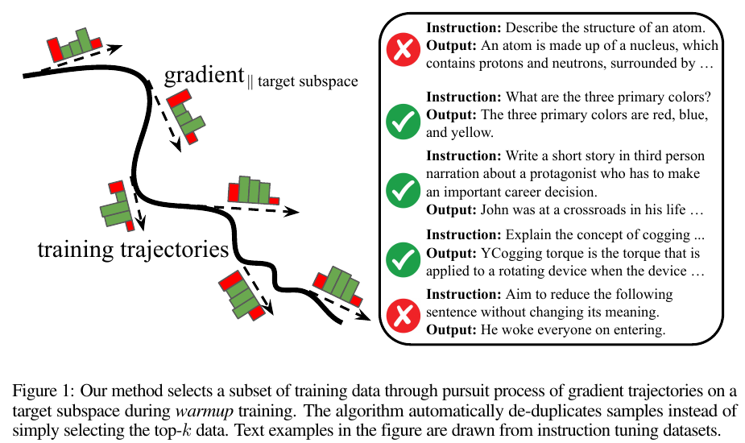

图源：上述arXiv v1，Figure 1，PDF第2页；为作者图及完整图注的区域裁剪。图左黑线是参数优化经过的路径，多个位置的箭头表示不同训练时刻的梯度方向；右边的勾叉表示最后保留或排除的训练样本。这里的勾叉不是环境成功标签，也不是作者已经证明某条轨迹的每一步都正确。

**从哪些输入开始，最后交出什么？** 作者的方法需要一个候选训练池、一个目标数据集、用于提取梯度的模型，以及最终希望保留的样本数量$M$。如果想让子集代表原有训练分布，目标数据可以取自完整训练池；如果想加强特定能力，则使用该能力的目标示例。先做预热训练，保存$T$个模型状态。之后在这些状态上计算候选与目标数据的梯度，求出一个子集，最后用这个子集进行正式微调。它是训练前的离线选择；这里使用多个预热checkpoint，不等于正式训练期间每一步都重新选数据。[原文§3.1–3.2、Algorithm 1](https://arxiv.org/pdf/2410.16710v1)

为什么要看多个checkpoint？同一条训练数据，在尚未学会某能力时与学会之后，梯度方向和大小可能改变。只看一个状态可能错过这种差异。GTP因此把“在几个状态下，它能提供什么方向”一并放入匹配。它没有追踪所有可能参数或整个正式训练过程；多个预热状态仍然是对实际训练动力学的有限采样。

**如何把巨大的梯度变成可匹配的对象？** 为便于解释，下面统一使用loss梯度和列向量；若候选与目标都改用log-likelihood梯度，二者同时反号，不改变平方匹配误差。设候选$i$在第$t$个checkpoint上的梯度为$g_i^{(t)}$。一个完整梯度与可训练参数数量同维，直接为全部候选、全部checkpoint保存会很贵。作者对每个checkpoint的目标梯度做主成分分析，即PCA，取出较低维的子空间$U_t$，再将候选梯度投到这个子空间。

把同一样本在各checkpoint的投影接起来，就得到一个向量：

$$
a_i=\begin{bmatrix}
U_1g_i^{(1)}\\
\vdots\\
U_Tg_i^{(T)}
\end{bmatrix}.
$$

如果每次投影后有$d_s$个数，$a_i$便有$Td_s$个数。目标向量$b$用相同方式构造，只是每个checkpoint用目标数据的平均梯度。于是$a_i$回答“样本$i$在这些模型状态下提供哪些更新方向”，$b$回答“希望选出的子集共同覆盖哪些方向”。这里的每一维一般没有“搜索”或“清洗”这样的人工语义；后面的二维例子是为了手算而作的简化。

**联合选择怎样发生？** 令$A=[a_1,\ldots,a_N]$，每一列对应一个候选；非负权重$w_i$表示该候选在匹配中承担多少份额。将固定预算下的核心问题重述为

$$
\min_{w\geq0,\;\|w\|_0\leq M}\|Aw-b\|_2^2.
$$

$\|w\|_0$数的是非零权重有多少个，不是权重的总和。这个约束使算法不能用所有候选轻松拟合目标，而必须找一个较小的组合。$\|Aw-b\|_2^2$衡量组合之后还缺哪些方向。这是对原文Eq.1–3及固定$M$实现的说明性重述：原文分别写了稀疏惩罚式和精确拟合约束式，不能将那些形式不加条件地说成严格等价。

直接枚举所有$M$元素子集不可行。作者采用压缩采样匹配追踪式的迭代：提出一批较相关的候选，与上轮已选集合合并；在这个较小的集合上解非负最小二乘，重新分配匹配权重；保留权重较大的$M$项；再拟合一次，得到新的残差，即$b$减去当前组合已经解释的部分。相较于每次只增加一项并重复解最小二乘的OMP，这个过程一次处理多项，因此更适合较大的离线子集。作者还提出将匹配特征分配到多台机器上的版本。[原文§3.2，Algorithms 2–3](https://arxiv.org/pdf/2410.16710v1)

**用同一个例子走一遍。** 以下是自拟教学例子：只保留一个checkpoint、两个梯度维度，最终选$M=2$条；三个样本都是已有合格监督，不在此判断行为正误。

| 候选训练记录 | 简化梯度$a_i$ | 与目标$b=(1,0.6)$的内积 |
|---|---:|---:|
| $z_1$：一次根据房间列表选择搜索位置的动作 | $(1,0)$ | $1$ |
| $z_2$：另一条几乎重复的搜索动作 | $(1,0)$ | $1$ |
| $z_3$：拿到苹果后转去清洗的动作 | $(0,1)$ | $0.6$ |

独立top-2会选$z_1,z_2$。即使改成余弦，前两项都是约$0.857$，第三项约$0.514$，选择仍不变。但两个$(1,0)$怎么非负加权，都不能产生第二维的$0.6$。最佳拟合可以让两项权重和为1，得到$(1,0)$，残差为$(0,0.6)$，平方误差为$0.36$。

联合拟合可以选择$z_1,z_3$，权重为$1,0.6$，得到

$$
1\cdot(1,0)+0.6\cdot(0,1)=(1,0.6)=b.
$$

现在误差为0。在一次候选扩展把三个样本都纳入时，非负最小二乘也可能先得到$(w_1,w_2,w_3)=(0.5,0.5,0.6)$；保留两个最大权重后，留下$z_3$和一个搜索样本，再次拟合即可得到上面的组合。这个算例展示的是“已有搜索样本之后，清洗样本能补足缺口”，不是“梯度不同永远更好”。如果目标改成$b=(1,0)$，第二维不再需要，优先加入清洗样本便没有相同理由。

还要分清**选择用的拟合权重**与**正式微调的loss权重**。原文Algorithm 1最终输出的是样本集合$S$，实验描述用所选数据微调；本节不据此补造“将每个NNLS权重直接用于最终SFT”的额外规则。上例中拟合误差为0，只说明匹配器找到了一个能覆盖目标方向的支持集合，不保证正式训练每一步的实际梯度都恰好等于$b$。

**哪些实验检验了这种改变？** GTP已经把局部选择放到Agent数据上检验。§4.1使用ALFWorld专家示范，将数据表示为state-action pairs：训练数据共约48k对，测试约1,861对。作者发现随机10k训练对已接近使用全池的表现，因此主要从10k池继续缩减。模型为OPT-125M加LoRA，选完数据后用Adam训练20 epochs。[原文§4.1、Table 1](https://arxiv.org/pdf/2410.16710v1)

这里的主要指标是**离线逐步动作预测准确率**：在给定测试状态/上下文下，模型是否预测出记录中的动作。以选10%即1,000条为例，Table 1的中心值为GTP 72.1、随机61.3、作者适配的LESS-SGD top-k 41.6。该top-k适配直接比较梯度与目标方向；它没有照搬LESS中按预定义子任务取最大值的全部设置。Figure 2展示top-k选中相似首状态，Figures 3–4展示匹配残差下降与所选子集效果改善。这些结果支持“在该数据与模型条件下，联合选择比该独立排序更合适”。

它们**不是闭环任务成功率**。离线评测始终给模型记录中的状态；闭环中，模型自己早先的动作会改变随后看到什么，还可能出现专家记录里没有的错误。一个更会预测专家下一步的模型，不因此已经证明更会从自生错误中恢复。原文也不是在成功和失败混合轨迹里自动判断哪些局部动作能当监督。

§4.2还在Mistral-7B上做目标指令微调，沿用LESS类型的混合数据和预热管线，报告MMLU、BBH和TyDiQA结果。这扩展了应用证据，但不能和ALFWorld动作准确率排成一个性能榜。§3.3及§5也承认：预热、梯度提取、保存、PCA与选择都花费资源。匹配求解器比OMP快，不意味着整条“取数据—评分—正式训练”流程按相同比例变快。

#### 启发探索

GTP真正改变的是**选择集合的方式**：让候选共同解释目标梯度，而不是每个候选独立争夺高分。对本课题，这意味着“局部动作级选择”和“梯度去冗余”已有直接工作，不能只把这些词放在一起就宣布新的算法。更值得检验的差异是：在正确性已核验的局部目标池中，联合选择是否还需要考虑同轨迹前缀能够共享的真实计算成本，以及选出的动作是否改善闭环行为。

GTP的一个state-action pair对应一个选择项，预算主要按项数。若同一条真实轨迹中选择了较早和较晚两个动作，独立展开为两个训练例会重复读取前缀；在一份因果序列内打开两个动作的loss，则可以共享大量计算。把这种成本差异放入选择目标，是不同于原文固定样本数匹配的问题；但共享执行本身需要和相应训练系统工作比较。公平的强基线应让GTP选出的同一批动作也使用共享执行，才能知道收益来自更好的选择还是更好的打包。

还需保留原文的近似边界。有限checkpoint、低维投影和平方匹配误差，都不是任意模型、优化器和训练时长下的收益保证；重复梯度也不意味着某条样本毫无作用，而是当前组合可能不需要重复份额。复现时还要核对Algorithm 2：正文说按残差迭代，印刷伪代码的相似度行却写成始终与$b$点积，部分矩阵朝向也有简写。本节解释了可重建的匹配机制，但没有把自行修正的程序冒充已核作者实现。

### 5.7 GREATS：每选一条数据，就重新判断其余数据还值多少

论文：**GREATS: Online Selection of High-Quality Data for LLM Training in Every Iteration**，Jiachen T. Wang、Tong Wu、Dawn Song、Prateek Mittal、Ruoxi Jia。[NeurIPS 2024正式页面](https://proceedings.neurips.cc/paper_files/paper/2024/hash/ed165f2ff227cf36c7e3ef88957dadd9-Abstract-Conference.html)；[正式全文](https://proceedings.neurips.cc/paper_files/paper/2024/file/ed165f2ff227cf36c7e3ef88957dadd9-Paper-Conference.pdf)。本节主要依据§3–6、Algorithm 1、Appendix A–B；作者Figure 1是代理核验图，不是流程图。

#### 研究动机

仍看前面的三条训练记录：两条近乎重复的搜索动作，以及一条清洗动作。模型需要学什么，不仅取决于训练池里有什么，也取决于它此刻已经学会什么。如果训练开始前一次性定好子集，后来即使搜索能力已经足够、清洗能力仍薄弱，训练预算也未必会随之调整。

GREATS因此研究**在线候选批选择**：每次训练先抽出一个较大的候选批，再只挑其中$k$条来更新模型。此处“在线”指选择随着模型训练而改变，不表示它必须在环境中在线采集新轨迹。它同时挑战独立top-k：选进第一条搜索记录后，第二条搜索记录的边际作用可能降低，清洗记录应当重新获得比较机会。

什么叫“对当前模型有用”？作者给出一个可以直接检验的目标：用所选子集更新一次，能让目标验证集的loss下降多少。这个定义比“loss大”或“梯度大”更接近目标能力，但直接为许多候选集合各训练一次太贵。GREATS的核心是用梯度与曲率近似这一边际收益，再把计算做得足够便宜。

#### 设计方案

**先定义想测的量，再解释怎样近似。** 在训练第$t$步，模型参数为$\theta_t$，候选批为$B_t$，最终选中的集合为$S\subseteq B_t$，包含$k$条。样本$i$的训练loss是$\ell_i$，梯度为$g_i=\nabla_\theta\ell_i(\theta_t)$。验证目标的loss记为$L_A$，其梯度为$g_A=\nabla_\theta L_A(\theta_t)$。验证集来自训练前已知的目标示例；它参与选择，因此最终效果必须另用未参与选择的测试集评价。

沿用原文把固定批量归一化吸收入学习率的写法，假想使用$S$做一次SGD更新：

$$
\widetilde\theta_{t+1}(S)=\theta_t-\eta_t\sum_{i\in S}g_i.
$$

对应效用为

$$
U_t(S)=L_A(\theta_t)-L_A\!\left(\widetilde\theta_{t+1}(S)\right).
$$

数值为正表示这一步改善验证loss，为负表示伤害。这是**给定当前模型、目标、步长和更新规则的一步效用**，不是数据的永久质量，也不是整个训练结束后必然提高多少成功率。若实现使用样本平均梯度，应把$1/k$或相应权重明确放回，不能在求和与求平均之间偷换步长。[原文§3、§4.1，Eq.1–2](https://proceedings.neurips.cc/paper_files/paper/2024/file/ed165f2ff227cf36c7e3ef88957dadd9-Paper-Conference.pdf)

独立评分的一阶近似为$\eta_t g_i^\top g_A$。如果已经选了$S$，加入$i$的价值则应比较$U_t(S\cup\{i\})-U_t(S)$，而不是继续使用空集合时的分数。作者先把它近似成

$$
U_t(i\mid S)\approx\eta_tg_i^\top\nabla L_A\!\left(\widetilde\theta_{t+1}(S)\right).
$$

这里候选梯度$g_i$仍在原始参数$\theta_t$上计算，因为这批数据的梯度原本就是在同一个模型上聚合；变化的是“已经按所选集合更新后，验证集还希望往哪个方向改”。如果每加入一条都真建立这个虚拟模型并重新计算验证梯度，费用仍然很大。GREATS再对验证梯度作一次Taylor展开：

$$
\nabla L_A\!\left(\widetilde\theta_{t+1}(S)\right)
\approx g_A-\eta_tH_A\sum_{j\in S}g_j,
$$

其中$H_A=\nabla_\theta^2L_A(\theta_t)$是验证loss的Hessian，描述参数朝不同方向移动时，梯度如何变化。代回后得到原文Eq.4的边际近似：

$$
\widehat U_t(i\mid S)
=\eta_tg_i^\top g_A
-\eta_t^2\sum_{j\in S}g_i^\top H_Ag_j.
$$

第一项是候选原本与目标有多对齐；第二项修正它和已选样本的相互作用。实践中完整Hessian太大，作者采用$H_A\approx I$等近似。取单位矩阵时，每选入$j$，其余$i$的分数就减去$\eta_t^2g_i^\top g_j$：高度同向的候选受到较大扣分，另一个方向可能因此进入集合。这个修正不是任何情况下都为正，也不是完整无误差的二阶收益公式；它仍依赖前两次近似。[原文§4.2–4.3，Algorithm 1](https://proceedings.neurips.cc/paper_files/paper/2024/file/ed165f2ff227cf36c7e3ef88957dadd9-Paper-Conference.pdf)

实际执行顺序是：抽候选批，计算初始分数，选择当前最高者，按其与其他候选的相互作用更新分数；重复至选满$k$条；再在这个子集上执行参数更新。下一步使用新模型重新开始，因此分数随训练状态变化。

**把三个动作算到底。** 继续使用前节的自拟二维梯度：$g_1=g_2=(1,0)$、$g_3=(0,1)$，目标梯度$g_A=(1,0.6)$。这次选择$k=2$，取$H_A=I$、教学步长$\eta=0.5$。这个数只为手算，不是论文或实际LLM训练建议。

初始分数分别为$0.5,0.5,0.3$。先选$z_1$，然后更新其余分数：

$$
\phi_2=0.5-0.5^2(1,0)^\top(1,0)=0.25,
\qquad
\phi_3=0.3-0.5^2(0,1)^\top(1,0)=0.3.
$$

于是第二条选$z_3$，而不是重复的$z_2$。现在可用一个明确的教学验证loss检查结果：令当前参数$\theta=(0,0)$，

$$
L_A(\theta)=\frac12\|\theta+(1,0.6)\|_2^2.
$$

它在当前点的梯度正是$(1,0.6)$，Hessian正是$I$，初始loss为$0.68$。独立top-2选择$z_1,z_2$，参数变成$(-1,0)$，loss为$0.18$，真实收益为$0.50$；GREATS选择$z_1,z_3$，参数变成$(-0.5,-0.5)$，loss为$0.13$，收益为$0.55$。这个特例中，按边际分数选到了更好的两项组合。

算例也让近似边界可见：GREATS依次得到的分数$0.5$和$0.3$并不相加成真实收益$0.55$，因为其边际近似没有保留每个候选自身的完整曲率项。再把步长改成$0.1$，第二条重复动作修正后得分$0.09$，清洗动作得分$0.06$，算法会选两条搜索动作；直接代入上述loss，两条搜索的真实收益$0.18$也高于一搜一洗的$0.15$。这说明**重复数据是否冗余取决于当前更新条件**，不是有一个永远正确的“多样性越高越好”规则。

**原文有没有用真实更新检验代理？** 有。作者在GPT-small的训练中取一个checkpoint，对若干候选子集执行真实一步更新，再把验证loss变化与代理预测比较。

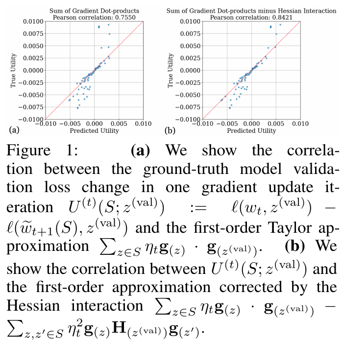

图源：正式论文Figure 1，PDF第6页；作者散点图与完整图注的区域裁剪。横轴是预测收益，纵轴是真实一步收益；每个点对应被检查的一个子集。左图只用梯度内积之和，右图加入Hessian交互修正；该设置在第3500步的相关系数由0.7550提高至0.8421。它支持“此处交互修正改善一步预测”，没有证明所有checkpoint、优化器或长轨迹mask都会有同样结果。短更新核验本身也是原文已经完成的部分，不能当成后续方案的新发明。

**大量梯度内积怎样算得动？** 直接为候选批中每条样本保存一个模型大小的参数梯度，费用可能超过节约的训练。GREATS使用ghost inner-product：保存反向传播本来就经过的层输入与层输出梯度，再从这些较小对象计算样本间的参数梯度内积，避免显式展开每个完整梯度。

例如一个线性层，对单个位置的输入向量$a_i$，层输出的loss梯度为$b_i$。该层参数梯度可以写成外积$a_ib_i^\top$。两条样本在这一层的参数梯度内积满足

$$
\langle a_ib_i^\top,a_jb_j^\top\rangle_F
=(a_i^\top a_j)(b_i^\top b_j).
$$

因此不用先造出两个大参数矩阵，就能得到内积。这里$\langle\cdot,\cdot\rangle_F$表示两个同形矩阵逐元素相乘后求和。对一整个序列，参数梯度是各位置外积之和，内积相应需要对双方位置对求和：

$$
\langle g_i^{\mathrm{layer}},g_j^{\mathrm{layer}}\rangle
=\sum_{u,v}(a_{iu}^\top a_{jv})(b_{iu}^\top b_{jv}).
$$

这也解释为什么长序列不能凭“ghost”一词就假定免费：朴素的跨位置比较可能涉及$T_iT_j$个位置对。Appendix A.1讨论根据序列长度与参数维数，选择构建位置相似矩阵还是参数梯度矩阵；A.2进一步给出LoRA的分解。具体内存优势依赖形状和实现。

为得到训练样本与验证目标的内积，作者把验证数据也放入这一轮计算。反传时保留样本索引、层输入和层输出梯度，选择完成后重聚合选中样本的参数梯度，避免再为所选子集做一次完整backward；验证数据用于评分，不应被误加进最终训练子集的梯度。[原文§4.3、Appendix A.3](https://proceedings.neurips.cc/paper_files/paper/2024/file/ed165f2ff227cf36c7e3ef88957dadd9-Paper-Conference.pdf)

这里有一条迁移到轨迹时必须保留的条件：上述复用利用的是**批内彼此独立的样本**。一条长轨迹里多个动作的loss却会共同影响早期历史层；一次合并backward得到的历史层输出梯度已经混合各动作贡献。不能只在最后几个动作Token上做mask，就声称分离了每动作的完整参数梯度。若要在共享轨迹中做动作级评分，需要另行证明分解，或使用loss向量的方向导数等办法验证计算正确。

**效果与费用分别怎样？** 作者在Llama-2-7B/MMLU、Mistral-7B/TyDiQA、Llama-3-8B/SAMSum及GPT-small/OpenWebText等设置中比较。每次选择候选批的50%做参数更新；regular training则更新完整候选批。因此“同训练步数”并非“同样本更新量”。验证示例数量很小，主设置不超过16；测试集另行评价。[原文§5.1、Table 1、Appendix B](https://proceedings.neurips.cc/paper_files/paper/2024/file/ed165f2ff227cf36c7e3ef88957dadd9-Paper-Conference.pdf)

Table 2中，所选9个MMLU科目的平均准确率为GREATS 54.2%、regular 50.4%；TyDiQA栏为55.0与54.3，按Appendix B应解释为1-shot macro-averaged F1，不能因表题泛称accuracy就把它改成准确率。这些实验支持所测目标上的效果，不是交互Agent的局部行为正确性或闭环恢复能力证据。

§5.3的GPT-small吞吐比较尤其说明实现的重要性：regular为76.2 examples/s，ghost版为71.3，直接逐样本梯度版只有4.2。ghost使额外选择成本降到接近常规训练，并没有使这张表中的每秒处理数高于regular。能否更早达到同一效果，应结合学习曲线与总墙钟时间判断；也不能把这个短模型/该批形状的结果外推成任意长轨迹的加速倍数。§6还指出，若显存不够同时放入验证样本，改用梯度累积会增加额外反传时间。

#### 启发探索

GREATS已经把一个相当完整的链条接起来：指定验证目标，按当前模型计算候选价值，根据已选样本修正边际价值，每步重新选择，并用实际一步更新检查代理。对本课题，它是“动态训练价值+批交互”的直接强近邻。新方案若只是将它换成动作名字、加一个去冗余项或画出短步校准模块，并没有据此获得新的机制。

它留下的一条明确边界是优化器。§6直接说明，ghost内积技术按SGD形式推导，不能直接推广到Adam的归一化；实验将SGD评分作为Adam训练的代理。Adam会对**整批聚合后的梯度**更新一二阶动量，再归一化，其结果通常不等于每个样本单独Adam方向的平均。因此，若方案使用过去二阶矩固定的预条件梯度，应把它称为近似评分，并用相同参数、相同Adam状态和相同目标数量的替换实验核验，不能声称已经精确计算真实Adam收益。

另一个边界是成本。GREATS原选择约束主要为固定样本数$k$；同样两条动作可能分别需要重复处理两份长历史，也可能共享同一条轨迹的大部分前缀。后续方案可以研究这种差异是否足以改变最佳选择，但必须让GREATS适配后的候选也使用相同共享前缀执行器，并完整记录候选评分、验证梯度、求解和训练费用。否则观察到的优势可能只是执行方式不同。

最后，验证loss下降仍只是目标代理。反复根据少量示例选数据，可能主要学会它们的格式或窄能力。GREATS在所测数据上观察到测试收益，不能排除新任务中的验证集过拟合。对成功/失败轨迹训练，至少还需把“哪些动作允许模仿”“哪些动作对当前模型有训练帮助”“模型在自己产生的新状态下是否完成任务”分开检验。这样才能把局部更新价值接到用户关心的真实Agent能力上。

### 5.8 ICA：Holdout-Loss-Based Data Selection for LLM Finetuning via In-Context Learning

正式身份：ICLR 2026；[官方记录](https://openreview.net/forum?id=Cw9Bxpda2h)。实际精读与裁图为作者[arXiv v2](https://arxiv.org/pdf/2510.14459v2)，2026-01-27，24页。OpenReview全文访问受限，未逐页比较正式版。读正文与附录A–D的方法、关键实验、消融和成本，未读取ICA代码；下文页码依实际阅读版。

#### 研究动机

假设我们有很多客服问答，但真正希望模型学会的是一小批经过修订的高质量回答。整批训练会同时学到答非所问、啰嗦和错误内容；只训练那一小批，又可能丢掉大数据中的知识和多样性。理想的选择标准是：加入某条训练样本后，模型在目标任务上的表现是否更好。论文用一份高质量或目标领域的指导集合表达目标，以其 loss 作为替代指标，称为 holdout loss。这里的 holdout 是选择的指导集合；论文主实验还把它纳入训练，不等于从未参与模型开发的最终测试集。[§4.1、App. B.1/C.5，pp.3–4、14、20–21；reported]

直接测量每个样本的价值，需要分别训练包含它的模型再评估指导集合，代价过大。ICA 的变化发生在评分环节：让同一个模型分别在“没有示范”和“前面放几条目标示范”的上下文中给候选答案算 loss，用两者之差判断该候选与目标模式的相合程度。它没有在评分时真正执行“学完候选后的模型更新”。[§4.2，pp.4–5；reported]

#### 设计方案

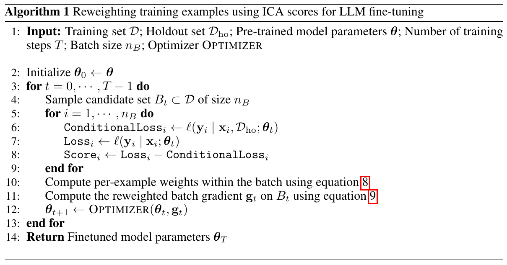

图 ICA-A：作者 Algorithm 1 原始算法框裁剪。该版本未提供方法流程图，唯一 Figure 1 是领域分数分布，故此处保留真实算法区域，不把分析图或自绘图冒充作者方法图。来源：ICA arXiv v2，实际 PDF 第 6 页；左上角为原点，裁剪框 `[104,69,507,280]` PDF points，页面 `612×792` points，216 dpi 渲染。原算法标题见图中。作者 Algorithm 2（p.17）增加了检索和缓存，才对应低开销实验实现。

图的起点是一条候选问答及指导集合；第 6、7 行在参数相同的模型上算两次候选 loss，第 8 行相减，第 10 行变成权重，第 11、12 行才进行参数更新。将候选放到模型输入中计算概率，不代表已经把它用于梯度训练。完整计算如下。[§4.2–4.3、App. B.4，Eq.7–9、Alg.1–2；reported]

1. 输入为训练集合 `D`、目标指导集合 `H`、待训练模型 `θ`。对候选 `(x_i,y_i)`，用嵌入模型比较候选与指导样本，取最近的 `k` 条作为示范 `C_i`。附录以 `f(x_i,y_i)` 写嵌入，因此不应未经实现核验就限定成“只检索指令”。默认 `k=3`，嵌入模型为 `all-mpnet-base-v2`。
2. 一次前向计算得到 `ℓ_i=-log p_θ(y_i|x_i)`；另一次把 `C_i` 格式化成前置问答示范，计算 `ℓ_i^C=-log p_θ(y_i|x_i,C_i)`。两次都对候选响应计算 loss，示范本身不进入这一候选的计分目标。SFT 时响应概率是每个响应 token 条件概率的乘积，负对数使其变成逐 token loss 之和。
3. 计算 `s_i=ℓ_i−ℓ_i^C`。高分表示目标示范让这条候选响应更容易被模型预测；它不是“候选在文本中看起来很重要”的评语，也不是模型实际训练一步后的验证集改变量。
4. 每个训练 batch 内做线性归一化：`w_i=(s_i−min_j s_j)/(max_j s_j−min_j s_j)`，范围为 `[0,1]`。然后使用 `g=Σ_i w_i∇_θℓ_i` 更新模型。这里权重作为给定系数使用，按 Eq.9 不对评分函数求导；把权重直接接入可微损失而不截断其梯度，会额外产生 `ℓ_i∇w_i`，改变原算法。
5. 工程版本每隔一段训练重新给全部样本评分，并在两次评分间缓存分数。默认 `R=1`，即只在初始化时评一次；只有 `R>1` 才会随训练模型更新分数。部署时使用微调后的模型，不再需要指导示范来给训练样本计分。

用同一个客服例子走通：三个候选回答 A、B、C 的普通 loss 分别为 `6、5、2`，加入目标示范后分别为 `3、4、2.5`。分数是 `3、1、−0.5`，同一 batch 的权重为 `1、3/7、0`。本次训练保留 A 的完整梯度，B 乘约 `0.429`，C 不贡献直接训练 loss。A 和 B 内部每个响应 token 继承各自样本的同一个权重；ICA 原方法没有识别 A 内哪一个步骤值得学。若换一个 batch，最小值、最大值可能变化，所以 B 的权重也可能变化。论文没有明确所有分数相等或 batch 只有一个候选时如何处理零分母；复现需要补上明确规则，并标为实现选择。[自拟例子；Eq.8–9 的 derived]

为什么作者将这个差值与“训练价值”联系起来？在理想的贝叶斯预测模型中，令 `z=(x,y)`，`D_t` 为已有训练数据。Bayes 公式在作者给定的条件独立假设下给出：

`L(H|D_t∪{z})=L(H|D_t)+ℓ(z|D_t∪H)−ℓ(z|D_t)`。

因此最小化加样本后的指导集 loss，等价于最大化 `ℓ(z|D_t)−ℓ(z|D_t∪H)`。但第二项仍需要在加入指导集后建立预测模型。ICA 再以“把指导样本放进上下文”的 loss 近似它，最终得到上述实际可算分数。第一层是贝叶斯预测关系，第二层是把神经网络训练与这种预测联系起来，第三层是用上下文示范替代训练；最后两层没有在本文中给出适用于真实优化器、多步更新和任意轨迹的误差界。正文 Eq.3 将候选无关的 `L(H|D_t)` 写成了负号，与其 App.A 的 Bayes 展开不一致；改正这个常数不改变后续候选分数排序。[App.A p.14；恒等式为 derived，近似为 reported，其适用边界为 inference]

论文还把样本权重用于偏好训练：输入是同一问题下的较优响应 `y_w` 和较差响应 `y_l`，loss 衡量模型是否偏向前者，再用普通与示范条件下的这种 loss 之差评分。需要校正作者版 §3 的公式排印：DPO 的 sigmoid 内应为 `β log[π_θ(y_w|x)/π_ref(y_w|x)]−β log[π_θ(y_l|x)/π_ref(y_l|x)]`；SimPO 内应为 `β/|y_w|·log π_θ(y_w|x)−β/|y_l|·log π_θ(y_l|x)−γ`。实际 PDF 把这些内部 `log` 漏掉了；不能照抄成概率差。此校正依据 [DPO 原论文 §4 Eq.7](https://arxiv.org/html/2305.18290v3#S4)及 [SimPO 原论文 §2/Table 3](https://arxiv.org/html/2405.14734v2)。ICA 所说不需要参考模型，指无需额外训练用于数据评分的参考模型；不等于 DPO 自身不再需要 `π_ref`。本次未读取 ICA 代码，不能由这处论文排印问题判断作者实验是否也实现错误。

实验中最清楚的任务价值证据来自 GSM8K：从训练集留出 1,000 条高质量问答作指导，再对其余训练样本中的 40% 扰乱推理过程；原测试集以 zero-shot CoT 的 Pass@1 正确率评估。LLaMA-3-8B 的原始干净训练、损坏训练、ICA 加权损坏训练分别为 `81.91%、52.75%、79.95%`；Qwen-3-8B 分别为 `83.27%、62.40%、83.04%`。这说明在该特定造噪条件下，样本评分能恢复很多被噪声损失的性能；不能推出已经能定位工具轨迹里的某个错误动作。[App.B.1/C.4、Table 15，pp.14、20；reported]

主要 SFT/偏好实验测的是 GPT-4o 判断“生成答案更接近测试参考答案”的胜率，提示词明确考虑内容、长度与风格，并不等于一般回答质量或事实正确率。Yahoo SFT 中 LLaMA-3-8B 的 ICA 对普通训练、RHO-Loss、One-Shot 的单次胜率分别为 `85.10%、54.03%、66.93%`；三随机种子训练对应 `82.86±1.96%、49.92±0.39%、62.59±0.57%`，因此“稳定压过 RHO-Loss”超出证据。主结果多为单次训练评估，随机种子补测局限于 Yahoo 的两个 8B 模型。[§5.1、Table 1、App.B.2 Table 5、App.D.1 Table 19；reported]

效率与消融也须同条件理解。`k=3,R=1` 在 LLaMA-3B、Yahoo、4×A6000 48GB 的一次全参数微调中，表 11 报告嵌入预处理约 2 秒、评分 800 秒，额外总时长约普通微调的 `1.5%`；不是任何模型、轨迹长度或刷新频率的固定成本。相同设置把 `R` 提到 3、5、9，相对默认的胜率为 `50.73%、52.77%、51.60%`，收益有限但评分次数增加。按分数硬留最高四分之一样本相对软加权胜率为 `48.67%`，留一半和一成分别为 `40.80%、40.07%`。这些消融支持默认场景中的轻量评分与软权重取舍，不构成对所有任务的最优参数证明。[§5.3/5.5、Tables 8–11，pp.8–9、18–19；reported]

#### 启发探索

ICA 提供了一个值得比较的廉价候选：通过目标示范引起的条件 loss 差，估计样本与目标任务的相合程度。它最适合作为“无需辅助模型训练的目标匹配评分”基线，而不能被当成已验证的优化器更新价值。将它移到一条完整执行轨迹内部时，可把示范条件下的 loss 差分解到动作片段，保持原始历史不变再排序；这是新的 `proposal`，原论文没有验证语义片段、工具返回、长程依赖或片段交互。

本课题若采用该扩展，决定性问题是：高分片段在真正加入训练后，是否比同长度随机片段、高 loss 片段和纯嵌入相似片段带来更大的独立任务收益。尤其要把“文本风格更像指导集”与“执行更成功”分开。完整执行轨迹仍可作为输入；选择的是哪些模型输出片段承担训练 loss。ICA 不提供删除历史观察的依据，也不要求把课题转成历史 token 的反向传播机制研究。[inference/proposal]

## 六、监督目标、反向传播与前缀共享的计算成本

前几章讨论“哪些内容值得学”。现在把问题推进一步：**模型仍然读完整条轨迹，但训练时只保存其中一部分计算过程，能否少用显存？又会损失什么？** 这与删除输入、少算几个训练目标不是一回事。

先分开四个对象。输入是模型读到的文本；直接监督目标是要求它学会输出的内容；激活是计算过程中临时产生的数字；参数是不同样本、不同位置共同使用的长期数字。前向计算用参数和输入得到预测，反向传播再根据预测误差计算参数应怎样调整。反向传播通常需要重用一些前向激活，所以训练比只生成答案需要更多显存。以下两篇真正改变了其中一部分反向计算路径，而不是仅把一些错误输出的损失设为零。

### 6.1 Memory-Efficient Fine-Tuning of Transformers via Token Selection（TokenTune）

[EMNLP 2024正式论文](https://aclanthology.org/2024.emnlp-main.1202/)；[全文](https://aclanthology.org/2024.emnlp-main.1202.pdf)。实际核验§1–5、§7、附录A–G及官方Llama数据整理、注意力、损失和prompt处理代码；未复现实验。正式发表于2024年，不能因arXiv上传较晚记为2025年。

#### 研究动机

想训练一个模型：看到“刚才打开的是红色商品，用户要米色”，应该返回并重新搜索。模型必须读到错误和需求，但不必学习生成每一句页面文本。把页面文本排除出直接监督，是否就大幅节省显存？**不一定。** 正确恢复动作仍然利用前文；反向传播可能经过前文的中间表示，因此仍要保存这些计算所需的激活。

这里再区分两种常用节省方法。LoRA不调整全部原始参数，只训练附加的小型参数组；量化用较少存储位保存权重。它们主要缩小“长期参数及其更新记录”，不自动消除“这一次读长文本产生的临时计算记录”。TokenTune针对后者：所有输入都参与前向计算，但只为随机选中的部分位置保留某些反向路径。（原文§1–3。）

为理解“保存计算记录”，可看一个自拟的单数字例子：一个中间计算是$y=w x$。若后续误差告诉我们“$y$每增加一点，损失会增加多少”，计算“$w$每增加一点，损失会增加多少”还需要知道当时的$x$。真实模型把这种计算重复许多层和许多位置，待保存的$x$及其他中间量就会占用显存。TokenTune不是让那些位置消失，而是不再沿被排除的位置计算这一类更新贡献。

#### 设计方案

**用一条序列走通，而不是先从矩阵开始。** 下例是教学简化，把整段含义看成一个位置；真实分词会把一句话拆成多个Token：

| 顺序位置 | 输入内容 | 在任务中的作用 |
|---|---|---|
| 0 | 开始标记 | 序列起点 |
| 1 | 用户要米色刷子 | 任务条件 |
| 2 | 当前页面是红色刷子 | 观察与错误背景 |
| 3 | 返回搜索页 | 应学会的恢复动作 |
| 4 | 搜索米色刷子 | 后续正确动作 |

普通训练先读完整序列，为指定动作计算损失，再沿需要的计算路径反向传播。TokenTune也读完整序列，但随机选出位置集合$G$，例如保留0、2、3、4；其余位置仍产生前向数值，却在相关算子中关闭梯度记录。选择通常在数据进入训练批次时重采样，不是永久指定“米色”这个词永远不训练。论文分类任务和语言生成任务的目标有所不同，以下先解释共同的计算机制。

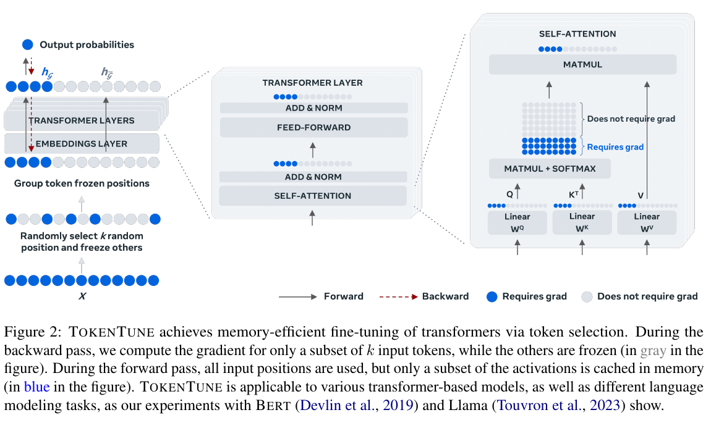

图源：正式PDF Figure 2，PDF第3页／印刷21567页，保留作者图注。图的内容按ACL Anthology的CC BY 4.0要求署名；作者代码主要采用CC BY-NC，不能把两种许可混同。

从图左下向上读。最下方$X$是一整条输入；上一行随机涂成蓝色的圆点是被选位置，灰色是未选位置。再上一行把两组位置放在一起，方便分别执行计算；**原始位置信息仍需保留**，这不是把句子内容任意打乱。灰色实线表示前向计算，红色虚线表示反向计算。中间展开一层：注意力先让各位置读取前文信息，再经过逐位置的前馈计算和归一化。右边进一步展开注意力：蓝色查询仍读取蓝、灰两组提供的信息；灰色不等于看不见。

“注意力”可先理解为加权取资料：当前位置提出一个查询$Q$，之前位置各提供用于匹配的标识$K$和被读取的内容$V$。匹配分数转成和为1的权重，再把内容加权相加。自拟例子中，预测“返回”时可以给“当前是红色”0.7的权重，给“用户要米色”0.3的权重；若两处简化内容数字分别是2和5，读取结果就是$0.7\times2+0.3\times5=2.9$。这只是说明加权计算，不声称真实模型只有两个数字或真实权重如此。

关键在于：即使“用户要米色”所在位置未被选中，它的数值5仍可影响2.9；但在对应$K,V$生成路径关闭梯度后，训练不再沿那条路径追问“生成这个5的参数怎样调整”。选中位置的查询、其他未截断路径仍可更新。因此保留输入与保留其全部学习路径是两种不同干预。

原文§3、式6–11把这个过程写为选中查询的注意力计算：

$$
h'_G=\operatorname{softmax}\!\left(\frac{Q_G[K_{\bar G},K_G]^\top}{\sqrt d}+M_G\right)[V_{\bar G},V_G].
$$

$G$是选中位置，$\bar G$是其余位置；方括号表示把两组资料接在一起。$d$是每个查询所用数字的数量，$\sqrt d$用于控制匹配分数尺度。上标$\top$是将资料排列转向，以便每个查询与每个标识匹配；`softmax`把匹配分数变成权重。$M_G$是因果遮罩：预测后面的词时不能偷看尚未发生的内容。$h'_G$是选中位置读取所有允许资料后的新表示。**式子的前向数值仍使用完整$K,V$，节省发生在反向记录，而不是输入长度。** 未选位置的线性变换、归一化和注意力等操作在`torch.no_grad()`中执行，逐位置的密集层就不必缓存它们的输入激活。只在整层末尾截断输出，不等于作者的逐算子实现。

训练目标还需另外说明。语言模型逐个预测下一个Token；原文式2用选中目标集合写为：

$$
L_{\mathrm{LM}}=-\sum_{i\in G}\log p(x_i\mid x_{<i}).
$$

$x_i$是第$i$个正确Token，$x_{<i}$是它之前的内容，$p$是模型给予正确Token的概率。比如概率从0.2升到0.8，该项损失从约1.61降到0.22；未计入目标的项不直接贡献这一笔损失。这里要警惕记号与代码位置的差别：**标签在$t$位置，预测它的输出通常来自$t-1$位置。** 上例标签“返回”在3，所用预测来自2。不能简单把“保留正确动作标签”实现成“只让动作文字自身的位置反传”；首个动作词的预测位置可能属于观察末尾。原文的紧凑公式不应代替实现中的标签移位检查。

官方代码还提供一个影响本课题定位的事实：`prompter.py`已把prompt标签设为−100，表示这些词不直接承担语言生成损失。它们仍可能被选入保留反向路径的位置。也就是说，**TokenTune已经允许“没有直接损失的输入位置参与学习”**；不能将这点重新包装成首次发现。原始语言模型方案的目标选择与反向位置选择又是相互关联的，不能直接当作“所有动作目标固定、只改变上下文路径”的实验。分类任务则对选中末层表示取平均，交给分类头；评测时改用所有位置的均值，不能把它与语言生成目标混写。

**实现核验的三个细节。** [官方Llama实现](https://github.com/facebookresearch/tokentune/blob/main/tokentune/llama_tokentune.py)的数据整理器在每个批次无放回重采样，强制首末位置入选，保存原始position IDs，并按下一个Token的关系重排标签。此前本调研对该代码做的CPU变长批次检查发现：填充标签使用0，而损失函数只忽略−100；当多个不同长度样本组批时，可能把填充也当成目标。论文使用microbatch=1，这个反例不直接推翻论文实验，但批量适配应将填充统一设为−100并核对移位。其次，论文Algorithm 1先写选中查询的注意力，后写未选组$K,V$的生成，是简写排版；实际程序必须先算出两组所需资料。最后，[训练代码](https://github.com/facebookresearch/tokentune/blob/main/tokentune/finetune.py)明确关闭k-bit准备的gradient checkpointing。后者是“不保存全部中间量，反向时重新计算”的另一条节省途径；公平工程比较应给它同样机会，而不是只比较作者默认配置。

**实验一：少保留路径，任务表现还能否接近？** BERT-large的GLUE测试集合包含文本分类、句间匹配和相似度等任务；表1的平均数混合了相应标准指标，不是统一的“正确率”。完整微调为82.8，TokenTune为82.1，支持在这些任务上存在较温和的表现—内存权衡，不证明严格无损。表内部分比较数值来自既有论文，并非全部同次运行。BERT-base的MRPC/STS-B给出5次运行均值及标准差；附录表7说明选32个位置平均已覆盖81.4%的Token，所以这里的“32”并不代表极小比例。

**实验二：能否和参数节省方法叠加？** Llama-2-7B在21,221条Open-Platypus指令上训练1轮，排除两个GPT来源子集；每次实际放入1条样本、累积32次梯度后更新。LoRA/QLoRA学习率为$4\times10^{-4}$，其他设置为$4\times10^{-5}$。表2在30%选择率下，LoRA平均分62.20，对应TokenTune组合62.08；QLoRA为62.55，组合为61.95。测的是若干问答选择题的平均表现，其中MMLU仅五个ethics子任务，不是完整MMLU。表中未给训练随机种子不确定性，不能把零点几的差异宣布为统计等效。

**实验三：究竟节省多少、付出什么？** 表3的QLoRA组合在10%位置选择时为61.02分、11.47 GiB；30%时为61.95分、19.71 GiB。GiB是显存容量单位，分数与内存同时报告才能看出交换关系。另一个人工序列实验固定长度2048、batch=1：12.5%位置选择时，QLoRA为51.9 GiB，组合为11.7 GiB。它与前一实验的序列分布和测量协议不同，不能跨表相除制造统一压缩比；表4全参数训练91.4 GiB是硬件装不下后的估算，不是实测。论文缺少足够计时或FLOPs证据，故结论是降低显存需求，**不是已证明训练更快**。（表2–4、图4。）

#### 启发探索

TokenTune真正改变的是“哪些位置的计算贡献进入梯度”，而不是“模型是否知道那段文本”。它对本课题构成强挑战：模型可能早就会表示“米色”和“红色”，只训练后续动作的共享参数就足以学会读取差异；未必必须训练所有上下文路径。

共享参数是各位置共用的一套规则。某位置本轮被`no_grad`排除，不意味着它的知识永久冻结：其他位置产生的更新也会改变下轮所有位置的计算。进一步说，多层路径随机截断会改变后续反向信号；把选中损失再乘以选择概率的倒数，也不自动恢复完整梯度的无偏估计。这不是“完全相同的训练，只是更省内存”，而是一种需要验证效果的梯度近似。

因此，后续至少要分开比较：原始随机TokenTune；保留全部正确动作监督、只随机选择额外上下文路径的适配版；普通动作损失加完整反向传播。若只击败原始版，可能只是少丢了正确动作目标，尚不能说明找到了更有学习价值的上下文。这些是本调研提出的实验要求，不是作者已验证的交互恢复结论。

### 6.2 TokenSeek: Memory Efficient Fine Tuning via Instance-Aware Token Ditching

[ICLR 2026官方目录](https://iclr.cc/Downloads/2026)收录该工作；官方OpenReview全文遭遇访问验证，实际阅读[作者arXiv v1](https://arxiv.org/pdf/2601.19739v1)，首页标有ICLR 2026。核验§1–4、S1–S3、S7.1相关部分及官方评分代码；发表身份与实际阅读版本分开记录，未复现实验。

#### 研究动机

接着上一节，假设只能为10%的位置保留反向路径。TokenTune随机抽取：有时抽中“用户要米色”，有时抽中无关页面描述。TokenSeek希望在同样位置预算内，**按每条样本的具体内容选位置，而不是仅靠随机数**。

它需要一种便宜的线索，预测哪些位置值得保留。作者提出两种：别的位置经常读取这里的信息吗？当前训练误差对这里的中间数值敏感吗？前者来自注意力，后者来自激活梯度。两者都只是代理信号，不能先验当成“语义重要性”或“长期训练价值”的真值。这篇研究内存高效微调，不直接验证环境动作是否正确，也不估计某动作完成任务的概率。

#### 设计方案

**完整过程分成训练前评分和实际微调。** 继续用“需求米色—页面红色—返回—重新搜索”的教学序列。第一步，待微调模型对整条样本做一次前向计算，记录最后一层注意力，得到每个位置被其他位置读取的总程度。第二步，通过有限的反向计算取得接近输出层的激活梯度。第三步，把两种分数变换到适合比较的范围，按分数排序，选择预算允许的位置。第四步，正式微调时复用这份位置清单，执行TokenTune式完整前向和部分反向。它不是每次参数更新后重新评分；因此分数代表评分时模型的状态，训练后期是否仍合适需要另行验证。（§3.2、S2。）

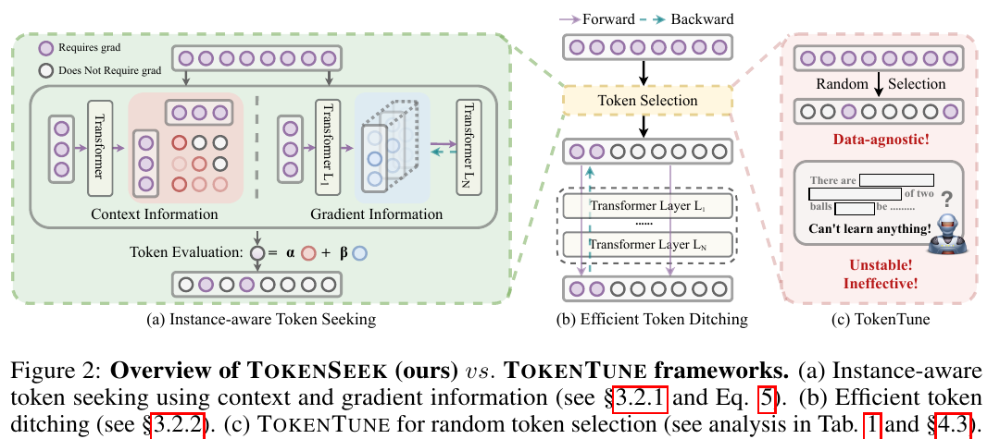

图源：实际阅读arXiv v1，Figure 2，PDF第4页。左侧绿色框是评分：红色关联表示从注意力取得的context信息，蓝色关联表示从梯度取得的信息，两者在底部合并。中间黄色框把分数变成位置选择，紫色边框圆点保留梯度，灰色圆点不保留；前向箭头仍穿过整组Token。右侧粉色框画随机抽取作为对照。图中对随机法的“无效、不稳定”是作者的动机性示意，不能代替所有任务下的实验证明，也不能读成随机法删掉了未选输入。

**先算“收到多少关注”。** 令$A_{ij}$表示位置$i$读取位置$j$时的注意力权重；每行加起来为1，未来位置会被因果遮罩排除。作者把最后一层中落到同一位置$j$的权重相加：

$$
I_1(j)=\sum_i A_{ij}.
$$

若两个允许读取“页面是红色”的位置分别分给它0.4和0.3，总贡献为0.7；再加其他位置的贡献就是该位置的$ I_1$。这与问“这个词的预测概率是多少”完全不同。靠前位置可被更多后续位置读取，因果顺序会产生位置偏好；高分不自动证明包含更多有用事实。（式3、图4。）

**再算“误差对中间数值怎样变化”。** 一个位置的内部表示不是一个数字，而是一串数字，长度记为$d$。记$g_{jk}$为“位置$j$第$k$个表示数字增加一点，损失怎样变化”的导数。作者式4及所取官方代码实际聚合为：

$$
I_2(j)=\sum_{k=1}^{d}g_{jk}.
$$

这里保留正负号。教学例子：某位置的两个导数是$[3,-3]$，求和是0，虽然两个方向的敏感性都很大；另一个位置是$[1,1]$，求和为2。若改成绝对值之和，它们是6和2；若改成欧氏长度，则约为4.24和1.41，排序都会不同。**原文文字称gradient magnitude，但式4与[backgradient.py](https://github.com/runtsang/TokenSeek/blob/master/tokenseek/backgradient.py)的`sum(dim=-1)`并没有计算绝对值或长度。** 复用时不能默默换成范数后仍宣称忠实实现。

**怎样合成并用到训练？** 论文式5为：

$$
I(j)=\alpha\log I_1(j)+\beta\operatorname{Norm}(I_2(j)).
$$

$\alpha,\beta$是两种信号的权重；`Norm`在这里指把本样本分数按最小值和最大值缩放，不是上段的向量长度。假设梯度和为$[-2,0,2]$，缩放后得到$[0,0.5,1]$；如果三者都相同，代码返回全0。注意力分数采用对数式压缩，使特别大的值不独占排序。然后挑出得分最高的若干位置，而不是直接拿分数作为奖励训练Agent。

论文写法和代码还存在需要锁定的差异。[combine_score.py](https://github.com/runtsang/TokenSeek/blob/master/tokenseek/combine_score.py)对注意力列和做`sign(x)·log1p(abs(x))`，对有符号梯度和做min-max，再用一个系数的互补权重混合。注意力非负，前一变换等于$\log(1+x)$；**不是给梯度先取绝对值，也不是给梯度做sign-log变换**。代码中的单系数不能不经换算就当作论文两个权重。论文称评分局部反向只开放最后block/head，当前`backgradient.py`的配置却开放最后两个layer；这些差异尚未用端到端复现解决。

选好位置后，未选位置依然生成供后文读取的key/value，只是在相关操作中关闭梯度记录。若“页面红色”未被选，模型本轮仍可据此预测“返回”；区别在于哪些生成和使用表示的路径能把该错误信号传回参数。部署时不需要离线筛选器替模型决定动作；筛选服务于训练内存管理。

**实验一：内容感知选择是否优于同预算随机选择？** 表1在Llama3.2-1B上，QLoRA微调的问答平均分52.13，叠加TokenSeek为52.61，叠加随机TokenTune为49.22。二者只保留10%位置计算梯度，因而随机对照检验的是“选哪些位置”而非仅“多训练多少”。但0.5B与1B的最优配置为$[\alpha,\beta]=[1,0]$，即只用attention；3B才用[5,5]。因此不能用1B结果证明两信号融合必不可少。Qwen0.5B的全参数设置从48.43退到41.94，又说明稀疏方案并非所有起点都保住能力。（表1、2，S1.4。）

**实验二：显存改善的分母是什么？** 上述1B组合平均显存为全参数、全Token基线的14.8%；QLoRA自身为该基线的45.6%。这里不是“相对于QLoRA只剩14.8%”，相对QLoRA约是$14.8/45.6\approx32.5\%$。必须先明确共同参照再解释资源收益。作者未使用checkpointing、ZeRO或offload等其他内存策略，故实际部署还要与这些可用配置比较。（S1.4、S1.6。）

**实验三：内存少了，会更快吗？** 附录S1.6计时相反：训练时长普遍增加约11–15%；Llama1B全参数为0.35→0.39 GPU小时，QLoRA为0.55→0.63。选择、重排和不同计算方式有开销，保留所有输入又没有消除全部前向计算。这个结果支持“用时间换内存”的可行性，不支持wall-time加速。离线评分也必须进入端到端预算，不能只报告正式微调阶段。

证据范围同样重要：主实验是在Open-Platypus上训练1轮的0.5–3B模型，以few-shot选择题评测；MMLU仍只是五个ethics子任务，S3的7B实验有限。S1.5的标准误来自评测工具，并非多次随机训练的方差。没有据此证明交互式长轨迹、错误恢复或需要远程历史的任务也能保住能力。

#### 启发探索

这篇把随机选择改成每样本评分，是真实直接近邻。对本课题最有用的不是照搬“重要Token”名称，而是它提供的可控干预：在保持前向文本不变时改变反向路径。

如果相同动作监督下，完整反传能学会使用早期报错，而部分反传不能，那么被截断的路径可能承担新条件表示的学习；如果没有差异，则已有表示可能足够。两种结果都需要实验，不能由注意力热图直接判断。实验还必须报告同一正确动作目标是否保留、预测位置是否正确对齐、打分成本多少，以及降低的是显存、耗时还是总运算，不能把它们合称为“训练效率提高”。

### 6.3 Tree Training：同一前缀只存一份，但必须保持原来的损失和梯度

来源：[Tree Training: Accelerating Agentic LLMs Training via Shared Prefix Reuse](https://arxiv.org/abs/2511.00413v5)，实际读取2026-04-23的arXiv v5；正式发表身份本轮未核实。精读§3.1–3.4、§4及附录A、B，未复现其分布式训练。以下区分原文结果与本课题推断。

#### 研究动机

Agent执行时可能从同一历史尝试多个后续动作，工具也可能并行运行。把各条最终路径分别作为训练样本，会重复计算相同的前缀。例如三条记录都是“收到任务—查柜子—看到杯子”，之后才分叉；独立跑三次，就把此前相同历史的前后向做了三遍。

推理时可以缓存历史键值向量，但训练会更新参数，而且后续分支的损失都要把梯度传回共同前缀。只复用一个不参与求导的推理缓存，并不等价于原训练。Tree Training试图在减少重复计算的同时，保持原有目标及参数梯度。

#### 设计方案

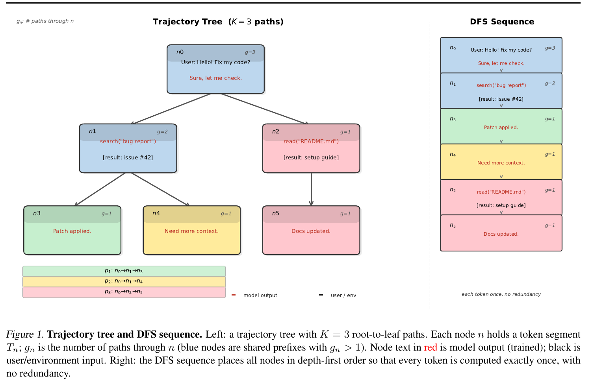

图源：原文Figure 1，PDF第2页，仅截取原图与图注。左图将相同前缀压成树，右图按深度优先顺序只排列一次各结点。相邻的序列化结点不一定在同一真实执行路径中，所以右图不能直接套普通的全序列因果注意力。

先把所有路径建成前缀树；每个结点是一段连续Token，相同前缀只占一个结点。树按深度优先顺序序列化后，注意力必须只允许当前位置读取自己的祖先和本结点较早位置，不能读取刚好排在前面的兄弟分支。位置编码也取真实路径深度，而非序列化后的全局索引。含状态空间层或因果卷积的混合模型，还需从父结点恢复对应状态，而不是承接上一兄弟结点的状态。`reported：§3及附录B`

更容易忽略的是损失权重。设原来有 $K$ 条路径，对各路径Token损失求和后再平均；某个共享Token在 $g_t$ 条路径里出现。独立路径训练中它被计算了 $g_t$ 次，合并后仍应给予 $g_t/K$ 的权重：

$$
L_{\rm paths}=\frac1K\sum_{k=1}^K\sum_{t\in\tau_k}\ell_t
=\sum_{t\in\mathrm{tree}}\frac{g_t}{K}\ell_t.
$$

上式以相同Token预测和该种路径归一化为前提。若原损失还带优势权重，应累加路径上的实际权重，不能只按出现次数。也不能把两种不同长度归一化擅自当成同一目标。`reported/derived`

教学上，三条路径有共同前缀 $P$，后缀分别为 $U,V,W$。原损失是 $(3L_P+L_U+L_V+L_W)/3$；合并后 $P$ 只算一次，但它的系数为1，三个后缀各为1/3。若去重后把四块都平均成1/4，就同时改变了数据权重，不能再称为等价加速。

大树放不进显存时，作者在结点边界分片。共同前缀产生的键值或混合层状态作为后续分片的入口；子分片反传得到入口梯度后，要累计并接回父图。论文实现会用detach形成可单独求导的入口，但随后**明确回传入口梯度**。只学到“detach缓存”而漏掉这一步，会把算法改成截断梯度训练。附录B.6的实现也表明，分片边界可能引入父图反传遍历，不能把“唯一Token数”直接当成任何后端实际运算次数的严格公式。

实验使用SWEsmith上的Claude Code轨迹，以及Megatron下的稠密和MoE模型；Figure 7在论文配置中报告平均约6.3倍、6.2倍的训练执行加速。Figure 8的合成案例更高，但不能与真实数据结果混为一谈。前缀重叠比例 $1-N_{\rm tree}/N_{\rm flat}$ 描述可复用冗余，不等于墙钟提升比例：注意力、分片、通信和内核效率都会影响结果。`reported：§4`

论文还比较完整树和只取最长路径，Terminal-Bench 2的avg@4分别为28.8和20.9。这个比较改变了训练内容，不能据此证明“相同数据仅换树执行就提升模型能力”。附录B.8给出小模型数值梯度等价检验，而非所有大规模、混合精度、随机配置的数学保证；本轮没有重新运行这些验证。

#### 启发探索

这篇工作直接否定一个容易误判的新颖性主张：“把同一轨迹的历史共用起来训练”并不新。本文方案若只把选好的局部动作合并执行，它首先是在利用已有训练系统思想。

真正待检验的差别在于**选之前的成本建模**：当一些目标共同出现时只需支付一次前缀费用，原来独立打分选出的集合是否仍是资源内最好的一组？Tree Training主要保留既定路径集合与目标，本文候选则改变哪些局部目标进入训练。为避免借旧系统优势取得虚假的方法优势，GTP/GREATS等强选择器也必须获得同样的共享执行。

首版不需要复制整套树系统：同一条线性历史中的多个动作，可以在一份普通因果序列上打开多个loss区间。只有真正引入分支共享时，才需要树注意力、位置编码和跨分片梯度累积。先验证最小实现，可以把选择机制与复杂系统实现的风险分开。`proposal`

### 6.4 psRL：让前缀复用在真实批处理、缓存和分布式训练中兑现

来源：[psRL: Efficient Training for Agentic AI via Training-Time Prefix Sharing](https://arxiv.org/abs/2608.25683)，实际读取arXiv v1（2026-08-26），§1–9，重点§4–7；正式发表身份本轮未核实，未复现作者实现。它是训练系统近邻，不是局部动作学习价值方法。

#### 研究动机

多轮交互通常把“到第1轮的前缀”“到第2轮的前缀”等分别送入训练。这些序列很长，却有大量相同前缀。即使允许缓存，如果相同前缀分散到不同设备、分支长度差异大、缓存过早驱逐，也难获得预期速度。psRL同时处理复用、分组、微批和梯度保持，说明节省Token冗余并不是单独一个mask就能实现的系统结果。

#### 设计方案

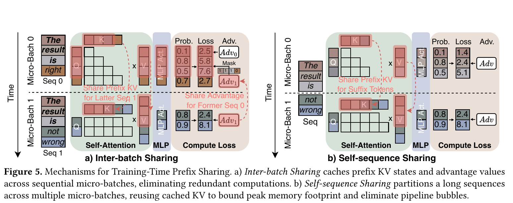

图源：Figure 5，PDF第6页，截取原图与图注。左侧展示不同微批对历史键值的复用，右侧展示长序列的分段。图中注意力与优势掩码仍按原训练目标对齐，不能因为缓存可用就让当前动作读取未来。

该方法先将有共同轨迹来源的样本分组，尽量让共享前缀位于同一工作设备；这里的“语义分组”不是说两段含义相似的文本可以共用键值缓存。精确复用仍要求实际前缀及相关模型计算一致。对于后缀长度 $l_{\rm suffix}$、总长度 $l$，作者拟合形如

$$
T(s)=\alpha_1 l_{\rm suffix}l+\alpha_2l_{\rm suffix}+\alpha_3
$$

的执行成本模型，分别反映后缀对历史的注意力、后缀其他计算和固定开销。系数由测量得到，不是与模型设备无关的常数。按组费用排序，将组分给当前较空闲设备，再组织Token级微批，兼顾前缀局部性与负载均衡。`reported：§4`

缓存按块组织，块大小依可复用前缀调节；已知后续批将如何使用缓存时，可以按剩余引用次数管理生命周期，内存不足时优先驱逐较晚再用的块。复用既包括不同微批之间，也包括长序列自身分片。关键是同一次模型更新内保持参数一致，不能把上次参数算出的键值直接当成下次参数下的新计算。

训练反传也必须保留。设前缀中间量 $z=f_\theta(P)$ 被两个后缀损失读取，总损失为 $L_1(z,\theta)+L_2(z,\theta)$。传回前缀的梯度为

$$
\frac{\partial L}{\partial z}
=\frac{\partial L_1}{\partial z}+\frac{\partial L_2}{\partial z}.
$$

psRL §6累积消费者传来的梯度，再经前缀生产者计算图回传；这与把 $z$ 当常量的推理缓存有本质区别。若一个后缀对前缀的梯度为2、另一个为−1，前缀收到的是1，而不是只取最后一个后缀的−1。这个教学标量例子只解释累积，真实键值是多维张量。

Table 1中，WebShop与ALFWorld的Step训练序列具有90.22%和94.51%的前缀匹配比例；换成Step-Summary后为21.79%和42.63%。这说明数据表示方式本身会改变系统优化空间，不能把一个任务的高重叠比例普遍套用到所有轨迹训练。

§7.2报告相对veRL最高5.2倍吞吐改进；工业Step配置中，psRL为239.1千Token/秒，较强SGLang-PS对照为62.7千，约3.8倍。该口径针对更新阶段及相关旧策略/参考计算，不是从生成数据到任务评测的全流程收益，也没有据此建立更高的Agent成功率。主要学术实验用8张A100，另有更大工业配置；不能把这些结果当成本课题一张显卡上已获得的速度。`reported`

消融进一步显示，缓存与调度必须一起看：去掉动态块等设计会显著增加内存，占用下降不等于所有内核同时更快。长度扩展实验还通过插入占位Token构造合成长度，因此测的是系统承载与吞吐，不是模型在真实更长推理任务上的泛化。

#### 启发探索

psRL给本课题两个硬约束。第一，成本函数要经过实际后端profile，不能简单把动作Token数、序列长度或重复率换算成GPU时间。第二，相同前缀共享若改变梯度或优化器更新边界，就不再是“同一训练目标的公平加速”。

它没有自动判定哪段失败经验值得学，而是在给定训练序列、损失和批结构下高效执行。候选研究应在同样执行能力之上检验目标选择，而不是把系统执行和学习收益混为一个指标。对资源较小的首版，线性轨迹微批与固定归一化更容易验证；复杂分支缓存应作为后续替代后端，独立证明等价和成本。`inference/proposal`

## 七、如何判断模型学会按条件决策

一个模型把训练答案复述得更像，并不等于遇到新情况会作决定。本章把“学会决策”拆成可观测问题：规则改变后能否跟着改变；给定现场能否分辨两个动作；信息足够时能否停止；同一回答在不同目标下能否重新排序。它们提供不同层面的证据，不能相互冒充。尤其“在静态数据上选对下一步”和“自己连续执行直到完成任务”有明显距离。

### 7.1 SFT Memorizes, RL Generalizes：成立条件比标题更重要

[ICML 2025正式论文](https://proceedings.mlr.press/v267/chu25c.html)。实际核验§3–6、与训练数据及预算有关的Appendix C.1–C.3，以及失败分析D.3；未复现训练。

#### 研究动机

考虑训练时规定J、Q、K都算10，测试时在题目中明确规定它们分别算11、12、13。模型若继续把J算成10，就可能只记住常见做法，没有依据当前规则决定。这里的“泛化”不是文风不同，而是**旧答案规则不再适用，需要使用新的条件**。

作者比较两条训练路径。监督微调（SFT）让模型模仿给定的正确答案；强化学习（RL）让模型自己尝试，验证器给出结果与反馈，再据此更新。两者从共同的已初始化模型继续训练，比较同规则测试和换规则测试。前者称同分布（ID），后者称分布外（OOD）；还可改变视觉外观或地点，检查迁移。需要先记住：这是一组受具体模型、任务和训练流程约束的比较，不是标题所暗示的普遍定理。

#### 设计方案

作者使用Llama-3.2-Vision-11B，并区分纯文字与视觉语言版本。GeneralPoints要求把四张牌的数值各使用一次，构造结果为24的算式。V-IRL则让模型依据文字或真实街景观察导航；不仅有算术任务，也有交互导航。（§3–4。）

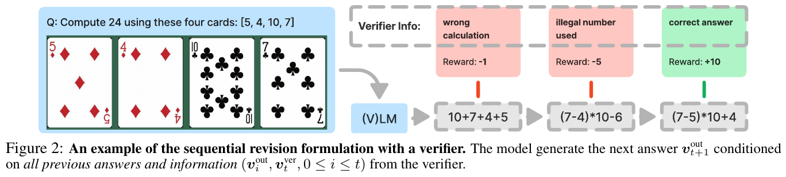

图源：原论文Figure 2，PDF第4页。沿图左到右读一条**作者原图中的实例**：四张牌是5、4、10、7。第一次输出$10+7+4+5$，值为26而非24，验证器给“计算错误”和−1。第二次输出$(7-4)\times10-6$，虽等于24，却擅自用了牌中没有的6，给“非法数字”和−5。第三次输出$(7-5)\times10+4=24$，数值和用牌都正确，给+10。下一次输入包含此前答案与对应文字反馈，所以“知道自己错在哪里”是后续作答的实际条件，而不只是一个最终总分。

训练时谁做什么，可以按四步理解。模型读题并生成完整回答；规则验证器检查使用的数和计算结果，返回奖励与错误描述；系统把回答与反馈追加到历史，直到正确或达到尝试上限；PPO根据收集到的尝试更新模型，使相对有利的行为更可能出现，并限制单次策略变化。部署评测时模型仍可以在规定的验证轮数内修正，但不在每道测试题后重新更新参数。不能把训练时参数学习和测试时“看反馈重新回答”混成一件事。

原文§3的总体目标是：

$$
\max_\pi\;\mathbb E_\pi\left[\sum_{t=0}^{T}r_t\right].
$$

$\pi$表示给定当前历史怎样选择输出的策略；$r_t$是验证器在第$t$次尝试给出的奖励，$T$是最多尝试轮数，$\mathbb E$表示对不同题目和模型随机输出取平均。就原图三次回答而言，未折扣奖励相加为$-1-5+10=4$；如果一开始就正确，得到10。它说明目标同时关心尝试结果，而不是“只要最后对，中途怎样都无所谓”。这不是PPO每个Token梯度的完整计算公式；实际更新还需要估计相对收益并约束新旧策略变化，不能把回报4直接均匀分给所有词，称为作者局部信用算法。

**换条件的测试怎么设计？** 算牌中训练与测试换J/Q/K的数值；导航中从“北、南”等绝对方向换为“左转、前进”等相对动作。后一种必须结合当前朝向：向东走的人左转是北，向西走的人左转是南。这个自拟方位例子解释为什么只记住“到这里向北”不足以应对动作规则变化。视觉测试再改变牌的外观或导航地点，以免仅依赖熟悉图像。

**实验一：同等近似训练计算下，谁更能适应新规则？** §5.1及Figure 6的V-IRL-L规则OOD，初始化80.8%，继续RL达到91.8%，继续SFT降为1.3%。Figure 6图注将导航指标称为单步准确率，本调研按这个口径解释：给定一个测试现场时选对下一动作的比例，**不将其写成整条路线走通的比例**。Appendix C.3对导航不同版本的指标叙述不完全清晰一致，严格复现仍需核对评测实现。GeneralPoints的对应指标是题目解出率。该结果在指定设置下支持两种训练的外推表现不同，但不能排除在线交互、训练分布、反馈类型等同时改变的因素。

**实验二：是否只是SFT没有见过失败与修正？** 主要SFT数据通常是最优单轮样本，RL则在线接触错误和反馈，这不是单一损失函数的干净替换。Appendix C.1另外让SFT学习包含错误与反馈的非最优轨迹，OOD仍下降，削弱了“只要加多轮错误数据便完全解决”的解释。它没有比较所有可能的局部掩码、纠正监督或条件干预方案，不能据此排除细粒度SFT。CFT等改变监督粒度的工作因此仍是相关反向证据。

**实验三：RL是否可以完全不要SFT？** §5.4和Appendix D.3给出反例：未做SFT冷启动时，模型经常不遵守要求格式，验证器拿不到可用结果，RL未能改善。过度SFT后的某些模型也无法再靠RL恢复OOD。因此作者观察不是“删除SFT”，而是SFT既能提供任务接口，也可能在特定阶段削弱外推，需要关注训练次序和程度。

**成本怎样比较？** Appendix C.3用近似FLOP模型：

$$
X_{\mathrm{SFT}}=6N(D_{\mathrm{init}}+D_{\mathrm{SFT}}),\qquad
X_{\mathrm{RL}}=6N(D_{\mathrm{init}}+D_{\mathrm{RL}})+2N D_{\mathrm{buffer}}.
$$

$N$是模型参数数量；$D_{\mathrm{init}}$是共同初始化阶段训练的Token数；另两项$D$是后续用于参数更新的Token；$D_{\mathrm{buffer}}$是RL生成尝试所需的Token。系数6近似计入一次前向与反向，系数2近似一次生成前向。这些是运算量估算，不是GPU实测时长，但优于只数更新样本而忽略RL生成。§5.5发现在相近预算下增加验证轮数有利于GP-L OOD；不代表所有任务都应无限多试。

#### 启发探索

这篇真正提供的是一种有力评测思想：**训练后改动必须依赖的规则，检验模型是否按当前条件重新决定。** 它也提醒我们必须分别报告单步判断和完整任务。困难的V-IRL-VL规则迁移中，整条路线成功率仍接近零（Figure 18）；不能用单步进步宣告长程任务已经解决。

对轨迹细粒度研究，合理问题不是“证明SFT天生记忆、RL天生推理”，而是在固定输入、正确目标和预算下，检验哪些训练信号帮助条件迁移。必须同时控制反馈、在线采样和初始化；否则观察到的差异无法归因于“是否用了失败”或“粒度更细”这一项。

### 7.2 ACT：动作判别已有直接实现，但“专家动作”不等于唯一正确动作

*Agentic Critical Training*，[作者arXiv:2603.08706v1](https://arxiv.org/abs/2603.08706)，2026。实际核验§2–4、Appendix A.1–A.5、Tables 1–5；本调研按预印本记录，未复现代码。

#### 研究动机

假设任务是拿苹果。成功示范在厨房柜台前执行“打开冰箱”。传统模仿训练告诉模型：在这个历史下，增加“打开冰箱”的输出概率。但它没有直接问：“打开冰箱”和“去另一张柜台”相比，为什么此时前者更合适？ACT把这道比较题加入训练，再检查比较能力能否帮助模型自己产生动作。

这个想法很直观，却有两个不同层面的含义：**根据参考答案选中专家动作**，和**根据真实后果选中价值更高的动作**。作者训练信号主要直接验证前者；后者是希望得到的迁移效果，不能在看实验前就视为已成立。

#### 设计方案

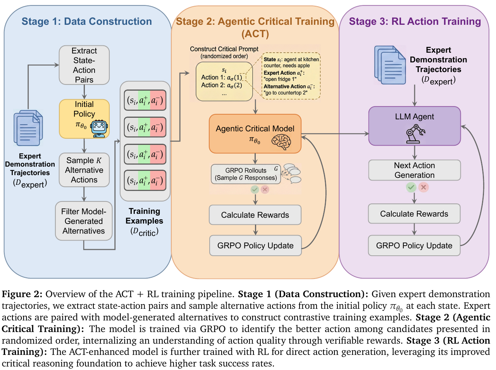

图源：原论文Figure 2，PDF第4页。左侧蓝色区从专家轨迹抽出“现场—专家动作”，让初始模型在同一现场另提动作，去掉与专家完全相同的候选，组成绿色专家、红色替代动作的训练例。中间橙色区把两个候选随机换序，让模型回答哪个更好，对同一问题生成多份回答，按选择结果给分并更新。右侧紫色区不再提供两个候选，而是让模型直接生成下一步动作，继续利用专家轨迹训练。图画的是ACT接RL的路线；正文也比较ACT后接模仿训练的组合。

沿用图中厨房场景作教学展开：给定任务、最近若干轮观察动作和当前观察，专家动作为“open fridge 1”，初始模型提议“go to counter 2”。构造器不执行这两个分支比实际结果，而是把前者当正参考，后者当不同候选。呈现时有时冰箱动作排第一，有时排第二，避免模型只学选位置1。比较阶段输出可以带推理，但最终要在`<action>...</action>`中给出所选动作。随后生成阶段撤掉候选列表，检验训练后的模型是否能自己提出合适动作。（§2、A.5。）

这里的“现场”不是环境全部真实状态，而是任务说明、最近$k$轮历史和当前观察。模型可能不知道未观察过的柜子内容，窗口之外的历史也可能不可见。主配置每个专家状态只采一个替代候选，即$K=1$；不同字符串并不等于不同结果。

**如何评分、如何更新？** Appendix A.1把完整回答$y$里的动作抽出来，记为$a$；专家参考是$a^+$，合法动作集合是$A_{\mathrm{admissible}}$。奖励为：

$$
R=R_{\mathrm{match}}(a,a^+)+R_{\mathrm{valid}}(a,A_{\mathrm{admissible}})+R_{\mathrm{format}}(y).
$$

规范化后与专家匹配得1；合法但不匹配得0.1；没有有效动作标签受−0.5格式惩罚，此时不再加动作语义得分。WebShop直接动作训练包含开放式搜索词，合法动作不能完全枚举，因而关闭合法性部分奖励。评分者主要是程序对参考与格式的核对，**不是每个候选都在环境执行后的任务奖励**。

同一比较问题生成$G$份回答，各自奖励为$r_g$。组相对优势是：

$$
\widehat A_g=\frac{r_g-\bar r}{\sigma_r+\varepsilon}.
$$

$\bar r$是这一组奖励的平均，$\sigma_r$是该组标准差，$\varepsilon$是防止除零的小量。若四份回答奖励是$[1,1,0.1,0.1]$，均值0.55、标准差0.45，忽略小量后优势是$[1,1,-1,-1]$。前两份比同组平均好，更新倾向于增加其产生概率；后两份相反。如果所有回答奖励相同，就没有这种组内区分信号。真实主实验8B模型每题采8份，4B采16份；四份仅用于手算说明。

原文式8还用新旧回答概率比$\rho$限制更新：

$$
L=-\mathbb E\!\left[\min\left(\rho\widehat A,
\operatorname{clip}(\rho,1-\epsilon_c,1+\epsilon_c)\widehat A\right)\right]
+\beta D_{\mathrm{KL}}(\pi_\theta\Vert\pi_{\mathrm{ref}}).
$$

$\rho$是同一回答在当前模型和采样旧模型下的概率之比，`clip`把过大的变化截到范围内；前面的负号把“提高有利回答”写成最小化损失。最后一项可惩罚偏离参考模型，$\beta$控制强度；但Table 4主配置$\beta=0$，不能说本文实验靠该项约束。这个目标奖励选中参考动作，并不对每一句解释是否真正忠实作独立监督。

**实验到底比较什么？** Table 1把直接模仿（IL）与“先ACT再IL”、直接按专家匹配奖励训练（RL）与“先ACT再RL”比较。均使用同一批专家状态动作，但额外比较训练增加了训练阶段。Qwen3-8B在ALFWorld OOD任务完成率上，IL为82.84%，加ACT为87.31%；RL为84.33%，加ACT为88.06%。WebShop任务完成率为28.00→31.60和29.40→33.80。这支持比较训练在这些设置下有后续收益。

ScienceWorld的RL43.04→50.34测的是**离线下一动作准确率**：给模型一个记录好的状态，看是否预测参考动作；不是从开始连续操作到结束的成功率。把它与前两环境列直接平均成统一Agent成功率，会掩盖指标差异。数据量为ALFWorld和ScienceWorld各10,240个训练状态对，WebShop 3,000；ScienceWorld测试10,000个离线状态。训练使用4张GH200、batch64、最多3轮，额外ACT开销未在主表中通过等总计算的直接训练抵消。（A.2–A.3。）

**最关键的反例怎么理解？** 若专家搜“beige brush”，候选搜“cream colored brush”，两种搜索可能都找到目标；只按字符串参考奖励会把后一种压低。再如任务允许先收杯子再收盘子，专家碰巧先收杯子，另一顺序未必更差。作者假设初始模型候选平均劣于专家，并未逐条验证替代动作价值。随机候选顺序能排除位置捷径，却不能排除专家措辞、常用动作或标签频率捷径。这个限制来自标签生成机制，不等于否认表中的实测收益。

#### 启发探索

ACT已经实现“先比较动作，再学产生动作”，因此新的方案不能仅说首次教会模型判断。可进一步检验的是：同样两个合法动作，在历史条件改变后，模型的选择是否随真实后果反转，而不是始终选更像专家的那个。

这样的验证至少要检查替代动作的实际可执行性与后续回报，引入等价正确动作、候选换序、实体重命名和条件置换，并固定额外训练预算。展示一条模型解释流畅的成功案例，无法代替这些反捷径对照；比较准确率提高是否变成错误恢复和整任务完成，也须分别评价。

### 7.3 CaRT：在上下文上构造反事实，学习继续还是停止

[作者全文](https://arxiv.org/abs/2510.08517)，实际阅读2025-10-09的arXiv v1，25页；[NeurIPS 2025 Multi-Turn Interactions Workshop接收列表](https://workshop-multi-turn-interaction.github.io/)可核实Workshop身份，未核实主会录用。OpenReview附件下载403；核验§3–5.4、B.1–B.3和C配置，数学实验完整处理脚本未核验。

#### 研究动机

有些模型不知道什么时候该停止：资料不足时急着作答，资料充分后又不断追加问题，浪费成本甚至被新信息带偏。CaRT只训练一个局部选择：**继续收集信息，还是现在给最终答案？** 它不同时解决所有工具动作选择。

普通训练可把成功对话结束处标为“停止”，之前标为“继续”。但模型可能学到错误规律：对话长就停止，或看到自信措辞就停止，而不是判断关键事实是否齐全。作者因此寻找两段看起来相近的历史：其中一段有关键事实，另一段缺失或替换了该事实，停止判断应相反。这叫反事实数据构造；它是否真能隔离所需事实，仍取决于构造和标签核验，不能只凭名称保证因果正确。

#### 设计方案

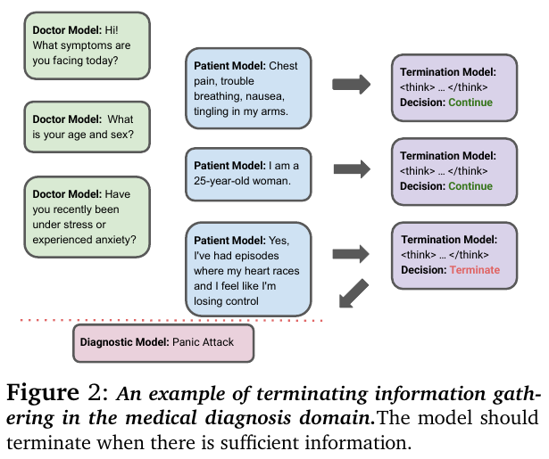

图源：Figure 2，PDF第4页。图是作者的模拟医学问答示例，不是临床建议。左侧提问模型提出问题，中间患者模型按模拟病例回答；右侧停止模型读到目前对话，前两次输出Continue，取得后续信息后输出Terminate。底部诊断模型此时才根据已有信息给最终诊断。箭头传递的是新增问答及停止决定，不是把诊断模型和停止模型当成同一个训练角色。

为了避免医学知识成为理解门槛，下用**自拟设备检修类比**解释同一数据结构，并不冒充作者训练域。任务是判断设备为什么不开机。前缀A只有“按开关没反应”；前缀B再得知“电源插头确实未接通”。如果固定诊断器在A下50次只答对10次，在B下答对40次，估计成功率由0.2升到0.8，增量0.6。构造器找到这个关键问答后，将B的最后问答替换成“外壳是什么颜色？黑色”，重新查询诊断器；若成功率降到0.3以下，就把原B标为停止、替换B标为继续。读者应注意：这里数字是假设的手算示例，作者实际使用的是模拟医疗对话。

作者医疗流程对应为五步。第一，收集完整问答，将每段对话拆成所有前缀。第二，对每个前缀让Llama-3.1-8B-Instruct生成50个诊断，按已知答案估计成功率。第三，选取最后问答使成功率相对之前提高至少0.5的断点。第四，删除并替换这轮问答，反复生成候选，直到估计成功率低于0.3，形成“停止／继续”的相反标签。第五，将前缀和**已知标签**交给GPT-4o，让它写解释，然后监督微调停止模型同时生成解释和决定。（§4、B.2。）

这里解释不是独立发现标签的证据：GPT-4o写解释时已知道该停止还是继续。我们可以研究这些解释是否帮助学习，却不能因文字自洽就认为它忠实揭示模型内部理由。数学任务也不完全照上述单轮替换：单改一步未必让解题成功下降，因此作者使用更早前缀、删除一段推理。故“所有样本只改一条最小信息”不符合全文。

**为什么停止目标里要乘折扣？** 原文式1希望在正确与开销之间取得平衡，可按一次真正停止的轨迹理解为最大化：

$$
\mathbb E\left[\sum_{t=1}^{T}\gamma^t\,
\mathbf 1\{a_t=\mathrm{terminate}\}\,r(x,y_t)\right].
$$

$t$是问答或思考步，$a_t$是继续/停止决定，$y_t$是假如此时作答得到的答案；$r(x,y_t)$衡量与正确答案是否一致；指示符$\mathbf1$在停止时为1，其余为0。$\gamma$在0与1之间，是继续耗时的折扣；例如教学设定$\gamma=0.9$，同样答对时第2步的折扣收益0.81，第5步约0.59。若过早停止只能以0.2概率答对，而稍后能以0.8概率答对，则增加信息仍可能值得。$T$是最大步数。这个式子说明追求的目标，实际CaRT主要通过上述标签和解释做SFT近似学习，**并不是为每个前缀精确求解全部未来的最优停止问题**。

作者还试了CaRT后接RL：当前前缀估计成功率至少0.5时选择停止、低于0.5时选择继续，奖励+1，否则−1。它依赖同一可操作标签阈值，而不等于直接观察到了所有未来交互价值。（§4.2。）

**实验一：是否只是多用了数据或调整标签比例？** B.2最终训练集4.78k例，其中80%继续、20%停止；普通SFT基线匹配数据量和标签比例。反事实构造先形成约1.95k条均衡例，再通过加入更早前缀扩充继续标签。匹配基线使比较更接近数据内容和解释的差异，而不只是“多给了停止例”。§5.4、Figure 5分别移除反事实或解释，表现都弱于完整方法，支持两者在该设置中有贡献；不自动证明任何解释文本都有效。

**实验二：少问几轮是否真的更划算？** 主要指标既看最终答案正确率，也比较与相同平均停止长度的固定预算基线之差。固定预算基线无论信息够不够都问固定次数；在平均次数相近时自适应停止更好，才更能说明分配时机有价值。医疗Figure 3基于3次训练和30次评估给区间；数学Figure 4在AIME 2025上给3个训练种子、16次评估的区间。本调研不从低分辨率曲线估算精确涨幅。

**实验三：所谓“最优停止率”覆盖哪些案例？** 这里必须顺着附录查分母。主文说100个ID、200个OOD问题；B.1经过难度过滤后记为1133个训练、121个ID、93个OOD问题；B.3生成并再筛选对话，最终评估261与233条。专门的optimal termination rate仅对其中51条具有至少0.5成功率跃升的对话计算。它衡量的是作者定义的陡升断点附近表现，不是所有任务的普遍最优停止能力。没有这种断点、信息逐渐累积的情形不能被这个子集指标覆盖。

构造成本也有实质含义：每个前缀50次诊断，加上替换最后问答时反复生成和复测，再加GPT-4o解释。反复用同一个诊断器筛选，可能挑中该模型的特殊弱点或采样噪声。因此需要独立诊断器或重新采样确认标签。B.3还保留“FILL IN evidence”占位，缺少对提问模型某项优势的完成证据；该预印本这部分不能当成已证明。C中的SFT配置为8张GPU、3轮、batch256、最长16384 Token，不能只按最终4.78k训练例宣称全流程廉价。

#### 启发探索

CaRT最值得借鉴的是把“条件有没有关键事实”和“模型是否愿意停止”联系起来，而不是只教一种回答习惯。但它与固定历史比较两个动作不同：CaRT改的是历史条件，动作集合始终是继续/停止；动作反事实则固定历史，实际比较不同动作后果。两类证据不能互相替代。

对于通用轨迹训练，可以借其思路构造信息条件探针，再检查干预是否在环境中真实可达、替换是否引入新捷径、标签是否由独立续跑确认，以及没有陡升断点的案例会怎样。不能仅把文本改得相似，就宣布识别到了轨迹中的因果必要信息。

### 7.4 Improving Context-Aware Preference Modeling：相同回答、不同条件、偏好反转已有先例

[NeurIPS 2024正式论文](https://papers.neurips.cc/paper_files/paper/2024/hash/82acbbc04435f6c1e7f656b1cbe4ad82-Abstract-Conference.html)，Pitis等。实际核验§3–6及Appendix A–C、E和[微软RPR数据卡](https://huggingface.co/datasets/microsoft/rpr)；有关1-sided采样细则的作者OpenReview附件访问受限，未当作已读证据。

#### 研究动机

同一个问题“天空为什么是蓝色”，回答A使用散射和波长的术语，回答B用手电和颜色比喻。哪一个更好？如果是大学光学作业，A可能合适；如果是给五岁孩子讲故事，B可能更好。问题文字没有说明使用场景，强迫评分器无条件选一个，可能把标注者各自猜测的背景混进标签。

本文研究的“偏好模型”不是直接完成环境任务的Agent，而是一个评分器：输入问题、候选回答及可选背景，输出哪个回答更受偏好或给每个回答打分。作者希望把两项困难分开：先知道或推断使用条件，再判断该条件下哪个回答更合适。Reasonable Preference Reversal（RPR）数据刻意让同一对回答在两种合理条件下优劣相反，防止模型只记住“A总比B好”。

#### 设计方案

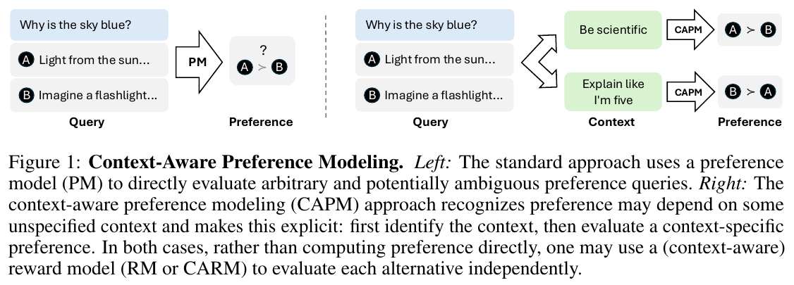

图源：原论文Figure 1，PDF第2页。左侧问题及A/B回答直接送入普通偏好模型PM，只输出一种排序。右侧保持问题和回答不变，分为“Be scientific”和“Explain like I'm five”两条背景分支，分别进入上下文感知偏好模型CAPM，输出A优于B和B优于A。箭头带的是文字条件与回答，不是实际环境状态转移。图注还说明，可以把两份回答分别交给上下文奖励模型打分，并不要求将A/B永远拼成一个输入。

**一条反转样本怎样构成？** 用原图问题作教学展开。保存五个对象：问题$x$；两份固定回答$y_A,y_B$；偏好A的条件$z_X$；偏好B的条件$z_Y$。训练记录可以展开为“$x,z_X$下A更好”和“$x,z_Y$下B更好”。Criteria版本把条件明确写成一句评价准则；Scenarios版本给自然使用情境，例如“准备交一份大学课程报告”，让模型从情境推断准则，而不是直接把“重科学性”复述一遍。

作者从UltraFeedback筛出的约42K个没有显式唯一答案的问题出发，让GPT-4 Turbo合成合理且区分度高的准则、两份都应高质量的回答，再自评筛选准则和场景。最终有10,167组训练反转样本、1,000组测试样本，问题不重叠。数据卡列出`prompt,response_a,response_b,criteria_x,criteria_y,scenario_x,scenario_y`；这些是同一工作内部不同条件，不应重复计成互不相关的问题来源。（§4、B。）

**评分器实际怎样学？** 作者从已有Mistral 7B奖励模型继续微调，得到CARM。每次输入包含完整条件、问题及某个回答，输出一个标量分数；分别给A、B评分后比较。Appendix C的训练混合10,167条Criteria、10,167条Scenarios及13,333条UltraFeedback，共33,667条；前两类对每个反转对随机取一侧。UltraFeedback补上一般性条件，以保留常规偏好能力。训练1轮，学习率$10^{-5}$，LoRA rank16、alpha32。推理时用当前给定或推断的条件评分，不是在环境里连续行动。

**理论中的“效用”表示什么？** 令$i$为使用意图，$u(i,y)$为回答$y$在该意图下的效用分数。它是建模量，不是论文已直接测得的真实心理价值。作者采用Bradley–Terry假设，将两回答分差转换为偏好概率：

$$
p(y_A\succ y_B\mid i)=\sigma\big(u(i,y_A)-u(i,y_B)\big),\qquad
\sigma(s)=\frac{1}{1+e^{-s}}.
$$

符号$\succ$表示更偏好，$\sigma$把任意分差压到0与1之间。教学例子：大学条件下A得3、B得1，分差2，对A的偏好概率约0.88；儿童条件下A得0、B得2，分差−2，对A偏好约0.12，即更偏好B。具体数字是为解释公式自拟，不是论文标签的实测效用。这个式子说明“比较应依条件改变”，但不等于已公开了作者完整微调损失。

**如果条件还不知道，错误来自哪里？** 作者把可能背景记为$z$，如大学报告或儿童故事。$p(z\mid x)$是根据问题推测背景的真实分布，$\Delta_z$是在该背景下A相对B的效用差。按作者选择的期望效用聚合，整体分差为$\Delta=\sum_zp(z\mid x)\Delta_z$；带帽子的量表示模型估计。假设大学与儿童各占一半、分差分别2与−2，则平均分差0；若模型误以为大学占90%，估计平均就可能偏向A。这说明即使各背景内评分都对，背景猜错也会导致总体错。

原文§3.2式3把总误差分为两个来源：

$$
|\Delta-\widehat\Delta|\le
\sum_z p(z\mid x)|\Delta_z-\widehat\Delta_z|
+\sum_z|\widehat\Delta_z|\,|p(z\mid x)-\widehat p(z\mid x)|.
$$

第一项是知道真实背景后，模型把A/B分差算错多少；第二项是背景概率猜错多少，并按该背景对偏好的影响加权。推导只需在两份加权和的差中加上再减去$\sum_zp(z\mid x)\widehat\Delta_z$，分成“分差错”和“权重错”两部分，再用“几个数相加的绝对值不超过各自绝对值之和”。这是误差来源的上界，**不是加入背景必然提升性能的保证**。如果背景就写“正确答案是A”，评分容易了，但获得这个背景等同于先解决原问题（§3.3）。

还要保留理论假设：期望效用聚合不是所有人类偏好混合的唯一方式。先平均分差再做$\sigma$，一般不等于先得到各背景偏好概率再平均，即$\sigma(\mathbb E\Delta)\ne\mathbb E\sigma(\Delta)$。两者对应不同建模选择，不能把上界包装成任意真实人群偏好的定理。

**反转数据为什么能检查条件使用？** 若完全忽略背景、对同一A/B永远选A，那么在两个方向均衡计分时最多答对一半。这个结论只需观察两侧答案相反，不需要懂神经网络。它能排除固定回答质量偏置，但无法排除其他数据合成捷径，也不证明评分器理解了物理知识或能执行长期决策。

**实验一：给条件、学条件，各贡献多少？** Table 2在RPR Criteria上，原Mistral奖励模型无条件为51.0%标签一致率，给条件升到86.7%；CARM给条件达到98.5%。“一致率”是模型排序与数据指定排序相同的比例，不是任务完成率，也不是人类绝对真理。Scenarios上原模型74.9%、CARM96.2%；转移到Multifaceted Bench从67.9%到78.7%，支持一定的跨数据集迁移。

**实验二：模型会不会仍忽略不习惯的条件？** Table 3故意给Negative Criteria，要求偏好原本较差的回答。如果完全遵从这个新条件，模型对原正偏好的认同应显著降低。CARM在Chatbot Arena上仍有51.8%与原正偏好一致，Preference Bench为29.3%；说明数据内98.5%不能推出任意条件都可靠。此实验是条件服从的压力测试，不是在主张现实使用中应当追求差回答。

**实验三：反转结构是否带来额外训练信息？** Appendix C.1 Table 7比较`1-sided RPR+UF`与`RPR+UF`：RPR Scenarios为92.9%和96.2%，HHH为89.8%和91.9%。但该比较改变训练数据组成或采样，正式PDF对1-sided具体挑选规则未写清，附件又未能直接访问。因此只能说反转来源的数据配置有收益，不能推出“相同全部样本，仅把它们标成配对，便额外提高了训练”。论文没有明确给出跨两种条件耦合的完整CARM损失，不能凭Bradley–Terry背景替作者补出一个新的配对损失。

**实验四：背景从哪里来，会不会偷看答案？** Table 4在Chatbot Arena上，用推断背景时CARM为78.1%，oracle背景时为90.9%。后者构造背景时看到了真实用户偏好，是特权信息，不是正常部署都能获得的条件。人工核验对Criteria和Scenarios各取100个盲样本，由作者检查，一致率分别97%和95%（B.2），不能称外部多方共识。主表未进行多训练种子实验，只有Table 6用户画像推断用了3个种子。

#### 启发探索

这篇已覆盖“固定问题和回答对、改变条件让偏好反转、训练条件奖励模型”的概念。我们的轨迹研究不能仅把回答叫作动作，就宣布新范式。它与闭环Agent仍有实质距离：这里评分的是英语单轮合成回答，没有执行动作、观察状态变化、恢复错误和计算长期任务回报。（§6。）

如果要借鉴到轨迹，需验证两边动作都合法、条件由真实可重放环境产生、后续价值确实随条件反转，并检验局部评分进步能否变成整任务收益。若拟提出跨条件耦合训练，还要保持全部单侧样本相同、只改变明确写出的耦合项，再寻找该目标的直接近邻；“RPR未明确写出”不等于无人研究。

成本也不能只看训练数据条数。Appendix E报告单张A100微调约8小时，GPT-4 Turbo合成是主要计算开销，未给完整端到端账单；常规评测表单元多在单GPU一小时内，但随模型和数据变化。该工作给我们的是条件评估及数据构造的有力出发点，不是已经完成的高效闭环轨迹训练方案。

## 八、跨论文证据综合：怎样从局部分析形成完整训练方法

这36篇工作不是可以任意叠加的36个组件。它们处理不同对象：有的估计动作能否帮助完成任务，有的决定给模型什么监督，有的估计参数更新价值，还有的让同一训练目标运行得更便宜。只有把这些层次接清楚，才能回答“怎样用细粒度轨迹训练一个更好的模型”。

### 8.1 必须区分四个量，而不是给它们都叫“轨迹价值”

| 要判断什么 | 可操作含义 | 代表证据 | 不能自动推出什么 |
|---|---|---|---|
| 行为可完成性 | 执行动作后，特定后续策略/已知路径能否完成任务 | IPR、STeCa、CSO、GraphGPO | 动作最优、局部因果优势、值得训练 |
| 监督身份 | 该片段应作为正目标、相对负侧、历史条件还是未确定材料 | ETO、STeP、HSL、LEMA、TOSS | 一份终局失败标签足以给每一步判错 |
| 当前学习收益 | 此刻用该目标更新，会怎样影响指定目标能力 | LESS、GTP、GREATS、ICA、LARK | 永久数据质量、真实长期收益、闭环成功保证 |
| 资源费用 | 核验、评分、选择、前后向及评测实际消耗多少 | HPL、CSO、TokenTune、TokenSeek、Tree Training、psRL | 监督比例降低就等比例节省GPU时间 |

四者可以相互影响，但需要不同证据。一个动作可执行且在某条成功路线上，仍可能是学生早已掌握的重复动作；一个动作学习价值高，却需要很长历史；同轨迹另一个分数稍低的动作，可能与它共用前缀而更值得一起学。

### 8.2 从“失败也有用”推进到明确的监督构造

刷子例子里，“点红色—发现颜色不符—返回—选米色”包含错误、信息和恢复。ETO把失败放到偏好负侧；STeP/LEMA把错误变成修正输出的条件；HSL改变目标，使同一行为在另一个合法任务下成为正例；CoEvolve让失败触发新练习。保留同一条日志，不等于给模型相同的学习要求。

新补读的CSO已经将失败定位、专家替换、学生续跑、单步偏好和迭代训练接成完整链；STeCa把相邻续跑成功率变化用于触发校正。它们排除了“只要把失败拆成步骤再修复就是空白”的判断。但两者也显示新的成本与标签问题：一次替换后成功，并不证明原动作无法被后续纠正；五次续跑的成功率会受续跑策略和剩余预算影响；教师后缀不一定能接到不可逆错误后的状态。

GraphGPO则利用已观测状态图中的成功通路，给失败轨迹里的有用转移重新提供信用。不过观测图距离不是最优Q值，观察文字相似也不保证隐藏环境和预算相同；其图优势还会与终局优势叠加，不能把局部正分直接读成最终正梯度。

因此，完整训练方案必须交代：从原始日志怎样得到目标、哪些证据使目标进入池、无法判断时怎样弃权、改变动作后怎样生成真实新分支，以及核验到底花了多少资源。固定一个共同候选池可以隔离选择器贡献，但不能用“已有正确标签”掩盖整个方法的数据构造难题。

### 8.3 切得细并不产生真值，高损失也不等于高学习收益

仅将轨迹切成短动作，仍然只有同一个终局反馈；它不会凭空提供更多正确性信息。ETO步级变体的失败，和IPR/HPL加入续跑证据后的结果，需要按标签与目标差异解释，而不能把步级方法简单排高低。

高熵描述模型犹豫，高损失描述实际目标概率低，CFT式反事实描述替换位置对特定续写的影响，STM关心保持原能力。一个位置可以对任务重要，但模型已经会；也可以损失极高，却只是标签错误。TOSS又提醒，同样的局部mask可以服务安全保持，而不是任务回报信用。

LESS将价值联系到目标更新方向，Learning Dynamics说明跨输入的参数共享关系也影响更新结果。GTP进一步表明，分别高分的样本放在一起可能重复，**且其ALFWorld试验已经是state-action单位**；因此“动作级梯度选样”不能作为未有人做的贡献。GREATS已在每步候选批中修正边际收益，并用真实短更新检验代理，覆盖了动态评分和批内交互的重要部分。

但这些近似也有明确边界：Adam批更新不等于各样本Adam更新的平均；同轨迹多个loss共用历史图时，原先按独立样本索引计算的ghost内积不能直接分离每个动作；LARK的LM-head梯度界不能不加条件移到冻结head的LoRA；ICA的上下文匹配差不等于真实优化器更新价值。主方案必须选择一个明确可实现的代理，并允许代理在检验中失败。

### 8.4 效率有两种来源：少学无效目标，或少重复相同计算

ATLaS、STeP、CFT、Rho-1、TOSS等改变直接监督目标，未必改变完整历史前后向；TokenTune/TokenSeek改变部分反传，主要触及激活与内存，额外评分和重排也可能变慢。目标更少、显存更低、吞吐更高、达到同一能力更便宜，分别需要验证。

Tree Training与psRL补齐了另一条直接相关路径：同一历史被多个目标使用时，可以共享计算，并在正确累加梯度后保持原训练目标。它们使“共享前缀”成为必须承认的先前技术，而非新方案独占的工程优势。

这也产生一个具体的选择问题：如果两个局部目标共同训练比独立成本之和便宜，选择时只比较单目标价值/长度可能低估它们的组合。**选择与执行的连接**值得检验，但有一个很强的反证：已有梯度选择器也用相同共享执行后，是否已经同样好？只有超出这个对照，才有理由主张新选择机制，而不只是合理采用已有系统优化。

这个连接也不是新的优化思想。[Iyer与Bilmes的NeurIPS 2013工作](https://proceedings.neurips.cc/paper_files/paper/2013/file/a1d50185e7426cbb0acad1e6ca74b9aa-Paper.pdf)在§1–2已经讨论协同/次模成本约束下的数据子集选择：已有集合越大，增加相关项目可能越便宜。本文固定互斥轨迹组、单调末端费用的成本正是边际成本递减的一种实例。所余研究价值必须来自具体轨迹训练中的有效建模、实现、适用条件或新实证，不是首次考虑共享费用；还须比较共享边际成本贪心及GREATS的同预算适配，而不只让强方法在选完后共享执行。这篇作为理论近邻定向读§1–2，未独立核验其全部近似证明，不列作本轮全文精读。

总费用必须包括构造目标、参考模型、梯度或前向评分、成本profile、求解及训练。[Compute-Constrained Data Selection，ICLR 2025](https://proceedings.iclr.cc/paper_files/paper/2025/file/5acb720a361eecb34ee62d356859d246-Paper-Conference.pdf)的§4式(2)已经明确约束评分加训练，表1、§5–6分析不同选择器费用和回本。其离线选择与参数化结果不能直接外推为本课题在线JVP的结论，却要求把ICA、LARK及简单检索等便宜代理当成认真竞争者；更复杂的梯度评分若不回本，科学上应选择较简单方法。该篇本轮定向读§1–6及成本公式，未审完附录/复现，不把这些段落计成新增方法级精读。

### 8.5 离线动作判断、真实决策与恢复能力分开测

GTP的ALFWorld结果测离线动作准确率，不能冒充Agent闭环成功；RPR/CaRT/ACT的条件变化与动作判别启发，也不能代替模型在自己造成的新状态里继续行动。一个模型可能在给定正确历史时选对动作，却无法从自己先前的错误中恢复。

后续评测至少区分：完整任务成功、真实偏离历史上的恢复、前置条件改变时行动是否相应改变、正常能力保持，以及达到这些结果的全部费用。条件对要由可重放环境产生，避免只换文字却留下自相矛盾状态。两条条件相反的记录若仅独立相加训练，把它们命名为一对并不会自动改变损失；其首要用途是辨别模型是否真用了历史，而不是凭配对名称制造方法贡献。

### 8.6 候选比较：本轮为何调整主方案

| 候选方向 | 实质价值 | 主要碰撞或风险 | 当前处理 |
|---|---|---|---|
| 失败局部核验与修复 | 提高监督来源可靠性 | CSO/STeCa已有完整方法；新核验要证明同预算更可靠 | 作为必要建池步骤与强对照，不单独宣称创新 |
| 动态局部训练价值 | 避免反复学习无效目标 | GTP/GREATS已覆盖许多核心操作；代理与真实优化器可能脱钩 | 保留，使用明确公式和真实更新诊断 |
| 固定目标后的历史稀疏反传 | 检验显存预算与条件学习关系 | TokenTune/TokenSeek直接相邻，且原方案只交付机制实验 | 保留为历史候选，不再替代完整训练方案 |
| 学习价值与共享前缀预算联合选择 | 使目标组合与真正需要支付的计算相匹配 | 可能只是已有选择＋已有共享；成本/评分费用可能不划算 | 当前主候选，须超越同后端强基线 |

主方案的选择并非已经证明最后一项更优，而是它能够完整连接用户要求的“轨迹解析—目标形成—当前模型选样—真实训练—任务能力与费用”。已有方法图和完整算例使实现途径可审查；决定性的近邻对照决定它是否值得继续投入。具体算法、输入输出、数学定义和失败分支见[方案设计](方案设计.md)。

### 8.7 当前已经知道什么，尚不能知道什么

已有证据足以反对三个过度简化：整条成功不意味着每步同样值得学；整条失败不意味着每步都无用；局部高分和监督稀疏不自动意味着高效训练。证据还足以要求新方法面对动作级梯度选择、执行核验与共享训练这些直接近邻。

尚未确定的是：当前学生、目标分布和优化器下的动作价值代理能否预测实际更新；共享成本是否足以改变更优组合；最终闭环收益能否超过全部额外费用。这些是需要实验的假设，不从论文拼接中自动成立。

本次在已有27篇正文基础上补入9篇方法级精读：CSO、STeCa、GraphGPO、GTP、GREATS、ICA、TOSS、Tree Training、psRL，并重写综合与方案。原27篇保留此前已核验的阅读成果，不声称本轮全部重新精读。新论文的实际版本、已读部分和未核验实现分别写在对应章节；正式会议身份与全文实际版本区分，预印本没有冒充主会。

研究机会检索仍有边界：系统领域中更广泛的共享设置费用、组成本数据选择可能提供直接近邻；本轮定向反检不能证明不存在。部署前也须核查具体数据许可、可重放性和模型后端。结构审计、合成算例和模型辅助文本评审只能发现相应层面的错误，不证明论文结论全部正确、真实初学者一定看懂，或新方法已经有效。
