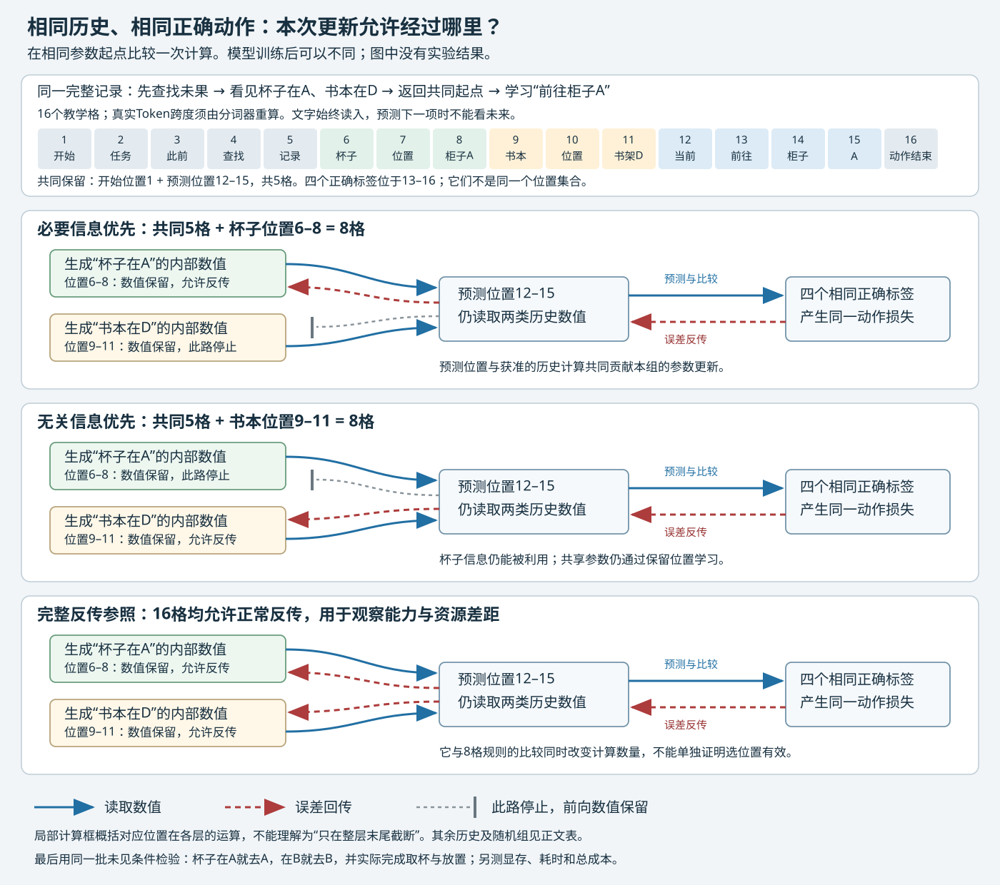

# 方案设计

## 用同一条找杯子轨迹，检验哪些训练计算值得保留

本方案面向没有大模型训练背景的读者，只假定能够阅读中文、理解基本算术。先用一个完整例子说明研究，再展开论文依据、实现和实验规则。文中的找杯子记录及位置编号是教学示例；截至2026-09-21，本方案尚未运行模型训练或环境实验。

## 一、从“细粒度利用轨迹”出发，我们先解决哪个问题

用户最初的问题是：模型做任务留下了成功和失败的过程记录，能否辨认其中不同部分的作用，用它们更有效地训练模型？这里的“过程记录”叫作**轨迹**：既包括模型做过的动作，也包括环境返回的观察。所谓“细粒度”，就是不把整条轨迹只当成一个成功或失败样本，而是进一步处理其中的动作、观察和文字位置。

先看一项家务任务：找到杯子，放到桌上。以下教学记录描述一个已经走过弯路、随后仍可完成任务的情形。

| 发生了什么 | 记录里有什么 | 后面做决定时为什么可能需要它 |
|---|---|---|
| 接到任务 | 把杯子放到桌上 | 决定要找什么、最终放在哪里 |
| 一次未找到目标的尝试 | 去货架C找；环境返回“这里没有杯子” | 说明已经查过哪里，避免无意义重复 |
| 继续观察 | 按固定查找路线取得真实观察：杯子在柜子A；书本在书架D | 前一句决定去哪里取杯子，后一句在本任务中是背景 |
| 回到共同起点 | 模型空手回到房间门口；当前画面没有显示杯子位置 | 接下来必须结合此前观察作决定 |
| 恢复执行 | 前往柜子A，取杯子，再去桌边放下 | 环境执行这些动作并核验任务完成 |

一个直接的训练办法是让模型模仿记录里的动作：读到此前历史后，提高下一个示范动作被生成的概率。这叫**监督微调**。如果只提供从未走错的成功路线，训练材料就缺少“已经查错地方，现在怎么办”的条件；如果模仿上述记录里的每个动作，又可能把不值得重复的尝试一并教给模型。单凭最后成功，不能决定中间每一步都应得到同样的模仿要求。

已有研究提供了更细的做法：保留已经发生的完整历史，只要求模型模仿经过确认的恢复输出。例如，STeP把被标为错误的输出留在上下文中，并把修复作为学习目标。对我们的杯子记录，可以保留“货架C没有杯子”，而把此刻正确的“前往柜子A”选作目标。一次搜索没找到东西也不一定是错误；本方案只使用实际核验过的目标，不靠“曾经失败”自动给每个动作判错。[STeP，§3.2–3.4](https://arxiv.org/abs/2505.20023)

现在出现一个新的、可以单独检验的问题：**历史仍然全部读入，正确动作也全部照常学习，是否还需要为每个历史位置保留同样多的训练计算？** 比如，“杯子在柜子A”和“书本在书架D”都能被读到，前者的计算是否更值得保留？如果能识别这类差别，就可能在显存有限时，把训练资源用在更有帮助的位置上。

我们先选这个子问题，是因为它连接了原目标中的三件事：保留失败经历中的有用信息、在轨迹内部作细粒度区分、检查资源投入能否减少。先固定可靠的动作目标，也使实验更容易解释：结果不会同时混入“目标换得更好”和“训练计算选得更好”两种变化。

这项选择留下了明确的未覆盖部分：本轮不解决如何自动给所有局部动作判对错，不提出新的在线强化学习方法，也不回答怎样利用全部不可恢复失败。标签核验在本研究中是前提和成本。当前要交付的是一项**机制实验**——查明某种训练改动在什么条件下有影响；只有它给出支持性证据，才继续设计能自动分配资源的新算法。

## 二、本次只改变哪一步

理解改动前，先把一次普通训练连起来。模型里面有许多可调的数字，叫作**参数**。它用这些数字处理历史文字，得到对下一步输出的预测；然后把预测与正确动作比较，计算一个误差数，叫作**损失**。训练再计算应怎样修改参数，争取让这个误差变小。

用找杯子例子说，模型看完历史后，应当更愿意输出“前往柜子A”。如果它只给正确输出很小的概率，损失就大；给正确输出较大的概率，损失就小。真实的动作由多个文字单元组成，训练会分别计算这些单元的损失，再按固定规则合并。所有比较组都使用相同的正确动作和合并规则。

从历史算出预测的过程叫**前向计算**。这个过程中产生许多中间数值，叫作**激活**。得到损失后，再沿着计算关系向回计算“哪些参数该怎样调整”，叫作**反向传播**，简称反传；得到的局部变化率叫梯度。反传往往需要保存或重新计算前向中的中间数值，保存它们要占用显卡上的内存，也就是显存。

因此，即使不要求模型生成“杯子在柜子A”这句观察，它仍可能参与训练：模型在预测后面的动作时读取了这句话，后面的损失便可能沿读取关系回到生成这段内部表示的计算。这就是“这句话不作答案”和“这句话的计算不参与反传”的区别。

已有的TokenTune和TokenSeek允许完整文字继续参与前向，只为部分位置保留反传路径。前者随机选位置，后者先根据模型计算得到分数再选择。这个能力让我们能够做所需的干预：让“杯子在柜子A”依然被读取，却关闭它在指定局部计算中对参数更新的贡献。保留部分反传是已有技术，本方案要检验的是它在交互恢复训练中的分配效果。[TokenTune，§3](https://aclanthology.org/2024.emnlp-main.1202/)；[TokenSeek，§3.2](https://arxiv.org/abs/2601.19739)

对于同一条杯子记录，三件事分别如下。

| 训练中的问题 | 本次统一怎样处理 | 是否是主要比较项 |
|---|---|---|
| 模型能读到什么？ | 完整的任务、既往动作和环境观察，包括杯子位置与无关背景 | 各组相同 |
| 要模型学会输出什么？ | 相同的、经环境核验的正确动作 | 各组相同 |
| 哪些局部计算允许通过反传贡献参数更新？ | 先保留预测这些目标所需的位置，再按不同规则分配剩余位置 | 在这里作比较 |

关闭某条反传路径时，前向数值仍照常算出和使用。例如模型仍然能看到杯子在A，仍然可能选对A。模型的参数也在不同文字位置之间共享：即使这次没有接收来自杯子位置的某项更新，它仍可通过其他保留位置学习，下一次处理杯子信息时也可能因此发生变化。所以，**任务中需要这条信息，不足以证明训练中必须保留它的全部反传路径**。哪一种保留规则更有帮助，要靠下面的训练比较回答。

## 三、把同一条记录真正走到一次参数更新

### 3.1 先确定正确目标，再标出它在哪里被预测

数据准备时，从相同环境起点重新执行动作，确认观察确实出现过，并验证“前往柜子A”后存在可完成任务的恢复路径。这叫重放核验。末尾“杯子已放上桌”的结果用来核验标签，但它属于未来，不能提前放进模型预测“前往柜子A”时的历史。

为看清位置关系，下面只展开“前往柜子A”这一项训练目标。后续取杯子、放杯子的正确动作也可分别形成训练目标，所有组采用同一份目标清单。历史中的观察和未核验动作不直接作为本例要求生成的答案。

语言模型实际先用分词器把文字拆成小单元，叫作**Token**；一个Token可能是一个字、几个字或词的一部分。下面临时用16个“教学格”代替一段序列，以便手算位置和预算。一个格子有时概括一段历史，**不代表任何真实分词器会这样切分**。真实训练保留原始历史顺序，并重新计算每个字段对应的Token跨度；不能把下面的16格直接作为程序输入。

| 教学位置 | 对应内容 | 是否作为本例直接学习的答案 |
|---|---|---|
| 1 | 开始标记 | 否 |
| 2 | 任务：找到杯子，放到桌上 | 否 |
| 3–5 | 前述查找动作及其余观察的教学缩写 | 否 |
| 6、7、8 | `杯子`、`位置`、`柜子A` | 否；这是决定动作的历史信息 |
| 9、10、11 | `书本`、`位置`、`书架D` | 否；这是本任务中的背景信息 |
| 12 | 已返回共同起点的当前观察，以及动作开始边界 | 否 |
| 13 | `前往` | 是 |
| 14 | `柜子` | 是 |
| 15 | `A` | 是 |
| 16 | `动作结束` | 是，学习完整动作何时结束 |

训练器会保存13–16格的正确答案，这些答案叫**标签**。但模型的任务是预测“下一个”单元，因此第13格的答案，要由第12格处理完历史后的状态来预测；第14格由第13格预测，依此类推。

| 当前算到哪里 | 当时可以利用的内容 | 要预测的下一项 |
|---|---|---|
| 第12格 | 任务与完整既往历史 | 第13格：前往 |
| 第13格 | 上述历史，以及已给出的正确前缀“前往” | 第14格：柜子 |
| 第14格 | 上述内容，再加“柜子” | 第15格：A |
| 第15格 | 上述内容，再加“A” | 第16格：动作结束 |

训练时将正确动作前缀提供给模型，是为了逐项学习完整动作；预测某一项时不能偷看该项或后面的答案。测试时则没有这些正确前缀，模型必须接着自己刚生成的内容继续输出。这里的通用位置关系是：**标签在第t格，预测由第t−1格产生。** 因此必须保留第12–15格的预测计算，不能误把第13–16格当成同一集合。第12格虽然不是答案，本例仍必须给它保留反传。

### 3.2 数量相同，把额外位置分给不同内容

现在复制同一初始模型和同一份训练数据，分别训练几份模型。每份都读上述完整记录，也都学习13–16格的四个目标。教学上假定每层允许保留8格反传计算，并额外约定开始位置1保留。共同集合于是是第1、12、13、14、15格，占5格；还剩8−5＝3格可分给历史。

| 保留规则 | 各组共同保留的5格 | 额外保留的3格 | 合计 |
|---|---|---|---|
| 必要信息优先 | 1、12、13、14、15 | 6、7、8：杯子的位置 | 8格 |
| 无关信息优先 | 1、12、13、14、15 | 9、10、11：书本的位置 | 8格 |
| 随机保留 | 1、12、13、14、15 | 从可选历史位置抽3格，例如4、7、10 | 8格 |
| 完整反传参照 | 上述共同位置也保留 | 所有位置都允许正常反传 | 16格，不作相同预算的对手 |

“必要信息”在这里是一个待核验的数据标签：在合法的两种场景里，杯子位置改变后，合适的取物动作也跟着改变；书本位置的变化则不改变这项选择。真实数据要核验这两个条件，不能只因我们觉得一句话重要就给它贴标签。它标的是任务条件的重要性，尚未标出梯度是否重要——后者正是实验要回答的问题。

真实程序按每层实际Token位置计预算，还要匹配可选字段的长度、距离等因素。这个8格例子只展示“共同需要的先扣除，其余等量分配”的规则。它也没有预言显存会减半：完整输入、模型参数和其他中间缓冲依然需要空间。

### 3.3 完整文字相同，参数更新从哪里开始不同

以两种有明确含义的规则为例。必要信息优先组与无关信息优先组都计算“杯子在A”和“书本在D”的内部数值；预测位置也都可以读取两者。因此，在参数相同的训练起点，两组的前向预测和动作损失应当相同。

区别出现在反传。必要信息优先组允许动作误差沿选定的杯子信息计算路径传回；无关信息优先组在这些局部计算处停止反传，把同样数量的位置留给书本信息。两组的目标预测位置始终可以贡献更新。于是，同一份损失可能产生不同的参数更新；更新后，两份模型的参数与预测就可能开始不同。重复训练后，再检验这些差别有没有转化为稳定的能力差异。

图为本方案原创机制示意。蓝色实线表示本次预测仍能读取的数值，红色虚线表示误差可以沿着回传的路径，灰色截线表示“保留数值，在这里停止这项更新贡献”。图中必要信息优先组与无关信息优先组都能读杯子和书本信息，差别在红色路径；完整参照保留两类路径。图省略其他历史位置，具体保留数以表格为准。

如果图不能显示，可以直接沿以下处理链理解：**同一完整记录 → 相同的下一动作预测任务 → 相同四项标签产生损失 → 按不同位置规则传回误差 → 各自修改共享参数 → 得到待测模型。** 这里“相同预测任务”不表示训练后的预测一直相同；只有相同参数、相同输入时，前向结果才应对齐。

这次干预落实在各层相应的局部运算中，含生成供后文读取的信息、以及逐位置变换的运算；它不是删掉观察，也不是只把某一项损失乘零。后文会规定截断发生在哪些算子，以及怎样验证实现。这里先抓住实验含义：两组知道相同的事、被要求学会相同的动作，但允许贡献本轮更新的计算位置不同。

还要保留一种完全可能的结果：无关信息优先组也能学好。它仍在更新动作预测处的计算，也在更新跨位置共享的参数；已有模型或许早已能准确表示“杯子在A”，只需学会怎样读取和利用它。必要信息优先组也可能更好，因为这项任务需要调整有关历史表示的生成方式。以上是两种竞争解释，教学图本身不替任何一方提供实验支持。

## 四、怎样知道这种区别值得研究，下一步做什么

训练记录里的正确答案是去A。若训练后只问这一条，模型一直回答A也能答对，无法说明它学会了根据历史决定。因此，要在**未参与训练或选择规则调整**的任务中测试同一类关系。

继续使用杯子情境：建立两种合法场景，模型都从同样的当前房间位置、空手开始恢复，当前观察都不直接显示杯子；但此前真实查找记录不同。甲场景记录杯子在柜子A，乙场景记录杯子在抽屉B。两边均允许前往A或B，统一剩余步数和后续执行条件，再由环境核验优选动作是否确实随条件改变。

| 未见测试情境 | 模型应根据什么改变选择 | 先检查什么 | 随后继续检查什么 |
|---|---|---|---|
| 甲：此前看见杯子在柜子A | 甲的完整历史 | 选择前往A | 能否取杯子并放上桌 |
| 乙：此前看见杯子在抽屉B | 乙的完整历史 | 选择前往B | 能否取杯子并放上桌 |

这里改变的是测试条件；每一种条件都交给所有训练组。不能让必要信息优先组只做甲、无关信息优先组只做乙。训练数据同样应覆盖多种位置关系，避免把“永远去A”教成捷径。实际数据先按任务家族划分训练和测试，同一任务的所有条件变体留在同一划分；测试中的A/B场景来自留出任务，不能只把某条训练记录里的A改成B就算未见测试。

一个场景对只有两边都选对，才说明模型在这一对条件上作出了正确区分。还要让它继续执行：选对下一步后仍可能拿错物品、反复绕路或放错地方。我们因此分别记录条件选择、从共同错误起点恢复到完成的比例，以及自然执行整项任务的成功率。每个模型使用同一批恢复起点，相同的步数和工具条件，比较才不至于混入起点难度差别。

杯子位置确实改变，不代表选错第一步一定使任务失败；剩余时间充足时，模型可能再绕回来。如果两种起步最终都能成功，只是步数不同，就把这个场景用于行动代价的诊断，不能人为宣称已经形成成功与失败的反转。

最先需要回答的比较是：在相同位置预算下，必要信息优先是否比无关信息优先更容易学会未见条件下的恢复？随机组进一步检查，明确挑位置是否比普通抽样有用；完整参照告诉我们，只保留一部分路径究竟损失了多少能力。结果会带来不同的下一步。

| 观察到的结果 | 当前能作出的判断 | 后续选择 |
|---|---|---|
| 必要信息优先稳定更好，且完整恢复也改善 | 在所测条件中，反传位置的分配确实影响学习 | 排查更新幅度等替代解释，再与现有评分方法比较 |
| 各种部分保留方式表现足够接近完整参照，误差范围也足够小 | 该范围内可能不需要复杂的位置分配 | 优先考虑更简单的部分反传方案 |
| 必要信息优先仍明显落后于完整参照 | 当前位置预算或选择规则可能不足 | 查明适用边界，不能直接宣称高效训练方法成立 |
| 恢复子群表现更好，但普通任务明显变差 | 局部收益没有转化为可接受的整体训练收益 | 保留局部机制发现，不接受实用效率主张 |
| 差异忽高忽低，数据不足以区分有益与有害 | 还无法判断 | 按资源增加独立任务或缩小结论，不把“没测出来”当成等效 |

与此同时，实际测量峰值显存、耗时，以及数据核验和位置选择的成本。省显存允许在某些设备上装下训练，但不保证训练更快。普通任务或原有能力的重大退化不能由恢复子群的收益抵消；连“是否退化过多”都无法排除时，也不能先宣布实用收益。只有能力与这些资源数据一起成立，才有依据讨论实用价值；第7.5节给出预先固定判断规则的要求。

当前方案到这里已经能形成一项完整的研究：构造可信轨迹，固定正确动作目标，在等量保留位置下作训练干预，最后检验未见条件中的任务完成与资源代价。自动选择哪些历史值得保留，是证据成立后才启动的下一阶段；人工或环境核验出来的“必要信息优先”只作为识别工具，不能冒充已经能部署的自动算法。

后续正文依次展开这条主线的证据依据、真实数据与算子实现、完整对照和统计判断，以及资源与停止规则。它们要解决的是如何把上述实验做准、做成，而不改变这里的中心比较。

## 五、已有研究支持了什么，这项研究还要回答什么

前面的例子解释了研究操作，但例子本身不能证明这个问题尚未解决，也不能证明预期结果会出现。这里把依据接回文献。详细原文分析与定位保存在[文献调研](文献调研.md)的第3、5、6、7章，本节只保留判断本方案所需的区别。

| 已有做法 | 它已经让我们知道什么 | 本方案仍需回答的问题 |
|---|---|---|
| STeP、ATLaS：保留历史，只模仿其中选定的输出 | 不直接模仿某段文字，并不要求把它从输入删除 | 正确动作目标固定后，为历史保留多少、哪些反传计算，是否影响恢复学习？ |
| TokenTune：只让部分位置参与反传 | 完整前向输入可以与部分反传并存，有节省激活内存的实现路径 | 随机保留是否足够？与恢复有关的历史是否具有额外价值？ |
| TokenSeek：根据注意力和激活梯度选择位置 | 已有方法并非只会随机选，普通重要性评分是必须比较的强基线 | 在同一目标和预算下，已有评分能否解释必要上下文的收益？ |
| LESS、Learning Dynamics：研究数据与模型更新的关系 | 一段信息的学习价值依赖模型和训练目标；更新还会影响其他输入 | 观察到的优势来自保留的内容，还是一般更新幅度和优化过程的差异？ |
| ACT、CaRT、RPR：比较动作、条件和停止决策 | 已有工作研究条件变化和决策翻转 | 条件辨别的改善能否迁移为真实多步任务恢复，而不仅是选项答对？ |

因此，我们不主张首次使用失败上下文、首次做局部监督或首次选择反传位置。拟争取的贡献是：**在交互恢复训练中，把输入、正确目标和训练条件固定，测清保留哪些历史计算确实影响学习，并给出能力与内存的可用边界。** 新颖性仍需随新证据复核，不能由“换了任务”自动获得。

轨迹打分、局部偏好和在线强化学习仍是重要分支。IPR、HPL、GiGPO、SALT、IAPO已经研究不同粒度的信用与训练信号；本轮先固定这些行为标签，是为了把“教什么”和“怎样分配训练计算”分开。它们不是被判定没有科研价值，也不是原始轨迹训练问题已被全面解决。

## 六、具体实现：把前面的例子变成可以检查的程序

本章供准备实现时查阅。阅读主线只需记住三个对象：完整输入、正确动作目标、参与反传的位置。下面把它们精确到数据字段、公式和计算操作。

### 6.1 数据从哪里来，哪些记录可以作为监督

首阶段拟用ALFWorld文字家务环境，迁移验证用WebShop商品购买环境。前者与杯子例子一致，后者检验结论能否超出家务操作。两者在当前文献中已有交互训练基线；数据文件、版本和可用资源仍需在执行前核验。[ALFWorld官方说明](https://github.com/alfworld/alfworld)与[WebShop官方说明](https://github.com/princeton-nlp/WebShop)提供环境接口，但不保证任意隐藏状态都能直接保存和恢复。

每条记录保存任务和任务家族标识、环境版本、种子、完整动作与观察、决策时可见前缀、终局结果以及来源。每步的标签状态分为“已核验、含糊、未知”。终局成功或失败只是记录字段，不自动转成每一步的对错。

数据按以下过程产生：

1. **先分任务，再生成轨迹。** 按任务家族、模板和环境实例划分训练、开发、测试；同一任务的成功、失败、纠正和条件变体留在同一划分。
2. **收集完整过程。** 使用许可允许的专家示范和公开策略得到成功、失败及恢复记录。保留未完成的失败，单列原因不明的情况。
3. **按完整动作或恢复子程序定位目标。** 保持工具调用、JSON及其参数完整，保存真实分词器版本和事件到Token跨度的映射，不把教学格子当真实Token。
4. **重放并核验。** 从同一初始环境执行动作前缀，核对可见观察及可获得的状态标识。复制旧对话不等于恢复环境；无法重放者退出确认性集合，并报告比例。
5. **验证候选输出。** 用环境规则确认前置条件，或执行动作并按固定策略和预算继续运行。后续策略失败不能直接证明该动作在所有策略下都错。
6. **形成共同训练底座。** 只监督确认正确的动作或恢复输出；错误动作、工具观察及未验证解释仍可作为历史。未修复失败中的局部正确步骤可以使用，不能确认的步骤不强行生成正负标签。

拟先从每环境200个训练任务、每任务4条轨迹做可行性取样。这是计划规模，不是已有800条有效数据。每个决策若只续跑4次，得到的只是粗估；不能把不确定的差别硬标为偏好。主实验规模由可验证覆盖率与成本决定。

“关键历史”的标注优先来自环境字段、参数依赖和规则。语言模型可提出候选片段，但不能自行充当真值。以下几件事分别记录：某字段被动作引用；改变它会改变前向预测；它对任务完成必要；让它参与反传对学习有益。最后一项正是本研究要测的结果，不能在训练之前用解释模型直接标成答案。

### 6.2 先确定模型要模仿哪些Token

把第$t$个目标Token记为$y_t$，它之前可见的完整历史记为$h_t$。模型参数为$\theta$，$\pi_\theta(y_t\mid h_t)$表示模型给正确Token的概率。开关$m_t$为1表示这个Token属于已核验输出，为0表示它不直接作为模仿目标。所有组使用同一个损失：

$$
\mathcal L_{\mathrm{action}}(\theta)
=-\frac{1}{\sum_t m_t}\sum_t m_t\log\pi_\theta(y_t\mid h_t).
$$

它先计算每个目标的负对数概率，再按有效目标Token数平均。负对数可以理解为“不够相信正确答案”的惩罚：概率0.2对应约1.61，0.8对应约0.22；两者平均约0.916。没有目标的历史不增加求和项，却仍影响预测概率。无有效目标的样本退出该项计算，不能除以零；各组的目标和归一化规则一致。

因果语言模型用位置$t-1$的表示预测$y_t$。所以必须保留的是**预测载体**，不只是目标文字的位置：

$$
G_{\mathrm{loss}}=\{t-1:m_t=1\},\qquad
G=G_{\mathrm{loss}}\cup G_{\mathrm{boundary}}\cup G_{\mathrm{context}}.
$$

$G_{\mathrm{boundary}}$是事先固定的特殊边界位置，$G_{\mathrm{context}}$才是各组可以不同的额外历史位置。集合重叠只计一次。观察的末尾若正好用于预测动作开头，也进入强制集合，不能在某一组随意关掉。正文教学例子的所有开关在实际实现中都需用真实分词结果重新计算。

首阶段仅用正确动作监督，不额外混入偏好优化或在线奖励训练。轨迹中的模型思考文本可留作输入，但是否把它作为目标另做消融，不与主比较同时改变。教师生成的长反思不作为默认正确标签。

### 6.3 保留数值，但减少哪些反传计算

前向计算是模型从输入得到预测；中间数值叫激活。反向传播沿这些计算关系求参数对误差的影响，再由优化器更新参数。为了减少保存反传所需的中间量，未选位置仍用当前参数计算，但其特定生成过程不接收梯度。

对第$l$层、位置$i$的一次运算输出$z_{l,i}$，诊断定义是：

$$
\widetilde z_{l,i}
=b_{l,i}z_{l,i}+(1-b_{l,i})\operatorname{stopgrad}(z_{l,i}),
\qquad b_{l,i}=\mathbb1[i\in G].
$$

条件成立时指示函数$\mathbb1$为1，否则为0。`stopgrad`表示数值照常往后传，但这次运算的生成路径在反向计算时视为常数；不是把文字删除或把数值改为零。首阶段各层使用同一位置集合，不同时搜索逐层选择方式。

该定义必须逐算子落实。这里的“保留计算图”是保留求梯度所需的计算关系，不是保留文档中的图片。embedding把Token变成向量；归一化调整尺度；查询/键/值用于匹配和读取历史；RoPE编码位置；MLP进一步变换向量；残差是一条绕过部分运算的相加路径；输出头产生词表预测。

| 模型内的操作 | 选中位置 | 未选位置 |
|---|---|---|
| embedding与RMSNorm/LayerNorm归一化 | 正常保留梯度路径 | 按当前参数求值，生成路径无梯度 |
| 查询、键、值投影及RoPE | 保留梯度，位置编号不变 | 数值保留，该行的输入与投影参数贡献不反传 |
| 注意力读取 | 选中查询读取全部键和值 | 未选键/值视为常数；未选查询的注意力计算无梯度 |
| 输出投影、MLP及残差 | 正常保留梯度路径 | 不能经残差旁路重新接通 |
| 词表输出与损失 | 在共同预测载体上计算相同目标 | 不另加直接损失、不改变平均分母 |

只在整个Transformer层结束时截断，不等于上述干预：下一层的投影可能重新产生未选行的参数梯度。实现时先做便于核验的诊断版，再做内存效率版。

- **诊断版**完整求值，在每个规定运算处加开关；它便于检查，不承诺省显存。
- **效率版**在求值前拆分行，未选行使用`no_grad`计算，再按原始位置恢复全部键和值；选中查询仍读取全部历史。

两版必须在真正只选了一部分位置时，对全部可训练参数得到一致梯度。前向一致或“全选时一致”不足以代替这个检查。不能跨参数更新复用旧模型的键/值缓存，否则连前向也变了。完整键/值、选中查询的注意力及临时重排空间仍占内存，因此保留一半位置不意味着总显存减半。

为什么截断后仍可能学会？一个目标位置可以把历史信息加权相加：

$$
o_j=\sum_{i\le j}\alpha_{ji}v_i,\qquad
\alpha_{ji}=\operatorname{softmax}_i(q_j^\top k_i/\sqrt d).
$$

$v_i$是历史提供的信息，$q_j$和$k_i$决定匹配分数，$d$为向量维数；softmax对分数取指数并除以指数总和，使权重相加为1。例如两条历史权重为0.8和0.2，读到的就是$0.8v_1+0.2v_2$。即使不更新第一条信息的生成路径，目标位置仍可能学会改变读取权重。共享参数也会由其他位置更新。因此，“历史对任务重要”不自动推出“该历史的每条反传路径都必要”；实验检验的是选择规则的训练效果，不是唯一内部因果通路。

### 6.4 实现模块如何衔接

| 模块 | 输入 → 输出 | 主要核验 |
|---|---|---|
| 轨迹解析 `trajectory_parser` | 完整记录与分词器 → 事件及Token跨度 | 观察不变成动作标签，跨度不串样本 |
| 重放核验 `replay_validator` | 环境与动作前缀 → 标签依据 | 同前缀可重现，无测试信息泄漏 |
| 目标构建 `target_builder` | 已核验输出 → 共同目标开关 | 各组逐Token完全相同 |
| 历史分配 `context_allocator` | 事件块、预算、评分 → 保留集合 | 强制集合和预算规则一致 |
| 选择性反传 `selective_backward` | 完整输入、两类开关 → 损失与梯度 | 与诊断定义一致，内存真实测量 |
| 闭环评测 `closed_loop_eval` | 冻结模型、未见任务 → 行为与结果 | 模型不接收正确标记和未来答案 |
| 成本记录 `cost_ledger` | 各阶段调用与计时 → 总成本 | 包含核验、评分、失败运行 |

这些是待实现接口。多个样本合并到一条序列的packing必须禁止跨样本读取；梯度检查点技术是在反传时重算部分激活以省内存，与保存模型文件的checkpoint不是一回事。位置重排、RoPE、因果掩码、梯度检查点和分布式实现都需保持上述定义。

## 七、完整验证计划：哪些比较回答哪些问题

前四章建立的是最小研究逻辑。本章将检查分成实现核验、中心比较和辅助诊断；不要求第一天同时展开全部实验。

### 7.1 先证明程序执行的是所定义的操作

这一步记作E0，是软件核验，不是科研假设验证。先在合成两层注意力网络上检查：未受监督的历史能否收到后续目标的梯度，开关是否截断了预期路径。再在真实长度样本上检查：

1. 参数相同、随机屏蔽关闭时，完整与稀疏实现的前向预测在数值容限内一致。
2. 全选时，两者的全部参数梯度一致。
3. 部分选择时，诊断版与效率版的全部可训练参数梯度一致。
4. 输入、移位后的目标和归一化不变；单Token动作、多段动作、首末目标、填充标签`-100`及样本边界均正确。
5. 效率版没有意外保存完整反传关系，确实测到与声称一致的内存变化。

记录float32小模型及BF16实现的误差容限。任一关键项失败，先修实现，不进行主比较。

拟议起始配置集中列在这里，供实现使用，不作为方法创新：Qwen2.5-1.5B/7B中先选能完成任务的小模型；LoRA低秩适配的rank为16、alpha为32、dropout为0，训练目标层为`q_proj,k_proj,v_proj,o_proj,gate_proj,up_proj,down_proj`。各组可训练参数完全相同；模型、许可证及环境兼容性在执行前核验。

使用BF16数值精度，每次装入1条序列，累积32次后更新，使有效批量为32；AdamW优化器的betas为0.9/0.999、epsilon为1e-8、weight decay为0，全局梯度裁剪阈值为1。开发集以相同预算比较学习率1e-5、3e-5、1e-4，再冻结共同主配置。LoRA的两个参数控制附加更新容量和尺度，学习率控制步长，裁剪限制过大的更新信号。

诊断阶段用便于核对的注意力实现；效率阶段只在各方法都支持时切到同一种高效内核。梯度检查点开/关分层记录。超出4k长度的完整轨迹另列或按统一规则排除，不截掉关键前缀。另做仅训练MLP与训练全部线性层的机制敏感性检查，不把改变参数集混入主比较。

### 7.2 中心比较：同样预算，保留的历史内容是否重要

这一步记作E1。为便于实现和读表，六组在这里首次统一编号；阅读时仍可使用中文名称。

| 名称（编号） | 保留哪些反传位置 | 它回答什么 |
|---|---|---|
| 完整组（D） | 全部 | 完整反传的能力参照 |
| 最小组（A） | 共同预测载体及固定边界 | 现有历史特征能否在极少额外反传下被利用？ |
| 随机组（R） | 强制位置加随机历史 | 普通稀疏训练是否已经足够？ |
| 必要历史优先组（N） | 强制位置加环境核验的相关历史 | 有针对性地保留内容是否有价值？ |
| 无关历史优先组（U） | 强制位置加匹配的无关历史 | 是否只是多保留任意历史都一样？ |
| 已有评分组（S） | 强制位置加TokenSeek式评分选择 | 现有通用选择机制是否已经解释收益？ |

六组读相同完整轨迹、模仿相同目标、使用相同初始化和批次顺序。只有R/N/U/S按相同50%或25%位置预算比较；D保留全部，A只保留强制集合而不补齐。因此，N与A的差异同时涉及数量与内容，不能单独证明选对内容有效。

实际使用价值另与全轨迹监督训练、原版TokenTune/TokenSeek、梯度检查点配合LoRA/QLoRA比较。这些参照可能改变目标或实现方式，单列其配方、预算和成本，不用它们代替上述同目标的机制比较。低损失、超额损失、高熵和ATLaS式目标选择留作目标分配扩展；在线奖励或局部偏好训练需另锁定交互/标注预算，不进入首阶段混合归因。

随机组每批在非填充、非强制位置无放回抽样；N/U优先选择核验跨度，同分按事件索引，剩余按同一随机规则补齐。匹配位置距离、字段长度、出现频率及错误类型。强制集合已超过预算或候选跨度过多时，采用主实验前冻结的共同处理规则，报告比例，不给有利组额外额度。记录关键事实的全部重复出现位置，并分别分析重复与不重复子集。

S是固定全部动作目标后的TokenSeek适配版，R也是固定目标的TokenTune式随机适配。原版方法的选择可能同时影响监督目标，须作为实用参照另报，不能混称同一干预。S在共同训练起点、相同动作损失上离线评分，正式训练不刷新。

实现S时保留所取作者代码的细节：注意力列和使用sign·log1p变换，激活梯度按**有符号求和**再min-max归一化，不改成绝对值或范数。代码混合为`alpha * norm_grad + (1-alpha) * transformed_attention`；开发配置为alpha=0与0.7，以同预算择一。它们不是论文两个独立权重的任意替代，也不代表已复现论文表格。所有来源锁定commit，偏离须说明。

N优于U还可能因为更新幅度不同。短步诊断从相同参数、同一优化器状态出发，先用SGD区分方向和幅度，再用共同AdamW检查真实参数变化。额外比较将实际更新缩放到同一全局范数但保留各自方向，并记录逐层相对更新、动量和二阶状态。若后来加入weight decay，衰减单列。匹配原始梯度范数不能消除AdamW状态影响；全局匹配也不等于逐层或全程动力学相同。学习率搜索的预算同样匹配。

### 7.3 测试材料：给所有模型同一张恢复考卷

不能直接比较每个模型“自己犯错之后的恢复率”：有的模型只在很难的任务出错，有的连容易任务也错，分母不相同。

在留出任务上，用冻结行为策略与预定错误注入方式建立一次性公共恢复起点库。每个任务至多抽取一个起点，按错误类型分层，记录动作前缀、环境版本、种子和状态标识。各模型从同一起点、同一步数预算继续执行。确认性恢复率只对存在独立核验成功恢复路径的起点计算；不可恢复、未知及不可重放分别报告，完整官方任务上的自然成功率另测，不隐藏未纳入子群。

杯子在不同位置的例子必须由两个合法环境实例和真实搜索历史构造，回到相同当前位置且均未持杯，两个候选动作都在`admissible_commands`中。只有在相同剩余预算与续跑方式下，行动优劣确实反转，才用作相应条件标签；都能成功但步数不同，只说明效率差异。环境不能提供匹配实例时，先找自然结构匹配，仍不足则停止该分支，不伪造观察。

另外检查“只给当前观察与任务”是否已足以答题，避免所谓历史依赖实际由当前位置泄漏。恢复正确路径只供评分，不能输入模型。错误类型包含工具暂时故障、不可达目标、超时与策略错误，未必都适合相同训练信号。

### 7.4 辅助诊断：不要把局部答对当成任务完成

这些诊断围绕中心比较，解释结果，而非另起多个主课题：

- **E2，读到与学习路径的区别。** 对同一恢复目标比较完整输入、删去相关历史、保留文字但截断路径、以及训练后仅在测试时遮蔽条件。删输入组不属于“同前向”的主比较。按依赖距离、错误码改写、实体重命名、条件冲突及两动作都合法的子集分析。
- **E3，失败信息的独立价值。** 在目标数量、长度和训练预算匹配下，比较仅成功、成功加核验恢复片段、成功加等量额外成功片段。如果恢复信息只胜过较少数据，不能证明失败信息具有特殊价值。
- **E4，条件辨别与实际恢复。** 同一候选动作在两个合法条件下优劣翻转，记录两侧都答对的比例，同时让模型真正执行到终局。多个同样有效动作按环境等价类接受，不限定专家原字符串。

条件辨别的成对准确率为：

$$
\mathrm{PairAcc}=\frac1n\sum_i\mathbb1[\hat a(h_i^+)=a_i\ \land\ \hat a(h_i^-)=b_i].
$$

$n$为合法条件对数量，$\hat a$为模型所选动作，$\land$要求两边都对。三对中只有一对双边正确，PairAcc就是1/3；不能用单边答案总数替代。另报两侧准确率，但它们都不能替代公共起点恢复率、完整任务成功率及无效/重复动作率。

### 7.5 成功标准与成本怎样计算

确认性主比较是50%位置预算下N与U的公共起点恢复率差，两个环境分别判断。当前拟定最小实际效应为3个百分点；支持要求校正后的区间下界大于0，且点估计至少达到3个百分点。例如差4个百分点而区间为−1到9，仍不能确认优势；区间为1到7且估计4才满足该规则。这些数字是设计选择，不是实测结果或自然常数。

效率主张另外要求：相对完整反传，恢复率差的单侧95%下界高于−2个百分点，同时在**同一冻结配置**上峰值实际分配显存至少降低20%，并通过下面的整体能力约束。三项必须同时成立，不能只用前两项宣布实用收益。

**整体能力约束是判断条件，不只是另报数据。** 评测包括未经恢复条件筛选的自然任务成功率，以及预先指定的保持能力测试。后者需在确认性实验前冻结任务清单、材料与划分、指标、参照模型和容许退化界限，并说明界限依据；如使用成功率、无效或重复动作率，须分别规定好坏方向，不混成一个可相互抵消的总分。至少相对同配置完整反传进行比较；若声称保留训练前能力，还须相对共同初始模型检验。测试材料不能根据主实验结果或各模型的成功任务事后筛选，未冻结这些项目不进入主实验。

每项关键指标按预定的单侧区间与多重比较规则排除超出容许范围的退化。自然任务或保持能力明确越界时，即使恢复非劣且省显存，也拒绝实用效率主张；区间过宽、尚不能排除越界时，结论是无法判定，不能算通过。可以保留恢复子群上的机制发现，但必须限定适用范围。保持能力结论只覆盖实际测试的能力，不外推为通用能力全面保持。

如果判断两组是否在实际意义上等价，使用预设±2个百分点界限，两个单侧检验（TOST）或相应90%区间整体落界内；“没有显著差异”不等于等价。该界限用于前述成功率比较，不自动套到不同尺度的保持指标。

统计单位是任务或任务家族，不是Token或同一任务的反复生成。使用配对任务差，对训练种子和任务家族双层重采样，展示每个训练种子的结果；另报固定训练运行条件下的任务区间。至少3个训练种子，解码种子单列。三个训练种子的高层方差估计仍脆弱，必要时增加独立训练，不能只增加回答次数。多项确认性比较预先限定并用Holm等方法控制误报。

样本量先用试点估计。ALFWorld官方unseen任务数较小，反复运行不会自动得到大量独立任务。最保守的独立二值近似下，单一比例95%区间半宽3个百分点需要约$1.96^2\times0.25/0.03^2\approx1068$个任务；这只是精度示例，不是配对检验的保证。配对差的独立任务方差近似为$[p_{10}+p_{01}-(p_{10}-p_{01})^2]/n$，其中$p_{10}$为N成功U失败的比例，$p_{01}$相反；还需纳入家族、种子相关和多重比较。资源内识别不了，就扩充合法独立任务或收缩主张，不事后改变阈值。

**E5为资源核验。** 先在相同批量和序列长度下测显存与前向、反向、更新耗时；再在同一显存上限内比较可行批量和达到相同质量的成本。改变每次装入量时，用梯度累积保持有效批量、样本曝光和更新次数；允许总批量变化的吞吐实验单列。固定预热、同步计时和显存统计窗口，分别报告张量实际分配的allocated与分配器预留的reserved。

总账包含采集、核验、选择、训练、评测。位置比例、有效目标数、输入和生成Token、环境调用、GPU型号与小时、失败运行都记录。如果选择先花5小时而一次训练只省2小时，就不能宣称单次端到端省时；若能复用，给出复用次数和摊销。仅省显存但更慢的结果，限缩为显存受限条件下的价值。

### 7.6 执行顺序与拟议运行量

| 阶段 | 内容 | 进入条件 |
|---|---|---|
| 实现核验 | E0、环境重放与标签检查 | 获得执行授权并核验资源 |
| 短试点 | 1小模型、1环境、D/R/N/U × 2种子，共8次短训练 | E0通过；估方差和成本，不用于主结论 |
| 核心比较 | 1模型 × 2环境 × D/A/R/N/U/S × 3种子，共36次 | 数据和统计识别能力足够；整体能力评测与界限已冻结；R/N/U/S先用50% |
| 预算曲线 | 25%时仅增加R/N/U/S × 2环境 × 3种子，共24次 | 需要更低预算点；D/A复用，合计60次 |
| 迁移复核 | 第二模型，50%时D/R/N/S × 2环境 × 3种子，共24次 | 中心差异及替代解释检查支持继续 |
| 算法扩展 | 下一章的候选选择器与校准 | 先有选择历史内容值得研究的证据 |

原版配方、学习率开发、参数集稳健性及选择器校准不包含在36次之中，另立运行矩阵和成本。不要因为某组失败而只补跑有利种子。试点用于设计，不与主测试混用来选择阈值并验收。

## 八、结果如何改变路线，以及当前还没有完成什么

### 8.1 先决定是否值得做新算法

| 观察结果 | 可以得到的认识 | 后续选择 |
|---|---|---|
| 必要历史组优于匹配无关/随机，已有评分也不能解释，闭环恢复保持 | 特定历史的反传分配有额外研究价值 | 才进入自动选择器开发 |
| 随机或最小组在预设边界内与必要组等价/非劣 | 在当前任务与精度下，复杂保留规则不是必需 | 采用简单训练方式，保留适用边界 |
| 优势经实际更新量或学习率对照消失 | 结果与一般优化差异相容，尚不能唯一确定原因 | 修改机制解释 |
| 条件选择更准，但闭环恢复不提高 | 局部辨别没有迁移到任务完成 | 不接受核心应用收益 |
| 恢复非劣且省显存，但自然任务或保持能力超出容许退化 | 局部收益不能抵消整体能力损失 | 拒绝实用效率主张；仅保留适用范围内的机制发现 |
| 整体能力区间过宽，尚不能排除重大退化 | 整体能力约束尚未通过 | 不宣布实用收益；按资源补证或报告无法判定 |
| 必要组与已有评分组实际等价 | 现有选择机制可能已足够 | 不另造选择器，保留受控证据 |
| 近乎全部反传才保住能力，或评分成本吞没收益 | 稀疏空间小或端到端不经济 | 停止效率算法路线 |
| 差异不显著但区间很宽 | 当前证据无法区分 | 报告无法判定，按资源补证或收缩 |

必要历史组使用环境核验信息，是用于研究的参照，不是已经可部署的自动算法。即便它获胜，也只能说明存在改进空间。

### 8.2 若中心结果成立，自动选择器具体从哪里起步

候选路线是按完整观察字段、动作结果或局部事件分块，保留事件到Token跨度。用训练侧目标的梯度敏感度提出评分，再检验它是否预测实际短更新收益；它不是“真实学习价值”的标签。

最小候选仅在训练起点评分一次、不动态刷新。每块取去长度偏置的平均敏感度，按分数除以新增位置成本的比值贪心加入；重叠位置只计一次，同分按事件索引。不足以放入一整块的余量不强行切碎该块，按统一随机规则补齐。比较独立块、联合条件块、随机块和TokenSeek时，共用评分与预算过程，只改变块约束。未覆盖错误类型的探索配额由开发集决定并冻结。

校准拟每环境使用32个训练侧任务，选择16个候选事件块；每块从共同参数与优化器状态做一次短更新并还原，在不重叠开发任务测恢复损失及保持能力。两环境至少32次短更新，另计评分、状态恢复与设备成本。激活敏感度受尺度、位置、长度影响，校准无预测效度则取消该候选，不不停换规则直到获胜。评分如果需要完整反传而当前设备容纳不了，只能使用明确可用的其他资源并计成本，不能隐藏这个要求。

这一路线的完整协议取决于前面机制试点，尚未冻结。当前已经可以执行的研究设计，是同输入、同目标的受控比较；不能将尚待验证的选择器称作已完成的新训练算法。

### 8.3 关键风险与停止条件

- **必要历史无法可靠核验。** 不把解释模型的猜测作为真值；改用可核验子集并报告范围，仍不足则停止该分支。
- **环境不支持匹配重放或合法条件对。** 不伪造文字观察；先检验自然实例，数据不可行时不启动大规模训练。
- **实现改变了前向、目标或梯度定义。** 返回E0；不能用一个版本的机制解释替另一个效率实现背书。
- **整体能力代价过大或无法排除。** 按冻结的自然任务和保持指标判断，不能用恢复子群或显存收益抵消；不通过时停止实用效率结论，保留或收缩机制发现。
- **效果只是其他位置的信息重复或共享参数更新。** 检查全部信息出现位置、强制集合占比和参数集；结论先限于训练规则，而不是唯一内部通路。
- **资源或统计功效不足。** 先测每配置GPU小时、显存和重放吞吐，再估总预算。若仅有24GB单卡，可考察小模型与QLoRA的可行性；量化或内核不兼容时先验证完整参照，不宣称已经可部署。

当前状态集中说明：研究依据和实验前设计已形成，未运行训练、环境试点或性能复现；本稿重构后的独立内审以对应版本记录为准，不继承旧稿通过状态。新颖性暂定（provisional），实验未运行（not-run），执行准备处于设计阶段（designed），需要当前版本的资源核验与执行授权。正、负、混合或无法判定均是允许的结果。

这项研究最后要交付的，不是一张“哪些Token永远重要”的通用表，而是对一个具体训练决策的证据：**在完整历史和正确动作监督不变时，哪些历史计算值得额外保留，以及这种选择是否真的带来可用的能力—资源收益。**
