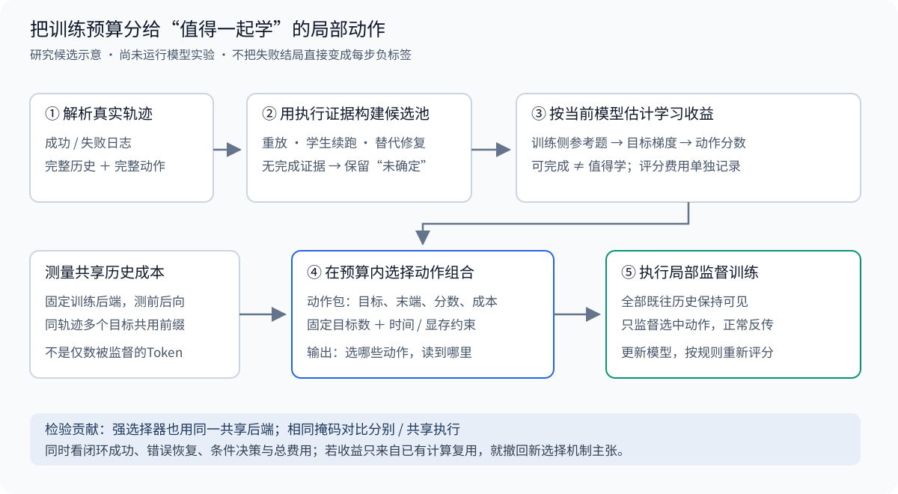

# 方案设计

## 按局部学习收益与共享历史成本，选择轨迹中的训练目标

**一句话说明方案：**把成功和失败记录拆成带完整历史的动作；先通过实际执行找出有完成任务证据的候选动作，再估计当前模型学习各动作的收益，最后把“值得学、而且能共用历史计算”的动作一起选入训练。

这里提出的是一套从原始轨迹到模型更新的**待验证算法**，不是已有有效性结论。截至2026-09-22，完成了文献核验、算法定义和合成小例上的选择器检查；尚未实现或运行大模型训练。科学主张暂定，完整训练后端、资源和实验协议尚未冻结。本文先解释实际做法，再说明它可能不成立的原因。

## 一、究竟要解决什么问题

### 1.1 不是判断整条轨迹“好不好”，而是决定下一笔训练预算用在哪里

模型操作工具完成任务，会留下任务要求、动作、环境反馈等过程记录，称为**轨迹**。设任务是“把杯子放到桌上”：模型先去货架C，发现没有杯子，后来发现杯子在柜子A，最终取到杯子并放上桌。

直接训练整条成功记录，会同时模仿有效动作和可能不必要的绕路；只训练从未犯错的路线，又缺少“已经走错，现在如何恢复”的条件。反过来，一条最后失败的记录，也可能包含有效观察、正确的早期动作，以及特别值得学习的恢复起点。

但“留下失败历史，只训练正确动作”还没有解决全部问题。一个动作能帮助完成任务，并不意味着当前模型还需要反复学习它；另一个动作值得学，却可能需要读取很长的历史才能预测，训练很贵。**动作是否有完成证据、模型学它是否有用、训练它要花多少计算，是三个不同问题。**

本方案的中心问题是：在固定计算资源内，怎样从这些局部动作中选出一组，使模型完成任务、利用历史和从错误中恢复的能力提高得更多？

### 1.2 本方案改变的环节

已有方法已经能生成恢复数据、比较局部动作、估计梯度价值，甚至共享相同前缀的计算；更早的子集选择理论也已处理“组合购买更便宜”的协同成本。本方案不把这些能力重新命名成创新。我们重点检验它们在一个具体训练问题中的连接：**选训练数据时，就把多个动作可以共用历史计算这一事实算进去，而不是选完独立样本后才合并执行。**

例如，同一条长记录里有两个值得学习的动作。学习后面的动作已经要读到那里；同时监督前面的动作，不需要再从头跑一遍这条记录。因此两个动作一起训练的成本，可能远低于它们分别训练的成本。只按单动作价值排名、或将每个样本长度相加，都可能错过这种组合。

这不是保证成立的直觉。已有选择器配上相同的共享执行，可能同样好；评分本身也可能比省下的训练更贵。后文的主要对照正是为了否定或支持这个具体主张，而不是让新方法只赢过一个浪费前缀的弱基线。

## 二、从一条记录走到一次训练



图为本方案示意，不是已完成实验。失败动作可以继续作为历史被读取；只有进入候选池并被选择的动作，才承担本次直接模仿的损失。

### 2.1 第一步：按完整动作拆分，不截断动作所需的历史

把日志整理成以下形式：

```text
任务 → 动作1 → 观察1 → 动作2 → 观察2 → ……
```

一个局部训练单元由两部分组成：**动作发生前的完整历史，以及要学习的完整动作**。工具调用的工具名、参数和结束标记属于同一动作；环境观察不是模型要模仿生成的答案。若原模型一次输出包含思考加工具调用，首版将这整次输出作为一个单元，不先发明未经核验的思考片段标签。

杯子例子中的候选可能是：

```text
输入历史：任务；已查货架C但未找到；后来观察到杯子在柜子A；目前空手在门口。
候选动作：前往柜子A。
```

训练时不能把后来“杯子已放上桌”的反馈塞进这个输入。完整历史指**截至当前动作之前已发生的历史**，不包括用于核验标签的未来。

### 2.2 第二步：得到“有执行证据的候选”，不是凭终局结果给每一步判对错

首版选择可重放的交互环境。每个决策点保存环境快照，或者能够从初始状态按日志精确重放。保存的不只是可见文字，还包括环境状态、随机种子、剩余动作预算和学生模型版本。

候选池按同一规则构造：

1. **成功记录里的原动作**：从对应状态执行原动作和已记录的后续路线，检查动作合法、观察一致、最终任务确实完成。通过后标记为“有可执行完成路径支持”。不宣称它是最短或最优动作。
2. **失败记录里的原动作**：从同一状态执行该动作，再由固定版本学生续跑。若得到成功分支，重放完整分支验证，保留该动作及实际成功分支中的可核验动作。
3. **仍未得到完成证据的决策点**：允许固定版本教师读取截至该点的历史，提出至多两个合法替代动作；分别执行、由同一学生继续，成功分支经重放后进入池。教师输出只是候选，不能直接充当真值。
4. **预算内没有得到成功分支**：记为“未确定”，不产生正向模仿目标；也不据此宣布原动作必然错误。这部分失败历史仍可用于分析覆盖缺口。

首轮工程试点拟每个原动作或替代动作各给两次学生续跑机会，最大剩余步数不超过环境原任务预算；不同方法共享这些分支、随机种子和候选池。两次只是一个待冻结的成本限制，**不是统计置信标准**。成功一次只支持存在这样一条可执行路径，不支持“该动作成功概率很高”或“优于另一个动作”。不以这类弱证据构造新的成对因果优劣标签。

如此，成功记录里的绕路仍可能进入池；可恢复但低效的动作也可能进入池。我们明确不把第一层核验包装为完美过滤器。它排除无执行支撑的臆造目标，第二层才检验哪些有完成证据的目标对学生更有学习价值。对违反明确任务硬约束的动作直接排除；没有规则证据的“看起来多余”不凭语言模型直觉删除。

**替代动作一旦不同，后面的记录必须是真正执行得到的新分支。**不能把“去了柜子A”的新动作接在原来“去了柜子B”的旧反馈前面。只有属于同一条真实历史、具有相同Token前缀的动作，后面才允许共享计算。

这一步复用执行核验、恢复训练等已有思想，不主张新颖。CSO 已完成“失败位置—专家候选—学生续跑—局部偏好训练”的流程；STeCa 已用续跑估计和专家校正构造训练数据。我们的重点是在候选池形成后如何分配训练预算。[CSO §3及表3、6](https://aclanthology.org/2026.findings-acl.1974/)；[STeCa §3及Limitations](https://aclanthology.org/2025.findings-acl.604/)

把杯子例子的入池过程写具体，避免将核验藏成一句“已有正确动作”。下表仍是教学情形，不是实际环境日志：

| 记录位置 | 实际核验得到什么 | 如何进入训练材料 |
|---|---|---|
| 原失败记录在观察到杯子位置后，又去货架C | 两次学生续跑都未成功 | 原动作仍是未确定，不作正目标；历史不凭此删除 |
| 同一决策点替换为“前往柜子A” | 执行后学生取杯并放上桌；完整分支重放通过 | 新分支A上的“前往柜子A”成为候选A1 |
| 新分支A随后“拿起杯子” | 从该处沿实际记录执行能完成任务 | 成为候选A2，与A1属于同一真实线性分支 |
| 另一条原成功记录B中的动作 | 原动作和完整后续重放通过 | 可进入候选B1/B2，但不据此称其最优 |

第一行与第二行不能形成“已证明原动作较差”的强因果结论；我们只取第二行有完成证据的新目标。A1前的旧搜索经历仍是真实已发生历史，A1后的反馈必须来自新执行。

### 2.3 第三步：问当前模型“学这个动作，会不会帮助目标能力”

先解释训练里几个必要的词。模型内部有许多可调整的数字，称为参数；这些数字决定它给各个可能输出多大概率。训练把目标动作的预测概率转成一个误差数，称为损失：给目标的概率越低，损失越高。梯度描述每个参数稍微改变会怎样影响损失；沿合适的方向一起调整参数，争取降低损失，就是一次更新。后文的“方向一致”比较的是这些参数变化，不是两句话意思是否相似。

准备一小份来自**训练侧独立任务实例**的参考题，覆盖正常执行、错误后恢复和必须利用历史的决策；其动作同样要有执行依据。它不是最终测试集，也不与候选池共享同一任务实例或环境种子。它定义希望模型提高什么能力，称为**目标参考集**。

先看模型在这些题上的预测误差，再估计学习各候选动作的更新方向，是否与减小这些误差的方向一致。方向一致，分数较高；方向相反，分数可能为负。这里的分数不是动作正确率，也不是未来任务成功率，而是当前参数下的短期学习收益代理。

例如，学生已经很会“拿起眼前杯子”，但经常忘记失败搜索结果。一个恢复动作可能比另一个直达动作更值得训练；换成已经学会恢复的学生，排序可能改变。算法因此定期重新评分，不把某段轨迹永久标成“高价值”。

计算并非免费。首版沿一个目标更新方向计算整条轨迹中各动作损失的变化率，不保存每个动作一份巨大参数梯度。后文给出精确定义和备用实现。若这种评分的费用超过节省的训练，它就不能被称为高效。

用两个参数的教学模型说明分数怎么来。假设在当前位置，参考损失对两个参数的变化率为 $(1,1)$；A1损失的变化率为 $(4,2)$，A2为 $(1,4)$。两个数分别表示：只增加第一个或第二个参数一点点，损失按多大的比例增加。训练要朝相反方向调整，因此学习A1或A2都可能减小参考损失。暂时不作额外缩放，方向对齐分数就是对应数相乘后相加：A1为 $4\times1+2\times1=6$，A2为 $1\times1+4\times1=5$。这种乘加叫内积。

接着把B1、B2、C1、C2的教学变化率分别设为 $(4,3),(-1,2),(2,2),(1,2)$，同样得到7、1、4、3，正是下一节表中的分数。这些局部变化率是为了演示而给定的计算结果，不是仅从一句文本或一个loss值猜出来；实际程序由模型自动求导/JVP取得，§3.3规定计算路径。高loss本身不能确定梯度方向。

### 2.4 第四步：选择一组动作，而不是只取最高分动作

下面使用完整的教学数字。分数是人为设定的学习价值代理，成本也是教学单位，不是实验结果；它们只演示选择规则。每次训练恰好选两个动作，预算为7。

| 真实记录 | 候选动作 | 分数 | 单独训练该动作需读取到的末端成本 |
|---|---|---:|---:|
| A：查错位置后恢复 | A1：根据此前观察前往柜子A | 6 | 6 |
| A：同一实际分支继续 | A2：拿起杯子 | 5 | 7 |
| B：另一条独立记录 | B1：当前的高分动作 | 7 | 6 |
| B：同一实际分支继续 | B2：后续动作 | 1 | 7 |
| C：第三条独立记录 | C1：较早动作 | 4 | 4 |
| C：同一实际分支继续 | C2：后续动作 | 3 | 5 |

若先拿最高分B1，就只剩1单位预算；能与它共用历史的B2使总成本达到7，总分为8。A1和A2分别跑要6+7=13，但在**同一份读到A2的历史**上同时计算两个动作损失，只需教学成本7，总分为11。C1+C2总成本5、总分7。预算7且必须选两项时，本方案选择A1+A2。

这不是说实际训练中第二个监督信号绝对零成本。首版使用固定的稠密输出层实现，序列前后向成本主要由读到哪里决定，计算损失的少量额外开销纳入实测成本模型。如果改成只计算部分位置输出层、或换批处理方式，就必须重新计费，不能照搬这张表。

### 2.5 第五步：保留历史，只在选中动作上算模仿损失

训练器接收记录A，并截在A2完整结束处；A1和A2的输出位置打开监督，其余位置不直接算答案损失。查错货架的旧动作、环境说“没有杯子”的反馈、杯子位置等历史仍可被模型读取。

“不直接算答案损失”不等于“该位置不反传”。预测A1/A2需要历史信息，梯度仍经过这些历史计算。**首版不删历史、不采用TokenTune式稀疏反传、不把失败动作乘负的交叉熵，也没有五个训练算子。核心训练操作只有一个：带完整历史、按选中动作计算的监督微调。**

每个动作先对自身Token损失取平均，再对本次选中的两个动作平均。这样较长动作不会仅因字数多获得更大权重。之后执行一次真实优化器更新，模型参数改变。下一轮继续从候选池选择；到预先规定的刷新点，用新参数重新评分。

在上述两个参数的简化例子中，选中A1+A2后平均梯度为 $((4+1)/2,(2+4)/2)=(2.5,3)$。若只为演示采用普通梯度下降、步长 $\eta$，参数就分别减去 $2.5\eta$ 和 $3\eta$；参考损失的一阶预计下降为 $5.5\eta=(6+5)\eta/2$。真实实现使用Adam，更新不等于这个简单算式，必须接受后文的代理核验。这个例子连接了入池、评分、组合选择和更新，但没有把教学算式当实验支持。

因此，这套方法输出的不只是“哪些位置重要”的分析，而是：可核验目标池、每轮选择的动作清单、序列读取端点、损失掩码、参数更新以及包含准备费用的成本记录。

## 三、怎样实现：数据、数学定义和训练循环

### 3.1 最小数据记录

每个候选至少保存以下字段；这些是课题数据结构，不写成通用科研Agent的默认配置。

| 字段 | 用途 |
|---|---|
| `task_id / split / instance_seed` | 防止候选、参考、调参与测试实例混用 |
| `trajectory_id / branch_id / parent_snapshot` | 表示真实分支及生成位置 |
| `history_tokens / action_span / end_position` | 精确恢复输入、动作标签、读取端点 |
| `environment_version / replay_hash` | 核验环境和重放一致性 |
| `label_source / continuation_policy / remaining_budget` | 区分原成功路线、学生成功续跑和教师替代后的成功续跑 |
| `attempts / outcomes / verification_status` | 保留失败核验和未确定状态，不只存成功分支 |
| `score_checkpoint / score / cost_profile_id` | 防止用旧模型分数或其他后端成本冒充当前测量 |

同一动作重复出现在克隆分支中，按任务实例、环境快照、完整历史Token及动作Token去重，保留全部来源列表。为使下文每个动作只属于一个轨迹组，固定一个不依赖学习分数的归属规则：在包含该动作的已验证真实分支中，选择完整Token序列哈希字典序最小的分支作为唯一所有者；其他分支仍保留这段文字作为历史，但不再把它列为本组候选目标。所有方法共用这份归属表，不能重复计入目标数 $K$。

这个明确但受限的规则可能放弃一些跨分支共享机会。因此下文求解的是**固定归属后的线性组问题**，不声称得到整棵分支树上的最优选择。归属规则的敏感性作为边界检查；若需要联合决定归属和选择，就必须另行定义求解器。首版只在**一条线性实际轨迹内部**共享，不跨不同分支使用树注意力；同一文字观察但隐藏环境不同，不能据此合并成同一训练条件。

### 3.2 统一训练目标，避免比较被归一化方式改变

令动作 $i$ 的Token集合为 $T_i$，参数为 $\theta$，动作损失为

$$
\ell_i(\theta)=-\frac{1}{|T_i|}\sum_{t\in T_i}\log p_\theta(x_t\mid x_{<t}).
$$

其中 $x_{<t}$ 只包括位置 $t$ 之前的真实历史。程序中第 $t$ 个标签由第 $t-1$ 个位置的输出预测，不能把标签和预测位置混淆。

每次更新固定选择 $K$ 个动作，损失为

$$
L_S(\theta)=\frac1K\sum_{i\in S}\ell_i(\theta),\qquad |S|=K.
$$

固定 $K$ 不是所有训练问题的最优选择，而是首版的重要控制：加入某动作时，不会偷偷改变其余动作的分母。一个动作有20个Token、另一个有5个，二者各占 $1/K$ 的动作权重；不能直接用框架默认的全Token平均替代。

### 3.3 当前学习价值如何计算

实际只训练LoRA参数 $\phi$：LoRA是在冻结基础模型上增加可训练的低秩矩阵，减小参数更新和优化器存储开销，但不会免去历史的前向与反向计算。令参考集动作平均损失为 $L_A$，其梯度为 $g_A=\nabla_\phi L_A$；候选动作的梯度为 $g_i=\nabla_\phi\ell_i$。

首版分数定义为

$$
s_i=g_i^\top P g_A.
$$

$P$ 是在本次评分中固定的非负对角缩放矩阵。首次评分使用单位矩阵；有优化器历史后，用上一次更新的Adam二阶矩作预条件缩放，并设置数值下界以避免接近零的分母。具体下界与精度在训练侧工程校准后冻结，所有对照共用。

为什么这个式子和学习有关？若临时采用固定预条件的一小步更新 $\phi' = \phi-\eta P K^{-1}\sum_i g_i$，则一阶展开给出

$$
L_A(\phi)-L_A(\phi')\approx\frac{\eta}{K}\sum_{i\in S}s_i.
$$

这只是 **derived：小步长、固定预条件器下的一阶代理**。实际Adam会根据当前批改变动量、二阶矩和剪裁，多个动作的真实收益也有相互作用；因此不能把 $s_i$ 宣称为精确Adam效用或长期泛化收益。LESS、GTP、GREATS已有目标梯度选择和联合选样，以上评分不是新理论。[LESS §3与附录G](https://proceedings.mlr.press/v235/xia24c.html)；[GTP §3–4](https://arxiv.org/abs/2410.16710)；[GREATS §3–4、6](https://proceedings.neurips.cc/paper_files/paper/2024/file/ed165f2ff227cf36c7e3ef88957dadd9-Paper-Conference.pdf)

**如何不存每个动作的完整梯度？**对一条轨迹计算动作损失向量 $\boldsymbol\ell_\tau(\phi)$，固定方向 $d=Pg_A$，求该向量沿 $d$ 的方向导数，即Jacobian-vector product（JVP）：

$$
\operatorname{JVP}_\phi[\boldsymbol\ell_\tau](d)_i
=\nabla_\phi\ell_i^\top d=s_i.
$$

直观上，这是问“参数沿同一个小方向移动，各动作的损失分别变多少”，输出每动作一个数。它需要穿过完整历史的计算图，不能只对答案位置的输出层求导。

首版实现前须验证所选注意力、LoRA和激活重计算后端支持JVP；不支持时先用逐动作自动求导点积作为正确性参考，再选择支持的等价后端并实测额外费用。不能将慢速备用实现的费用删掉，或声称已有一遍反传免费得到所有动作梯度。

### 3.4 用实际前后向成本，而不是目标Token数定预算

首版每个微批只运行一条轨迹，在一条序列里监督其中多个选中动作；跨轨迹累计梯度，达到固定 $K$ 后更新一次。采用固定稠密输出层、精度和重计算设置。这样便于把各条序列的费用近似相加，不先引入跨分支缓存或复杂的多序列打包。

在相同设备、模型和实现上，测量读到轨迹 $\tau$ 第 $j$ 个候选结束处的前向、反向及掩码开销，得到 $c_\tau(j)$。重复测量，使用保守上界和平滑后的非递减包络；另测峰值显存。一次共同的优化器更新费单独计入。成本不是从论文速度倍率搬来的。

对于同轨迹选择集合 $S_\tau$，代理成本为

$$
C(S)=\sum_{\tau:S_\tau\ne\varnothing}c_\tau(\max S_\tau).
$$

这里“最大”按真实动作末端顺序，不按价值分数。它忽略小幅目标数相关费用，因此只在上述固定后端、经过实测误差检查时使用。预算向上取整只使**代理费用**保守，不会保证墙钟误差也保守；实际超限时先修订成本模型，不解释为算法已满足预算。

Tree Training已经给出树前缀共享与原损失等价的训练实现；psRL已经研究共享前缀、批调度与梯度累积。本方案不重新声称发明计算复用，且会让所有强基线使用相同线性前缀共享。[Tree Training §3及附录B](https://arxiv.org/abs/2511.00413v5)；[psRL §4–6](https://arxiv.org/abs/2608.25683)

### 3.5 怎样选：每条轨迹的动作包，加一个预算求解器

选择问题为

$$
\max_{S}\sum_{i\in S}s_i\quad
\text{满足 }|S|=K,\ C(S)\le B,\ \text{单序列峰值显存}\le M.
$$

$B$ 是一次更新可用的序列前后向预算，$M$ 是显存上限。评分、核验等不塞进这个内部约束，但必须进入整体效率指标。

先为每条轨迹枚举“最晚动作 $j$、选择数 $q$”。既然末端已固定，且代理成本只取决于末端，就一定包含动作 $j$，再从它之前的候选中选分数最高的 $q-1$ 项。把这个集合称为一个**动作包**，记录动作清单、数量、总分和成本。空包表示这条轨迹本轮不用。

随后用标准多选背包动态规划：每条轨迹选至多一个包，在总数 $K$ 和预算 $B$ 内找总分最高的组合。预算按固定时间粒度向上离散；状态为“已处理轨迹数、已选动作数、已用预算”。保存回溯指针，输出真实动作掩码，不只是一个目标函数值。

这不是新的动态规划理论。上述“末端固定后选最高分”仅在**效用可加、同末端同成本**条件下成立；若加入动作之间的二阶收益或稀疏输出层费用，就不能继续称该求解器精确。最坏复杂度随轨迹数、$K$、预算格数及候选包数增长，求解墙钟也计费；只在**同一选择数 $q$ 内**保留效用—成本非支配包可减少状态。不能跨 $q$ 剪枝：两动作包即使比一动作包总分低、费用高，也可能是补满固定 $K$ 的必要选择。首版参考程序未启用此剪枝，不承诺所有大池都廉价。

无可行解时，按预先规定的分层抽样扩大候选池一次，补评分并计费；仍不可行则记录预算不可行并停止该配置，不静默减小 $K$ 或超支。最优总分非正时，标记代理不建议更新；先进入评分诊断，不临时更换规则来凑出正结果。此类停止同样属于方法失败率。

### 3.6 完整伪代码

```text
输入：成功与失败日志、可重放环境、初始学生、固定教师与续跑策略
      训练侧目标参考集、K、训练预算B、显存M、评分刷新规则

1. 先按任务实例/近重复历史分组划分，候选、参考、校准、测试互斥
2. 各分区内解析日志，恢复真实历史、完整动作和环境快照
3. 仅在对应训练侧分区按固定预算续跑/修复；记录未确定与全部费用
   将去重目标按固定规则分配到唯一真实分支，冻结候选归属表
4. 在同一后端测量各序列末端的前后向成本与峰值显存

循环至预定总预算：
  a. 按任务与来源分层抽候选轨迹
  b. 若到评分刷新点：计算参考梯度，逐轨迹JVP得到各动作分数
  c. 枚举每轨迹的动作包，用动态规划选择总计K个动作
  d. 若预算不可行/代理失效：按预定规则扩池或停止并报告
  e. 对每个非空包读取真实序列到最后目标结束
     只在所选动作算Token平均损失，再统一除以K，累计梯度
  f. 执行一次优化器更新，登记目标ID、分数版本及实测费用

输出：更新后的学生、选择/核验日志、闭环任务结果与完整成本账
```

评分可以每次更新刷新，也可以在固定候选池内复用若干次。首个机制比较采用每次刷新以隔离分数陈旧因素；若收费后不划算，再把刷新间隔作为预先声明的效率变量测试，而不是忽略它。复用时保存分数对应的旧参数版本，不冒充当前值。

## 四、已有研究做到哪里，剩下的贡献到底是什么

| 直接近邻 | 已覆盖，不能据为创新 | 本方案仍需证明的差别 |
|---|---|---|
| STeP、STeCa、CSO | 失败上下文、校正目标、执行核验、局部训练 | 共同目标池形成以后，如何按当前收益与实际共享成本分配预算 |
| GTP | 联合梯度选择、减少重复；已在ALFWorld的state-action池实验 | 从离线动作准确率推进到闭环能力；明确共享历史的非加性预算，不只固定样本数 |
| LESS、GREATS | 目标条件价值、动态选择、批内交互与短更新核验 | 强选择器配同一共享后端后，联合成本选择是否仍有增益 |
| ICA、LARK | 前向计算的选择代理及较低评分开销 | 昂贵梯度代理能否在总费用上胜过便宜代理，而非仅训练阶段更好 |
| TokenTune、TokenSeek | 保持输入、稀疏反传以节省显存 | 首版不研究这一算子；它是后续独立因素，不混入主因果比较 |
| Tree Training、psRL | 相同前缀复用、梯度保持、训练调度 | 是否在选择数据之前考虑共享成本，而不是仅把给定数据跑快 |
| Iyer–Bilmes协同成本选择（NeurIPS 2013） | 次模成本约束下选择有用子集；已含数据选择应用 | 不是首次提出共享费用选样；只能检验轨迹训练中的具体建模、实现和实证价值 |
| Compute-Constrained Data Selection（ICLR 2025） | 将评分与训练共同纳入计算预算；比较便宜与昂贵选择 | 必须证明本实现的收益回本，不能将“记全部费用”当创新 |

独立反检进一步收缩了贡献空间。[Iyer与Bilmes，§1–2](https://proceedings.neurips.cc/paper_files/paper/2013/file/a1d50185e7426cbb0acad1e6ca74b9aa-Paper.pdf)已经研究协同成本约束下的子集选择。本文固定互斥轨迹组、单调末端费用时，增加一个更早动作的新增费用随已有集合扩大而不增，正属于“边际成本递减”这一已有结构；效用则是分数相加的模块函数。本文另有固定 $K$ 和可能为负的分数，因此不能不加条件套用原文近似保证，也不能声称创造了新的优化问题家族。

[Compute-Constrained Data Selection，§4式(2)、表1及§5–6](https://proceedings.iclr.cc/paper_files/paper/2025/file/5acb720a361eecb34ee62d356859d246-Paper-Conference.pdf)已经将评分费用与训练费用共同约束，并发现某些昂贵选择在所测预算中不划算。它主要研究离线选择及相应成本模型，不能直接推断本JVP在线方案必然失败；反过来也不能忽略它，先假定梯度方法值得做。

本轮实际阅读了上述新增直接近邻的方法与关键实验；对未取得的正式版使用作者预印本时，具体版本与边界记在[文献调研](文献调研.md)。截至2026-09-22的定向检索不能证明全球无人研究这个组合，故新颖性仍为**暂定**。

中心假设可拆成三个必要而不等价的部分：

1. **价值可用**：该代理在指定模型、优化器和目标分布上，能区分有益与低效的局部监督；若不能，成本求解器只是在精确选择错误分数。
2. **共享成本改变选择**：轨迹内前缀重用足够显著，使独立样本成本近似确实改变最优目标集合；若每条轨迹只有一个候选，研究退化为普通成本敏感选样。
3. **净收益成立**：更好的选择带来的闭环收益，足以抵偿核验、评分和求解费用；若只提升每个训练步的质量却花掉更多总资源，不支持高效训练主张。

相应的知识主张不是“失败都值得训练”或“重要Token决定一切”，而是：**在给定核验与训练条件下，局部监督的价值必须与它和其他目标共同使用时的历史计算成本一起评价。**是否能形成有价值的方法论文，取决于这些检验能否超越直接近邻，不由描述复杂度决定。

## 五、怎样验证，而不是怎样展示涨点

### 5.1 先检查程序实现，再运行学习实验

以下检查只证明实现是否对应定义，不证明模型训练有效：

| 检查 | 操作 | 不通过时 |
|---|---|---|
| 标签与分支合法 | 重放核验；禁止把替代动作接到旧未来；检查Token跨度和shift | 修数据，不训练 |
| 损失/梯度等价 | 同一小模型、同一目标集合，比较分别读前缀与合并监督；先关闭dropout | 修掩码、归一化、position或attention规则 |
| 分数正确 | JVP与逐动作自动求导点积比较，随后检验实际精度/后端 | 不声称廉价评分可运行 |
| 选择器正确 | 小池穷举所有可行集合，与动态规划比较；包括负分、不可行、同分 | 修选择器 |
| 成本可预测 | 未用于拟合的长度/末端组合，比较代理与真实墙钟及显存 | 修成本模型或缩小适用范围 |

当前仅完成最后训练系统之外的**合成选择器检查**：教学例及160个随机小池与穷举一致，并检查了负代理、不可行预算、重复ID和非单调成本输入。未运行JVP、LoRA、GPU等价或环境验证，不能把这一结果称为算法实验通过。

### 5.2 第一组科学检验：分数是否真的有预测作用

从训练侧独立校准池抽取动作替换对。在相同初始参数和完整优化器状态下，复制两条短更新分支；每批恰好 $K$ 个动作，仅把一个槽位从候选 $r$ 换成 $i$，其余伙伴不变。执行同一步真实Adam更新，比较校准目标损失变化，与 $s_i-s_r$ 的方向和排序相对照。

必须复制Adam动量、二阶矩、计步、学习率调度、剪裁、混合精度及随机状态。一个单动作的Adam更新不能直接平均成多动作的Adam批更新。再检查短期排序与较长训练、闭环成功是否脱钩；短更新相关性只验证代理局部适用，不替代最终效果。

报告配对符号一致率、排序相关及按任务实例聚类的不确定性；同时画实际收益对预测分数的图。若在冻结校准设置下不能稳定优于随机排序，停止将其作为主选择器，保留随机/便宜前向分数作对照并重新设计。不能在同一校准集上反复挑阈值，直到声称代理有效。

首版没有额外“校准网络”。对固定 $K$，将所有分数改成同一个正斜率的线性变换并不会改变最优集合；不能把这类不改变决策的拟合包装为方法贡献。

### 5.3 第二组科学检验：是选得好，还是仅仅合并执行更省

主比较共享同一候选池、动作损失、固定 $K$、模型初始化和前缀执行后端。

| 对照 | 改变什么 | 回答什么 |
|---|---|---|
| 随机动作＋共享执行 | 不使用目标学习价值 | 价值评分是否有用 |
| LESS-action / GTP-action / GREATS-action＋共享执行 | 使用已有强选择规则；适配处逐项披露 | 不是只赢过整轨迹随机采样 |
| 本文评分＋独立前缀成本选择＋共享执行 | 选择时按每动作独立费用估计，执行仍共享 | 共享成本进入**选择**是否有用 |
| 本文评分＋共享成本选择＋共享执行 | 完整候选方法 | 主方法 |
| 本文评分＋共享边际成本贪心＋共享执行 | 不用DP，但每次按新增费用判断加入哪项 | 简单的已有成本敏感思路是否已经足够 |
| GREATS边际效用＋共享预算选择＋共享执行 | 强近邻也读取相同共享成本，而不只是选完后复用 | 本文的效用/求解组合是否超越共享感知的竞争方法 |
| 完全相同目标掩码，分别执行与共享执行 | 不改变所选数据 | 纯计算复用贡献有多大 |
| ICA/LARK-inspired前向代理＋同一成本求解器 | 换成便宜的价值代理，并说明动作化不等于原版 | 更昂贵评分是否值得 |

适配GTP/GREATS时不假装只是换输入：GTP预热checkpoint、非负重权可能改变损失；GREATS二阶选择与固定数量的实现也有其目标。分别报告原作者配方与统一损失的控制版本，不能偷偷删掉强方法的关键组件，再把差异全归因于新方法。

共享边际成本对照定义清楚：已有集合为 $S$ 时，新增费用为 $C(S\cup\{i\})-C(S)$；正收益且零新增代理费用的项先按收益排序，其余按边际收益/正新增费用选择，全部仍需能在剩余预算补满 $K$。用同一可行性DP判断是否可补满，但不用它优化效用；无可行完成则排除当前选项。GREATS共享预算版把分子换成它根据已选集合更新的边际效用；这是透明的适配对照，不宣称原作者已提供该轨迹版本。负边际值、同分和停止规则在校准前固定，适配求解费同样计入。

对照预算要对应实际执行：给“忽略共享成本”的基线同时报告相同内部阈值与按实际训练时间重新调节其选择规模/训练步数的公平预算结果，避免它因过度估价而闲置预算。固定 $K$ 是局部机制比较；最终总资源比较允许各方法在同一总预算内执行不同更新次数。

再按共享程度分层：每轨迹只有一个可用动作、多个相距较近动作、长前缀后多个动作。若只在最后一类有效，应报告适用边界；若所有优势都由“相同目标、共享执行”解释，应撤回新选择机制贡献。

### 5.4 第三组科学检验：模型是否真会按情况行动

第一阶段拟用可重放ALFWorld环境和同一个约1.5B参数指令模型的LoRA训练；具体模型revision、环境commit、依赖锁及设备由实施前实际验证后冻结，当前未声明已具备相应显卡或服务。选择这一环境是为了控制历史、动作和任务完成，不代表开放网络工具使用已得到覆盖。第二环境可考虑WebShop，但仅在第一环境的定义与费用核验通过后扩展，不借多数据集堆叠掩盖机制失败。

评测包含：

- **闭环任务成功率**：模型自己连续行动，环境判是否完成；不能用离线“下一动作命中率”替代。
- **可恢复历史上的完成率**：从真实可重放的偏离历史继续；单列恢复成功需要的动作数和无效动作率。
- **条件变化测试**：构造当前可见画面相似、但此前观察不同的真实任务对，例如杯子位置分别在A/B，要求后续动作随历史改变。两侧均重放验证，位置随机化、任务实例隔离，避免只背答案词。
- **正常任务保持**：恢复能力变好时，正常执行或其他训练任务是否退化。
- **效率与覆盖**：到同一成功率所需总费用、同一总费用下的成功率、不同任务/失败类型的入池率、未确定比例和训练暴露量。

先按任务实例、环境种子和近重复历史分组划分，再造候选；候选、目标参考、代理校准与调参使用互斥训练侧实例，最终测试使用官方保留集或另行冻结的独立实例。参考集如何分配正常/恢复任务是方法的目标设定，须固定并报告敏感性；不能用最终测试错题指导选择。

### 5.5 试点规模、运行量和停止规则

以下是**拟议起始配置，不是已运行结果或可用资源声明**：固定 $K=8$，每次候选池先抽64条有目标的真实轨迹；超出可支持上下文的样本单列，不静默裁掉必要历史。首轮训练长度上限拟4096 Token，实际分词与环境历史分布检查后冻结。候选池不足 $K$ 时按既定规则扩池，不重复拷贝同一动作凑数。

试点先完成一个模型、一个环境的实现检查和小规模分数校准。主对照优先四组“随机/本文评分 × 独立/共享成本”，全部同一共享执行，再加入GTP/GREATS与便宜代理中经实现核验的强基线。资源不足时缩减次要扩展，不删除决定中心主张的强对照。

学习实验初始计划至少3个独立训练种子，并共享配对环境评测种子；报告逐种子结果。正式种子数与任务数根据试点方差和预先规定的最小有意义差异做功效/精度分析后冻结。置信区间以任务实例和训练种子为单位组织，不把同一轨迹的许多Token当独立样本。

资源估算由实测分项相加：

$$
T_{\rm total}=T_{\rm build}+T_{\rm warmup}+T_{\rm profile}
+T_{\rm calibration}+T_{\rm score}+T_{\rm solve}+T_{\rm train}+T_{\rm eval}.
$$

其中 $T_{\rm warmup}$ 包括需要预热的基线/初始化，$T_{\rm calibration}$ 包括真实短更新、代理适用性确认与必要停止检查，不能漏算。主资源比较固定同一GPU型号和数量、CPU额度与流程并行度，以一次完整执行的**端到端墙钟时间**为总预算；教师调用次数与费用另设共同硬上限，峰值显存是可行性约束。具体设备未知前只能定义预算口径，不能提前给出虚构GPU小时。

上述分项相加用于首版受控串行流程；若后续并行执行，以实际开始—结束时间为墙钟，分项资源时间另报，不将重叠时间重复相加。教师API若计费，则另报调用量与费用；GPU小时、CPU时间、墙钟和峰值显存不混成一个无单位“效率分”。共享候选池的控制比较可以摊销 $T_{\rm build}$，但从原始日志出发的实际部署账必须保留它。

超参数搜索是另一笔研究开发账：各方法给予相同预先冻结的调参上限，完整保存失败配置；报告“单次按已选配置运行”的上述费用，以及包括所有试点、调参、失败运行的研究总费用。若部署算法本身每换任务就需要重新调参或校准，那部分也加入单次部署成本，不借研究账名义移除。

是否划算的最低条件是：新增的核验、评分与求解费用，低于达到同一任务质量所节省的训练及必要评测费用。如果预算内到不了相同质量，报告整个能力—成本曲线，不凭外推宣称回本。

停止/回退规则包括：环境无法重放；核验目标覆盖过低；JVP不支持且备用评分不经济；代理排序无效；成本模型频繁超支；完整方法不能超过同共享后端的强基线；收益依赖测试泄漏或损害正常能力。负结果保留，不能把这些失效悄悄转成新的成功指标。

## 六、什么结果支持什么贡献

| 可能出现的结果 | 可得结论 | 必须撤回的说法 |
|---|---|---|
| 代理可预测，联合成本选择超越同后端强基线，总费用也更低 | 在已验证分布内支持成本感知局部选择；可形成方法与实证贡献 | 仍不能声称普适、最优或任意失败都可利用 |
| 任务质量提高，但评分后总费用更高 | 有效选样但尚非高效训练；给出回本条件 | “节省总训练资源” |
| 只有相同掩码共享执行有效 | 确认已有计算复用在该任务有价值 | 新选择机制的增益 |
| 简单前向评分或GREATS同样好/更好 | 昂贵代理不必要，优先采用强已有方法 | 当前新算法值得替代近邻 |
| 一阶分数和真实更新不一致 | 代理不适用此优化器/批结构 | 用DP精确求解就代表科学问题解决 |
| 核验几乎只留下成功直达动作 | 数据构造未覆盖失败恢复，需重设计 | 已实现广泛失败轨迹利用 |

因此，本方案当前的交付是**一个定义完整、可以开始工程试点和被否证的研究候选**：动作建池有步骤，价值分数有公式，选择器有求解办法，训练器有明确损失，评测有强对照。它还不是经过模型实验验证的高效算法，也不是已确认具有顶会级非等价贡献的结论。

原先“固定目标、研究历史位置反传”的机制实验保留在历史版本中，不再担任当前主方案。它可能作为未来的正交扩展，但不能代替用户要求的“从细粒度轨迹数据构建完整训练方法”。下一步若获得实验执行授权，应先交付数据核验、共享梯度等价、JVP与成本校准四项可运行实现，再依据试点决定是否值得开展完整比较。
